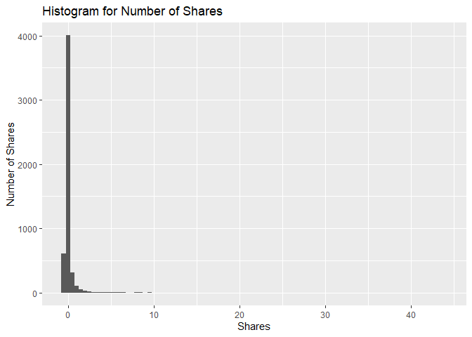
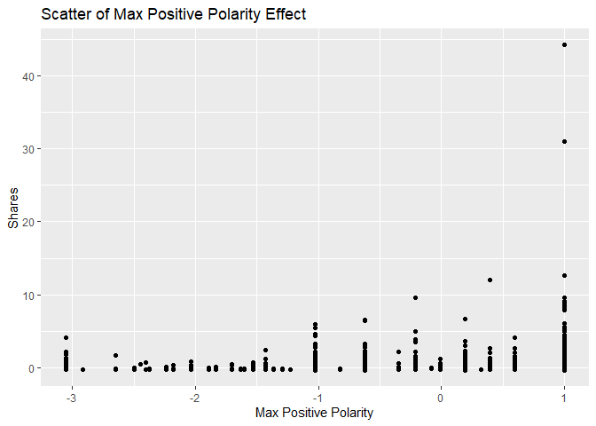
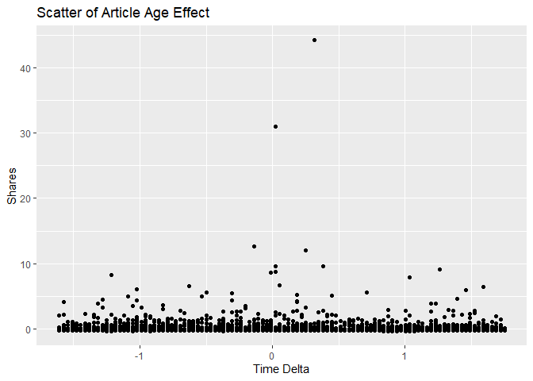
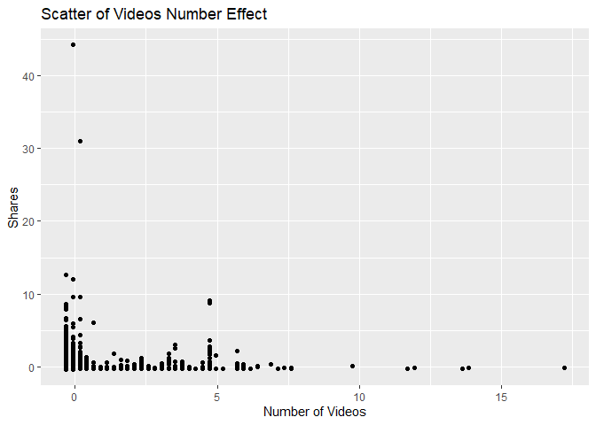

News Popularity Tuesday Data
================
Shuang Du
10/16/2020

## Load Libraries

``` r
library(readxl);
library(tidyverse);
library(caret);
library(modelr);
library(rpart);
library(kableExtra);
```

## Read in Data

``` r
getData <- function(day) {

  newsPopData <- read_csv("../../raw_data/OnlineNewsPopularity.csv")
  
  if (day == 'monday') {
    newsPopData <- newsPopData %>% filter(weekday_is_monday == 1)
  } else if(day == 'tuesday') {
    newsPopData <- newsPopData %>% filter(weekday_is_tuesday == 1)
  } else if(day == 'wednesday') {
    newsPopData <- newsPopData %>% filter(weekday_is_wednesday == 1)
  } else if(day == 'thursday') {
    newsPopData <- newsPopData %>% filter(weekday_is_thursday == 1)
  } else if(day == 'friday') {
    newsPopData <- newsPopData %>% filter(weekday_is_friday == 1)
  } else if(day == 'saturday') {
    newsPopData <- newsPopData %>% filter(weekday_is_saturday == 1)
  } else if(day == 'sunday') {
    newsPopData <- newsPopData %>% filter(weekday_is_sunday == 1)
  } else {
    stop("Invalid date")
  }
  return(newsPopData)
}

newsPopData <- getData(params$day)
```

## Set Aside Training Data

``` r
set.seed(92)
trainIndex <- createDataPartition(newsPopData$shares, 
                                  p = 0.7, list = FALSE)

newsPopTrain <- newsPopData[as.vector(trainIndex),];
newsPopTest <- newsPopData[-as.vector(trainIndex),];
```

## Center and Scale

``` r
preProcValues <- preProcess(newsPopTrain, method = c("center", "scale"))
newsPopTrain <- predict(preProcValues, newsPopTrain) 
newsPopTest <- predict(preProcValues, newsPopTest)
```

## Summary of a Few Variables

The plots below show a histogram of the number of shares for the given
day. Scatter plots on the effect of max positive polarity, article time
delta and number of videos in the article are also included.

As expected the histogram has a strong right tail, as seem by the
summary stats which show a very high maximum and a median severals
orders of magnitude lower. This is expected for because of the “viral”
nature of online popularity.

``` r
summary(newsPopTrain$shares)
```

    ##     Min.  1st Qu.   Median     Mean  3rd Qu.     Max. 
    ## -0.31620 -0.22995 -0.18930  0.00000 -0.06826 44.16344

``` r
g0 <- ggplot(newsPopTrain, aes(x=shares))
g0 + geom_histogram(binwidth = 0.5) + ggtitle('Histogram for Number of Shares') + ylab('Number of Shares') + xlab('Shares')
```

<!-- -->

``` r
summary(newsPopTrain$max_positive_polarity)
```

    ##    Min. 1st Qu.  Median    Mean 3rd Qu.    Max. 
    ## -3.0504 -0.6206  0.1893  0.0000  0.9992  0.9992

``` r
g1 <- ggplot(newsPopTrain, aes(x = max_positive_polarity, y = shares )) 
g1 + geom_point() + ggtitle('Scatter of Max Positive Polarity Effect') + ylab('Shares') + xlab('Max Positive Polarity')
```

<!-- -->

``` r
summary(newsPopTrain$timedelta)
```

    ##     Min.  1st Qu.   Median     Mean  3rd Qu.     Max. 
    ## -1.60954 -0.89161 -0.07578  0.00000  0.87058  1.75168

``` r
g2 <- ggplot(newsPopTrain, aes(x = timedelta, y = shares )) 
g2 + geom_point() + ggtitle('Scatter of Article Age Effect') + ylab('Shares') + xlab('Time Delta')
```

<!-- -->

``` r
summary(newsPopTrain$num_videos)
```

    ##     Min.  1st Qu.   Median     Mean  3rd Qu.     Max. 
    ## -0.31683 -0.31683 -0.31683  0.00000 -0.07667 17.21525

``` r
g3 <- ggplot(newsPopTrain, aes(x = num_videos, y = shares )) 
g3 + geom_point() + ggtitle('Scatter of Videos Number Effect') + ylab('Shares') + xlab('Number of Videos')
```

<!-- -->

## Modeling

### Standard Tree Based Model (no ensemble)

The type of model being fitted here is a decision tree. The tree splits
are based on minimizing the residual sum of squares for each region.

``` r
rpartFit <- train(shares ~ timedelta + n_tokens_title + n_tokens_content + n_unique_tokens + n_non_stop_words + n_non_stop_unique_tokens
                 + num_hrefs + num_self_hrefs + num_imgs + num_videos + average_token_length + num_keywords + data_channel_is_lifestyle +
                 data_channel_is_entertainment + data_channel_is_bus + data_channel_is_socmed + data_channel_is_tech + data_channel_is_world +
                 self_reference_min_shares + self_reference_max_shares + self_reference_avg_sharess + global_subjectivity + global_sentiment_polarity
                 + global_rate_positive_words + global_rate_negative_words + rate_positive_words + rate_negative_words + avg_positive_polarity +
                  min_positive_polarity + max_positive_polarity + avg_negative_polarity + min_negative_polarity + max_negative_polarity + title_subjectivity
                 + title_sentiment_polarity + abs_title_subjectivity + abs_title_sentiment_polarity, data = newsPopTrain,
             method = "rpart",
             trControl = trainControl(method = "cv", number = 10))
rpartFit
```

    ## CART 
    ## 
    ## 5175 samples
    ##   37 predictor
    ## 
    ## No pre-processing
    ## Resampling: Cross-Validated (10 fold) 
    ## Summary of sample sizes: 4657, 4656, 4658, 4659, 4658, 4657, ... 
    ## Resampling results across tuning parameters:
    ## 
    ##   cp           RMSE       Rsquared     MAE      
    ##   0.009374849  0.9296032  0.014337260  0.3088501
    ##   0.014264451  0.9237981  0.011247511  0.3085854
    ##   0.016973613  0.9045616  0.005153685  0.3064534
    ## 
    ## RMSE was used to select the optimal model using the smallest value.
    ## The final value used for the model was cp = 0.01697361.

``` r
# create the prediction
pred1 <- predict(rpartFit, newdata = newsPopTest)

# compare the prediction vs the actual
resample1 <- postResample(pred1, obs = newsPopTest$shares)
resample1
```

    ##      RMSE  Rsquared       MAE 
    ## 0.9605903        NA 0.3123001

### Boosted Tree Based Model

A boosted tree is an ensemble method which slowly approaches the tree
prediction which would result from the original data. In general, an
ensemble model model will have a lower RSME than a single tree model.

``` r
gbmFit <- train(shares ~ timedelta + n_tokens_title + n_tokens_content + n_unique_tokens + n_non_stop_words + n_non_stop_unique_tokens
                 + num_hrefs + num_self_hrefs + num_imgs + num_videos + average_token_length + num_keywords + data_channel_is_lifestyle +
                 data_channel_is_entertainment + data_channel_is_bus + data_channel_is_socmed + data_channel_is_tech + data_channel_is_world +
                 self_reference_min_shares + self_reference_max_shares + self_reference_avg_sharess + global_subjectivity + global_sentiment_polarity
                 + global_rate_positive_words + global_rate_negative_words + rate_positive_words + rate_negative_words + avg_positive_polarity +
                  min_positive_polarity + max_positive_polarity + avg_negative_polarity + min_negative_polarity + max_negative_polarity + title_subjectivity
                 + title_sentiment_polarity + abs_title_subjectivity + abs_title_sentiment_polarity, data = newsPopTrain,
             method = "gbm",
             trControl = trainControl(method = "cv", number = 10))
```

    ## Iter   TrainDeviance   ValidDeviance   StepSize   Improve
    ##      1        1.0682             nan     0.1000    0.0022
    ##      2        1.0663             nan     0.1000    0.0009
    ##      3        1.0638             nan     0.1000    0.0018
    ##      4        1.0613             nan     0.1000    0.0013
    ##      5        1.0597             nan     0.1000    0.0002
    ##      6        1.0586             nan     0.1000    0.0001
    ##      7        1.0571             nan     0.1000    0.0011
    ##      8        1.0559             nan     0.1000    0.0008
    ##      9        1.0551             nan     0.1000   -0.0006
    ##     10        1.0539             nan     0.1000    0.0002
    ##     20        1.0465             nan     0.1000   -0.0001
    ##     40        1.0380             nan     0.1000   -0.0011
    ##     60        1.0326             nan     0.1000   -0.0004
    ##     80        1.0290             nan     0.1000   -0.0005
    ##    100        1.0264             nan     0.1000   -0.0006
    ##    120        1.0227             nan     0.1000   -0.0006
    ##    140        1.0206             nan     0.1000   -0.0006
    ##    150        1.0192             nan     0.1000   -0.0004
    ## 
    ## Iter   TrainDeviance   ValidDeviance   StepSize   Improve
    ##      1        1.0670             nan     0.1000    0.0015
    ##      2        1.0627             nan     0.1000    0.0002
    ##      3        1.0612             nan     0.1000    0.0003
    ##      4        1.0564             nan     0.1000    0.0008
    ##      5        1.0533             nan     0.1000   -0.0001
    ##      6        1.0446             nan     0.1000    0.0036
    ##      7        1.0370             nan     0.1000   -0.0011
    ##      8        1.0283             nan     0.1000   -0.0015
    ##      9        1.0239             nan     0.1000    0.0011
    ##     10        1.0187             nan     0.1000   -0.0004
    ##     20        0.9797             nan     0.1000   -0.0030
    ##     40        0.9481             nan     0.1000   -0.0016
    ##     60        0.9205             nan     0.1000   -0.0014
    ##     80        0.8924             nan     0.1000   -0.0015
    ##    100        0.8695             nan     0.1000   -0.0005
    ##    120        0.8455             nan     0.1000   -0.0025
    ##    140        0.8273             nan     0.1000   -0.0062
    ##    150        0.8188             nan     0.1000   -0.0006
    ## 
    ## Iter   TrainDeviance   ValidDeviance   StepSize   Improve
    ##      1        1.0544             nan     0.1000    0.0067
    ##      2        1.0449             nan     0.1000    0.0015
    ##      3        1.0421             nan     0.1000    0.0020
    ##      4        1.0340             nan     0.1000   -0.0003
    ##      5        1.0312             nan     0.1000   -0.0004
    ##      6        1.0267             nan     0.1000   -0.0002
    ##      7        1.0248             nan     0.1000   -0.0013
    ##      8        1.0181             nan     0.1000   -0.0013
    ##      9        1.0123             nan     0.1000   -0.0024
    ##     10        1.0070             nan     0.1000   -0.0009
    ##     20        0.9453             nan     0.1000   -0.0006
    ##     40        0.8827             nan     0.1000   -0.0014
    ##     60        0.8410             nan     0.1000   -0.0044
    ##     80        0.8118             nan     0.1000   -0.0005
    ##    100        0.7759             nan     0.1000   -0.0005
    ##    120        0.7396             nan     0.1000   -0.0007
    ##    140        0.7026             nan     0.1000   -0.0002
    ##    150        0.6859             nan     0.1000   -0.0002
    ## 
    ## Iter   TrainDeviance   ValidDeviance   StepSize   Improve
    ##      1        1.0808             nan     0.1000   -0.0000
    ##      2        1.0796             nan     0.1000   -0.0006
    ##      3        1.0778             nan     0.1000    0.0003
    ##      4        1.0757             nan     0.1000    0.0023
    ##      5        1.0741             nan     0.1000    0.0008
    ##      6        1.0713             nan     0.1000    0.0019
    ##      7        1.0686             nan     0.1000    0.0003
    ##      8        1.0671             nan     0.1000    0.0009
    ##      9        1.0666             nan     0.1000   -0.0001
    ##     10        1.0660             nan     0.1000    0.0001
    ##     20        1.0581             nan     0.1000    0.0002
    ##     40        1.0481             nan     0.1000   -0.0001
    ##     60        1.0426             nan     0.1000   -0.0002
    ##     80        1.0390             nan     0.1000   -0.0001
    ##    100        1.0344             nan     0.1000   -0.0001
    ##    120        1.0301             nan     0.1000   -0.0002
    ##    140        1.0277             nan     0.1000   -0.0009
    ##    150        1.0270             nan     0.1000   -0.0009
    ## 
    ## Iter   TrainDeviance   ValidDeviance   StepSize   Improve
    ##      1        1.0707             nan     0.1000    0.0005
    ##      2        1.0675             nan     0.1000    0.0015
    ##      3        1.0655             nan     0.1000    0.0004
    ##      4        1.0631             nan     0.1000    0.0020
    ##      5        1.0573             nan     0.1000   -0.0002
    ##      6        1.0461             nan     0.1000   -0.0008
    ##      7        1.0436             nan     0.1000    0.0008
    ##      8        1.0382             nan     0.1000   -0.0004
    ##      9        1.0373             nan     0.1000    0.0003
    ##     10        1.0313             nan     0.1000   -0.0022
    ##     20        1.0081             nan     0.1000   -0.0021
    ##     40        0.9614             nan     0.1000   -0.0013
    ##     60        0.9183             nan     0.1000   -0.0002
    ##     80        0.8994             nan     0.1000   -0.0006
    ##    100        0.8788             nan     0.1000   -0.0007
    ##    120        0.8542             nan     0.1000    0.0000
    ##    140        0.8395             nan     0.1000   -0.0007
    ##    150        0.8320             nan     0.1000   -0.0051
    ## 
    ## Iter   TrainDeviance   ValidDeviance   StepSize   Improve
    ##      1        1.0727             nan     0.1000   -0.0004
    ##      2        1.0653             nan     0.1000    0.0001
    ##      3        1.0501             nan     0.1000    0.0062
    ##      4        1.0469             nan     0.1000   -0.0002
    ##      5        1.0373             nan     0.1000    0.0004
    ##      6        1.0322             nan     0.1000   -0.0012
    ##      7        1.0240             nan     0.1000   -0.0028
    ##      8        1.0160             nan     0.1000   -0.0016
    ##      9        1.0133             nan     0.1000   -0.0002
    ##     10        1.0094             nan     0.1000   -0.0015
    ##     20        0.9699             nan     0.1000   -0.0005
    ##     40        0.9010             nan     0.1000   -0.0015
    ##     60        0.8437             nan     0.1000   -0.0002
    ##     80        0.8018             nan     0.1000   -0.0016
    ##    100        0.7626             nan     0.1000   -0.0015
    ##    120        0.7265             nan     0.1000   -0.0007
    ##    140        0.6920             nan     0.1000   -0.0007
    ##    150        0.6822             nan     0.1000   -0.0042
    ## 
    ## Iter   TrainDeviance   ValidDeviance   StepSize   Improve
    ##      1        0.8555             nan     0.1000    0.0017
    ##      2        0.8543             nan     0.1000    0.0010
    ##      3        0.8528             nan     0.1000    0.0005
    ##      4        0.8508             nan     0.1000    0.0003
    ##      5        0.8497             nan     0.1000    0.0003
    ##      6        0.8478             nan     0.1000    0.0007
    ##      7        0.8467             nan     0.1000    0.0008
    ##      8        0.8457             nan     0.1000   -0.0003
    ##      9        0.8450             nan     0.1000   -0.0001
    ##     10        0.8435             nan     0.1000    0.0002
    ##     20        0.8351             nan     0.1000   -0.0003
    ##     40        0.8277             nan     0.1000   -0.0006
    ##     60        0.8223             nan     0.1000   -0.0003
    ##     80        0.8179             nan     0.1000   -0.0004
    ##    100        0.8154             nan     0.1000   -0.0004
    ##    120        0.8124             nan     0.1000   -0.0007
    ##    140        0.8101             nan     0.1000   -0.0002
    ##    150        0.8089             nan     0.1000   -0.0004
    ## 
    ## Iter   TrainDeviance   ValidDeviance   StepSize   Improve
    ##      1        0.8437             nan     0.1000    0.0019
    ##      2        0.8418             nan     0.1000    0.0015
    ##      3        0.8373             nan     0.1000    0.0009
    ##      4        0.8284             nan     0.1000   -0.0004
    ##      5        0.8206             nan     0.1000   -0.0008
    ##      6        0.8116             nan     0.1000   -0.0013
    ##      7        0.8063             nan     0.1000   -0.0001
    ##      8        0.7991             nan     0.1000   -0.0024
    ##      9        0.7973             nan     0.1000    0.0007
    ##     10        0.7960             nan     0.1000   -0.0001
    ##     20        0.7735             nan     0.1000   -0.0003
    ##     40        0.7476             nan     0.1000   -0.0003
    ##     60        0.7199             nan     0.1000   -0.0004
    ##     80        0.6971             nan     0.1000   -0.0036
    ##    100        0.6684             nan     0.1000   -0.0008
    ##    120        0.6521             nan     0.1000   -0.0017
    ##    140        0.6351             nan     0.1000   -0.0006
    ##    150        0.6287             nan     0.1000   -0.0016
    ## 
    ## Iter   TrainDeviance   ValidDeviance   StepSize   Improve
    ##      1        0.8453             nan     0.1000    0.0028
    ##      2        0.8330             nan     0.1000    0.0002
    ##      3        0.8301             nan     0.1000    0.0006
    ##      4        0.8205             nan     0.1000   -0.0010
    ##      5        0.8173             nan     0.1000    0.0006
    ##      6        0.8126             nan     0.1000    0.0002
    ##      7        0.8048             nan     0.1000   -0.0031
    ##      8        0.8012             nan     0.1000   -0.0010
    ##      9        0.7929             nan     0.1000    0.0003
    ##     10        0.7826             nan     0.1000   -0.0021
    ##     20        0.7371             nan     0.1000   -0.0025
    ##     40        0.6832             nan     0.1000   -0.0010
    ##     60        0.6535             nan     0.1000   -0.0032
    ##     80        0.6207             nan     0.1000   -0.0011
    ##    100        0.6072             nan     0.1000   -0.0014
    ##    120        0.5810             nan     0.1000   -0.0007
    ##    140        0.5481             nan     0.1000   -0.0011
    ##    150        0.5422             nan     0.1000   -0.0029
    ## 
    ## Iter   TrainDeviance   ValidDeviance   StepSize   Improve
    ##      1        0.6243             nan     0.1000    0.0021
    ##      2        0.6220             nan     0.1000    0.0015
    ##      3        0.6198             nan     0.1000    0.0014
    ##      4        0.6188             nan     0.1000    0.0009
    ##      5        0.6170             nan     0.1000    0.0008
    ##      6        0.6159             nan     0.1000    0.0001
    ##      7        0.6147             nan     0.1000    0.0006
    ##      8        0.6141             nan     0.1000    0.0003
    ##      9        0.6132             nan     0.1000   -0.0002
    ##     10        0.6126             nan     0.1000    0.0002
    ##     20        0.6070             nan     0.1000   -0.0001
    ##     40        0.5995             nan     0.1000   -0.0002
    ##     60        0.5950             nan     0.1000   -0.0001
    ##     80        0.5917             nan     0.1000   -0.0005
    ##    100        0.5893             nan     0.1000   -0.0004
    ##    120        0.5867             nan     0.1000   -0.0005
    ##    140        0.5844             nan     0.1000   -0.0008
    ##    150        0.5833             nan     0.1000   -0.0005
    ## 
    ## Iter   TrainDeviance   ValidDeviance   StepSize   Improve
    ##      1        0.6239             nan     0.1000    0.0030
    ##      2        0.6198             nan     0.1000    0.0027
    ##      3        0.6167             nan     0.1000    0.0002
    ##      4        0.6112             nan     0.1000   -0.0008
    ##      5        0.6078             nan     0.1000   -0.0005
    ##      6        0.6063             nan     0.1000    0.0006
    ##      7        0.6015             nan     0.1000    0.0003
    ##      8        0.5992             nan     0.1000   -0.0017
    ##      9        0.5954             nan     0.1000    0.0002
    ##     10        0.5940             nan     0.1000   -0.0008
    ##     20        0.5816             nan     0.1000   -0.0008
    ##     40        0.5700             nan     0.1000   -0.0003
    ##     60        0.5528             nan     0.1000   -0.0005
    ##     80        0.5371             nan     0.1000   -0.0025
    ##    100        0.5282             nan     0.1000   -0.0004
    ##    120        0.5191             nan     0.1000   -0.0004
    ##    140        0.5117             nan     0.1000   -0.0009
    ##    150        0.5051             nan     0.1000   -0.0002
    ## 
    ## Iter   TrainDeviance   ValidDeviance   StepSize   Improve
    ##      1        0.6229             nan     0.1000    0.0030
    ##      2        0.6190             nan     0.1000    0.0039
    ##      3        0.6136             nan     0.1000    0.0006
    ##      4        0.6068             nan     0.1000    0.0002
    ##      5        0.6007             nan     0.1000   -0.0012
    ##      6        0.5983             nan     0.1000   -0.0000
    ##      7        0.5933             nan     0.1000    0.0005
    ##      8        0.5917             nan     0.1000    0.0007
    ##      9        0.5893             nan     0.1000    0.0014
    ##     10        0.5883             nan     0.1000   -0.0000
    ##     20        0.5615             nan     0.1000   -0.0011
    ##     40        0.5213             nan     0.1000   -0.0005
    ##     60        0.4998             nan     0.1000   -0.0013
    ##     80        0.4835             nan     0.1000   -0.0015
    ##    100        0.4707             nan     0.1000   -0.0008
    ##    120        0.4575             nan     0.1000   -0.0027
    ##    140        0.4423             nan     0.1000   -0.0003
    ##    150        0.4363             nan     0.1000   -0.0009
    ## 
    ## Iter   TrainDeviance   ValidDeviance   StepSize   Improve
    ##      1        1.0911             nan     0.1000    0.0021
    ##      2        1.0881             nan     0.1000    0.0010
    ##      3        1.0876             nan     0.1000   -0.0002
    ##      4        1.0855             nan     0.1000    0.0012
    ##      5        1.0842             nan     0.1000    0.0003
    ##      6        1.0831             nan     0.1000   -0.0001
    ##      7        1.0811             nan     0.1000    0.0005
    ##      8        1.0796             nan     0.1000    0.0004
    ##      9        1.0789             nan     0.1000   -0.0003
    ##     10        1.0779             nan     0.1000    0.0009
    ##     20        1.0698             nan     0.1000   -0.0000
    ##     40        1.0598             nan     0.1000    0.0004
    ##     60        1.0543             nan     0.1000   -0.0008
    ##     80        1.0496             nan     0.1000   -0.0006
    ##    100        1.0460             nan     0.1000   -0.0001
    ##    120        1.0416             nan     0.1000   -0.0003
    ##    140        1.0394             nan     0.1000   -0.0008
    ##    150        1.0378             nan     0.1000   -0.0003
    ## 
    ## Iter   TrainDeviance   ValidDeviance   StepSize   Improve
    ##      1        1.0845             nan     0.1000    0.0019
    ##      2        1.0754             nan     0.1000   -0.0008
    ##      3        1.0721             nan     0.1000    0.0018
    ##      4        1.0648             nan     0.1000    0.0005
    ##      5        1.0576             nan     0.1000   -0.0035
    ##      6        1.0532             nan     0.1000    0.0023
    ##      7        1.0495             nan     0.1000   -0.0014
    ##      8        1.0464             nan     0.1000   -0.0008
    ##      9        1.0443             nan     0.1000    0.0001
    ##     10        1.0384             nan     0.1000    0.0016
    ##     20        1.0080             nan     0.1000   -0.0016
    ##     40        0.9650             nan     0.1000   -0.0003
    ##     60        0.9296             nan     0.1000   -0.0015
    ##     80        0.9120             nan     0.1000   -0.0020
    ##    100        0.8880             nan     0.1000   -0.0040
    ##    120        0.8684             nan     0.1000   -0.0007
    ##    140        0.8518             nan     0.1000   -0.0007
    ##    150        0.8456             nan     0.1000   -0.0003
    ## 
    ## Iter   TrainDeviance   ValidDeviance   StepSize   Improve
    ##      1        1.0841             nan     0.1000    0.0031
    ##      2        1.0755             nan     0.1000    0.0005
    ##      3        1.0635             nan     0.1000    0.0010
    ##      4        1.0608             nan     0.1000    0.0004
    ##      5        1.0526             nan     0.1000   -0.0007
    ##      6        1.0463             nan     0.1000    0.0004
    ##      7        1.0417             nan     0.1000   -0.0005
    ##      8        1.0377             nan     0.1000   -0.0011
    ##      9        1.0298             nan     0.1000   -0.0034
    ##     10        1.0284             nan     0.1000   -0.0007
    ##     20        0.9838             nan     0.1000   -0.0010
    ##     40        0.9142             nan     0.1000   -0.0005
    ##     60        0.8657             nan     0.1000   -0.0028
    ##     80        0.8233             nan     0.1000   -0.0009
    ##    100        0.7961             nan     0.1000   -0.0002
    ##    120        0.7681             nan     0.1000   -0.0008
    ##    140        0.7369             nan     0.1000   -0.0018
    ##    150        0.7232             nan     0.1000   -0.0010
    ## 
    ## Iter   TrainDeviance   ValidDeviance   StepSize   Improve
    ##      1        1.0428             nan     0.1000    0.0009
    ##      2        1.0405             nan     0.1000    0.0009
    ##      3        1.0388             nan     0.1000    0.0005
    ##      4        1.0368             nan     0.1000    0.0006
    ##      5        1.0353             nan     0.1000    0.0004
    ##      6        1.0330             nan     0.1000    0.0012
    ##      7        1.0318             nan     0.1000    0.0001
    ##      8        1.0308             nan     0.1000   -0.0004
    ##      9        1.0301             nan     0.1000   -0.0003
    ##     10        1.0284             nan     0.1000    0.0012
    ##     20        1.0204             nan     0.1000   -0.0003
    ##     40        1.0112             nan     0.1000   -0.0007
    ##     60        1.0061             nan     0.1000   -0.0003
    ##     80        1.0023             nan     0.1000   -0.0005
    ##    100        0.9994             nan     0.1000   -0.0002
    ##    120        0.9969             nan     0.1000   -0.0011
    ##    140        0.9930             nan     0.1000   -0.0007
    ##    150        0.9912             nan     0.1000   -0.0003
    ## 
    ## Iter   TrainDeviance   ValidDeviance   StepSize   Improve
    ##      1        1.0406             nan     0.1000    0.0010
    ##      2        1.0384             nan     0.1000    0.0003
    ##      3        1.0366             nan     0.1000    0.0017
    ##      4        1.0322             nan     0.1000    0.0006
    ##      5        1.0284             nan     0.1000   -0.0001
    ##      6        1.0271             nan     0.1000   -0.0000
    ##      7        1.0179             nan     0.1000   -0.0005
    ##      8        1.0061             nan     0.1000   -0.0020
    ##      9        0.9989             nan     0.1000   -0.0003
    ##     10        0.9977             nan     0.1000   -0.0003
    ##     20        0.9694             nan     0.1000   -0.0006
    ##     40        0.9073             nan     0.1000   -0.0015
    ##     60        0.8831             nan     0.1000   -0.0022
    ##     80        0.8624             nan     0.1000   -0.0006
    ##    100        0.8462             nan     0.1000   -0.0002
    ##    120        0.8343             nan     0.1000   -0.0011
    ##    140        0.8221             nan     0.1000   -0.0012
    ##    150        0.8134             nan     0.1000   -0.0010
    ## 
    ## Iter   TrainDeviance   ValidDeviance   StepSize   Improve
    ##      1        1.0296             nan     0.1000    0.0074
    ##      2        1.0222             nan     0.1000    0.0017
    ##      3        1.0188             nan     0.1000    0.0009
    ##      4        1.0096             nan     0.1000   -0.0001
    ##      5        1.0009             nan     0.1000   -0.0011
    ##      6        0.9992             nan     0.1000   -0.0005
    ##      7        0.9887             nan     0.1000   -0.0026
    ##      8        0.9856             nan     0.1000   -0.0001
    ##      9        0.9763             nan     0.1000    0.0002
    ##     10        0.9724             nan     0.1000    0.0005
    ##     20        0.9324             nan     0.1000   -0.0000
    ##     40        0.8842             nan     0.1000   -0.0003
    ##     60        0.8134             nan     0.1000   -0.0016
    ##     80        0.7712             nan     0.1000   -0.0001
    ##    100        0.7293             nan     0.1000   -0.0022
    ##    120        0.7088             nan     0.1000   -0.0017
    ##    140        0.6732             nan     0.1000   -0.0006
    ##    150        0.6654             nan     0.1000   -0.0006
    ## 
    ## Iter   TrainDeviance   ValidDeviance   StepSize   Improve
    ##      1        1.0469             nan     0.1000    0.0024
    ##      2        1.0446             nan     0.1000    0.0017
    ##      3        1.0425             nan     0.1000    0.0013
    ##      4        1.0413             nan     0.1000   -0.0000
    ##      5        1.0401             nan     0.1000   -0.0001
    ##      6        1.0386             nan     0.1000    0.0004
    ##      7        1.0378             nan     0.1000   -0.0000
    ##      8        1.0363             nan     0.1000    0.0006
    ##      9        1.0353             nan     0.1000    0.0001
    ##     10        1.0342             nan     0.1000    0.0011
    ##     20        1.0270             nan     0.1000   -0.0005
    ##     40        1.0186             nan     0.1000   -0.0000
    ##     60        1.0145             nan     0.1000   -0.0003
    ##     80        1.0109             nan     0.1000   -0.0006
    ##    100        1.0080             nan     0.1000   -0.0004
    ##    120        1.0062             nan     0.1000   -0.0003
    ##    140        1.0042             nan     0.1000   -0.0002
    ##    150        1.0032             nan     0.1000   -0.0004
    ## 
    ## Iter   TrainDeviance   ValidDeviance   StepSize   Improve
    ##      1        1.0447             nan     0.1000    0.0023
    ##      2        1.0400             nan     0.1000    0.0009
    ##      3        1.0382             nan     0.1000    0.0001
    ##      4        1.0326             nan     0.1000    0.0004
    ##      5        1.0295             nan     0.1000    0.0005
    ##      6        1.0264             nan     0.1000   -0.0010
    ##      7        1.0195             nan     0.1000   -0.0006
    ##      8        1.0113             nan     0.1000   -0.0000
    ##      9        1.0088             nan     0.1000   -0.0015
    ##     10        1.0082             nan     0.1000   -0.0005
    ##     20        0.9839             nan     0.1000    0.0007
    ##     40        0.9416             nan     0.1000   -0.0009
    ##     60        0.9122             nan     0.1000   -0.0008
    ##     80        0.8909             nan     0.1000   -0.0008
    ##    100        0.8607             nan     0.1000   -0.0026
    ##    120        0.8411             nan     0.1000   -0.0004
    ##    140        0.8156             nan     0.1000   -0.0007
    ##    150        0.8061             nan     0.1000   -0.0003
    ## 
    ## Iter   TrainDeviance   ValidDeviance   StepSize   Improve
    ##      1        1.0401             nan     0.1000    0.0008
    ##      2        1.0329             nan     0.1000    0.0001
    ##      3        1.0238             nan     0.1000    0.0002
    ##      4        1.0140             nan     0.1000   -0.0004
    ##      5        1.0063             nan     0.1000   -0.0002
    ##      6        1.0000             nan     0.1000   -0.0002
    ##      7        0.9927             nan     0.1000   -0.0017
    ##      8        0.9854             nan     0.1000   -0.0007
    ##      9        0.9805             nan     0.1000   -0.0025
    ##     10        0.9740             nan     0.1000   -0.0011
    ##     20        0.9216             nan     0.1000   -0.0016
    ##     40        0.8776             nan     0.1000   -0.0001
    ##     60        0.8318             nan     0.1000   -0.0004
    ##     80        0.7970             nan     0.1000   -0.0017
    ##    100        0.7592             nan     0.1000   -0.0004
    ##    120        0.7350             nan     0.1000   -0.0007
    ##    140        0.6984             nan     0.1000   -0.0005
    ##    150        0.6854             nan     0.1000   -0.0010
    ## 
    ## Iter   TrainDeviance   ValidDeviance   StepSize   Improve
    ##      1        1.0830             nan     0.1000    0.0009
    ##      2        1.0795             nan     0.1000    0.0022
    ##      3        1.0766             nan     0.1000    0.0015
    ##      4        1.0757             nan     0.1000    0.0004
    ##      5        1.0738             nan     0.1000    0.0008
    ##      6        1.0727             nan     0.1000   -0.0001
    ##      7        1.0710             nan     0.1000    0.0012
    ##      8        1.0704             nan     0.1000   -0.0001
    ##      9        1.0685             nan     0.1000    0.0009
    ##     10        1.0678             nan     0.1000   -0.0005
    ##     20        1.0587             nan     0.1000   -0.0003
    ##     40        1.0489             nan     0.1000   -0.0005
    ##     60        1.0440             nan     0.1000   -0.0000
    ##     80        1.0409             nan     0.1000   -0.0005
    ##    100        1.0377             nan     0.1000   -0.0011
    ##    120        1.0351             nan     0.1000   -0.0007
    ##    140        1.0327             nan     0.1000   -0.0009
    ##    150        1.0313             nan     0.1000   -0.0003
    ## 
    ## Iter   TrainDeviance   ValidDeviance   StepSize   Improve
    ##      1        1.0781             nan     0.1000    0.0020
    ##      2        1.0670             nan     0.1000    0.0008
    ##      3        1.0638             nan     0.1000   -0.0000
    ##      4        1.0598             nan     0.1000    0.0005
    ##      5        1.0575             nan     0.1000    0.0006
    ##      6        1.0479             nan     0.1000   -0.0018
    ##      7        1.0461             nan     0.1000    0.0008
    ##      8        1.0422             nan     0.1000   -0.0003
    ##      9        1.0359             nan     0.1000   -0.0015
    ##     10        1.0327             nan     0.1000   -0.0000
    ##     20        0.9897             nan     0.1000   -0.0003
    ##     40        0.9448             nan     0.1000   -0.0116
    ##     60        0.9191             nan     0.1000   -0.0009
    ##     80        0.8936             nan     0.1000   -0.0073
    ##    100        0.8783             nan     0.1000   -0.0005
    ##    120        0.8658             nan     0.1000   -0.0004
    ##    140        0.8505             nan     0.1000   -0.0029
    ##    150        0.8409             nan     0.1000   -0.0025
    ## 
    ## Iter   TrainDeviance   ValidDeviance   StepSize   Improve
    ##      1        1.0798             nan     0.1000    0.0036
    ##      2        1.0648             nan     0.1000    0.0014
    ##      3        1.0614             nan     0.1000   -0.0006
    ##      4        1.0530             nan     0.1000    0.0014
    ##      5        1.0478             nan     0.1000    0.0006
    ##      6        1.0453             nan     0.1000    0.0014
    ##      7        1.0329             nan     0.1000    0.0026
    ##      8        1.0308             nan     0.1000    0.0004
    ##      9        1.0243             nan     0.1000   -0.0009
    ##     10        1.0231             nan     0.1000    0.0002
    ##     20        0.9764             nan     0.1000   -0.0004
    ##     40        0.9059             nan     0.1000    0.0002
    ##     60        0.8449             nan     0.1000   -0.0007
    ##     80        0.8094             nan     0.1000   -0.0022
    ##    100        0.7747             nan     0.1000   -0.0006
    ##    120        0.7459             nan     0.1000   -0.0006
    ##    140        0.7195             nan     0.1000   -0.0007
    ##    150        0.7068             nan     0.1000   -0.0028
    ## 
    ## Iter   TrainDeviance   ValidDeviance   StepSize   Improve
    ##      1        0.9955             nan     0.1000    0.0003
    ##      2        0.9932             nan     0.1000    0.0023
    ##      3        0.9910             nan     0.1000    0.0018
    ##      4        0.9885             nan     0.1000    0.0010
    ##      5        0.9868             nan     0.1000    0.0005
    ##      6        0.9861             nan     0.1000    0.0001
    ##      7        0.9848             nan     0.1000    0.0005
    ##      8        0.9834             nan     0.1000    0.0006
    ##      9        0.9822             nan     0.1000   -0.0009
    ##     10        0.9812             nan     0.1000   -0.0001
    ##     20        0.9738             nan     0.1000    0.0002
    ##     40        0.9649             nan     0.1000   -0.0016
    ##     60        0.9593             nan     0.1000   -0.0005
    ##     80        0.9564             nan     0.1000   -0.0000
    ##    100        0.9540             nan     0.1000    0.0005
    ##    120        0.9510             nan     0.1000   -0.0006
    ##    140        0.9492             nan     0.1000   -0.0008
    ##    150        0.9479             nan     0.1000    0.0001
    ## 
    ## Iter   TrainDeviance   ValidDeviance   StepSize   Improve
    ##      1        0.9876             nan     0.1000    0.0005
    ##      2        0.9788             nan     0.1000   -0.0001
    ##      3        0.9710             nan     0.1000   -0.0005
    ##      4        0.9662             nan     0.1000   -0.0004
    ##      5        0.9620             nan     0.1000   -0.0006
    ##      6        0.9562             nan     0.1000   -0.0036
    ##      7        0.9484             nan     0.1000   -0.0002
    ##      8        0.9412             nan     0.1000   -0.0016
    ##      9        0.9379             nan     0.1000    0.0008
    ##     10        0.9361             nan     0.1000   -0.0004
    ##     20        0.8972             nan     0.1000   -0.0004
    ##     40        0.8637             nan     0.1000   -0.0009
    ##     60        0.8478             nan     0.1000   -0.0012
    ##     80        0.8307             nan     0.1000   -0.0009
    ##    100        0.8068             nan     0.1000   -0.0007
    ##    120        0.7879             nan     0.1000   -0.0006
    ##    140        0.7611             nan     0.1000   -0.0011
    ##    150        0.7563             nan     0.1000   -0.0039
    ## 
    ## Iter   TrainDeviance   ValidDeviance   StepSize   Improve
    ##      1        0.9802             nan     0.1000    0.0004
    ##      2        0.9727             nan     0.1000   -0.0004
    ##      3        0.9639             nan     0.1000   -0.0011
    ##      4        0.9544             nan     0.1000   -0.0012
    ##      5        0.9464             nan     0.1000    0.0006
    ##      6        0.9378             nan     0.1000   -0.0030
    ##      7        0.9349             nan     0.1000   -0.0013
    ##      8        0.9338             nan     0.1000   -0.0002
    ##      9        0.9272             nan     0.1000   -0.0016
    ##     10        0.9260             nan     0.1000    0.0005
    ##     20        0.8895             nan     0.1000    0.0004
    ##     40        0.8271             nan     0.1000   -0.0001
    ##     60        0.7713             nan     0.1000   -0.0008
    ##     80        0.7253             nan     0.1000   -0.0016
    ##    100        0.6872             nan     0.1000   -0.0024
    ##    120        0.6591             nan     0.1000   -0.0006
    ##    140        0.6290             nan     0.1000   -0.0015
    ##    150        0.6205             nan     0.1000   -0.0009
    ## 
    ## Iter   TrainDeviance   ValidDeviance   StepSize   Improve
    ##      1        1.0851             nan     0.1000    0.0003
    ##      2        1.0820             nan     0.1000    0.0020
    ##      3        1.0801             nan     0.1000    0.0019
    ##      4        1.0791             nan     0.1000   -0.0003
    ##      5        1.0767             nan     0.1000    0.0012
    ##      6        1.0750             nan     0.1000    0.0006
    ##      7        1.0740             nan     0.1000    0.0009
    ##      8        1.0729             nan     0.1000    0.0007
    ##      9        1.0709             nan     0.1000    0.0004
    ##     10        1.0697             nan     0.1000    0.0005
    ##     20        1.0615             nan     0.1000   -0.0002
    ##     40        1.0516             nan     0.1000   -0.0001
    ##     60        1.0473             nan     0.1000   -0.0005
    ##     80        1.0429             nan     0.1000    0.0000
    ##    100        1.0395             nan     0.1000   -0.0012
    ##    120        1.0367             nan     0.1000   -0.0009
    ##    140        1.0341             nan     0.1000   -0.0010
    ##    150        1.0324             nan     0.1000   -0.0006
    ## 
    ## Iter   TrainDeviance   ValidDeviance   StepSize   Improve
    ##      1        1.0811             nan     0.1000    0.0012
    ##      2        1.0772             nan     0.1000    0.0016
    ##      3        1.0727             nan     0.1000    0.0016
    ##      4        1.0670             nan     0.1000    0.0028
    ##      5        1.0649             nan     0.1000   -0.0006
    ##      6        1.0629             nan     0.1000    0.0004
    ##      7        1.0615             nan     0.1000   -0.0007
    ##      8        1.0578             nan     0.1000   -0.0015
    ##      9        1.0504             nan     0.1000   -0.0012
    ##     10        1.0471             nan     0.1000    0.0006
    ##     20        1.0063             nan     0.1000   -0.0000
    ##     40        0.9643             nan     0.1000    0.0000
    ##     60        0.9248             nan     0.1000   -0.0026
    ##     80        0.9075             nan     0.1000   -0.0005
    ##    100        0.8853             nan     0.1000   -0.0007
    ##    120        0.8663             nan     0.1000   -0.0004
    ##    140        0.8482             nan     0.1000   -0.0017
    ##    150        0.8447             nan     0.1000   -0.0010
    ## 
    ## Iter   TrainDeviance   ValidDeviance   StepSize   Improve
    ##      1        1.0835             nan     0.1000    0.0020
    ##      2        1.0748             nan     0.1000    0.0002
    ##      3        1.0611             nan     0.1000    0.0008
    ##      4        1.0512             nan     0.1000    0.0004
    ##      5        1.0467             nan     0.1000   -0.0017
    ##      6        1.0447             nan     0.1000    0.0008
    ##      7        1.0355             nan     0.1000   -0.0006
    ##      8        1.0282             nan     0.1000   -0.0025
    ##      9        1.0272             nan     0.1000   -0.0001
    ##     10        1.0181             nan     0.1000   -0.0018
    ##     20        0.9772             nan     0.1000   -0.0003
    ##     40        0.9095             nan     0.1000   -0.0018
    ##     60        0.8510             nan     0.1000   -0.0009
    ##     80        0.8137             nan     0.1000   -0.0033
    ##    100        0.7765             nan     0.1000   -0.0009
    ##    120        0.7407             nan     0.1000   -0.0002
    ##    140        0.7079             nan     0.1000   -0.0021
    ##    150        0.6919             nan     0.1000   -0.0003
    ## 
    ## Iter   TrainDeviance   ValidDeviance   StepSize   Improve
    ##      1        0.9973             nan     0.1000    0.0020
    ##      2        0.9954             nan     0.1000    0.0012
    ##      3        0.9934             nan     0.1000    0.0015
    ##      4        0.9920             nan     0.1000    0.0010
    ##      5        0.9905             nan     0.1000    0.0006
    ##      6        0.9895             nan     0.1000   -0.0000
    ##      7        0.9880             nan     0.1000    0.0000
    ##      8        0.9877             nan     0.1000   -0.0001
    ##      9        0.9866             nan     0.1000    0.0005
    ##     10        0.9855             nan     0.1000    0.0005
    ##     20        0.9776             nan     0.1000   -0.0000
    ##     40        0.9684             nan     0.1000    0.0000
    ##     50        0.9655             nan     0.1000   -0.0008

``` r
gbmFit
```

    ## Stochastic Gradient Boosting 
    ## 
    ## 5175 samples
    ##   37 predictor
    ## 
    ## No pre-processing
    ## Resampling: Cross-Validated (10 fold) 
    ## Summary of sample sizes: 4658, 4657, 4658, 4657, 4657, 4657, ... 
    ## Resampling results across tuning parameters:
    ## 
    ##   interaction.depth  n.trees  RMSE       Rsquared    MAE      
    ##   1                   50      0.8485267  0.02893236  0.2956408
    ##   1                  100      0.8506317  0.02830195  0.2969766
    ##   1                  150      0.8516196  0.02835408  0.2975383
    ##   2                   50      0.8712602  0.01530196  0.3045289
    ##   2                  100      0.8823032  0.01851306  0.3128673
    ##   2                  150      0.8916030  0.01425544  0.3182590
    ##   3                   50      0.8718646  0.01930475  0.3046674
    ##   3                  100      0.8900302  0.01470754  0.3157205
    ##   3                  150      0.9039832  0.01156517  0.3237980
    ## 
    ## Tuning parameter 'shrinkage' was held constant at a value of 0.1
    ## Tuning parameter 'n.minobsinnode' was held constant at a value of 10
    ## RMSE was used to select the optimal model using the smallest value.
    ## The final values used for the model were n.trees = 50, interaction.depth = 1, shrinkage = 0.1 and n.minobsinnode = 10.

``` r
# create the prediction
pred2 <- predict(gbmFit, newdata = newsPopTest)

# compare the prediction vs the actual
resample2 <- postResample(pred2, obs = newsPopTest$shares)
resample2
```

    ##       RMSE   Rsquared        MAE 
    ## 0.95557720 0.01254627 0.30610453

### Comparison

Below is a comparison of the two methods. Both have relatively high root
mean square errors.

``` r
comparison <- data.frame("RSME" = c(resample1[[1]], resample2[[1]]), "MAE" = c(resample1[[3]], resample2[[3]]) )
rownames(comparison) <- c("RPART","GBM")
kable(comparison)
```

<table>

<thead>

<tr>

<th style="text-align:left;">

</th>

<th style="text-align:right;">

RSME

</th>

<th style="text-align:right;">

MAE

</th>

</tr>

</thead>

<tbody>

<tr>

<td style="text-align:left;">

RPART

</td>

<td style="text-align:right;">

0.9605903

</td>

<td style="text-align:right;">

0.3123001

</td>

</tr>

<tr>

<td style="text-align:left;">

GBM

</td>

<td style="text-align:right;">

0.9555772

</td>

<td style="text-align:right;">

0.3061045

</td>

</tr>

</tbody>

</table>
