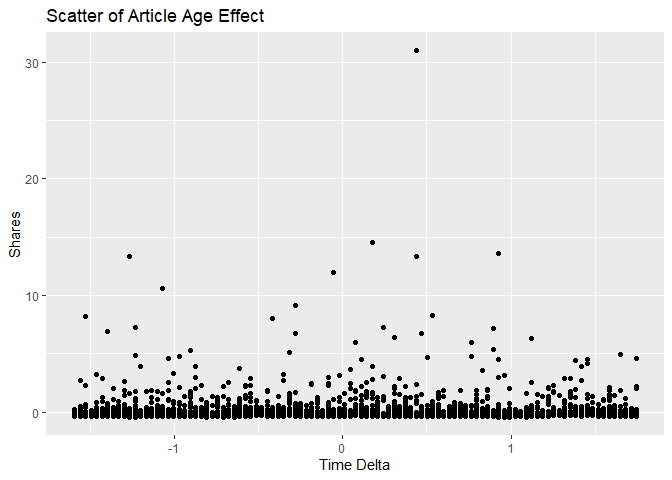
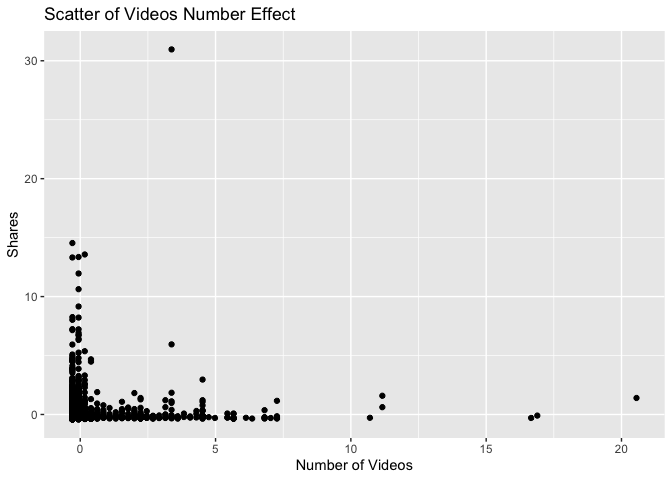

News Popularity Friday Data
================
Shuang Du
10/16/2020

Load Libraries
--------------

    library(readxl);
    library(tidyverse);
    library(caret);
    library(modelr);
    library(rpart);
    library(kableExtra);

Read in Data
------------

    getData <- function(day) {

      newsPopData <- read_csv("raw_data/OnlineNewsPopularity.csv")
      
      if (day == 'monday') {
        newsPopData <- newsPopData %>% filter(weekday_is_monday == 1)
      } else if(day == 'tuesday') {
        newsPopData <- newsPopData %>% filter(weekday_is_tuesday == 1)
      } else if(day == 'wednesday') {
        newsPopData <- newsPopData %>% filter(weekday_is_wednesday == 1)
      } else if(day == 'thursday') {
        newsPopData <- newsPopData %>% filter(weekday_is_thursday == 1)
      } else if(day == 'friday') {
        newsPopData <- newsPopData %>% filter(weekday_is_friday == 1)
      } else if(day == 'saturday') {
        newsPopData <- newsPopData %>% filter(weekday_is_saturday == 1)
      } else if(day == 'sunday') {
        newsPopData <- newsPopData %>% filter(weekday_is_sunday == 1)
      } else {
        stop("Invalid date")
      }
      return(newsPopData)
    }

    newsPopData <- getData(params$day)

Set Aside Training Data
-----------------------

    set.seed(92)
    trainIndex <- createDataPartition(newsPopData$shares, 
                                      p = 0.7, list = FALSE)

    newsPopTrain <- newsPopData[as.vector(trainIndex),];
    newsPopTest <- newsPopData[-as.vector(trainIndex),];

Center and Scale
----------------

    preProcValues <- preProcess(newsPopTrain, method = c("center", "scale"))
    newsPopTrain <- predict(preProcValues, newsPopTrain) 
    newsPopTest <- predict(preProcValues, newsPopTest)

Summary of a Few Variables
--------------------------

The plots below show a histogram of the number of shares for the given
day. Scatter plots on the effect of max positive polarity, article time
delta and number of videos in the article are also included.

As expected the histogram has a strong right tail, as seem by the
summary stats which show a very high maximum and a median severals
orders of magnitude lower. This is expected for because of the “viral”
nature of online popularity.

    summary(newsPopTrain$shares)

    ##     Min.  1st Qu.   Median     Mean  3rd Qu.     Max. 
    ## -0.42680 -0.29889 -0.22801  0.00000 -0.06661 30.96279

    g0 <- ggplot(newsPopTrain, aes(x=shares))
    g0 + geom_histogram(binwidth = 0.5) + ggtitle('Histogram for Number of Shares') + ylab('Number of Shares') + xlab('Shares')

<!-- -->

    summary(newsPopTrain$max_positive_polarity)

    ##    Min. 1st Qu.  Median    Mean 3rd Qu.    Max. 
    ## -3.0308 -0.6086  0.1988  0.0000  1.0062  1.0062

    g1 <- ggplot(newsPopTrain, aes(x = max_positive_polarity, y = shares )) 
    g1 + geom_point() + ggtitle('Scatter of Max Positive Polarity Effect') + ylab('Shares') + xlab('Max Positive Polarity')

<!-- -->

    summary(newsPopTrain$timedelta)

    ##     Min.  1st Qu.   Median     Mean  3rd Qu.     Max. 
    ## -1.59326 -0.87297 -0.08719  0.00000  0.89503  1.74628

    g2 <- ggplot(newsPopTrain, aes(x = timedelta, y = shares )) 
    g2 + geom_point() + ggtitle('Scatter of Article Age Effect') + ylab('Shares') + xlab('Time Delta')

<!-- -->

    summary(newsPopTrain$num_videos)

    ##     Min.  1st Qu.   Median     Mean  3rd Qu.     Max. 
    ## -0.29027 -0.29027 -0.29027  0.00000 -0.06121 20.55418

    g3 <- ggplot(newsPopTrain, aes(x = num_videos, y = shares )) 
    g3 + geom_point() + ggtitle('Scatter of Videos Number Effect') + ylab('Shares') + xlab('Number of Videos')

<!-- -->

Modeling
--------

### Standard Tree Based Model (no ensemble)

The type of model being fitted here is a decision tree. The tree splits
are based on minimizing the residual sum of squares for each region.

    rpartFit <- train(shares ~ timedelta + n_tokens_title + n_tokens_content + n_unique_tokens + n_non_stop_words + n_non_stop_unique_tokens
                     + num_hrefs + num_self_hrefs + num_imgs + num_videos + average_token_length + num_keywords + data_channel_is_lifestyle +
                     data_channel_is_entertainment + data_channel_is_bus + data_channel_is_socmed + data_channel_is_tech + data_channel_is_world +
                     self_reference_min_shares + self_reference_max_shares + self_reference_avg_sharess + global_subjectivity + global_sentiment_polarity
                     + global_rate_positive_words + global_rate_negative_words + rate_positive_words + rate_negative_words + avg_positive_polarity +
                      min_positive_polarity + max_positive_polarity + avg_negative_polarity + min_negative_polarity + max_negative_polarity + title_subjectivity
                     + title_sentiment_polarity + abs_title_subjectivity + abs_title_sentiment_polarity, data = newsPopTrain,
                 method = "rpart",
                 trControl = trainControl(method = "cv", number = 10),
                 tuneGrid = data.frame(cp = c(.001,.01,.015,.02,.03,.04,.05))
                 )
    rpartFit

    ## CART 
    ## 
    ## 3993 samples
    ##   37 predictor
    ## 
    ## No pre-processing
    ## Resampling: Cross-Validated (10 fold) 
    ## Summary of sample sizes: 3594, 3594, 3594, 3593, 3593, 3594, ... 
    ## Resampling results across tuning parameters:
    ## 
    ##   cp     RMSE       Rsquared     MAE      
    ##   0.001  1.0184006  0.032329340  0.3998806
    ##   0.010  0.9717632  0.037997320  0.3797988
    ##   0.015  0.9778767  0.024587783  0.3805137
    ##   0.020  0.9788911  0.015408448  0.3820427
    ##   0.030  0.9630544  0.007326637  0.3812745
    ##   0.040  0.9555957          NaN  0.3832784
    ##   0.050  0.9555957          NaN  0.3832784
    ## 
    ## RMSE was used to select the optimal model using the smallest value.
    ## The final value used for the model was cp = 0.05.

    # create the prediction
    pred1 <- predict(rpartFit, newdata = newsPopTest)

    # compare the prediction vs the actual
    resample1 <- postResample(pred1, obs = newsPopTest$shares)
    resample1

    ##      RMSE  Rsquared       MAE 
    ## 1.2930638        NA 0.4239443

### Boosted Tree Based Model

A boosted tree is an ensemble method which slowly approaches the tree
prediction which would result from the original data. In general, an
ensemble model model will have a lower RSME than a single tree model.

    gbmFit <- train(shares ~ timedelta + n_tokens_title + n_tokens_content + n_unique_tokens + n_non_stop_words + n_non_stop_unique_tokens
                     + num_hrefs + num_self_hrefs + num_imgs + num_videos + average_token_length + num_keywords + data_channel_is_lifestyle +
                     data_channel_is_entertainment + data_channel_is_bus + data_channel_is_socmed + data_channel_is_tech + data_channel_is_world +
                     self_reference_min_shares + self_reference_max_shares + self_reference_avg_sharess + global_subjectivity + global_sentiment_polarity
                     + global_rate_positive_words + global_rate_negative_words + rate_positive_words + rate_negative_words + avg_positive_polarity +
                      min_positive_polarity + max_positive_polarity + avg_negative_polarity + min_negative_polarity + max_negative_polarity + title_subjectivity
                     + title_sentiment_polarity + abs_title_subjectivity + abs_title_sentiment_polarity, data = newsPopTrain,
                 method = "gbm",
                 trControl = trainControl(method = "cv", number = 10))

    ## Iter   TrainDeviance   ValidDeviance   StepSize   Improve
    ##      1        0.9955             nan     0.1000    0.0032
    ##      2        0.9932             nan     0.1000    0.0002
    ##      3        0.9906             nan     0.1000    0.0012
    ##      4        0.9879             nan     0.1000    0.0004
    ##      5        0.9848             nan     0.1000    0.0021
    ##      6        0.9835             nan     0.1000   -0.0004
    ##      7        0.9809             nan     0.1000    0.0015
    ##      8        0.9793             nan     0.1000    0.0009
    ##      9        0.9770             nan     0.1000    0.0007
    ##     10        0.9761             nan     0.1000   -0.0001
    ##     20        0.9646             nan     0.1000    0.0000
    ##     40        0.9506             nan     0.1000   -0.0004
    ##     60        0.9411             nan     0.1000   -0.0003
    ##     80        0.9357             nan     0.1000   -0.0007
    ##    100        0.9307             nan     0.1000   -0.0016
    ##    120        0.9241             nan     0.1000   -0.0004
    ##    140        0.9200             nan     0.1000   -0.0002
    ##    150        0.9173             nan     0.1000   -0.0012
    ## 
    ## Iter   TrainDeviance   ValidDeviance   StepSize   Improve
    ##      1        0.9914             nan     0.1000    0.0023
    ##      2        0.9884             nan     0.1000    0.0012
    ##      3        0.9809             nan     0.1000   -0.0004
    ##      4        0.9742             nan     0.1000    0.0012
    ##      5        0.9664             nan     0.1000    0.0033
    ##      6        0.9599             nan     0.1000    0.0021
    ##      7        0.9576             nan     0.1000   -0.0002
    ##      8        0.9556             nan     0.1000    0.0004
    ##      9        0.9511             nan     0.1000    0.0004
    ##     10        0.9451             nan     0.1000   -0.0011
    ##     20        0.9148             nan     0.1000   -0.0006
    ##     40        0.8781             nan     0.1000   -0.0001
    ##     60        0.8540             nan     0.1000   -0.0004
    ##     80        0.8303             nan     0.1000   -0.0012
    ##    100        0.8165             nan     0.1000   -0.0012
    ##    120        0.8024             nan     0.1000   -0.0010
    ##    140        0.7841             nan     0.1000   -0.0007
    ##    150        0.7765             nan     0.1000   -0.0014
    ## 
    ## Iter   TrainDeviance   ValidDeviance   StepSize   Improve
    ##      1        0.9820             nan     0.1000    0.0049
    ##      2        0.9711             nan     0.1000    0.0023
    ##      3        0.9677             nan     0.1000    0.0005
    ##      4        0.9604             nan     0.1000    0.0015
    ##      5        0.9555             nan     0.1000    0.0013
    ##      6        0.9498             nan     0.1000   -0.0020
    ##      7        0.9421             nan     0.1000   -0.0021
    ##      8        0.9329             nan     0.1000   -0.0004
    ##      9        0.9308             nan     0.1000   -0.0007
    ##     10        0.9254             nan     0.1000   -0.0016
    ##     20        0.8861             nan     0.1000   -0.0017
    ##     40        0.8185             nan     0.1000   -0.0010
    ##     60        0.7869             nan     0.1000   -0.0018
    ##     80        0.7641             nan     0.1000   -0.0020
    ##    100        0.7432             nan     0.1000   -0.0005
    ##    120        0.7221             nan     0.1000   -0.0013
    ##    140        0.7040             nan     0.1000   -0.0010
    ##    150        0.6934             nan     0.1000   -0.0025
    ## 
    ## Iter   TrainDeviance   ValidDeviance   StepSize   Improve
    ##      1        1.0051             nan     0.1000    0.0030
    ##      2        1.0020             nan     0.1000    0.0034
    ##      3        0.9995             nan     0.1000    0.0012
    ##      4        0.9964             nan     0.1000    0.0014
    ##      5        0.9937             nan     0.1000    0.0020
    ##      6        0.9922             nan     0.1000    0.0007
    ##      7        0.9904             nan     0.1000    0.0011
    ##      8        0.9890             nan     0.1000    0.0002
    ##      9        0.9872             nan     0.1000    0.0019
    ##     10        0.9847             nan     0.1000    0.0008
    ##     20        0.9730             nan     0.1000   -0.0000
    ##     40        0.9611             nan     0.1000    0.0001
    ##     60        0.9530             nan     0.1000   -0.0009
    ##     80        0.9460             nan     0.1000   -0.0004
    ##    100        0.9403             nan     0.1000   -0.0005
    ##    120        0.9368             nan     0.1000   -0.0006
    ##    140        0.9341             nan     0.1000   -0.0001
    ##    150        0.9334             nan     0.1000   -0.0001
    ## 
    ## Iter   TrainDeviance   ValidDeviance   StepSize   Improve
    ##      1        1.0011             nan     0.1000    0.0047
    ##      2        0.9936             nan     0.1000    0.0019
    ##      3        0.9910             nan     0.1000   -0.0013
    ##      4        0.9877             nan     0.1000    0.0024
    ##      5        0.9815             nan     0.1000   -0.0018
    ##      6        0.9719             nan     0.1000    0.0032
    ##      7        0.9640             nan     0.1000    0.0003
    ##      8        0.9580             nan     0.1000    0.0005
    ##      9        0.9499             nan     0.1000    0.0001
    ##     10        0.9472             nan     0.1000    0.0002
    ##     20        0.9184             nan     0.1000   -0.0002
    ##     40        0.8759             nan     0.1000   -0.0007
    ##     60        0.8539             nan     0.1000   -0.0008
    ##     80        0.8300             nan     0.1000   -0.0034
    ##    100        0.8132             nan     0.1000   -0.0000
    ##    120        0.7962             nan     0.1000   -0.0015
    ##    140        0.7799             nan     0.1000   -0.0007
    ##    150        0.7765             nan     0.1000   -0.0010
    ## 
    ## Iter   TrainDeviance   ValidDeviance   StepSize   Improve
    ##      1        0.9971             nan     0.1000    0.0065
    ##      2        0.9858             nan     0.1000    0.0036
    ##      3        0.9723             nan     0.1000   -0.0015
    ##      4        0.9579             nan     0.1000    0.0040
    ##      5        0.9507             nan     0.1000   -0.0002
    ##      6        0.9441             nan     0.1000   -0.0015
    ##      7        0.9399             nan     0.1000    0.0010
    ##      8        0.9354             nan     0.1000   -0.0001
    ##      9        0.9297             nan     0.1000   -0.0013
    ##     10        0.9221             nan     0.1000   -0.0008
    ##     20        0.8925             nan     0.1000   -0.0005
    ##     40        0.8362             nan     0.1000   -0.0025
    ##     60        0.8052             nan     0.1000   -0.0014
    ##     80        0.7749             nan     0.1000    0.0001
    ##    100        0.7475             nan     0.1000    0.0000
    ##    120        0.7185             nan     0.1000   -0.0019
    ##    140        0.7006             nan     0.1000   -0.0024
    ##    150        0.6892             nan     0.1000   -0.0044
    ## 
    ## Iter   TrainDeviance   ValidDeviance   StepSize   Improve
    ##      1        1.0386             nan     0.1000    0.0040
    ##      2        1.0364             nan     0.1000    0.0001
    ##      3        1.0338             nan     0.1000    0.0021
    ##      4        1.0312             nan     0.1000    0.0026
    ##      5        1.0274             nan     0.1000    0.0017
    ##      6        1.0261             nan     0.1000   -0.0004
    ##      7        1.0237             nan     0.1000    0.0004
    ##      8        1.0213             nan     0.1000    0.0011
    ##      9        1.0199             nan     0.1000    0.0009
    ##     10        1.0181             nan     0.1000    0.0012
    ##     20        1.0035             nan     0.1000   -0.0007
    ##     40        0.9897             nan     0.1000   -0.0002
    ##     60        0.9803             nan     0.1000   -0.0004
    ##     80        0.9738             nan     0.1000   -0.0001
    ##    100        0.9687             nan     0.1000   -0.0002
    ##    120        0.9636             nan     0.1000   -0.0008
    ##    140        0.9588             nan     0.1000   -0.0011
    ##    150        0.9562             nan     0.1000   -0.0005
    ## 
    ## Iter   TrainDeviance   ValidDeviance   StepSize   Improve
    ##      1        1.0394             nan     0.1000    0.0014
    ##      2        1.0342             nan     0.1000    0.0029
    ##      3        1.0286             nan     0.1000    0.0004
    ##      4        1.0224             nan     0.1000   -0.0001
    ##      5        1.0095             nan     0.1000    0.0038
    ##      6        1.0065             nan     0.1000   -0.0016
    ##      7        1.0035             nan     0.1000   -0.0001
    ##      8        0.9960             nan     0.1000    0.0009
    ##      9        0.9919             nan     0.1000    0.0022
    ##     10        0.9900             nan     0.1000    0.0011
    ##     20        0.9597             nan     0.1000   -0.0021
    ##     40        0.9136             nan     0.1000   -0.0003
    ##     60        0.8897             nan     0.1000   -0.0000
    ##     80        0.8635             nan     0.1000    0.0002
    ##    100        0.8490             nan     0.1000   -0.0008
    ##    120        0.8265             nan     0.1000   -0.0022
    ##    140        0.8039             nan     0.1000   -0.0016
    ##    150        0.7920             nan     0.1000   -0.0021
    ## 
    ## Iter   TrainDeviance   ValidDeviance   StepSize   Improve
    ##      1        1.0243             nan     0.1000    0.0037
    ##      2        1.0203             nan     0.1000    0.0011
    ##      3        1.0061             nan     0.1000    0.0026
    ##      4        1.0002             nan     0.1000    0.0036
    ##      5        0.9974             nan     0.1000    0.0007
    ##      6        0.9928             nan     0.1000   -0.0006
    ##      7        0.9885             nan     0.1000    0.0003
    ##      8        0.9846             nan     0.1000    0.0025
    ##      9        0.9818             nan     0.1000    0.0011
    ##     10        0.9789             nan     0.1000   -0.0016
    ##     20        0.9341             nan     0.1000   -0.0010
    ##     40        0.8573             nan     0.1000   -0.0087
    ##     60        0.8129             nan     0.1000   -0.0031
    ##     80        0.7794             nan     0.1000   -0.0030
    ##    100        0.7579             nan     0.1000   -0.0019
    ##    120        0.7389             nan     0.1000   -0.0045
    ##    140        0.7215             nan     0.1000   -0.0006
    ##    150        0.7025             nan     0.1000   -0.0014
    ## 
    ## Iter   TrainDeviance   ValidDeviance   StepSize   Improve
    ##      1        0.7467             nan     0.1000    0.0022
    ##      2        0.7451             nan     0.1000    0.0009
    ##      3        0.7429             nan     0.1000    0.0017
    ##      4        0.7412             nan     0.1000    0.0008
    ##      5        0.7390             nan     0.1000    0.0014
    ##      6        0.7371             nan     0.1000    0.0011
    ##      7        0.7356             nan     0.1000    0.0008
    ##      8        0.7343             nan     0.1000    0.0005
    ##      9        0.7325             nan     0.1000    0.0004
    ##     10        0.7310             nan     0.1000    0.0007
    ##     20        0.7225             nan     0.1000   -0.0004
    ##     40        0.7119             nan     0.1000   -0.0002
    ##     60        0.7053             nan     0.1000   -0.0004
    ##     80        0.7012             nan     0.1000   -0.0007
    ##    100        0.6965             nan     0.1000   -0.0002
    ##    120        0.6924             nan     0.1000   -0.0014
    ##    140        0.6886             nan     0.1000   -0.0006
    ##    150        0.6872             nan     0.1000   -0.0006
    ## 
    ## Iter   TrainDeviance   ValidDeviance   StepSize   Improve
    ##      1        0.7453             nan     0.1000   -0.0001
    ##      2        0.7392             nan     0.1000    0.0020
    ##      3        0.7357             nan     0.1000    0.0017
    ##      4        0.7304             nan     0.1000    0.0009
    ##      5        0.7265             nan     0.1000    0.0032
    ##      6        0.7234             nan     0.1000    0.0021
    ##      7        0.7204             nan     0.1000    0.0007
    ##      8        0.7169             nan     0.1000    0.0015
    ##      9        0.7150             nan     0.1000    0.0005
    ##     10        0.7113             nan     0.1000    0.0001
    ##     20        0.6902             nan     0.1000   -0.0000
    ##     40        0.6667             nan     0.1000   -0.0002
    ##     60        0.6481             nan     0.1000   -0.0006
    ##     80        0.6325             nan     0.1000   -0.0007
    ##    100        0.6236             nan     0.1000   -0.0009
    ##    120        0.6132             nan     0.1000   -0.0010
    ##    140        0.6043             nan     0.1000    0.0000
    ##    150        0.6013             nan     0.1000   -0.0007
    ## 
    ## Iter   TrainDeviance   ValidDeviance   StepSize   Improve
    ##      1        0.7445             nan     0.1000    0.0001
    ##      2        0.7410             nan     0.1000    0.0019
    ##      3        0.7385             nan     0.1000    0.0006
    ##      4        0.7349             nan     0.1000    0.0008
    ##      5        0.7291             nan     0.1000    0.0015
    ##      6        0.7257             nan     0.1000    0.0005
    ##      7        0.7218             nan     0.1000    0.0004
    ##      8        0.7164             nan     0.1000    0.0007
    ##      9        0.7123             nan     0.1000    0.0003
    ##     10        0.7061             nan     0.1000   -0.0016
    ##     20        0.6761             nan     0.1000   -0.0008
    ##     40        0.6400             nan     0.1000   -0.0014
    ##     60        0.6128             nan     0.1000   -0.0010
    ##     80        0.5964             nan     0.1000   -0.0009
    ##    100        0.5788             nan     0.1000   -0.0009
    ##    120        0.5664             nan     0.1000   -0.0008
    ##    140        0.5545             nan     0.1000   -0.0010
    ##    150        0.5495             nan     0.1000   -0.0007
    ## 
    ## Iter   TrainDeviance   ValidDeviance   StepSize   Improve
    ##      1        1.0727             nan     0.1000    0.0018
    ##      2        1.0679             nan     0.1000    0.0036
    ##      3        1.0644             nan     0.1000    0.0029
    ##      4        1.0616             nan     0.1000    0.0024
    ##      5        1.0603             nan     0.1000    0.0007
    ##      6        1.0570             nan     0.1000    0.0010
    ##      7        1.0549             nan     0.1000   -0.0008
    ##      8        1.0529             nan     0.1000    0.0002
    ##      9        1.0514             nan     0.1000   -0.0007
    ##     10        1.0504             nan     0.1000   -0.0001
    ##     20        1.0375             nan     0.1000   -0.0009
    ##     40        1.0232             nan     0.1000   -0.0008
    ##     60        1.0143             nan     0.1000   -0.0007
    ##     80        1.0069             nan     0.1000   -0.0005
    ##    100        1.0007             nan     0.1000   -0.0002
    ##    120        0.9964             nan     0.1000    0.0007
    ##    140        0.9925             nan     0.1000    0.0005
    ##    150        0.9903             nan     0.1000   -0.0008
    ## 
    ## Iter   TrainDeviance   ValidDeviance   StepSize   Improve
    ##      1        1.0635             nan     0.1000    0.0094
    ##      2        1.0536             nan     0.1000    0.0026
    ##      3        1.0472             nan     0.1000   -0.0011
    ##      4        1.0417             nan     0.1000    0.0022
    ##      5        1.0400             nan     0.1000    0.0002
    ##      6        1.0350             nan     0.1000    0.0005
    ##      7        1.0313             nan     0.1000    0.0004
    ##      8        1.0285             nan     0.1000    0.0008
    ##      9        1.0246             nan     0.1000    0.0007
    ##     10        1.0220             nan     0.1000   -0.0002
    ##     20        0.9834             nan     0.1000    0.0004
    ##     40        0.9372             nan     0.1000   -0.0001
    ##     60        0.9144             nan     0.1000   -0.0013
    ##     80        0.8930             nan     0.1000   -0.0004
    ##    100        0.8682             nan     0.1000   -0.0006
    ##    120        0.8443             nan     0.1000   -0.0007
    ##    140        0.8263             nan     0.1000   -0.0005
    ##    150        0.8202             nan     0.1000   -0.0031
    ## 
    ## Iter   TrainDeviance   ValidDeviance   StepSize   Improve
    ##      1        1.0668             nan     0.1000    0.0065
    ##      2        1.0521             nan     0.1000    0.0029
    ##      3        1.0352             nan     0.1000    0.0005
    ##      4        1.0315             nan     0.1000    0.0022
    ##      5        1.0269             nan     0.1000    0.0007
    ##      6        1.0189             nan     0.1000    0.0028
    ##      7        0.9999             nan     0.1000   -0.0000
    ##      8        0.9948             nan     0.1000   -0.0011
    ##      9        0.9860             nan     0.1000    0.0007
    ##     10        0.9793             nan     0.1000   -0.0017
    ##     20        0.9335             nan     0.1000   -0.0002
    ##     40        0.8747             nan     0.1000   -0.0021
    ##     60        0.8413             nan     0.1000   -0.0028
    ##     80        0.8114             nan     0.1000   -0.0011
    ##    100        0.7891             nan     0.1000   -0.0018
    ##    120        0.7675             nan     0.1000   -0.0005
    ##    140        0.7472             nan     0.1000   -0.0011
    ##    150        0.7283             nan     0.1000   -0.0012
    ## 
    ## Iter   TrainDeviance   ValidDeviance   StepSize   Improve
    ##      1        1.0263             nan     0.1000    0.0039
    ##      2        1.0241             nan     0.1000   -0.0003
    ##      3        1.0220             nan     0.1000    0.0010
    ##      4        1.0207             nan     0.1000   -0.0001
    ##      5        1.0187             nan     0.1000    0.0023
    ##      6        1.0159             nan     0.1000    0.0008
    ##      7        1.0133             nan     0.1000    0.0012
    ##      8        1.0103             nan     0.1000    0.0021
    ##      9        1.0081             nan     0.1000    0.0006
    ##     10        1.0069             nan     0.1000   -0.0011
    ##     20        0.9913             nan     0.1000    0.0003
    ##     40        0.9774             nan     0.1000   -0.0016
    ##     60        0.9692             nan     0.1000   -0.0007
    ##     80        0.9632             nan     0.1000   -0.0003
    ##    100        0.9593             nan     0.1000   -0.0006
    ##    120        0.9534             nan     0.1000    0.0006
    ##    140        0.9501             nan     0.1000   -0.0007
    ##    150        0.9482             nan     0.1000   -0.0003
    ## 
    ## Iter   TrainDeviance   ValidDeviance   StepSize   Improve
    ##      1        1.0227             nan     0.1000    0.0030
    ##      2        1.0109             nan     0.1000    0.0061
    ##      3        1.0094             nan     0.1000   -0.0003
    ##      4        1.0018             nan     0.1000   -0.0010
    ##      5        0.9961             nan     0.1000   -0.0022
    ##      6        0.9911             nan     0.1000    0.0004
    ##      7        0.9832             nan     0.1000   -0.0010
    ##      8        0.9765             nan     0.1000   -0.0006
    ##      9        0.9699             nan     0.1000    0.0032
    ##     10        0.9668             nan     0.1000    0.0016
    ##     20        0.9276             nan     0.1000   -0.0006
    ##     40        0.8912             nan     0.1000   -0.0007
    ##     60        0.8578             nan     0.1000    0.0001
    ##     80        0.8276             nan     0.1000   -0.0004
    ##    100        0.8151             nan     0.1000   -0.0010
    ##    120        0.8000             nan     0.1000   -0.0012
    ##    140        0.7874             nan     0.1000   -0.0008
    ##    150        0.7824             nan     0.1000   -0.0007
    ## 
    ## Iter   TrainDeviance   ValidDeviance   StepSize   Improve
    ##      1        1.0048             nan     0.1000    0.0011
    ##      2        0.9966             nan     0.1000    0.0016
    ##      3        0.9903             nan     0.1000    0.0039
    ##      4        0.9815             nan     0.1000    0.0000
    ##      5        0.9766             nan     0.1000   -0.0008
    ##      6        0.9683             nan     0.1000    0.0037
    ##      7        0.9627             nan     0.1000   -0.0015
    ##      8        0.9559             nan     0.1000    0.0004
    ##      9        0.9514             nan     0.1000    0.0016
    ##     10        0.9432             nan     0.1000   -0.0017
    ##     20        0.8945             nan     0.1000   -0.0035
    ##     40        0.8348             nan     0.1000    0.0002
    ##     60        0.7879             nan     0.1000   -0.0028
    ##     80        0.7595             nan     0.1000   -0.0025
    ##    100        0.7374             nan     0.1000   -0.0005
    ##    120        0.7179             nan     0.1000   -0.0024
    ##    140        0.6981             nan     0.1000   -0.0021
    ##    150        0.6802             nan     0.1000   -0.0018
    ## 
    ## Iter   TrainDeviance   ValidDeviance   StepSize   Improve
    ##      1        1.0125             nan     0.1000    0.0033
    ##      2        1.0094             nan     0.1000    0.0024
    ##      3        1.0077             nan     0.1000    0.0007
    ##      4        1.0056             nan     0.1000    0.0012
    ##      5        1.0039             nan     0.1000   -0.0000
    ##      6        1.0018             nan     0.1000   -0.0005
    ##      7        0.9995             nan     0.1000    0.0015
    ##      8        0.9982             nan     0.1000   -0.0004
    ##      9        0.9961             nan     0.1000    0.0016
    ##     10        0.9951             nan     0.1000   -0.0000
    ##     20        0.9851             nan     0.1000   -0.0004
    ##     40        0.9693             nan     0.1000    0.0006
    ##     60        0.9612             nan     0.1000   -0.0001
    ##     80        0.9543             nan     0.1000   -0.0019
    ##    100        0.9482             nan     0.1000   -0.0006
    ##    120        0.9418             nan     0.1000   -0.0012
    ##    140        0.9365             nan     0.1000   -0.0013
    ##    150        0.9355             nan     0.1000   -0.0007
    ## 
    ## Iter   TrainDeviance   ValidDeviance   StepSize   Improve
    ##      1        1.0050             nan     0.1000    0.0018
    ##      2        0.9972             nan     0.1000    0.0024
    ##      3        0.9945             nan     0.1000    0.0011
    ##      4        0.9925             nan     0.1000   -0.0007
    ##      5        0.9886             nan     0.1000    0.0022
    ##      6        0.9858             nan     0.1000    0.0016
    ##      7        0.9802             nan     0.1000   -0.0005
    ##      8        0.9774             nan     0.1000    0.0007
    ##      9        0.9751             nan     0.1000    0.0011
    ##     10        0.9703             nan     0.1000    0.0000
    ##     20        0.9397             nan     0.1000   -0.0002
    ##     40        0.8911             nan     0.1000   -0.0002
    ##     60        0.8574             nan     0.1000   -0.0066
    ##     80        0.8383             nan     0.1000   -0.0006
    ##    100        0.8213             nan     0.1000    0.0002
    ##    120        0.8033             nan     0.1000   -0.0008
    ##    140        0.7906             nan     0.1000   -0.0015
    ##    150        0.7807             nan     0.1000   -0.0005
    ## 
    ## Iter   TrainDeviance   ValidDeviance   StepSize   Improve
    ##      1        1.0090             nan     0.1000    0.0049
    ##      2        0.9988             nan     0.1000    0.0006
    ##      3        0.9957             nan     0.1000    0.0003
    ##      4        0.9866             nan     0.1000    0.0011
    ##      5        0.9698             nan     0.1000    0.0011
    ##      6        0.9674             nan     0.1000    0.0011
    ##      7        0.9602             nan     0.1000    0.0001
    ##      8        0.9553             nan     0.1000   -0.0006
    ##      9        0.9469             nan     0.1000    0.0006
    ##     10        0.9393             nan     0.1000   -0.0022
    ##     20        0.8970             nan     0.1000    0.0016
    ##     40        0.8388             nan     0.1000   -0.0029
    ##     60        0.7917             nan     0.1000   -0.0007
    ##     80        0.7638             nan     0.1000   -0.0014
    ##    100        0.7397             nan     0.1000   -0.0036
    ##    120        0.7173             nan     0.1000   -0.0012
    ##    140        0.6983             nan     0.1000   -0.0012
    ##    150        0.6863             nan     0.1000   -0.0007
    ## 
    ## Iter   TrainDeviance   ValidDeviance   StepSize   Improve
    ##      1        1.0145             nan     0.1000    0.0028
    ##      2        1.0114             nan     0.1000    0.0026
    ##      3        1.0096             nan     0.1000    0.0003
    ##      4        1.0073             nan     0.1000    0.0004
    ##      5        1.0047             nan     0.1000    0.0024
    ##      6        1.0019             nan     0.1000    0.0010
    ##      7        1.0002             nan     0.1000    0.0017
    ##      8        0.9983             nan     0.1000    0.0006
    ##      9        0.9975             nan     0.1000   -0.0003
    ##     10        0.9959             nan     0.1000   -0.0008
    ##     20        0.9829             nan     0.1000   -0.0002
    ##     40        0.9700             nan     0.1000   -0.0010
    ##     60        0.9617             nan     0.1000   -0.0008
    ##     80        0.9558             nan     0.1000   -0.0004
    ##    100        0.9500             nan     0.1000   -0.0002
    ##    120        0.9467             nan     0.1000   -0.0012
    ##    140        0.9419             nan     0.1000   -0.0013
    ##    150        0.9407             nan     0.1000   -0.0011
    ## 
    ## Iter   TrainDeviance   ValidDeviance   StepSize   Improve
    ##      1        1.0100             nan     0.1000   -0.0014
    ##      2        1.0059             nan     0.1000    0.0025
    ##      3        0.9988             nan     0.1000    0.0014
    ##      4        0.9880             nan     0.1000    0.0044
    ##      5        0.9830             nan     0.1000    0.0005
    ##      6        0.9790             nan     0.1000   -0.0011
    ##      7        0.9731             nan     0.1000   -0.0006
    ##      8        0.9696             nan     0.1000    0.0007
    ##      9        0.9650             nan     0.1000   -0.0040
    ##     10        0.9622             nan     0.1000   -0.0008
    ##     20        0.9299             nan     0.1000    0.0002
    ##     40        0.8924             nan     0.1000   -0.0011
    ##     60        0.8600             nan     0.1000   -0.0008
    ##     80        0.8294             nan     0.1000   -0.0023
    ##    100        0.8111             nan     0.1000   -0.0029
    ##    120        0.7916             nan     0.1000   -0.0007
    ##    140        0.7802             nan     0.1000   -0.0005
    ##    150        0.7727             nan     0.1000   -0.0012
    ## 
    ## Iter   TrainDeviance   ValidDeviance   StepSize   Improve
    ##      1        1.0014             nan     0.1000    0.0017
    ##      2        0.9782             nan     0.1000    0.0004
    ##      3        0.9728             nan     0.1000    0.0023
    ##      4        0.9585             nan     0.1000   -0.0020
    ##      5        0.9549             nan     0.1000    0.0014
    ##      6        0.9527             nan     0.1000   -0.0002
    ##      7        0.9450             nan     0.1000    0.0006
    ##      8        0.9401             nan     0.1000   -0.0008
    ##      9        0.9346             nan     0.1000   -0.0024
    ##     10        0.9319             nan     0.1000   -0.0005
    ##     20        0.8845             nan     0.1000   -0.0014
    ##     40        0.8301             nan     0.1000    0.0001
    ##     60        0.7918             nan     0.1000   -0.0008
    ##     80        0.7565             nan     0.1000   -0.0046
    ##    100        0.7274             nan     0.1000   -0.0025
    ##    120        0.7072             nan     0.1000   -0.0019
    ##    140        0.6792             nan     0.1000   -0.0009
    ##    150        0.6630             nan     0.1000   -0.0008
    ## 
    ## Iter   TrainDeviance   ValidDeviance   StepSize   Improve
    ##      1        1.0111             nan     0.1000    0.0024
    ##      2        1.0086             nan     0.1000   -0.0004
    ##      3        1.0064             nan     0.1000    0.0006
    ##      4        1.0029             nan     0.1000    0.0023
    ##      5        1.0006             nan     0.1000    0.0013
    ##      6        0.9990             nan     0.1000    0.0003
    ##      7        0.9973             nan     0.1000    0.0013
    ##      8        0.9955             nan     0.1000   -0.0006
    ##      9        0.9941             nan     0.1000    0.0011
    ##     10        0.9922             nan     0.1000    0.0002
    ##     20        0.9814             nan     0.1000   -0.0007
    ##     40        0.9691             nan     0.1000   -0.0005
    ##     60        0.9607             nan     0.1000   -0.0015
    ##     80        0.9558             nan     0.1000   -0.0008
    ##    100        0.9496             nan     0.1000   -0.0011
    ##    120        0.9443             nan     0.1000   -0.0014
    ##    140        0.9408             nan     0.1000   -0.0012
    ##    150        0.9374             nan     0.1000   -0.0014
    ## 
    ## Iter   TrainDeviance   ValidDeviance   StepSize   Improve
    ##      1        1.0035             nan     0.1000    0.0019
    ##      2        0.9958             nan     0.1000   -0.0012
    ##      3        0.9902             nan     0.1000   -0.0029
    ##      4        0.9836             nan     0.1000    0.0033
    ##      5        0.9751             nan     0.1000    0.0053
    ##      6        0.9674             nan     0.1000   -0.0015
    ##      7        0.9608             nan     0.1000   -0.0007
    ##      8        0.9567             nan     0.1000   -0.0003
    ##      9        0.9531             nan     0.1000   -0.0010
    ##     10        0.9504             nan     0.1000    0.0011
    ##     20        0.9181             nan     0.1000    0.0016
    ##     40        0.8746             nan     0.1000   -0.0018
    ##     60        0.8446             nan     0.1000   -0.0024
    ##     80        0.8239             nan     0.1000   -0.0030
    ##    100        0.8079             nan     0.1000   -0.0011
    ##    120        0.7883             nan     0.1000   -0.0001
    ##    140        0.7711             nan     0.1000   -0.0010
    ##    150        0.7652             nan     0.1000   -0.0007
    ## 
    ## Iter   TrainDeviance   ValidDeviance   StepSize   Improve
    ##      1        1.0032             nan     0.1000    0.0093
    ##      2        0.9912             nan     0.1000    0.0043
    ##      3        0.9796             nan     0.1000    0.0059
    ##      4        0.9713             nan     0.1000    0.0003
    ##      5        0.9674             nan     0.1000    0.0006
    ##      6        0.9609             nan     0.1000    0.0021
    ##      7        0.9515             nan     0.1000    0.0007
    ##      8        0.9481             nan     0.1000    0.0005
    ##      9        0.9421             nan     0.1000   -0.0001
    ##     10        0.9380             nan     0.1000   -0.0026
    ##     20        0.8888             nan     0.1000   -0.0012
    ##     40        0.8346             nan     0.1000   -0.0019
    ##     60        0.8023             nan     0.1000   -0.0014
    ##     80        0.7689             nan     0.1000   -0.0013
    ##    100        0.7505             nan     0.1000   -0.0008
    ##    120        0.7209             nan     0.1000   -0.0027
    ##    140        0.6985             nan     0.1000   -0.0005
    ##    150        0.6898             nan     0.1000   -0.0027
    ## 
    ## Iter   TrainDeviance   ValidDeviance   StepSize   Improve
    ##      1        1.0400             nan     0.1000   -0.0007
    ##      2        1.0379             nan     0.1000    0.0011
    ##      3        1.0356             nan     0.1000    0.0026
    ##      4        1.0343             nan     0.1000    0.0001
    ##      5        1.0317             nan     0.1000    0.0028
    ##      6        1.0298             nan     0.1000    0.0001
    ##      7        1.0281             nan     0.1000    0.0007
    ##      8        1.0258             nan     0.1000    0.0025
    ##      9        1.0236             nan     0.1000    0.0012
    ##     10        1.0221             nan     0.1000    0.0000
    ##     20        1.0114             nan     0.1000   -0.0000
    ##     40        0.9971             nan     0.1000   -0.0006
    ##     60        0.9883             nan     0.1000   -0.0011
    ##     80        0.9806             nan     0.1000   -0.0009
    ##    100        0.9767             nan     0.1000   -0.0012
    ##    120        0.9713             nan     0.1000   -0.0015
    ##    140        0.9679             nan     0.1000   -0.0002
    ##    150        0.9656             nan     0.1000   -0.0009
    ## 
    ## Iter   TrainDeviance   ValidDeviance   StepSize   Improve
    ##      1        1.0373             nan     0.1000    0.0033
    ##      2        1.0334             nan     0.1000    0.0032
    ##      3        1.0264             nan     0.1000    0.0016
    ##      4        1.0238             nan     0.1000    0.0014
    ##      5        1.0188             nan     0.1000   -0.0020
    ##      6        1.0101             nan     0.1000    0.0032
    ##      7        1.0064             nan     0.1000    0.0005
    ##      8        1.0028             nan     0.1000   -0.0003
    ##      9        1.0001             nan     0.1000   -0.0008
    ##     10        0.9970             nan     0.1000   -0.0019
    ##     20        0.9695             nan     0.1000   -0.0002
    ##     40        0.9116             nan     0.1000   -0.0016
    ##     60        0.8891             nan     0.1000   -0.0011
    ##     80        0.8661             nan     0.1000   -0.0013
    ##    100        0.8480             nan     0.1000   -0.0011
    ##    120        0.8299             nan     0.1000   -0.0011
    ##    140        0.8196             nan     0.1000   -0.0021
    ##    150        0.8123             nan     0.1000   -0.0021
    ## 
    ## Iter   TrainDeviance   ValidDeviance   StepSize   Improve
    ##      1        1.0254             nan     0.1000    0.0023
    ##      2        1.0196             nan     0.1000    0.0019
    ##      3        1.0134             nan     0.1000   -0.0008
    ##      4        1.0004             nan     0.1000    0.0021
    ##      5        0.9915             nan     0.1000    0.0086
    ##      6        0.9834             nan     0.1000   -0.0013
    ##      7        0.9784             nan     0.1000    0.0008
    ##      8        0.9711             nan     0.1000   -0.0004
    ##      9        0.9667             nan     0.1000   -0.0010
    ##     10        0.9560             nan     0.1000   -0.0012
    ##     20        0.9206             nan     0.1000   -0.0005
    ##     40        0.8673             nan     0.1000   -0.0009
    ##     60        0.8315             nan     0.1000    0.0002
    ##     80        0.7957             nan     0.1000   -0.0011
    ##    100        0.7678             nan     0.1000   -0.0014
    ##    120        0.7386             nan     0.1000   -0.0025
    ##    140        0.7151             nan     0.1000   -0.0005
    ##    150        0.7059             nan     0.1000   -0.0056
    ## 
    ## Iter   TrainDeviance   ValidDeviance   StepSize   Improve
    ##      1        0.9962             nan     0.1000    0.0036
    ##      2        0.9926             nan     0.1000    0.0027
    ##      3        0.9895             nan     0.1000    0.0016
    ##      4        0.9870             nan     0.1000    0.0021
    ##      5        0.9851             nan     0.1000   -0.0006
    ##      6        0.9842             nan     0.1000   -0.0002
    ##      7        0.9822             nan     0.1000    0.0003
    ##      8        0.9800             nan     0.1000    0.0012
    ##      9        0.9785             nan     0.1000    0.0001
    ##     10        0.9775             nan     0.1000   -0.0001
    ##     20        0.9662             nan     0.1000   -0.0001
    ##     40        0.9541             nan     0.1000   -0.0007
    ##     50        0.9510             nan     0.1000   -0.0001

    gbmFit

    ## Stochastic Gradient Boosting 
    ## 
    ## 3993 samples
    ##   37 predictor
    ## 
    ## No pre-processing
    ## Resampling: Cross-Validated (10 fold) 
    ## Summary of sample sizes: 3594, 3592, 3594, 3594, 3594, 3594, ... 
    ## Resampling results across tuning parameters:
    ## 
    ##   interaction.depth  n.trees  RMSE       Rsquared    MAE      
    ##   1                   50      0.9422440  0.02894667  0.3732887
    ##   1                  100      0.9440748  0.02901458  0.3761952
    ##   1                  150      0.9464386  0.02618560  0.3769530
    ##   2                   50      0.9529047  0.02472347  0.3796524
    ##   2                  100      0.9591986  0.02444009  0.3814391
    ##   2                  150      0.9666739  0.02260110  0.3864796
    ##   3                   50      0.9521291  0.02982720  0.3774578
    ##   3                  100      0.9618167  0.02823872  0.3836890
    ##   3                  150      0.9729944  0.02453754  0.3922108
    ## 
    ## Tuning parameter 'shrinkage' was held constant at a value of 0.1
    ## Tuning parameter 'n.minobsinnode' was held constant at a value
    ##  of 10
    ## RMSE was used to select the optimal model using the smallest value.
    ## The final values used for the model were n.trees = 50, interaction.depth = 1, shrinkage = 0.1 and n.minobsinnode = 10.

    # create the prediction
    pred2 <- predict(gbmFit, newdata = newsPopTest)

    # compare the prediction vs the actual
    resample2 <- postResample(pred2, obs = newsPopTest$shares)
    resample2

    ##       RMSE   Rsquared        MAE 
    ## 1.28060459 0.01948384 0.41571273

### Linear Regression Model

Linear regression is used to predict the outcome of a response variable
for 1 to n predictors. The aim is to establish a linear relationship
between the predictor variable(s) and response variable so we can
predict the value of the response when only the predictor variable(s)
is(are) known.

    # train the linear model for main effects + interactions on first 3 preds
    lmFit <- train(shares ~ timedelta*n_tokens_title*n_tokens_content, data = newsPopTrain,
                                                                       method = "lm", preProces = c("center", "scale"),
                                                                       trControl = trainControl(method = "cv", number = 10))
    lmFit

    ## Linear Regression 
    ## 
    ## 3993 samples
    ##    3 predictor
    ## 
    ## Pre-processing: centered (7), scaled (7) 
    ## Resampling: Cross-Validated (10 fold) 
    ## Summary of sample sizes: 3593, 3593, 3593, 3595, 3594, 3593, ... 
    ## Resampling results:
    ## 
    ##   RMSE       Rsquared     MAE     
    ##   0.9710555  0.002483647  0.383183
    ## 
    ## Tuning parameter 'intercept' was held constant at a value of TRUE

    # create the prediction
    pred3 <- predict(lmFit, newdata = newsPopTest)

    # compare the prediction vs the actual
    resample3 <- postResample(pred3, obs = newsPopTest$shares)
    resample3

    ##        RMSE    Rsquared         MAE 
    ## 1.291410247 0.002670282 0.424692144

### Comparison

Below is a comparison of the 3 methods. All have relatively high root
mean square errors.

    # compare results from 3 methods
    comparison <- data.frame("RSME" = c(resample1[[1]], resample2[[1]], resample3[1]), "MAE" = c(resample1[[3]], resample2[[3]], resample3[[3]]))
    rownames(comparison) <- c("RPART","GBM", "LM")
    kable(comparison)

<table>
<thead>
<tr>
<th style="text-align:left;">
</th>
<th style="text-align:right;">
RSME
</th>
<th style="text-align:right;">
MAE
</th>
</tr>
</thead>
<tbody>
<tr>
<td style="text-align:left;">
RPART
</td>
<td style="text-align:right;">
1.293064
</td>
<td style="text-align:right;">
0.4239443
</td>
</tr>
<tr>
<td style="text-align:left;">
GBM
</td>
<td style="text-align:right;">
1.280605
</td>
<td style="text-align:right;">
0.4157127
</td>
</tr>
<tr>
<td style="text-align:left;">
LM
</td>
<td style="text-align:right;">
1.291410
</td>
<td style="text-align:right;">
0.4246921
</td>
</tr>
</tbody>
</table>
