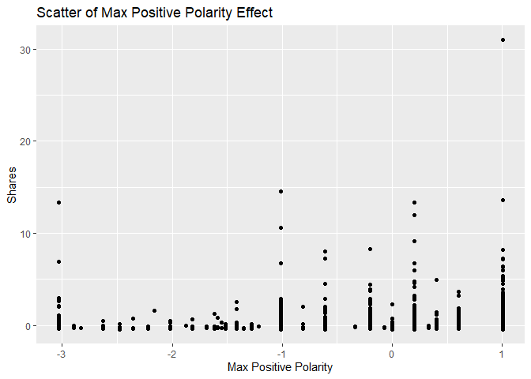

News Popularity Friday Data
================
Shuang Du
10/16/2020

## Load Libraries

``` r
library(readxl);
library(tidyverse);
library(caret);
library(modelr);
library(rpart);
library(kableExtra);
```

## Read in Data

``` r
getData <- function(day) {

  newsPopData <- read_csv("../../raw_data/OnlineNewsPopularity.csv")
  
  if (day == 'monday') {
    newsPopData <- newsPopData %>% filter(weekday_is_monday == 1)
  } else if(day == 'tuesday') {
    newsPopData <- newsPopData %>% filter(weekday_is_tuesday == 1)
  } else if(day == 'wednesday') {
    newsPopData <- newsPopData %>% filter(weekday_is_wednesday == 1)
  } else if(day == 'thursday') {
    newsPopData <- newsPopData %>% filter(weekday_is_thursday == 1)
  } else if(day == 'friday') {
    newsPopData <- newsPopData %>% filter(weekday_is_friday == 1)
  } else if(day == 'saturday') {
    newsPopData <- newsPopData %>% filter(weekday_is_saturday == 1)
  } else if(day == 'sunday') {
    newsPopData <- newsPopData %>% filter(weekday_is_sunday == 1)
  } else {
    stop("Invalid date")
  }
  return(newsPopData)
}

newsPopData <- getData(params$day)
```

## Set Aside Training Data

``` r
set.seed(92)
trainIndex <- createDataPartition(newsPopData$shares, 
                                  p = 0.7, list = FALSE)

newsPopTrain <- newsPopData[as.vector(trainIndex),];
newsPopTest <- newsPopData[-as.vector(trainIndex),];
```

## Center and Scale

``` r
preProcValues <- preProcess(newsPopTrain, method = c("center", "scale"))
newsPopTrain <- predict(preProcValues, newsPopTrain) 
newsPopTest <- predict(preProcValues, newsPopTest)
```

## Summary of a Few Variables

The plots below show a histogram of the number of shares for the given
day. Scatter plots on the effect of max positive polarity, article time
delta and number of videos in the article are also included.

As expected the histogram has a strong right tail, as seem by the
summary stats which show a very high maximum and a median severals
orders of magnitude lower. This is expected for because of the “viral”
nature of online popularity.

``` r
summary(newsPopTrain$shares)
```

    ##     Min.  1st Qu.   Median     Mean  3rd Qu.     Max. 
    ## -0.42680 -0.29889 -0.22801  0.00000 -0.06661 30.96279

``` r
g0 <- ggplot(newsPopTrain, aes(x=shares))
g0 + geom_histogram(binwidth = 0.5) + ggtitle('Histogram for Number of Shares') + ylab('Number of Shares') + xlab('Shares')
```

<!-- -->

``` r
summary(newsPopTrain$max_positive_polarity)
```

    ##    Min. 1st Qu.  Median    Mean 3rd Qu.    Max. 
    ## -3.0308 -0.6086  0.1988  0.0000  1.0062  1.0062

``` r
g1 <- ggplot(newsPopTrain, aes(x = max_positive_polarity, y = shares )) 
g1 + geom_point() + ggtitle('Scatter of Max Positive Polarity Effect') + ylab('Shares') + xlab('Max Positive Polarity')
```

<!-- -->

``` r
summary(newsPopTrain$timedelta)
```

    ##     Min.  1st Qu.   Median     Mean  3rd Qu.     Max. 
    ## -1.59326 -0.87297 -0.08719  0.00000  0.89503  1.74628

``` r
g2 <- ggplot(newsPopTrain, aes(x = timedelta, y = shares )) 
g2 + geom_point() + ggtitle('Scatter of Article Age Effect') + ylab('Shares') + xlab('Time Delta')
```

<!-- -->

``` r
summary(newsPopTrain$num_videos)
```

    ##     Min.  1st Qu.   Median     Mean  3rd Qu.     Max. 
    ## -0.29027 -0.29027 -0.29027  0.00000 -0.06121 20.55418

``` r
g3 <- ggplot(newsPopTrain, aes(x = num_videos, y = shares )) 
g3 + geom_point() + ggtitle('Scatter of Videos Number Effect') + ylab('Shares') + xlab('Number of Videos')
```

<!-- -->

## Modeling

### Standard Tree Based Model (no ensemble)

The type of model being fitted here is a decision tree. The tree splits
are based on minimizing the residual sum of squares for each region.

``` r
rpartFit <- train(shares ~ timedelta + n_tokens_title + n_tokens_content + n_unique_tokens + n_non_stop_words + n_non_stop_unique_tokens
                 + num_hrefs + num_self_hrefs + num_imgs + num_videos + average_token_length + num_keywords + data_channel_is_lifestyle +
                 data_channel_is_entertainment + data_channel_is_bus + data_channel_is_socmed + data_channel_is_tech + data_channel_is_world +
                 self_reference_min_shares + self_reference_max_shares + self_reference_avg_sharess + global_subjectivity + global_sentiment_polarity
                 + global_rate_positive_words + global_rate_negative_words + rate_positive_words + rate_negative_words + avg_positive_polarity +
                  min_positive_polarity + max_positive_polarity + avg_negative_polarity + min_negative_polarity + max_negative_polarity + title_subjectivity
                 + title_sentiment_polarity + abs_title_subjectivity + abs_title_sentiment_polarity, data = newsPopTrain,
             method = "rpart",
             trControl = trainControl(method = "cv", number = 10))
rpartFit
```

    ## CART 
    ## 
    ## 3993 samples
    ##   37 predictor
    ## 
    ## No pre-processing
    ## Resampling: Cross-Validated (10 fold) 
    ## Summary of sample sizes: 3594, 3594, 3594, 3593, 3593, 3594, ... 
    ## Resampling results across tuning parameters:
    ## 
    ##   cp          RMSE       Rsquared     MAE      
    ##   0.01095346  0.9775826  0.030381312  0.3801257
    ##   0.02032740  0.9788911  0.015408448  0.3820427
    ##   0.02374013  0.9808500  0.007496958  0.3840107
    ## 
    ## RMSE was used to select the optimal model using the smallest value.
    ## The final value used for the model was cp = 0.01095346.

``` r
# create the prediction
pred1 <- predict(rpartFit, newdata = newsPopTest)

# compare the prediction vs the actual
resample1 <- postResample(pred1, obs = newsPopTest$shares)
resample1
```

    ##      RMSE  Rsquared       MAE 
    ## 1.2923121 0.0211727 0.4249831

### Boosted Tree Based Model

A boosted tree is an ensemble method which slowly approaches the tree
prediction which would result from the original data. In general, an
ensemble model model will have a lower RSME than a single tree model.

``` r
gbmFit <- train(shares ~ timedelta + n_tokens_title + n_tokens_content + n_unique_tokens + n_non_stop_words + n_non_stop_unique_tokens
                 + num_hrefs + num_self_hrefs + num_imgs + num_videos + average_token_length + num_keywords + data_channel_is_lifestyle +
                 data_channel_is_entertainment + data_channel_is_bus + data_channel_is_socmed + data_channel_is_tech + data_channel_is_world +
                 self_reference_min_shares + self_reference_max_shares + self_reference_avg_sharess + global_subjectivity + global_sentiment_polarity
                 + global_rate_positive_words + global_rate_negative_words + rate_positive_words + rate_negative_words + avg_positive_polarity +
                  min_positive_polarity + max_positive_polarity + avg_negative_polarity + min_negative_polarity + max_negative_polarity + title_subjectivity
                 + title_sentiment_polarity + abs_title_subjectivity + abs_title_sentiment_polarity, data = newsPopTrain,
             method = "gbm",
             trControl = trainControl(method = "cv", number = 10))
```

    ## Iter   TrainDeviance   ValidDeviance   StepSize   Improve
    ##      1        0.9797             nan     0.1000   -0.0002
    ##      2        0.9755             nan     0.1000    0.0025
    ##      3        0.9734             nan     0.1000    0.0008
    ##      4        0.9703             nan     0.1000    0.0011
    ##      5        0.9675             nan     0.1000    0.0015
    ##      6        0.9660             nan     0.1000   -0.0006
    ##      7        0.9649             nan     0.1000   -0.0005
    ##      8        0.9639             nan     0.1000   -0.0010
    ##      9        0.9616             nan     0.1000   -0.0001
    ##     10        0.9598             nan     0.1000    0.0015
    ##     20        0.9477             nan     0.1000    0.0006
    ##     40        0.9377             nan     0.1000   -0.0006
    ##     60        0.9309             nan     0.1000   -0.0009
    ##     80        0.9252             nan     0.1000   -0.0000
    ##    100        0.9211             nan     0.1000   -0.0013
    ##    120        0.9144             nan     0.1000    0.0001
    ##    140        0.9105             nan     0.1000   -0.0011
    ##    150        0.9089             nan     0.1000   -0.0006
    ## 
    ## Iter   TrainDeviance   ValidDeviance   StepSize   Improve
    ##      1        0.9760             nan     0.1000    0.0032
    ##      2        0.9720             nan     0.1000    0.0024
    ##      3        0.9640             nan     0.1000    0.0014
    ##      4        0.9589             nan     0.1000    0.0005
    ##      5        0.9568             nan     0.1000   -0.0004
    ##      6        0.9507             nan     0.1000    0.0012
    ##      7        0.9443             nan     0.1000   -0.0011
    ##      8        0.9409             nan     0.1000    0.0019
    ##      9        0.9384             nan     0.1000    0.0002
    ##     10        0.9360             nan     0.1000    0.0006
    ##     20        0.9053             nan     0.1000   -0.0003
    ##     40        0.8662             nan     0.1000    0.0004
    ##     60        0.8437             nan     0.1000   -0.0025
    ##     80        0.8178             nan     0.1000   -0.0009
    ##    100        0.8024             nan     0.1000   -0.0024
    ##    120        0.7839             nan     0.1000   -0.0016
    ##    140        0.7676             nan     0.1000   -0.0007
    ##    150        0.7631             nan     0.1000   -0.0006
    ## 
    ## Iter   TrainDeviance   ValidDeviance   StepSize   Improve
    ##      1        0.9730             nan     0.1000    0.0012
    ##      2        0.9675             nan     0.1000    0.0027
    ##      3        0.9588             nan     0.1000   -0.0008
    ##      4        0.9560             nan     0.1000    0.0012
    ##      5        0.9514             nan     0.1000    0.0017
    ##      6        0.9449             nan     0.1000    0.0017
    ##      7        0.9408             nan     0.1000    0.0013
    ##      8        0.9342             nan     0.1000   -0.0028
    ##      9        0.9239             nan     0.1000    0.0009
    ##     10        0.9197             nan     0.1000   -0.0006
    ##     20        0.8833             nan     0.1000   -0.0003
    ##     40        0.8325             nan     0.1000   -0.0013
    ##     60        0.7990             nan     0.1000    0.0001
    ##     80        0.7603             nan     0.1000   -0.0004
    ##    100        0.7319             nan     0.1000   -0.0013
    ##    120        0.7085             nan     0.1000   -0.0013
    ##    140        0.6910             nan     0.1000    0.0001
    ##    150        0.6770             nan     0.1000   -0.0027
    ## 
    ## Iter   TrainDeviance   ValidDeviance   StepSize   Improve
    ##      1        1.0416             nan     0.1000    0.0029
    ##      2        1.0389             nan     0.1000    0.0025
    ##      3        1.0358             nan     0.1000    0.0024
    ##      4        1.0344             nan     0.1000    0.0001
    ##      5        1.0325             nan     0.1000    0.0008
    ##      6        1.0296             nan     0.1000    0.0001
    ##      7        1.0277             nan     0.1000    0.0018
    ##      8        1.0257             nan     0.1000    0.0009
    ##      9        1.0240             nan     0.1000    0.0010
    ##     10        1.0229             nan     0.1000   -0.0001
    ##     20        1.0104             nan     0.1000   -0.0006
    ##     40        0.9950             nan     0.1000    0.0002
    ##     60        0.9867             nan     0.1000   -0.0014
    ##     80        0.9803             nan     0.1000   -0.0007
    ##    100        0.9743             nan     0.1000   -0.0008
    ##    120        0.9707             nan     0.1000   -0.0008
    ##    140        0.9638             nan     0.1000   -0.0008
    ##    150        0.9618             nan     0.1000   -0.0015
    ## 
    ## Iter   TrainDeviance   ValidDeviance   StepSize   Improve
    ##      1        1.0346             nan     0.1000    0.0032
    ##      2        1.0297             nan     0.1000   -0.0001
    ##      3        1.0249             nan     0.1000    0.0002
    ##      4        1.0157             nan     0.1000    0.0011
    ##      5        1.0085             nan     0.1000   -0.0008
    ##      6        1.0039             nan     0.1000   -0.0029
    ##      7        0.9975             nan     0.1000    0.0005
    ##      8        0.9935             nan     0.1000   -0.0001
    ##      9        0.9906             nan     0.1000    0.0011
    ##     10        0.9881             nan     0.1000    0.0008
    ##     20        0.9482             nan     0.1000   -0.0015
    ##     40        0.9045             nan     0.1000   -0.0018
    ##     60        0.8800             nan     0.1000   -0.0006
    ##     80        0.8576             nan     0.1000   -0.0009
    ##    100        0.8368             nan     0.1000   -0.0013
    ##    120        0.8222             nan     0.1000   -0.0012
    ##    140        0.8018             nan     0.1000   -0.0018
    ##    150        0.7971             nan     0.1000   -0.0005
    ## 
    ## Iter   TrainDeviance   ValidDeviance   StepSize   Improve
    ##      1        1.0357             nan     0.1000   -0.0008
    ##      2        1.0243             nan     0.1000    0.0059
    ##      3        1.0153             nan     0.1000    0.0027
    ##      4        0.9977             nan     0.1000   -0.0009
    ##      5        0.9922             nan     0.1000    0.0033
    ##      6        0.9770             nan     0.1000    0.0002
    ##      7        0.9724             nan     0.1000    0.0027
    ##      8        0.9623             nan     0.1000   -0.0026
    ##      9        0.9568             nan     0.1000   -0.0030
    ##     10        0.9532             nan     0.1000   -0.0006
    ##     20        0.9117             nan     0.1000   -0.0006
    ##     40        0.8724             nan     0.1000   -0.0029
    ##     60        0.8237             nan     0.1000   -0.0002
    ##     80        0.7840             nan     0.1000   -0.0030
    ##    100        0.7508             nan     0.1000   -0.0016
    ##    120        0.7355             nan     0.1000   -0.0002
    ##    140        0.7028             nan     0.1000   -0.0015
    ##    150        0.6917             nan     0.1000   -0.0015
    ## 
    ## Iter   TrainDeviance   ValidDeviance   StepSize   Improve
    ##      1        1.0063             nan     0.1000    0.0029
    ##      2        1.0032             nan     0.1000    0.0030
    ##      3        1.0000             nan     0.1000    0.0019
    ##      4        0.9981             nan     0.1000    0.0021
    ##      5        0.9969             nan     0.1000    0.0005
    ##      6        0.9948             nan     0.1000    0.0021
    ##      7        0.9940             nan     0.1000    0.0001
    ##      8        0.9931             nan     0.1000   -0.0007
    ##      9        0.9914             nan     0.1000    0.0008
    ##     10        0.9896             nan     0.1000   -0.0002
    ##     20        0.9771             nan     0.1000   -0.0001
    ##     40        0.9622             nan     0.1000   -0.0007
    ##     60        0.9526             nan     0.1000   -0.0003
    ##     80        0.9490             nan     0.1000   -0.0012
    ##    100        0.9423             nan     0.1000   -0.0006
    ##    120        0.9375             nan     0.1000   -0.0007
    ##    140        0.9336             nan     0.1000   -0.0017
    ##    150        0.9323             nan     0.1000   -0.0009
    ## 
    ## Iter   TrainDeviance   ValidDeviance   StepSize   Improve
    ##      1        1.0037             nan     0.1000    0.0042
    ##      2        1.0008             nan     0.1000   -0.0005
    ##      3        0.9963             nan     0.1000    0.0040
    ##      4        0.9893             nan     0.1000    0.0021
    ##      5        0.9865             nan     0.1000    0.0015
    ##      6        0.9806             nan     0.1000   -0.0006
    ##      7        0.9741             nan     0.1000    0.0018
    ##      8        0.9682             nan     0.1000   -0.0022
    ##      9        0.9638             nan     0.1000    0.0010
    ##     10        0.9594             nan     0.1000    0.0027
    ##     20        0.9306             nan     0.1000   -0.0009
    ##     40        0.8889             nan     0.1000   -0.0010
    ##     60        0.8706             nan     0.1000   -0.0012
    ##     80        0.8510             nan     0.1000    0.0005
    ##    100        0.8279             nan     0.1000   -0.0039
    ##    120        0.8175             nan     0.1000   -0.0001
    ##    140        0.7993             nan     0.1000   -0.0009
    ##    150        0.7918             nan     0.1000   -0.0004
    ## 
    ## Iter   TrainDeviance   ValidDeviance   StepSize   Improve
    ##      1        1.0021             nan     0.1000    0.0026
    ##      2        0.9960             nan     0.1000    0.0018
    ##      3        0.9903             nan     0.1000    0.0051
    ##      4        0.9839             nan     0.1000   -0.0006
    ##      5        0.9789             nan     0.1000    0.0001
    ##      6        0.9620             nan     0.1000    0.0005
    ##      7        0.9588             nan     0.1000    0.0015
    ##      8        0.9573             nan     0.1000   -0.0011
    ##      9        0.9522             nan     0.1000    0.0012
    ##     10        0.9483             nan     0.1000    0.0010
    ##     20        0.9030             nan     0.1000   -0.0000
    ##     40        0.8353             nan     0.1000   -0.0011
    ##     60        0.7975             nan     0.1000   -0.0016
    ##     80        0.7634             nan     0.1000   -0.0001
    ##    100        0.7294             nan     0.1000   -0.0013
    ##    120        0.7055             nan     0.1000   -0.0004
    ##    140        0.6867             nan     0.1000   -0.0011
    ##    150        0.6726             nan     0.1000   -0.0030
    ## 
    ## Iter   TrainDeviance   ValidDeviance   StepSize   Improve
    ##      1        0.9860             nan     0.1000    0.0028
    ##      2        0.9820             nan     0.1000    0.0028
    ##      3        0.9800             nan     0.1000    0.0001
    ##      4        0.9769             nan     0.1000    0.0022
    ##      5        0.9754             nan     0.1000   -0.0000
    ##      6        0.9731             nan     0.1000    0.0015
    ##      7        0.9708             nan     0.1000    0.0001
    ##      8        0.9694             nan     0.1000    0.0003
    ##      9        0.9676             nan     0.1000    0.0004
    ##     10        0.9658             nan     0.1000    0.0012
    ##     20        0.9537             nan     0.1000   -0.0001
    ##     40        0.9400             nan     0.1000   -0.0017
    ##     60        0.9338             nan     0.1000   -0.0003
    ##     80        0.9270             nan     0.1000   -0.0004
    ##    100        0.9229             nan     0.1000   -0.0002
    ##    120        0.9180             nan     0.1000   -0.0008
    ##    140        0.9135             nan     0.1000   -0.0004
    ##    150        0.9120             nan     0.1000   -0.0010
    ## 
    ## Iter   TrainDeviance   ValidDeviance   StepSize   Improve
    ##      1        0.9787             nan     0.1000    0.0045
    ##      2        0.9751             nan     0.1000    0.0031
    ##      3        0.9664             nan     0.1000   -0.0009
    ##      4        0.9615             nan     0.1000   -0.0052
    ##      5        0.9533             nan     0.1000    0.0011
    ##      6        0.9487             nan     0.1000    0.0038
    ##      7        0.9452             nan     0.1000    0.0009
    ##      8        0.9436             nan     0.1000    0.0004
    ##      9        0.9387             nan     0.1000    0.0027
    ##     10        0.9370             nan     0.1000    0.0011
    ##     20        0.9145             nan     0.1000   -0.0001
    ##     40        0.8707             nan     0.1000   -0.0023
    ##     60        0.8385             nan     0.1000   -0.0015
    ##     80        0.8149             nan     0.1000   -0.0022
    ##    100        0.7999             nan     0.1000   -0.0008
    ##    120        0.7777             nan     0.1000   -0.0011
    ##    140        0.7652             nan     0.1000   -0.0002
    ##    150        0.7534             nan     0.1000   -0.0008
    ## 
    ## Iter   TrainDeviance   ValidDeviance   StepSize   Improve
    ##      1        0.9841             nan     0.1000    0.0023
    ##      2        0.9687             nan     0.1000    0.0044
    ##      3        0.9627             nan     0.1000    0.0020
    ##      4        0.9588             nan     0.1000    0.0022
    ##      5        0.9408             nan     0.1000   -0.0001
    ##      6        0.9367             nan     0.1000    0.0009
    ##      7        0.9311             nan     0.1000   -0.0007
    ##      8        0.9244             nan     0.1000   -0.0015
    ##      9        0.9181             nan     0.1000   -0.0008
    ##     10        0.9162             nan     0.1000   -0.0001
    ##     20        0.8717             nan     0.1000   -0.0016
    ##     40        0.8114             nan     0.1000   -0.0015
    ##     60        0.7761             nan     0.1000   -0.0012
    ##     80        0.7404             nan     0.1000   -0.0018
    ##    100        0.7151             nan     0.1000   -0.0000
    ##    120        0.6901             nan     0.1000   -0.0039
    ##    140        0.6660             nan     0.1000   -0.0005
    ##    150        0.6569             nan     0.1000   -0.0013
    ## 
    ## Iter   TrainDeviance   ValidDeviance   StepSize   Improve
    ##      1        1.0663             nan     0.1000    0.0031
    ##      2        1.0636             nan     0.1000    0.0001
    ##      3        1.0587             nan     0.1000    0.0027
    ##      4        1.0559             nan     0.1000    0.0023
    ##      5        1.0537             nan     0.1000    0.0013
    ##      6        1.0512             nan     0.1000    0.0016
    ##      7        1.0496             nan     0.1000   -0.0003
    ##      8        1.0475             nan     0.1000    0.0008
    ##      9        1.0462             nan     0.1000    0.0004
    ##     10        1.0455             nan     0.1000   -0.0006
    ##     20        1.0319             nan     0.1000   -0.0004
    ##     40        1.0189             nan     0.1000   -0.0014
    ##     60        1.0095             nan     0.1000   -0.0011
    ##     80        1.0024             nan     0.1000   -0.0004
    ##    100        0.9966             nan     0.1000    0.0001
    ##    120        0.9925             nan     0.1000   -0.0012
    ##    140        0.9875             nan     0.1000   -0.0010
    ##    150        0.9866             nan     0.1000   -0.0012
    ## 
    ## Iter   TrainDeviance   ValidDeviance   StepSize   Improve
    ##      1        1.0610             nan     0.1000    0.0016
    ##      2        1.0551             nan     0.1000   -0.0001
    ##      3        1.0445             nan     0.1000    0.0042
    ##      4        1.0357             nan     0.1000    0.0053
    ##      5        1.0311             nan     0.1000    0.0010
    ##      6        1.0275             nan     0.1000   -0.0002
    ##      7        1.0247             nan     0.1000   -0.0019
    ##      8        1.0166             nan     0.1000   -0.0008
    ##      9        1.0148             nan     0.1000   -0.0000
    ##     10        1.0096             nan     0.1000   -0.0035
    ##     20        0.9733             nan     0.1000    0.0003
    ##     40        0.9284             nan     0.1000   -0.0015
    ##     60        0.9012             nan     0.1000   -0.0012
    ##     80        0.8738             nan     0.1000   -0.0003
    ##    100        0.8580             nan     0.1000    0.0001
    ##    120        0.8421             nan     0.1000   -0.0027
    ##    140        0.8226             nan     0.1000   -0.0016
    ##    150        0.8126             nan     0.1000   -0.0041
    ## 
    ## Iter   TrainDeviance   ValidDeviance   StepSize   Improve
    ##      1        1.0602             nan     0.1000    0.0056
    ##      2        1.0446             nan     0.1000    0.0073
    ##      3        1.0362             nan     0.1000    0.0007
    ##      4        1.0256             nan     0.1000    0.0005
    ##      5        1.0210             nan     0.1000   -0.0006
    ##      6        1.0181             nan     0.1000    0.0002
    ##      7        1.0134             nan     0.1000    0.0003
    ##      8        1.0072             nan     0.1000   -0.0008
    ##      9        1.0004             nan     0.1000    0.0015
    ##     10        0.9892             nan     0.1000    0.0000
    ##     20        0.9453             nan     0.1000   -0.0005
    ##     40        0.8716             nan     0.1000   -0.0037
    ##     60        0.8192             nan     0.1000   -0.0027
    ##     80        0.7905             nan     0.1000   -0.0001
    ##    100        0.7686             nan     0.1000   -0.0050
    ##    120        0.7449             nan     0.1000   -0.0044
    ##    140        0.7233             nan     0.1000   -0.0016
    ##    150        0.7153             nan     0.1000   -0.0005
    ## 
    ## Iter   TrainDeviance   ValidDeviance   StepSize   Improve
    ##      1        1.0122             nan     0.1000    0.0029
    ##      2        1.0092             nan     0.1000    0.0019
    ##      3        1.0068             nan     0.1000    0.0023
    ##      4        1.0042             nan     0.1000    0.0019
    ##      5        1.0025             nan     0.1000    0.0008
    ##      6        1.0005             nan     0.1000    0.0013
    ##      7        0.9982             nan     0.1000    0.0011
    ##      8        0.9961             nan     0.1000    0.0011
    ##      9        0.9945             nan     0.1000   -0.0000
    ##     10        0.9930             nan     0.1000    0.0007
    ##     20        0.9816             nan     0.1000    0.0004
    ##     40        0.9684             nan     0.1000   -0.0001
    ##     60        0.9596             nan     0.1000   -0.0006
    ##     80        0.9533             nan     0.1000   -0.0007
    ##    100        0.9485             nan     0.1000   -0.0006
    ##    120        0.9449             nan     0.1000   -0.0014
    ##    140        0.9413             nan     0.1000   -0.0008
    ##    150        0.9392             nan     0.1000   -0.0008
    ## 
    ## Iter   TrainDeviance   ValidDeviance   StepSize   Improve
    ##      1        1.0100             nan     0.1000   -0.0001
    ##      2        0.9998             nan     0.1000    0.0023
    ##      3        0.9925             nan     0.1000    0.0007
    ##      4        0.9899             nan     0.1000    0.0007
    ##      5        0.9866             nan     0.1000    0.0007
    ##      6        0.9815             nan     0.1000    0.0026
    ##      7        0.9756             nan     0.1000    0.0023
    ##      8        0.9700             nan     0.1000   -0.0013
    ##      9        0.9677             nan     0.1000    0.0008
    ##     10        0.9617             nan     0.1000    0.0036
    ##     20        0.9285             nan     0.1000   -0.0016
    ##     40        0.8846             nan     0.1000   -0.0011
    ##     60        0.8596             nan     0.1000   -0.0008
    ##     80        0.8398             nan     0.1000   -0.0031
    ##    100        0.8202             nan     0.1000   -0.0011
    ##    120        0.7998             nan     0.1000   -0.0013
    ##    140        0.7827             nan     0.1000   -0.0010
    ##    150        0.7760             nan     0.1000   -0.0004
    ## 
    ## Iter   TrainDeviance   ValidDeviance   StepSize   Improve
    ##      1        1.0071             nan     0.1000    0.0018
    ##      2        0.9961             nan     0.1000   -0.0010
    ##      3        0.9830             nan     0.1000    0.0060
    ##      4        0.9756             nan     0.1000    0.0010
    ##      5        0.9685             nan     0.1000    0.0021
    ##      6        0.9566             nan     0.1000    0.0054
    ##      7        0.9404             nan     0.1000   -0.0001
    ##      8        0.9351             nan     0.1000   -0.0002
    ##      9        0.9311             nan     0.1000    0.0003
    ##     10        0.9230             nan     0.1000   -0.0036
    ##     20        0.8737             nan     0.1000   -0.0026
    ##     40        0.8284             nan     0.1000   -0.0023
    ##     60        0.7892             nan     0.1000   -0.0008
    ##     80        0.7548             nan     0.1000   -0.0006
    ##    100        0.7265             nan     0.1000   -0.0004
    ##    120        0.7012             nan     0.1000   -0.0007
    ##    140        0.6835             nan     0.1000   -0.0008
    ##    150        0.6744             nan     0.1000   -0.0010
    ## 
    ## Iter   TrainDeviance   ValidDeviance   StepSize   Improve
    ##      1        0.8117             nan     0.1000    0.0024
    ##      2        0.8087             nan     0.1000    0.0020
    ##      3        0.8063             nan     0.1000    0.0019
    ##      4        0.8039             nan     0.1000    0.0014
    ##      5        0.8020             nan     0.1000    0.0010
    ##      6        0.8001             nan     0.1000    0.0004
    ##      7        0.7990             nan     0.1000    0.0009
    ##      8        0.7972             nan     0.1000    0.0008
    ##      9        0.7957             nan     0.1000    0.0002
    ##     10        0.7947             nan     0.1000    0.0007
    ##     20        0.7852             nan     0.1000    0.0003
    ##     40        0.7723             nan     0.1000   -0.0001
    ##     60        0.7653             nan     0.1000   -0.0003
    ##     80        0.7600             nan     0.1000   -0.0003
    ##    100        0.7566             nan     0.1000   -0.0006
    ##    120        0.7520             nan     0.1000   -0.0004
    ##    140        0.7497             nan     0.1000    0.0001
    ##    150        0.7480             nan     0.1000   -0.0007
    ## 
    ## Iter   TrainDeviance   ValidDeviance   StepSize   Improve
    ##      1        0.8114             nan     0.1000    0.0030
    ##      2        0.8072             nan     0.1000   -0.0003
    ##      3        0.8037             nan     0.1000   -0.0007
    ##      4        0.7998             nan     0.1000    0.0012
    ##      5        0.7955             nan     0.1000    0.0021
    ##      6        0.7918             nan     0.1000   -0.0003
    ##      7        0.7869             nan     0.1000    0.0016
    ##      8        0.7841             nan     0.1000   -0.0014
    ##      9        0.7820             nan     0.1000    0.0011
    ##     10        0.7796             nan     0.1000   -0.0005
    ##     20        0.7458             nan     0.1000   -0.0008
    ##     40        0.7134             nan     0.1000    0.0008
    ##     60        0.6947             nan     0.1000   -0.0018
    ##     80        0.6802             nan     0.1000   -0.0007
    ##    100        0.6709             nan     0.1000   -0.0005
    ##    120        0.6605             nan     0.1000   -0.0008
    ##    140        0.6480             nan     0.1000   -0.0003
    ##    150        0.6446             nan     0.1000   -0.0008
    ## 
    ## Iter   TrainDeviance   ValidDeviance   StepSize   Improve
    ##      1        0.8037             nan     0.1000    0.0039
    ##      2        0.7970             nan     0.1000    0.0056
    ##      3        0.7913             nan     0.1000    0.0011
    ##      4        0.7846             nan     0.1000    0.0013
    ##      5        0.7782             nan     0.1000    0.0001
    ##      6        0.7740             nan     0.1000    0.0012
    ##      7        0.7660             nan     0.1000    0.0035
    ##      8        0.7621             nan     0.1000    0.0032
    ##      9        0.7573             nan     0.1000    0.0017
    ##     10        0.7537             nan     0.1000   -0.0001
    ##     20        0.7194             nan     0.1000   -0.0003
    ##     40        0.6765             nan     0.1000   -0.0014
    ##     60        0.6508             nan     0.1000   -0.0005
    ##     80        0.6282             nan     0.1000   -0.0014
    ##    100        0.6096             nan     0.1000   -0.0017
    ##    120        0.5935             nan     0.1000   -0.0006
    ##    140        0.5781             nan     0.1000   -0.0009
    ##    150        0.5711             nan     0.1000   -0.0012
    ## 
    ## Iter   TrainDeviance   ValidDeviance   StepSize   Improve
    ##      1        1.0424             nan     0.1000    0.0033
    ##      2        1.0380             nan     0.1000    0.0024
    ##      3        1.0349             nan     0.1000    0.0024
    ##      4        1.0330             nan     0.1000   -0.0002
    ##      5        1.0313             nan     0.1000    0.0009
    ##      6        1.0305             nan     0.1000    0.0001
    ##      7        1.0284             nan     0.1000    0.0008
    ##      8        1.0260             nan     0.1000    0.0014
    ##      9        1.0244             nan     0.1000   -0.0001
    ##     10        1.0230             nan     0.1000    0.0006
    ##     20        1.0101             nan     0.1000    0.0001
    ##     40        0.9952             nan     0.1000   -0.0010
    ##     60        0.9869             nan     0.1000   -0.0009
    ##     80        0.9802             nan     0.1000   -0.0011
    ##    100        0.9759             nan     0.1000   -0.0010
    ##    120        0.9726             nan     0.1000   -0.0008
    ##    140        0.9675             nan     0.1000   -0.0007
    ##    150        0.9664             nan     0.1000   -0.0003
    ## 
    ## Iter   TrainDeviance   ValidDeviance   StepSize   Improve
    ##      1        1.0389             nan     0.1000    0.0048
    ##      2        1.0321             nan     0.1000    0.0018
    ##      3        1.0276             nan     0.1000    0.0035
    ##      4        1.0177             nan     0.1000    0.0023
    ##      5        1.0128             nan     0.1000    0.0003
    ##      6        1.0063             nan     0.1000   -0.0002
    ##      7        0.9996             nan     0.1000   -0.0010
    ##      8        0.9958             nan     0.1000    0.0016
    ##      9        0.9904             nan     0.1000    0.0007
    ##     10        0.9859             nan     0.1000   -0.0020
    ##     20        0.9569             nan     0.1000    0.0003
    ##     40        0.9033             nan     0.1000   -0.0014
    ##     60        0.8832             nan     0.1000   -0.0021
    ##     80        0.8615             nan     0.1000   -0.0019
    ##    100        0.8441             nan     0.1000   -0.0007
    ##    120        0.8299             nan     0.1000   -0.0011
    ##    140        0.8137             nan     0.1000   -0.0012
    ##    150        0.8062             nan     0.1000   -0.0011
    ## 
    ## Iter   TrainDeviance   ValidDeviance   StepSize   Improve
    ##      1        1.0347             nan     0.1000    0.0029
    ##      2        1.0188             nan     0.1000    0.0018
    ##      3        1.0144             nan     0.1000    0.0021
    ##      4        1.0084             nan     0.1000    0.0027
    ##      5        1.0013             nan     0.1000   -0.0004
    ##      6        0.9978             nan     0.1000    0.0001
    ##      7        0.9895             nan     0.1000   -0.0003
    ##      8        0.9811             nan     0.1000    0.0024
    ##      9        0.9734             nan     0.1000   -0.0009
    ##     10        0.9710             nan     0.1000    0.0006
    ##     20        0.9276             nan     0.1000    0.0004
    ##     40        0.8653             nan     0.1000   -0.0032
    ##     60        0.8250             nan     0.1000   -0.0030
    ##     80        0.7892             nan     0.1000   -0.0036
    ##    100        0.7560             nan     0.1000   -0.0019
    ##    120        0.7349             nan     0.1000   -0.0013
    ##    140        0.7090             nan     0.1000   -0.0005
    ##    150        0.7008             nan     0.1000   -0.0050
    ## 
    ## Iter   TrainDeviance   ValidDeviance   StepSize   Improve
    ##      1        1.0422             nan     0.1000    0.0036
    ##      2        1.0390             nan     0.1000    0.0031
    ##      3        1.0354             nan     0.1000    0.0014
    ##      4        1.0339             nan     0.1000    0.0003
    ##      5        1.0325             nan     0.1000   -0.0004
    ##      6        1.0304             nan     0.1000    0.0006
    ##      7        1.0281             nan     0.1000    0.0013
    ##      8        1.0267             nan     0.1000   -0.0009
    ##      9        1.0244             nan     0.1000    0.0011
    ##     10        1.0230             nan     0.1000    0.0009
    ##     20        1.0139             nan     0.1000    0.0008
    ##     40        0.9971             nan     0.1000   -0.0003
    ##     60        0.9872             nan     0.1000   -0.0006
    ##     80        0.9820             nan     0.1000   -0.0007
    ##    100        0.9780             nan     0.1000   -0.0005
    ##    120        0.9723             nan     0.1000   -0.0003
    ##    140        0.9676             nan     0.1000   -0.0005
    ##    150        0.9651             nan     0.1000   -0.0000
    ## 
    ## Iter   TrainDeviance   ValidDeviance   StepSize   Improve
    ##      1        1.0360             nan     0.1000    0.0032
    ##      2        1.0305             nan     0.1000    0.0018
    ##      3        1.0220             nan     0.1000    0.0048
    ##      4        1.0172             nan     0.1000   -0.0006
    ##      5        1.0143             nan     0.1000    0.0012
    ##      6        1.0121             nan     0.1000    0.0015
    ##      7        1.0070             nan     0.1000    0.0012
    ##      8        1.0034             nan     0.1000    0.0018
    ##      9        0.9965             nan     0.1000    0.0003
    ##     10        0.9923             nan     0.1000   -0.0017
    ##     20        0.9563             nan     0.1000    0.0001
    ##     40        0.9062             nan     0.1000   -0.0020
    ##     60        0.8799             nan     0.1000   -0.0010
    ##     80        0.8580             nan     0.1000   -0.0023
    ##    100        0.8420             nan     0.1000   -0.0014
    ##    120        0.8173             nan     0.1000   -0.0005
    ##    140        0.8069             nan     0.1000   -0.0003
    ##    150        0.7983             nan     0.1000   -0.0020
    ## 
    ## Iter   TrainDeviance   ValidDeviance   StepSize   Improve
    ##      1        1.0387             nan     0.1000    0.0026
    ##      2        1.0301             nan     0.1000    0.0031
    ##      3        1.0248             nan     0.1000   -0.0003
    ##      4        1.0090             nan     0.1000    0.0004
    ##      5        1.0058             nan     0.1000    0.0003
    ##      6        0.9969             nan     0.1000    0.0007
    ##      7        0.9939             nan     0.1000    0.0005
    ##      8        0.9836             nan     0.1000   -0.0031
    ##      9        0.9817             nan     0.1000   -0.0011
    ##     10        0.9736             nan     0.1000   -0.0003
    ##     20        0.9193             nan     0.1000    0.0002
    ##     40        0.8596             nan     0.1000   -0.0032
    ##     60        0.8211             nan     0.1000   -0.0012
    ##     80        0.7818             nan     0.1000   -0.0024
    ##    100        0.7588             nan     0.1000   -0.0020
    ##    120        0.7275             nan     0.1000   -0.0027
    ##    140        0.7050             nan     0.1000   -0.0015
    ##    150        0.6867             nan     0.1000   -0.0021
    ## 
    ## Iter   TrainDeviance   ValidDeviance   StepSize   Improve
    ##      1        0.9708             nan     0.1000    0.0039
    ##      2        0.9691             nan     0.1000    0.0002
    ##      3        0.9649             nan     0.1000    0.0009
    ##      4        0.9633             nan     0.1000    0.0006
    ##      5        0.9595             nan     0.1000    0.0013
    ##      6        0.9575             nan     0.1000    0.0014
    ##      7        0.9564             nan     0.1000    0.0002
    ##      8        0.9549             nan     0.1000    0.0003
    ##      9        0.9524             nan     0.1000    0.0006
    ##     10        0.9517             nan     0.1000   -0.0001
    ##     20        0.9408             nan     0.1000   -0.0003
    ##     40        0.9295             nan     0.1000   -0.0003
    ##     60        0.9217             nan     0.1000   -0.0004
    ##     80        0.9143             nan     0.1000   -0.0003
    ##    100        0.9098             nan     0.1000   -0.0016
    ##    120        0.9037             nan     0.1000   -0.0007
    ##    140        0.8995             nan     0.1000   -0.0009
    ##    150        0.8977             nan     0.1000   -0.0004
    ## 
    ## Iter   TrainDeviance   ValidDeviance   StepSize   Improve
    ##      1        0.9703             nan     0.1000    0.0055
    ##      2        0.9568             nan     0.1000    0.0066
    ##      3        0.9467             nan     0.1000    0.0006
    ##      4        0.9408             nan     0.1000    0.0002
    ##      5        0.9332             nan     0.1000   -0.0004
    ##      6        0.9299             nan     0.1000   -0.0000
    ##      7        0.9233             nan     0.1000   -0.0009
    ##      8        0.9182             nan     0.1000   -0.0004
    ##      9        0.9159             nan     0.1000    0.0009
    ##     10        0.9130             nan     0.1000   -0.0000
    ##     20        0.8861             nan     0.1000   -0.0010
    ##     40        0.8465             nan     0.1000    0.0007
    ##     60        0.8170             nan     0.1000   -0.0008
    ##     80        0.7990             nan     0.1000   -0.0010
    ##    100        0.7782             nan     0.1000    0.0004
    ##    120        0.7671             nan     0.1000   -0.0024
    ##    140        0.7470             nan     0.1000   -0.0009
    ##    150        0.7411             nan     0.1000   -0.0028
    ## 
    ## Iter   TrainDeviance   ValidDeviance   StepSize   Improve
    ##      1        0.9643             nan     0.1000    0.0021
    ##      2        0.9470             nan     0.1000    0.0069
    ##      3        0.9366             nan     0.1000    0.0012
    ##      4        0.9158             nan     0.1000    0.0082
    ##      5        0.9126             nan     0.1000    0.0011
    ##      6        0.9002             nan     0.1000    0.0020
    ##      7        0.8924             nan     0.1000   -0.0000
    ##      8        0.8902             nan     0.1000    0.0007
    ##      9        0.8867             nan     0.1000    0.0022
    ##     10        0.8800             nan     0.1000    0.0008
    ##     20        0.8348             nan     0.1000   -0.0012
    ##     40        0.7691             nan     0.1000   -0.0012
    ##     60        0.7323             nan     0.1000   -0.0019
    ##     80        0.7033             nan     0.1000    0.0003
    ##    100        0.6783             nan     0.1000   -0.0031
    ##    120        0.6521             nan     0.1000   -0.0006
    ##    140        0.6289             nan     0.1000   -0.0005
    ##    150        0.6256             nan     0.1000   -0.0012
    ## 
    ## Iter   TrainDeviance   ValidDeviance   StepSize   Improve
    ##      1        0.9971             nan     0.1000    0.0023
    ##      2        0.9941             nan     0.1000    0.0029
    ##      3        0.9925             nan     0.1000    0.0007
    ##      4        0.9910             nan     0.1000   -0.0003
    ##      5        0.9891             nan     0.1000    0.0006
    ##      6        0.9866             nan     0.1000    0.0019
    ##      7        0.9837             nan     0.1000    0.0017
    ##      8        0.9815             nan     0.1000    0.0013
    ##      9        0.9799             nan     0.1000    0.0011
    ##     10        0.9780             nan     0.1000    0.0003
    ##     20        0.9666             nan     0.1000   -0.0002
    ##     40        0.9533             nan     0.1000   -0.0002
    ##     50        0.9493             nan     0.1000   -0.0004

``` r
gbmFit
```

    ## Stochastic Gradient Boosting 
    ## 
    ## 3993 samples
    ##   37 predictor
    ## 
    ## No pre-processing
    ## Resampling: Cross-Validated (10 fold) 
    ## Summary of sample sizes: 3594, 3595, 3595, 3593, 3594, 3592, ... 
    ## Resampling results across tuning parameters:
    ## 
    ##   interaction.depth  n.trees  RMSE       Rsquared    MAE      
    ##   1                   50      0.9538492  0.02509559  0.3748233
    ##   1                  100      0.9548217  0.02637877  0.3767409
    ##   1                  150      0.9564702  0.02524605  0.3776673
    ##   2                   50      0.9573510  0.02557478  0.3743341
    ##   2                  100      0.9624314  0.02693698  0.3785626
    ##   2                  150      0.9678963  0.02470411  0.3804008
    ##   3                   50      0.9611844  0.03063946  0.3763732
    ##   3                  100      0.9705938  0.02618676  0.3826196
    ##   3                  150      0.9756831  0.02607816  0.3867384
    ## 
    ## Tuning parameter 'shrinkage' was held constant at a value of 0.1
    ## Tuning parameter 'n.minobsinnode' was held constant at a value of 10
    ## RMSE was used to select the optimal model using the smallest value.
    ## The final values used for the model were n.trees = 50, interaction.depth = 1, shrinkage = 0.1 and n.minobsinnode = 10.

``` r
# create the prediction
pred2 <- predict(gbmFit, newdata = newsPopTest)

# compare the prediction vs the actual
resample2 <- postResample(pred2, obs = newsPopTest$shares)
resample2
```

    ##       RMSE   Rsquared        MAE 
    ## 1.27669783 0.02538874 0.41955775

### Comparison

Below is a comparison of the two methods. Both have relatively high root
mean square errors.

``` r
comparison <- data.frame("RSME" = c(resample1[[1]], resample2[[1]]), "MAE" = c(resample1[[3]], resample2[[3]]) )
rownames(comparison) <- c("RPART","GBM")
kable(comparison)
```

<table>

<thead>

<tr>

<th style="text-align:left;">

</th>

<th style="text-align:right;">

RSME

</th>

<th style="text-align:right;">

MAE

</th>

</tr>

</thead>

<tbody>

<tr>

<td style="text-align:left;">

RPART

</td>

<td style="text-align:right;">

1.292312

</td>

<td style="text-align:right;">

0.4249831

</td>

</tr>

<tr>

<td style="text-align:left;">

GBM

</td>

<td style="text-align:right;">

1.276698

</td>

<td style="text-align:right;">

0.4195577

</td>

</tr>

</tbody>

</table>
