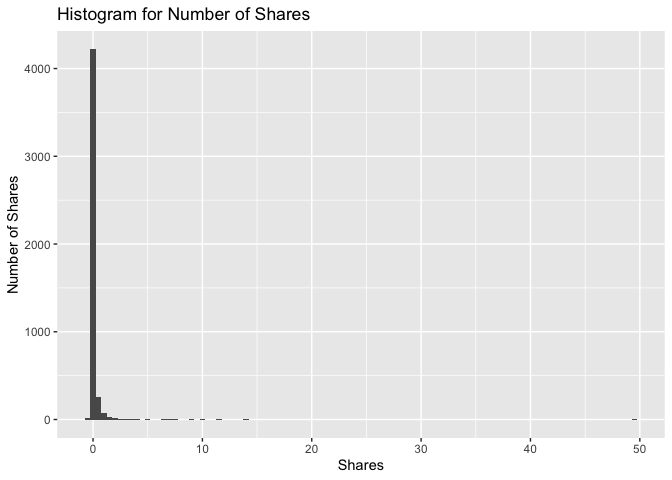
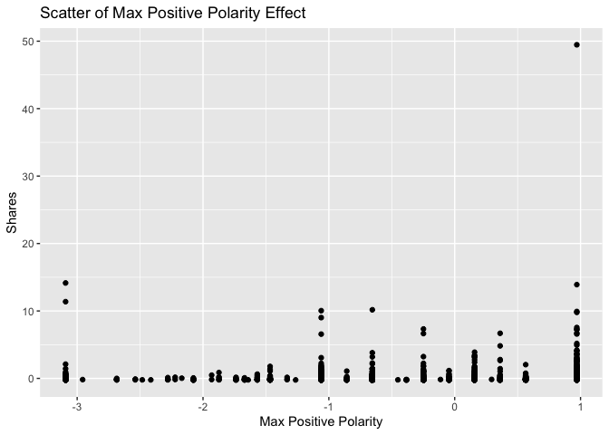
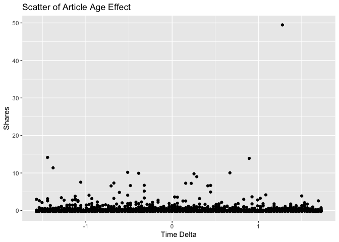
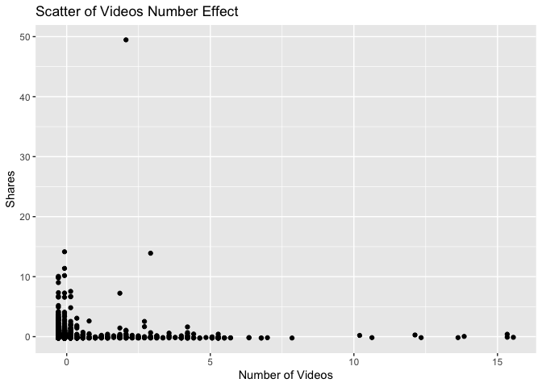

News Popularity Monday Data
================
Shuang Du
10/16/2020

## Load Libraries

``` r
library(readxl);
library(tidyverse);
library(caret);
library(modelr);
library(rpart);
library(kableExtra);
```

## Read in Data

``` r
getData <- function(day) {

  newsPopData <- read_csv("../../raw_data/OnlineNewsPopularity.csv")
  
  if (day == 'monday') {
    newsPopData <- newsPopData %>% filter(weekday_is_monday == 1)
  } else if(day == 'tuesday') {
    newsPopData <- newsPopData %>% filter(weekday_is_tuesday == 1)
  } else if(day == 'wednesday') {
    newsPopData <- newsPopData %>% filter(weekday_is_wednesday == 1)
  } else if(day == 'thursday') {
    newsPopData <- newsPopData %>% filter(weekday_is_thursday == 1)
  } else if(day == 'friday') {
    newsPopData <- newsPopData %>% filter(weekday_is_friday == 1)
  } else if(day == 'saturday') {
    newsPopData <- newsPopData %>% filter(weekday_is_saturday == 1)
  } else if(day == 'sunday') {
    newsPopData <- newsPopData %>% filter(weekday_is_sunday == 1)
  } else {
    stop("Invalid date")
  }
  return(newsPopData)
}

newsPopData <- getData(params$day)
```

## Set Aside Training Data

``` r
set.seed(92)
trainIndex <- createDataPartition(newsPopData$shares, 
                                  p = 0.7, list = FALSE)

newsPopTrain <- newsPopData[as.vector(trainIndex),];
newsPopTest <- newsPopData[-as.vector(trainIndex),];
```

## Center and Scale

``` r
preProcValues <- preProcess(newsPopTrain, method = c("center", "scale"))
newsPopTrain <- predict(preProcValues, newsPopTrain) 
newsPopTest <- predict(preProcValues, newsPopTest)
```

## Summary of a Few Variables

The plots below show a histogram of the number of shares for the given
day. Scatter plots on the effect of max positive polarity, article time
delta and number of videos in the article are also included.

As expected the histogram has a strong right tail, as seem by the
summary stats which show a very high maximum and a median severals
orders of magnitude lower. This is expected for because of the “viral”
nature of online popularity.

``` r
summary(newsPopTrain$shares)
```

    ##     Min.  1st Qu.   Median     Mean  3rd Qu.     Max. 
    ## -0.26350 -0.19737 -0.16273  0.00000 -0.06909 49.46601

``` r
g0 <- ggplot(newsPopTrain, aes(x=shares))
g0 + geom_histogram(binwidth = 0.5) + ggtitle('Histogram for Number of Shares') + ylab('Number of Shares') + xlab('Shares')
```

<!-- -->

``` r
summary(newsPopTrain$max_positive_polarity)
```

    ##    Min. 1st Qu.  Median    Mean 3rd Qu.    Max. 
    ## -3.0920 -0.6545  0.1579  0.0000  0.9704  0.9704

``` r
g1 <- ggplot(newsPopTrain, aes(x = max_positive_polarity, y = shares )) 
g1 + geom_point() + ggtitle('Scatter of Max Positive Polarity Effect') + ylab('Shares') + xlab('Max Positive Polarity')
```

<!-- -->

``` r
summary(newsPopTrain$timedelta)
```

    ##     Min.  1st Qu.   Median     Mean  3rd Qu.     Max. 
    ## -1.57188 -0.89940 -0.06681  0.00000  0.89388  1.72648

``` r
g2 <- ggplot(newsPopTrain, aes(x = timedelta, y = shares )) 
g2 + geom_point() + ggtitle('Scatter of Article Age Effect') + ylab('Shares') + xlab('Time Delta')
```

<!-- -->

``` r
summary(newsPopTrain$num_videos)
```

    ##     Min.  1st Qu.   Median     Mean  3rd Qu.     Max. 
    ## -0.29034 -0.29034 -0.29034  0.00000 -0.07625 15.55264

``` r
g3 <- ggplot(newsPopTrain, aes(x = num_videos, y = shares )) 
g3 + geom_point() + ggtitle('Scatter of Videos Number Effect') + ylab('Shares') + xlab('Number of Videos')
```

<!-- -->

## Modeling

### Standard Tree Based Model (no ensemble)

The type of model being fitted here is a decision tree. The tree splits
are based on minimizing the residual sum of squares for each region.

``` r
rpartFit <- train(shares ~ timedelta + n_tokens_title + n_tokens_content + n_unique_tokens + n_non_stop_words + n_non_stop_unique_tokens
                 + num_hrefs + num_self_hrefs + num_imgs + num_videos + average_token_length + num_keywords + data_channel_is_lifestyle +
                 data_channel_is_entertainment + data_channel_is_bus + data_channel_is_socmed + data_channel_is_tech + data_channel_is_world +
                 self_reference_min_shares + self_reference_max_shares + self_reference_avg_sharess + global_subjectivity + global_sentiment_polarity
                 + global_rate_positive_words + global_rate_negative_words + rate_positive_words + rate_negative_words + avg_positive_polarity +
                  min_positive_polarity + max_positive_polarity + avg_negative_polarity + min_negative_polarity + max_negative_polarity + title_subjectivity
                 + title_sentiment_polarity + abs_title_subjectivity + abs_title_sentiment_polarity, data = newsPopTrain,
             method = "rpart",
             trControl = trainControl(method = "cv", number = 10),
             tuneGrid = data.frame(cp = c(.001,.01,.015,.02,.03,.04,.05))
             )
             
rpartFit
```

    ## CART 
    ## 
    ## 4664 samples
    ##   37 predictor
    ## 
    ## No pre-processing
    ## Resampling: Cross-Validated (10 fold) 
    ## Summary of sample sizes: 4197, 4197, 4198, 4198, 4198, 4198, ... 
    ## Resampling results across tuning parameters:
    ## 
    ##   cp     RMSE       Rsquared     MAE      
    ##   0.001  0.9415776  0.008291090  0.2724841
    ##   0.010  0.9040358  0.006221227  0.2642650
    ##   0.015  0.9012953  0.006476592  0.2640466
    ##   0.020  0.9008808  0.007501558  0.2660116
    ##   0.030  0.8754077  0.010782680  0.2660516
    ##   0.040  0.8629773          NaN  0.2669994
    ##   0.050  0.8629773          NaN  0.2669994
    ## 
    ## RMSE was used to select the optimal model using the smallest value.
    ## The final value used for the model was cp = 0.05.

``` r
# create the prediction
pred1 <- predict(rpartFit, newdata = newsPopTest)

# compare the prediction vs the actual
resample1 <- postResample(pred1, obs = newsPopTest$shares)
resample1
```

    ##      RMSE  Rsquared       MAE 
    ## 1.1829896        NA 0.2640217

### Boosted Tree Based Model

A boosted tree is an ensemble method which slowly approaches the tree
prediction which would result from the original data. In general, an
ensemble model model will have a lower RSME than a single tree model.

``` r
gbmFit <- train(shares ~ timedelta + n_tokens_title + n_tokens_content + n_unique_tokens + n_non_stop_words + n_non_stop_unique_tokens
                 + num_hrefs + num_self_hrefs + num_imgs + num_videos + average_token_length + num_keywords + data_channel_is_lifestyle +
                 data_channel_is_entertainment + data_channel_is_bus + data_channel_is_socmed + data_channel_is_tech + data_channel_is_world +
                 self_reference_min_shares + self_reference_max_shares + self_reference_avg_sharess + global_subjectivity + global_sentiment_polarity
                 + global_rate_positive_words + global_rate_negative_words + rate_positive_words + rate_negative_words + avg_positive_polarity +
                  min_positive_polarity + max_positive_polarity + avg_negative_polarity + min_negative_polarity + max_negative_polarity + title_subjectivity
                 + title_sentiment_polarity + abs_title_subjectivity + abs_title_sentiment_polarity, data = newsPopTrain,
             method = "gbm",
             trControl = trainControl(method = "cv", number = 10))
```

    ## Iter   TrainDeviance   ValidDeviance   StepSize   Improve
    ##      1        1.0903             nan     0.1000    0.0016
    ##      2        1.0881             nan     0.1000    0.0010
    ##      3        1.0865             nan     0.1000    0.0004
    ##      4        1.0848             nan     0.1000    0.0003
    ##      5        1.0838             nan     0.1000   -0.0005
    ##      6        1.0834             nan     0.1000   -0.0002
    ##      7        1.0823             nan     0.1000   -0.0009
    ##      8        1.0817             nan     0.1000   -0.0000
    ##      9        1.0812             nan     0.1000    0.0000
    ##     10        1.0805             nan     0.1000   -0.0010
    ##     20        1.0733             nan     0.1000   -0.0001
    ##     40        1.0664             nan     0.1000   -0.0007
    ##     60        1.0613             nan     0.1000   -0.0012
    ##     80        1.0573             nan     0.1000   -0.0012
    ##    100        1.0527             nan     0.1000    0.0001
    ##    120        1.0519             nan     0.1000   -0.0008
    ##    140        1.0478             nan     0.1000   -0.0009
    ##    150        1.0459             nan     0.1000   -0.0010
    ## 
    ## Iter   TrainDeviance   ValidDeviance   StepSize   Improve
    ##      1        1.0897             nan     0.1000    0.0003
    ##      2        1.0812             nan     0.1000   -0.0001
    ##      3        1.0693             nan     0.1000   -0.0005
    ##      4        1.0603             nan     0.1000   -0.0030
    ##      5        1.0578             nan     0.1000    0.0009
    ##      6        1.0480             nan     0.1000   -0.0077
    ##      7        1.0424             nan     0.1000   -0.0080
    ##      8        1.0404             nan     0.1000    0.0010
    ##      9        1.0392             nan     0.1000    0.0002
    ##     10        1.0297             nan     0.1000   -0.0011
    ##     20        0.9820             nan     0.1000    0.0007
    ##     40        0.9385             nan     0.1000   -0.0030
    ##     60        0.9071             nan     0.1000   -0.0041
    ##     80        0.8851             nan     0.1000   -0.0020
    ##    100        0.8565             nan     0.1000   -0.0019
    ##    120        0.8371             nan     0.1000   -0.0032
    ##    140        0.8234             nan     0.1000   -0.0006
    ##    150        0.8141             nan     0.1000   -0.0038
    ## 
    ## Iter   TrainDeviance   ValidDeviance   StepSize   Improve
    ##      1        1.0844             nan     0.1000   -0.0007
    ##      2        1.0727             nan     0.1000   -0.0020
    ##      3        1.0702             nan     0.1000   -0.0000
    ##      4        1.0653             nan     0.1000    0.0011
    ##      5        1.0542             nan     0.1000   -0.0027
    ##      6        1.0518             nan     0.1000    0.0001
    ##      7        1.0441             nan     0.1000   -0.0026
    ##      8        1.0421             nan     0.1000    0.0005
    ##      9        1.0396             nan     0.1000   -0.0003
    ##     10        1.0387             nan     0.1000   -0.0004
    ##     20        0.9779             nan     0.1000   -0.0002
    ##     40        0.9144             nan     0.1000   -0.0057
    ##     60        0.8694             nan     0.1000   -0.0003
    ##     80        0.8164             nan     0.1000   -0.0031
    ##    100        0.7871             nan     0.1000   -0.0021
    ##    120        0.7502             nan     0.1000   -0.0023
    ##    140        0.7353             nan     0.1000   -0.0002
    ##    150        0.7200             nan     0.1000   -0.0029
    ## 
    ## Iter   TrainDeviance   ValidDeviance   StepSize   Improve
    ##      1        1.0107             nan     0.1000    0.0016
    ##      2        1.0097             nan     0.1000    0.0004
    ##      3        1.0089             nan     0.1000    0.0002
    ##      4        1.0084             nan     0.1000   -0.0002
    ##      5        1.0067             nan     0.1000   -0.0004
    ##      6        1.0055             nan     0.1000   -0.0008
    ##      7        1.0045             nan     0.1000   -0.0011
    ##      8        1.0031             nan     0.1000    0.0003
    ##      9        1.0025             nan     0.1000   -0.0000
    ##     10        1.0015             nan     0.1000   -0.0002
    ##     20        0.9979             nan     0.1000    0.0001
    ##     40        0.9914             nan     0.1000    0.0000
    ##     60        0.9877             nan     0.1000   -0.0013
    ##     80        0.9852             nan     0.1000   -0.0003
    ##    100        0.9808             nan     0.1000   -0.0003
    ##    120        0.9781             nan     0.1000   -0.0015
    ##    140        0.9753             nan     0.1000   -0.0008
    ##    150        0.9747             nan     0.1000   -0.0007
    ## 
    ## Iter   TrainDeviance   ValidDeviance   StepSize   Improve
    ##      1        1.0018             nan     0.1000    0.0042
    ##      2        0.9911             nan     0.1000   -0.0037
    ##      3        0.9892             nan     0.1000    0.0006
    ##      4        0.9828             nan     0.1000   -0.0007
    ##      5        0.9796             nan     0.1000    0.0034
    ##      6        0.9698             nan     0.1000   -0.0029
    ##      7        0.9604             nan     0.1000   -0.0004
    ##      8        0.9553             nan     0.1000   -0.0007
    ##      9        0.9542             nan     0.1000   -0.0003
    ##     10        0.9528             nan     0.1000    0.0008
    ##     20        0.9246             nan     0.1000   -0.0055
    ##     40        0.8851             nan     0.1000   -0.0048
    ##     60        0.8392             nan     0.1000   -0.0040
    ##     80        0.8142             nan     0.1000   -0.0035
    ##    100        0.7877             nan     0.1000   -0.0020
    ##    120        0.7680             nan     0.1000   -0.0004
    ##    140        0.7424             nan     0.1000   -0.0002
    ##    150        0.7334             nan     0.1000   -0.0043
    ## 
    ## Iter   TrainDeviance   ValidDeviance   StepSize   Improve
    ##      1        1.0094             nan     0.1000   -0.0001
    ##      2        0.9974             nan     0.1000   -0.0004
    ##      3        0.9944             nan     0.1000    0.0005
    ##      4        0.9910             nan     0.1000    0.0014
    ##      5        0.9807             nan     0.1000   -0.0016
    ##      6        0.9707             nan     0.1000   -0.0046
    ##      7        0.9618             nan     0.1000   -0.0022
    ##      8        0.9540             nan     0.1000   -0.0017
    ##      9        0.9526             nan     0.1000    0.0000
    ##     10        0.9439             nan     0.1000   -0.0027
    ##     20        0.8726             nan     0.1000   -0.0013
    ##     40        0.8306             nan     0.1000   -0.0011
    ##     60        0.7628             nan     0.1000   -0.0004
    ##     80        0.7149             nan     0.1000   -0.0028
    ##    100        0.6798             nan     0.1000   -0.0021
    ##    120        0.6460             nan     0.1000   -0.0009
    ##    140        0.6021             nan     0.1000   -0.0014
    ##    150        0.5813             nan     0.1000   -0.0004
    ## 
    ## Iter   TrainDeviance   ValidDeviance   StepSize   Improve
    ##      1        0.5141             nan     0.1000    0.0011
    ##      2        0.5134             nan     0.1000   -0.0000
    ##      3        0.5125             nan     0.1000    0.0001
    ##      4        0.5111             nan     0.1000    0.0012
    ##      5        0.5102             nan     0.1000    0.0006
    ##      6        0.5091             nan     0.1000    0.0008
    ##      7        0.5083             nan     0.1000    0.0007
    ##      8        0.5077             nan     0.1000   -0.0001
    ##      9        0.5067             nan     0.1000    0.0001
    ##     10        0.5061             nan     0.1000    0.0006
    ##     20        0.5014             nan     0.1000    0.0004
    ##     40        0.4948             nan     0.1000   -0.0001
    ##     60        0.4920             nan     0.1000   -0.0004
    ##     80        0.4902             nan     0.1000   -0.0006
    ##    100        0.4884             nan     0.1000   -0.0004
    ##    120        0.4870             nan     0.1000   -0.0000
    ##    140        0.4853             nan     0.1000   -0.0003
    ##    150        0.4847             nan     0.1000   -0.0002
    ## 
    ## Iter   TrainDeviance   ValidDeviance   StepSize   Improve
    ##      1        0.5124             nan     0.1000    0.0019
    ##      2        0.5100             nan     0.1000    0.0014
    ##      3        0.5081             nan     0.1000    0.0011
    ##      4        0.5060             nan     0.1000    0.0016
    ##      5        0.5049             nan     0.1000    0.0007
    ##      6        0.5032             nan     0.1000    0.0005
    ##      7        0.5017             nan     0.1000   -0.0001
    ##      8        0.5007             nan     0.1000    0.0001
    ##      9        0.4997             nan     0.1000    0.0003
    ##     10        0.4980             nan     0.1000   -0.0002
    ##     20        0.4871             nan     0.1000    0.0000
    ##     40        0.4709             nan     0.1000   -0.0004
    ##     60        0.4628             nan     0.1000   -0.0008
    ##     80        0.4564             nan     0.1000    0.0002
    ##    100        0.4509             nan     0.1000   -0.0005
    ##    120        0.4464             nan     0.1000   -0.0007
    ##    140        0.4415             nan     0.1000   -0.0004
    ##    150        0.4393             nan     0.1000   -0.0003
    ## 
    ## Iter   TrainDeviance   ValidDeviance   StepSize   Improve
    ##      1        0.5115             nan     0.1000   -0.0006
    ##      2        0.5087             nan     0.1000   -0.0005
    ##      3        0.5042             nan     0.1000    0.0012
    ##      4        0.5000             nan     0.1000   -0.0002
    ##      5        0.4968             nan     0.1000    0.0005
    ##      6        0.4947             nan     0.1000   -0.0001
    ##      7        0.4926             nan     0.1000   -0.0003
    ##      8        0.4899             nan     0.1000    0.0005
    ##      9        0.4867             nan     0.1000    0.0016
    ##     10        0.4851             nan     0.1000    0.0005
    ##     20        0.4700             nan     0.1000   -0.0003
    ##     40        0.4422             nan     0.1000   -0.0000
    ##     60        0.4210             nan     0.1000   -0.0005
    ##     80        0.4086             nan     0.1000   -0.0011
    ##    100        0.3989             nan     0.1000   -0.0011
    ##    120        0.3890             nan     0.1000   -0.0007
    ##    140        0.3786             nan     0.1000   -0.0008
    ##    150        0.3760             nan     0.1000   -0.0007
    ## 
    ## Iter   TrainDeviance   ValidDeviance   StepSize   Improve
    ##      1        1.0500             nan     0.1000    0.0006
    ##      2        1.0490             nan     0.1000    0.0007
    ##      3        1.0474             nan     0.1000   -0.0007
    ##      4        1.0462             nan     0.1000    0.0004
    ##      5        1.0449             nan     0.1000   -0.0009
    ##      6        1.0439             nan     0.1000   -0.0001
    ##      7        1.0431             nan     0.1000    0.0004
    ##      8        1.0424             nan     0.1000    0.0000
    ##      9        1.0415             nan     0.1000   -0.0011
    ##     10        1.0403             nan     0.1000    0.0003
    ##     20        1.0348             nan     0.1000    0.0002
    ##     40        1.0288             nan     0.1000   -0.0016
    ##     60        1.0226             nan     0.1000    0.0003
    ##     80        1.0190             nan     0.1000   -0.0011
    ##    100        1.0155             nan     0.1000   -0.0004
    ##    120        1.0137             nan     0.1000   -0.0016
    ##    140        1.0114             nan     0.1000   -0.0007
    ##    150        1.0106             nan     0.1000   -0.0003
    ## 
    ## Iter   TrainDeviance   ValidDeviance   StepSize   Improve
    ##      1        1.0497             nan     0.1000   -0.0004
    ##      2        1.0342             nan     0.1000   -0.0016
    ##      3        1.0325             nan     0.1000   -0.0016
    ##      4        1.0294             nan     0.1000    0.0014
    ##      5        1.0216             nan     0.1000   -0.0048
    ##      6        1.0191             nan     0.1000    0.0014
    ##      7        1.0170             nan     0.1000    0.0016
    ##      8        1.0059             nan     0.1000   -0.0019
    ##      9        1.0045             nan     0.1000    0.0009
    ##     10        0.9948             nan     0.1000   -0.0015
    ##     20        0.9691             nan     0.1000    0.0000
    ##     40        0.8997             nan     0.1000   -0.0055
    ##     60        0.8685             nan     0.1000   -0.0041
    ##     80        0.8363             nan     0.1000   -0.0031
    ##    100        0.8235             nan     0.1000   -0.0053
    ##    120        0.8034             nan     0.1000   -0.0054
    ##    140        0.7847             nan     0.1000   -0.0024
    ##    150        0.7769             nan     0.1000   -0.0028
    ## 
    ## Iter   TrainDeviance   ValidDeviance   StepSize   Improve
    ##      1        1.0389             nan     0.1000   -0.0005
    ##      2        1.0236             nan     0.1000   -0.0025
    ##      3        1.0207             nan     0.1000   -0.0000
    ##      4        1.0078             nan     0.1000    0.0001
    ##      5        0.9968             nan     0.1000   -0.0013
    ##      6        0.9862             nan     0.1000   -0.0010
    ##      7        0.9811             nan     0.1000    0.0008
    ##      8        0.9704             nan     0.1000    0.0006
    ##      9        0.9625             nan     0.1000   -0.0014
    ##     10        0.9603             nan     0.1000    0.0008
    ##     20        0.9082             nan     0.1000   -0.0010
    ##     40        0.8380             nan     0.1000   -0.0038
    ##     60        0.8147             nan     0.1000   -0.0009
    ##     80        0.7562             nan     0.1000   -0.0041
    ##    100        0.7133             nan     0.1000   -0.0008
    ##    120        0.6934             nan     0.1000   -0.0078
    ##    140        0.6589             nan     0.1000   -0.0038
    ##    150        0.6433             nan     0.1000   -0.0031
    ## 
    ## Iter   TrainDeviance   ValidDeviance   StepSize   Improve
    ##      1        1.0626             nan     0.1000   -0.0005
    ##      2        1.0617             nan     0.1000    0.0009
    ##      3        1.0607             nan     0.1000    0.0001
    ##      4        1.0592             nan     0.1000    0.0004
    ##      5        1.0587             nan     0.1000   -0.0001
    ##      6        1.0575             nan     0.1000   -0.0011
    ##      7        1.0570             nan     0.1000   -0.0000
    ##      8        1.0556             nan     0.1000    0.0004
    ##      9        1.0547             nan     0.1000    0.0005
    ##     10        1.0538             nan     0.1000   -0.0002
    ##     20        1.0478             nan     0.1000   -0.0000
    ##     40        1.0420             nan     0.1000   -0.0019
    ##     60        1.0351             nan     0.1000   -0.0001
    ##     80        1.0320             nan     0.1000   -0.0016
    ##    100        1.0277             nan     0.1000    0.0003
    ##    120        1.0269             nan     0.1000   -0.0004
    ##    140        1.0251             nan     0.1000   -0.0011
    ##    150        1.0226             nan     0.1000   -0.0005
    ## 
    ## Iter   TrainDeviance   ValidDeviance   StepSize   Improve
    ##      1        1.0499             nan     0.1000   -0.0016
    ##      2        1.0397             nan     0.1000   -0.0034
    ##      3        1.0375             nan     0.1000   -0.0007
    ##      4        1.0273             nan     0.1000    0.0003
    ##      5        1.0246             nan     0.1000    0.0012
    ##      6        1.0155             nan     0.1000   -0.0066
    ##      7        1.0145             nan     0.1000   -0.0001
    ##      8        1.0050             nan     0.1000   -0.0010
    ##      9        0.9957             nan     0.1000   -0.0006
    ##     10        0.9896             nan     0.1000   -0.0034
    ##     20        0.9612             nan     0.1000    0.0003
    ##     40        0.9200             nan     0.1000    0.0002
    ##     60        0.8669             nan     0.1000   -0.0005
    ##     80        0.8329             nan     0.1000    0.0002
    ##    100        0.8058             nan     0.1000   -0.0020
    ##    120        0.7888             nan     0.1000   -0.0008
    ##    140        0.7773             nan     0.1000   -0.0017
    ##    150        0.7644             nan     0.1000   -0.0030
    ## 
    ## Iter   TrainDeviance   ValidDeviance   StepSize   Improve
    ##      1        1.0546             nan     0.1000    0.0013
    ##      2        1.0522             nan     0.1000   -0.0002
    ##      3        1.0473             nan     0.1000    0.0009
    ##      4        1.0356             nan     0.1000   -0.0032
    ##      5        1.0180             nan     0.1000   -0.0026
    ##      6        1.0160             nan     0.1000   -0.0005
    ##      7        1.0061             nan     0.1000   -0.0005
    ##      8        1.0035             nan     0.1000    0.0012
    ##      9        0.9955             nan     0.1000   -0.0021
    ##     10        0.9864             nan     0.1000   -0.0060
    ##     20        0.9434             nan     0.1000   -0.0001
    ##     40        0.8547             nan     0.1000   -0.0052
    ##     60        0.8084             nan     0.1000   -0.0021
    ##     80        0.7852             nan     0.1000   -0.0037
    ##    100        0.7453             nan     0.1000   -0.0032
    ##    120        0.6977             nan     0.1000   -0.0021
    ##    140        0.6633             nan     0.1000   -0.0012
    ##    150        0.6517             nan     0.1000   -0.0038
    ## 
    ## Iter   TrainDeviance   ValidDeviance   StepSize   Improve
    ##      1        1.0191             nan     0.1000    0.0008
    ##      2        1.0182             nan     0.1000    0.0006
    ##      3        1.0172             nan     0.1000    0.0010
    ##      4        1.0161             nan     0.1000   -0.0000
    ##      5        1.0146             nan     0.1000    0.0002
    ##      6        1.0130             nan     0.1000    0.0004
    ##      7        1.0123             nan     0.1000    0.0000
    ##      8        1.0118             nan     0.1000   -0.0002
    ##      9        1.0107             nan     0.1000   -0.0004
    ##     10        1.0103             nan     0.1000   -0.0001
    ##     20        1.0018             nan     0.1000   -0.0001
    ##     40        0.9949             nan     0.1000   -0.0010
    ##     60        0.9913             nan     0.1000    0.0005
    ##     80        0.9870             nan     0.1000    0.0006
    ##    100        0.9842             nan     0.1000   -0.0007
    ##    120        0.9817             nan     0.1000   -0.0009
    ##    140        0.9809             nan     0.1000   -0.0005
    ##    150        0.9807             nan     0.1000   -0.0010
    ## 
    ## Iter   TrainDeviance   ValidDeviance   StepSize   Improve
    ##      1        1.0181             nan     0.1000    0.0011
    ##      2        1.0163             nan     0.1000    0.0018
    ##      3        1.0143             nan     0.1000   -0.0001
    ##      4        1.0026             nan     0.1000   -0.0020
    ##      5        0.9940             nan     0.1000   -0.0007
    ##      6        0.9914             nan     0.1000   -0.0002
    ##      7        0.9810             nan     0.1000   -0.0014
    ##      8        0.9800             nan     0.1000    0.0003
    ##      9        0.9784             nan     0.1000    0.0011
    ##     10        0.9695             nan     0.1000   -0.0009
    ##     20        0.9292             nan     0.1000   -0.0005
    ##     40        0.8746             nan     0.1000   -0.0008
    ##     60        0.8533             nan     0.1000   -0.0038
    ##     80        0.8330             nan     0.1000   -0.0003
    ##    100        0.7942             nan     0.1000   -0.0056
    ##    120        0.7830             nan     0.1000   -0.0004
    ##    140        0.7657             nan     0.1000   -0.0017
    ##    150        0.7636             nan     0.1000   -0.0013
    ## 
    ## Iter   TrainDeviance   ValidDeviance   StepSize   Improve
    ##      1        1.0069             nan     0.1000   -0.0013
    ##      2        0.9994             nan     0.1000   -0.0005
    ##      3        0.9946             nan     0.1000    0.0002
    ##      4        0.9920             nan     0.1000   -0.0005
    ##      5        0.9811             nan     0.1000   -0.0009
    ##      6        0.9770             nan     0.1000    0.0014
    ##      7        0.9751             nan     0.1000   -0.0000
    ##      8        0.9654             nan     0.1000   -0.0012
    ##      9        0.9557             nan     0.1000   -0.0014
    ##     10        0.9472             nan     0.1000   -0.0045
    ##     20        0.9172             nan     0.1000    0.0001
    ##     40        0.8589             nan     0.1000   -0.0024
    ##     60        0.8103             nan     0.1000   -0.0032
    ##     80        0.7940             nan     0.1000   -0.0012
    ##    100        0.7390             nan     0.1000   -0.0041
    ##    120        0.6981             nan     0.1000   -0.0053
    ##    140        0.6853             nan     0.1000   -0.0013
    ##    150        0.6714             nan     0.1000   -0.0028
    ## 
    ## Iter   TrainDeviance   ValidDeviance   StepSize   Improve
    ##      1        1.0782             nan     0.1000    0.0018
    ##      2        1.0765             nan     0.1000    0.0005
    ##      3        1.0751             nan     0.1000    0.0001
    ##      4        1.0746             nan     0.1000   -0.0001
    ##      5        1.0728             nan     0.1000   -0.0008
    ##      6        1.0723             nan     0.1000    0.0002
    ##      7        1.0715             nan     0.1000    0.0003
    ##      8        1.0702             nan     0.1000   -0.0010
    ##      9        1.0695             nan     0.1000    0.0004
    ##     10        1.0688             nan     0.1000    0.0002
    ##     20        1.0624             nan     0.1000   -0.0019
    ##     40        1.0555             nan     0.1000   -0.0000
    ##     60        1.0501             nan     0.1000   -0.0008
    ##     80        1.0482             nan     0.1000   -0.0014
    ##    100        1.0453             nan     0.1000   -0.0007
    ##    120        1.0435             nan     0.1000   -0.0004
    ##    140        1.0412             nan     0.1000   -0.0014
    ##    150        1.0406             nan     0.1000   -0.0016
    ## 
    ## Iter   TrainDeviance   ValidDeviance   StepSize   Improve
    ##      1        1.0775             nan     0.1000    0.0011
    ##      2        1.0666             nan     0.1000   -0.0010
    ##      3        1.0648             nan     0.1000   -0.0000
    ##      4        1.0613             nan     0.1000    0.0016
    ##      5        1.0600             nan     0.1000    0.0002
    ##      6        1.0499             nan     0.1000   -0.0013
    ##      7        1.0483             nan     0.1000    0.0001
    ##      8        1.0477             nan     0.1000   -0.0002
    ##      9        1.0412             nan     0.1000    0.0002
    ##     10        1.0403             nan     0.1000   -0.0002
    ##     20        0.9881             nan     0.1000   -0.0001
    ##     40        0.9161             nan     0.1000   -0.0099
    ##     60        0.8807             nan     0.1000   -0.0038
    ##     80        0.8625             nan     0.1000   -0.0068
    ##    100        0.8370             nan     0.1000   -0.0024
    ##    120        0.8182             nan     0.1000   -0.0051
    ##    140        0.8048             nan     0.1000   -0.0075
    ##    150        0.7958             nan     0.1000    0.0003
    ## 
    ## Iter   TrainDeviance   ValidDeviance   StepSize   Improve
    ##      1        1.0680             nan     0.1000   -0.0008
    ##      2        1.0552             nan     0.1000   -0.0006
    ##      3        1.0533             nan     0.1000    0.0003
    ##      4        1.0389             nan     0.1000   -0.0014
    ##      5        1.0371             nan     0.1000    0.0001
    ##      6        1.0346             nan     0.1000   -0.0000
    ##      7        1.0324             nan     0.1000   -0.0002
    ##      8        1.0297             nan     0.1000    0.0002
    ##      9        1.0202             nan     0.1000   -0.0004
    ##     10        1.0106             nan     0.1000   -0.0007
    ##     20        0.9734             nan     0.1000   -0.0002
    ##     40        0.8969             nan     0.1000   -0.0019
    ##     60        0.8546             nan     0.1000   -0.0033
    ##     80        0.8097             nan     0.1000   -0.0055
    ##    100        0.7598             nan     0.1000   -0.0030
    ##    120        0.7238             nan     0.1000   -0.0043
    ##    140        0.7002             nan     0.1000   -0.0020
    ##    150        0.6893             nan     0.1000   -0.0031
    ## 
    ## Iter   TrainDeviance   ValidDeviance   StepSize   Improve
    ##      1        1.0565             nan     0.1000    0.0009
    ##      2        1.0547             nan     0.1000    0.0006
    ##      3        1.0537             nan     0.1000   -0.0001
    ##      4        1.0518             nan     0.1000   -0.0006
    ##      5        1.0511             nan     0.1000    0.0004
    ##      6        1.0505             nan     0.1000    0.0002
    ##      7        1.0498             nan     0.1000    0.0003
    ##      8        1.0493             nan     0.1000    0.0003
    ##      9        1.0481             nan     0.1000   -0.0010
    ##     10        1.0476             nan     0.1000   -0.0001
    ##     20        1.0412             nan     0.1000    0.0005
    ##     40        1.0327             nan     0.1000   -0.0002
    ##     60        1.0273             nan     0.1000   -0.0014
    ##     80        1.0235             nan     0.1000   -0.0012
    ##    100        1.0202             nan     0.1000   -0.0002
    ##    120        1.0179             nan     0.1000   -0.0013
    ##    140        1.0158             nan     0.1000   -0.0009
    ##    150        1.0157             nan     0.1000   -0.0008
    ## 
    ## Iter   TrainDeviance   ValidDeviance   StepSize   Improve
    ##      1        1.0549             nan     0.1000    0.0007
    ##      2        1.0534             nan     0.1000    0.0006
    ##      3        1.0400             nan     0.1000   -0.0010
    ##      4        1.0296             nan     0.1000   -0.0013
    ##      5        1.0231             nan     0.1000   -0.0004
    ##      6        1.0121             nan     0.1000   -0.0041
    ##      7        1.0036             nan     0.1000   -0.0018
    ##      8        0.9936             nan     0.1000   -0.0023
    ##      9        0.9866             nan     0.1000   -0.0001
    ##     10        0.9759             nan     0.1000   -0.0014
    ##     20        0.9380             nan     0.1000   -0.0083
    ##     40        0.9101             nan     0.1000   -0.0077
    ##     60        0.8785             nan     0.1000   -0.0005
    ##     80        0.8611             nan     0.1000   -0.0013
    ##    100        0.8339             nan     0.1000   -0.0078
    ##    120        0.8093             nan     0.1000   -0.0014
    ##    140        0.8006             nan     0.1000   -0.0047
    ##    150        0.7871             nan     0.1000   -0.0028
    ## 
    ## Iter   TrainDeviance   ValidDeviance   StepSize   Improve
    ##      1        1.0543             nan     0.1000    0.0016
    ##      2        1.0519             nan     0.1000    0.0010
    ##      3        1.0497             nan     0.1000    0.0009
    ##      4        1.0451             nan     0.1000   -0.0001
    ##      5        1.0409             nan     0.1000    0.0002
    ##      6        1.0394             nan     0.1000   -0.0004
    ##      7        1.0378             nan     0.1000   -0.0002
    ##      8        1.0363             nan     0.1000   -0.0002
    ##      9        1.0201             nan     0.1000   -0.0019
    ##     10        1.0175             nan     0.1000   -0.0006
    ##     20        0.9691             nan     0.1000   -0.0069
    ##     40        0.8730             nan     0.1000    0.0005
    ##     60        0.8209             nan     0.1000   -0.0032
    ##     80        0.7927             nan     0.1000   -0.0029
    ##    100        0.7481             nan     0.1000   -0.0029
    ##    120        0.7191             nan     0.1000   -0.0009
    ##    140        0.6974             nan     0.1000    0.0002
    ##    150        0.6803             nan     0.1000   -0.0045
    ## 
    ## Iter   TrainDeviance   ValidDeviance   StepSize   Improve
    ##      1        1.0099             nan     0.1000    0.0008
    ##      2        1.0084             nan     0.1000   -0.0003
    ##      3        1.0072             nan     0.1000   -0.0010
    ##      4        1.0065             nan     0.1000    0.0004
    ##      5        1.0056             nan     0.1000   -0.0016
    ##      6        1.0049             nan     0.1000    0.0003
    ##      7        1.0036             nan     0.1000   -0.0003
    ##      8        1.0026             nan     0.1000   -0.0006
    ##      9        1.0021             nan     0.1000   -0.0010
    ##     10        1.0014             nan     0.1000   -0.0009
    ##     20        0.9926             nan     0.1000   -0.0001
    ##     40        0.9863             nan     0.1000   -0.0003
    ##     60        0.9823             nan     0.1000   -0.0011
    ##     80        0.9796             nan     0.1000   -0.0006
    ##    100        0.9788             nan     0.1000   -0.0009
    ##    120        0.9763             nan     0.1000   -0.0010
    ##    140        0.9754             nan     0.1000   -0.0012
    ##    150        0.9756             nan     0.1000   -0.0016
    ## 
    ## Iter   TrainDeviance   ValidDeviance   StepSize   Improve
    ##      1        1.0083             nan     0.1000    0.0004
    ##      2        1.0021             nan     0.1000   -0.0002
    ##      3        1.0009             nan     0.1000    0.0006
    ##      4        0.9905             nan     0.1000   -0.0022
    ##      5        0.9806             nan     0.1000   -0.0012
    ##      6        0.9795             nan     0.1000   -0.0002
    ##      7        0.9699             nan     0.1000    0.0036
    ##      8        0.9612             nan     0.1000   -0.0021
    ##      9        0.9539             nan     0.1000   -0.0025
    ##     10        0.9447             nan     0.1000   -0.0011
    ##     20        0.9015             nan     0.1000   -0.0067
    ##     40        0.8591             nan     0.1000   -0.0016
    ##     60        0.8294             nan     0.1000   -0.0037
    ##     80        0.7958             nan     0.1000   -0.0028
    ##    100        0.7737             nan     0.1000   -0.0050
    ##    120        0.7687             nan     0.1000   -0.0027
    ##    140        0.7504             nan     0.1000   -0.0005
    ##    150        0.7440             nan     0.1000   -0.0039
    ## 
    ## Iter   TrainDeviance   ValidDeviance   StepSize   Improve
    ##      1        0.9980             nan     0.1000    0.0001
    ##      2        0.9942             nan     0.1000   -0.0003
    ##      3        0.9925             nan     0.1000    0.0001
    ##      4        0.9903             nan     0.1000    0.0010
    ##      5        0.9793             nan     0.1000   -0.0005
    ##      6        0.9694             nan     0.1000   -0.0009
    ##      7        0.9671             nan     0.1000    0.0011
    ##      8        0.9555             nan     0.1000   -0.0064
    ##      9        0.9525             nan     0.1000   -0.0005
    ##     10        0.9504             nan     0.1000   -0.0000
    ##     20        0.9136             nan     0.1000   -0.0063
    ##     40        0.8417             nan     0.1000   -0.0051
    ##     60        0.8119             nan     0.1000   -0.0029
    ##     80        0.7769             nan     0.1000   -0.0034
    ##    100        0.7108             nan     0.1000   -0.0016
    ##    120        0.6677             nan     0.1000   -0.0036
    ##    140        0.6365             nan     0.1000   -0.0007
    ##    150        0.6258             nan     0.1000   -0.0021
    ## 
    ## Iter   TrainDeviance   ValidDeviance   StepSize   Improve
    ##      1        1.0914             nan     0.1000   -0.0005
    ##      2        1.0890             nan     0.1000    0.0014
    ##      3        1.0876             nan     0.1000    0.0002
    ##      4        1.0868             nan     0.1000    0.0001
    ##      5        1.0854             nan     0.1000    0.0004
    ##      6        1.0848             nan     0.1000   -0.0000
    ##      7        1.0843             nan     0.1000   -0.0004
    ##      8        1.0835             nan     0.1000    0.0002
    ##      9        1.0828             nan     0.1000   -0.0002
    ##     10        1.0812             nan     0.1000    0.0006
    ##     20        1.0728             nan     0.1000   -0.0015
    ##     40        1.0657             nan     0.1000   -0.0017
    ##     60        1.0612             nan     0.1000    0.0009
    ##     80        1.0569             nan     0.1000   -0.0012
    ##    100        1.0541             nan     0.1000   -0.0007
    ##    120        1.0530             nan     0.1000   -0.0012
    ##    140        1.0516             nan     0.1000   -0.0007
    ##    150        1.0510             nan     0.1000   -0.0006
    ## 
    ## Iter   TrainDeviance   ValidDeviance   StepSize   Improve
    ##      1        1.0821             nan     0.1000   -0.0025
    ##      2        1.0733             nan     0.1000   -0.0008
    ##      3        1.0706             nan     0.1000    0.0013
    ##      4        1.0606             nan     0.1000   -0.0013
    ##      5        1.0577             nan     0.1000    0.0005
    ##      6        1.0556             nan     0.1000    0.0005
    ##      7        1.0463             nan     0.1000   -0.0007
    ##      8        1.0447             nan     0.1000   -0.0003
    ##      9        1.0332             nan     0.1000   -0.0060
    ##     10        1.0319             nan     0.1000    0.0004
    ##     20        0.9830             nan     0.1000   -0.0007
    ##     40        0.9358             nan     0.1000   -0.0014
    ##     60        0.9035             nan     0.1000   -0.0028
    ##     80        0.8728             nan     0.1000   -0.0073
    ##    100        0.8519             nan     0.1000   -0.0024
    ##    120        0.8348             nan     0.1000   -0.0022
    ##    140        0.8191             nan     0.1000   -0.0018
    ##    150        0.8197             nan     0.1000   -0.0005
    ## 
    ## Iter   TrainDeviance   ValidDeviance   StepSize   Improve
    ##      1        1.0797             nan     0.1000    0.0002
    ##      2        1.0753             nan     0.1000    0.0031
    ##      3        1.0683             nan     0.1000   -0.0011
    ##      4        1.0653             nan     0.1000    0.0005
    ##      5        1.0633             nan     0.1000    0.0005
    ##      6        1.0612             nan     0.1000    0.0002
    ##      7        1.0594             nan     0.1000   -0.0002
    ##      8        1.0562             nan     0.1000    0.0004
    ##      9        1.0436             nan     0.1000   -0.0008
    ##     10        1.0415             nan     0.1000   -0.0000
    ##     20        1.0035             nan     0.1000   -0.0054
    ##     40        0.9312             nan     0.1000   -0.0048
    ##     60        0.8919             nan     0.1000   -0.0015
    ##     80        0.8408             nan     0.1000   -0.0039
    ##    100        0.7804             nan     0.1000   -0.0047
    ##    120        0.7543             nan     0.1000   -0.0031
    ##    140        0.7308             nan     0.1000   -0.0039
    ##    150        0.7232             nan     0.1000   -0.0003
    ## 
    ## Iter   TrainDeviance   ValidDeviance   StepSize   Improve
    ##      1        0.9988             nan     0.1000    0.0010
    ##      2        0.9975             nan     0.1000    0.0001
    ##      3        0.9964             nan     0.1000    0.0006
    ##      4        0.9954             nan     0.1000   -0.0007
    ##      5        0.9944             nan     0.1000    0.0002
    ##      6        0.9933             nan     0.1000   -0.0005
    ##      7        0.9917             nan     0.1000    0.0004
    ##      8        0.9906             nan     0.1000    0.0001
    ##      9        0.9894             nan     0.1000    0.0004
    ##     10        0.9888             nan     0.1000    0.0001
    ##     20        0.9832             nan     0.1000   -0.0001
    ##     40        0.9767             nan     0.1000   -0.0003
    ##     50        0.9746             nan     0.1000   -0.0008

``` r
gbmFit
```

    ## Stochastic Gradient Boosting 
    ## 
    ## 4664 samples
    ##   37 predictor
    ## 
    ## No pre-processing
    ## Resampling: Cross-Validated (10 fold) 
    ## Summary of sample sizes: 4199, 4198, 4197, 4198, 4197, 4198, ... 
    ## Resampling results across tuning parameters:
    ## 
    ##   interaction.depth  n.trees  RMSE       Rsquared     MAE      
    ##   1                   50      0.8504771  0.013003609  0.2629133
    ##   1                  100      0.8509822  0.015723635  0.2622797
    ##   1                  150      0.8529123  0.014518025  0.2626208
    ##   2                   50      0.8773335  0.005365322  0.2704992
    ##   2                  100      0.8991825  0.005294142  0.2860585
    ##   2                  150      0.9037200  0.006089261  0.2906115
    ##   3                   50      0.8756815  0.010855112  0.2724991
    ##   3                  100      0.8974778  0.009220545  0.2861893
    ##   3                  150      0.9118208  0.008551262  0.2958861
    ## 
    ## Tuning parameter 'shrinkage' was held constant at a value of 0.1
    ## Tuning parameter 'n.minobsinnode' was held constant at a value of 10
    ## RMSE was used to select the optimal model using the smallest value.
    ## The final values used for the model were n.trees = 50, interaction.depth = 1, shrinkage = 0.1 and n.minobsinnode = 10.

``` r
# create the prediction
pred2 <- predict(gbmFit, newdata = newsPopTest)

# compare the prediction vs the actual
resample2 <- postResample(pred2, obs = newsPopTest$shares)
resample2
```

    ##       RMSE   Rsquared        MAE 
    ## 1.17615643 0.01156287 0.25556953

### Comparison

Below is a comparison of the two methods. Both have relatively high root
mean square errors.

``` r
comparison <- data.frame("RSME" = c(resample1[[1]], resample2[[1]]), "MAE" = c(resample1[[3]], resample2[[3]]) )
rownames(comparison) <- c("RPART","GBM")
kable(comparison)
```

<table>

<thead>

<tr>

<th style="text-align:left;">

</th>

<th style="text-align:right;">

RSME

</th>

<th style="text-align:right;">

MAE

</th>

</tr>

</thead>

<tbody>

<tr>

<td style="text-align:left;">

RPART

</td>

<td style="text-align:right;">

1.182990

</td>

<td style="text-align:right;">

0.2640217

</td>

</tr>

<tr>

<td style="text-align:left;">

GBM

</td>

<td style="text-align:right;">

1.176156

</td>

<td style="text-align:right;">

0.2555695

</td>

</tr>

</tbody>

</table>
