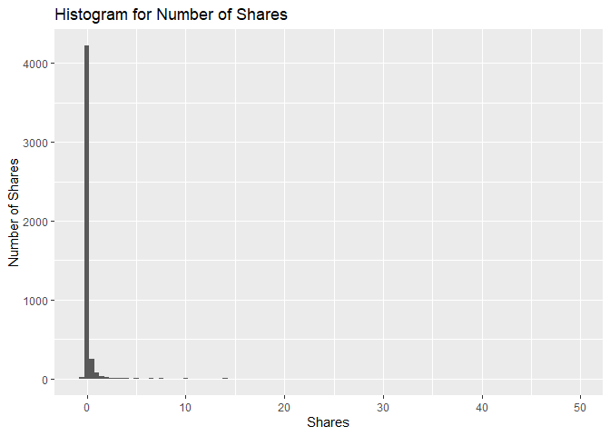
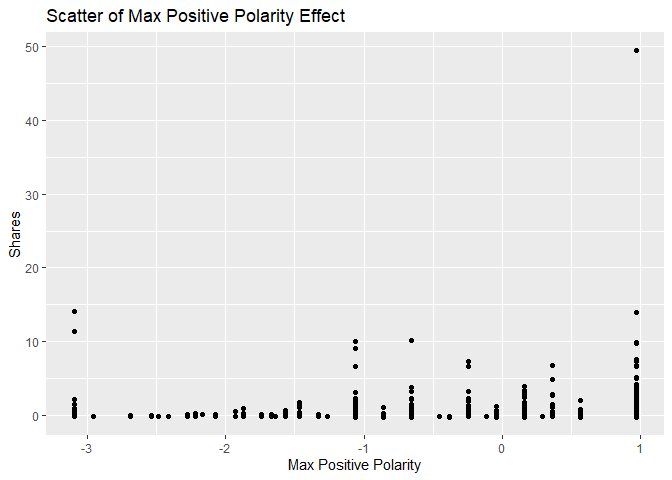
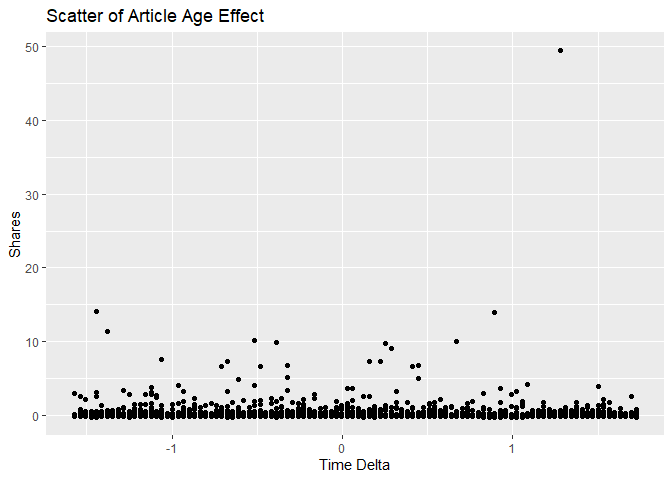
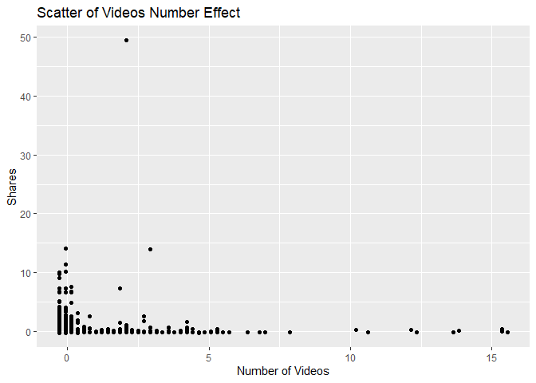

News Popularity Monday Data
================
Shuang Du
10/16/2020

## Load Libraries

``` r
library(readxl);
library(tidyverse);
library(caret);
library(modelr);
library(rpart);
library(kableExtra);
```

## Read in Data

``` r
getData <- function(day) {

  newsPopData <- read_csv("../../raw_data/OnlineNewsPopularity.csv")
  
  if (day == 'monday') {
    newsPopData <- newsPopData %>% filter(weekday_is_monday == 1)
  } else if(day == 'tuesday') {
    newsPopData <- newsPopData %>% filter(weekday_is_tuesday == 1)
  } else if(day == 'wednesday') {
    newsPopData <- newsPopData %>% filter(weekday_is_wednesday == 1)
  } else if(day == 'thursday') {
    newsPopData <- newsPopData %>% filter(weekday_is_thursday == 1)
  } else if(day == 'friday') {
    newsPopData <- newsPopData %>% filter(weekday_is_friday == 1)
  } else if(day == 'saturday') {
    newsPopData <- newsPopData %>% filter(weekday_is_saturday == 1)
  } else if(day == 'sunday') {
    newsPopData <- newsPopData %>% filter(weekday_is_sunday == 1)
  } else {
    stop("Invalid date")
  }
  return(newsPopData)
}

newsPopData <- getData(params$day)
```

## Set Aside Training Data

``` r
set.seed(92)
trainIndex <- createDataPartition(newsPopData$shares, 
                                  p = 0.7, list = FALSE)

newsPopTrain <- newsPopData[as.vector(trainIndex),];
newsPopTest <- newsPopData[-as.vector(trainIndex),];
```

## Center and Scale

``` r
preProcValues <- preProcess(newsPopTrain, method = c("center", "scale"))
newsPopTrain <- predict(preProcValues, newsPopTrain) 
newsPopTest <- predict(preProcValues, newsPopTest)
```

## Summary of a Few Variables

The plots below show a histogram of the number of shares for the given
day. Scatter plots on the effect of max positive polarity, article time
delta and number of videos in the article are also included.

As expected the histogram has a strong right tail, as seem by the
summary stats which show a very high maximum and a median severals
orders of magnitude lower. This is expected for because of the “viral”
nature of online popularity.

``` r
summary(newsPopTrain$shares)
```

    ##     Min.  1st Qu.   Median     Mean  3rd Qu.     Max. 
    ## -0.26350 -0.19737 -0.16273  0.00000 -0.06909 49.46601

``` r
g0 <- ggplot(newsPopTrain, aes(x=shares))
g0 + geom_histogram(binwidth = 0.5) + ggtitle('Histogram for Number of Shares') + ylab('Number of Shares') + xlab('Shares')
```

<!-- -->

``` r
summary(newsPopTrain$max_positive_polarity)
```

    ##    Min. 1st Qu.  Median    Mean 3rd Qu.    Max. 
    ## -3.0920 -0.6545  0.1579  0.0000  0.9704  0.9704

``` r
g1 <- ggplot(newsPopTrain, aes(x = max_positive_polarity, y = shares )) 
g1 + geom_point() + ggtitle('Scatter of Max Positive Polarity Effect') + ylab('Shares') + xlab('Max Positive Polarity')
```

<!-- -->

``` r
summary(newsPopTrain$timedelta)
```

    ##     Min.  1st Qu.   Median     Mean  3rd Qu.     Max. 
    ## -1.57188 -0.89940 -0.06681  0.00000  0.89388  1.72648

``` r
g2 <- ggplot(newsPopTrain, aes(x = timedelta, y = shares )) 
g2 + geom_point() + ggtitle('Scatter of Article Age Effect') + ylab('Shares') + xlab('Time Delta')
```

<!-- -->

``` r
summary(newsPopTrain$num_videos)
```

    ##     Min.  1st Qu.   Median     Mean  3rd Qu.     Max. 
    ## -0.29034 -0.29034 -0.29034  0.00000 -0.07625 15.55264

``` r
g3 <- ggplot(newsPopTrain, aes(x = num_videos, y = shares )) 
g3 + geom_point() + ggtitle('Scatter of Videos Number Effect') + ylab('Shares') + xlab('Number of Videos')
```

<!-- -->

## Modeling

### Standard Tree Based Model (no ensemble)

The type of model being fitted here is a decision tree. The tree splits
are based on minimizing the residual sum of squares for each region.

``` r
rpartFit <- train(shares ~ timedelta + n_tokens_title + n_tokens_content + n_unique_tokens + n_non_stop_words + n_non_stop_unique_tokens
                 + num_hrefs + num_self_hrefs + num_imgs + num_videos + average_token_length + num_keywords + data_channel_is_lifestyle +
                 data_channel_is_entertainment + data_channel_is_bus + data_channel_is_socmed + data_channel_is_tech + data_channel_is_world +
                 self_reference_min_shares + self_reference_max_shares + self_reference_avg_sharess + global_subjectivity + global_sentiment_polarity
                 + global_rate_positive_words + global_rate_negative_words + rate_positive_words + rate_negative_words + avg_positive_polarity +
                  min_positive_polarity + max_positive_polarity + avg_negative_polarity + min_negative_polarity + max_negative_polarity + title_subjectivity
                 + title_sentiment_polarity + abs_title_subjectivity + abs_title_sentiment_polarity, data = newsPopTrain,
             method = "rpart",
             trControl = trainControl(method = "cv", number = 10))
rpartFit
```

    ## CART 
    ## 
    ## 4664 samples
    ##   37 predictor
    ## 
    ## No pre-processing
    ## Resampling: Cross-Validated (10 fold) 
    ## Summary of sample sizes: 4197, 4197, 4198, 4198, 4198, 4198, ... 
    ## Resampling results across tuning parameters:
    ## 
    ##   cp           RMSE       Rsquared     MAE      
    ##   0.005723266  0.9122676  0.009296596  0.2630153
    ##   0.006740781  0.9073521  0.012194938  0.2625475
    ##   0.030178940  0.8754077  0.010782680  0.2660516
    ## 
    ## RMSE was used to select the optimal model using the smallest value.
    ## The final value used for the model was cp = 0.03017894.

``` r
# create the prediction
pred1 <- predict(rpartFit, newdata = newsPopTest)

# compare the prediction vs the actual
resample1 <- postResample(pred1, obs = newsPopTest$shares)
resample1
```

    ##      RMSE  Rsquared       MAE 
    ## 1.1829896        NA 0.2640217

### Boosted Tree Based Model

A boosted tree is an ensemble method which slowly approaches the tree
prediction which would result from the original data. In general, an
ensemble model model will have a lower RSME than a single tree model.

``` r
gbmFit <- train(shares ~ timedelta + n_tokens_title + n_tokens_content + n_unique_tokens + n_non_stop_words + n_non_stop_unique_tokens
                 + num_hrefs + num_self_hrefs + num_imgs + num_videos + average_token_length + num_keywords + data_channel_is_lifestyle +
                 data_channel_is_entertainment + data_channel_is_bus + data_channel_is_socmed + data_channel_is_tech + data_channel_is_world +
                 self_reference_min_shares + self_reference_max_shares + self_reference_avg_sharess + global_subjectivity + global_sentiment_polarity
                 + global_rate_positive_words + global_rate_negative_words + rate_positive_words + rate_negative_words + avg_positive_polarity +
                  min_positive_polarity + max_positive_polarity + avg_negative_polarity + min_negative_polarity + max_negative_polarity + title_subjectivity
                 + title_sentiment_polarity + abs_title_subjectivity + abs_title_sentiment_polarity, data = newsPopTrain,
             method = "gbm",
             trControl = trainControl(method = "cv", number = 10))
```

    ## Iter   TrainDeviance   ValidDeviance   StepSize   Improve
    ##      1        1.0434             nan     0.1000    0.0009
    ##      2        1.0421             nan     0.1000    0.0003
    ##      3        1.0410             nan     0.1000   -0.0002
    ##      4        1.0397             nan     0.1000    0.0014
    ##      5        1.0389             nan     0.1000    0.0003
    ##      6        1.0372             nan     0.1000   -0.0004
    ##      7        1.0361             nan     0.1000    0.0010
    ##      8        1.0354             nan     0.1000    0.0000
    ##      9        1.0346             nan     0.1000   -0.0000
    ##     10        1.0340             nan     0.1000    0.0003
    ##     20        1.0286             nan     0.1000   -0.0011
    ##     40        1.0203             nan     0.1000    0.0006
    ##     60        1.0145             nan     0.1000   -0.0003
    ##     80        1.0137             nan     0.1000   -0.0013
    ##    100        1.0105             nan     0.1000   -0.0010
    ##    120        1.0076             nan     0.1000   -0.0013
    ##    140        1.0068             nan     0.1000   -0.0011
    ##    150        1.0058             nan     0.1000   -0.0010
    ## 
    ## Iter   TrainDeviance   ValidDeviance   StepSize   Improve
    ##      1        1.0415             nan     0.1000    0.0027
    ##      2        1.0298             nan     0.1000   -0.0006
    ##      3        1.0236             nan     0.1000   -0.0007
    ##      4        1.0113             nan     0.1000   -0.0041
    ##      5        1.0041             nan     0.1000   -0.0062
    ##      6        1.0021             nan     0.1000    0.0015
    ##      7        1.0000             nan     0.1000    0.0001
    ##      8        0.9985             nan     0.1000   -0.0001
    ##      9        0.9964             nan     0.1000   -0.0003
    ##     10        0.9900             nan     0.1000   -0.0040
    ##     20        0.9541             nan     0.1000   -0.0033
    ##     40        0.8835             nan     0.1000   -0.0025
    ##     60        0.8520             nan     0.1000   -0.0063
    ##     80        0.8394             nan     0.1000   -0.0017
    ##    100        0.8189             nan     0.1000   -0.0030
    ##    120        0.8040             nan     0.1000   -0.0006
    ##    140        0.7769             nan     0.1000   -0.0021
    ##    150        0.7687             nan     0.1000   -0.0019
    ## 
    ## Iter   TrainDeviance   ValidDeviance   StepSize   Improve
    ##      1        1.0338             nan     0.1000   -0.0009
    ##      2        1.0220             nan     0.1000    0.0001
    ##      3        1.0066             nan     0.1000   -0.0013
    ##      4        0.9948             nan     0.1000   -0.0003
    ##      5        0.9901             nan     0.1000    0.0010
    ##      6        0.9791             nan     0.1000   -0.0072
    ##      7        0.9733             nan     0.1000   -0.0001
    ##      8        0.9633             nan     0.1000   -0.0013
    ##      9        0.9576             nan     0.1000   -0.0039
    ##     10        0.9454             nan     0.1000    0.0004
    ##     20        0.9132             nan     0.1000   -0.0057
    ##     40        0.8375             nan     0.1000   -0.0030
    ##     60        0.7740             nan     0.1000   -0.0020
    ##     80        0.7309             nan     0.1000   -0.0062
    ##    100        0.6984             nan     0.1000   -0.0028
    ##    120        0.6612             nan     0.1000   -0.0023
    ##    140        0.6355             nan     0.1000   -0.0046
    ##    150        0.6266             nan     0.1000   -0.0032
    ## 
    ## Iter   TrainDeviance   ValidDeviance   StepSize   Improve
    ##      1        1.0840             nan     0.1000   -0.0004
    ##      2        1.0828             nan     0.1000    0.0009
    ##      3        1.0817             nan     0.1000    0.0005
    ##      4        1.0813             nan     0.1000   -0.0002
    ##      5        1.0807             nan     0.1000   -0.0005
    ##      6        1.0798             nan     0.1000    0.0004
    ##      7        1.0787             nan     0.1000   -0.0007
    ##      8        1.0780             nan     0.1000    0.0004
    ##      9        1.0774             nan     0.1000    0.0003
    ##     10        1.0769             nan     0.1000   -0.0001
    ##     20        1.0704             nan     0.1000    0.0000
    ##     40        1.0643             nan     0.1000   -0.0003
    ##     60        1.0603             nan     0.1000   -0.0010
    ##     80        1.0556             nan     0.1000   -0.0012
    ##    100        1.0520             nan     0.1000   -0.0002
    ##    120        1.0492             nan     0.1000    0.0002
    ##    140        1.0473             nan     0.1000   -0.0012
    ##    150        1.0468             nan     0.1000   -0.0015
    ## 
    ## Iter   TrainDeviance   ValidDeviance   StepSize   Improve
    ##      1        1.0790             nan     0.1000    0.0011
    ##      2        1.0775             nan     0.1000    0.0013
    ##      3        1.0696             nan     0.1000   -0.0015
    ##      4        1.0681             nan     0.1000    0.0009
    ##      5        1.0659             nan     0.1000   -0.0002
    ##      6        1.0650             nan     0.1000   -0.0004
    ##      7        1.0636             nan     0.1000   -0.0003
    ##      8        1.0544             nan     0.1000   -0.0009
    ##      9        1.0523             nan     0.1000    0.0013
    ##     10        1.0443             nan     0.1000   -0.0006
    ##     20        1.0007             nan     0.1000   -0.0004
    ##     40        0.9546             nan     0.1000   -0.0003
    ##     60        0.9095             nan     0.1000   -0.0064
    ##     80        0.8712             nan     0.1000   -0.0020
    ##    100        0.8461             nan     0.1000   -0.0000
    ##    120        0.8330             nan     0.1000   -0.0063
    ##    140        0.8107             nan     0.1000   -0.0058
    ##    150        0.8023             nan     0.1000   -0.0006
    ## 
    ## Iter   TrainDeviance   ValidDeviance   StepSize   Improve
    ##      1        1.0835             nan     0.1000    0.0012
    ##      2        1.0810             nan     0.1000    0.0003
    ##      3        1.0740             nan     0.1000   -0.0009
    ##      4        1.0642             nan     0.1000   -0.0026
    ##      5        1.0608             nan     0.1000    0.0003
    ##      6        1.0493             nan     0.1000    0.0000
    ##      7        1.0368             nan     0.1000   -0.0017
    ##      8        1.0251             nan     0.1000    0.0001
    ##      9        1.0143             nan     0.1000   -0.0010
    ##     10        1.0057             nan     0.1000   -0.0037
    ##     20        0.9467             nan     0.1000   -0.0020
    ##     40        0.9004             nan     0.1000   -0.0029
    ##     60        0.8618             nan     0.1000   -0.0062
    ##     80        0.8025             nan     0.1000   -0.0052
    ##    100        0.7623             nan     0.1000   -0.0009
    ##    120        0.7377             nan     0.1000   -0.0027
    ##    140        0.7163             nan     0.1000   -0.0013
    ##    150        0.6992             nan     0.1000    0.0001
    ## 
    ## Iter   TrainDeviance   ValidDeviance   StepSize   Improve
    ##      1        1.0091             nan     0.1000    0.0021
    ##      2        1.0071             nan     0.1000    0.0003
    ##      3        1.0050             nan     0.1000    0.0013
    ##      4        1.0039             nan     0.1000   -0.0005
    ##      5        1.0029             nan     0.1000   -0.0005
    ##      6        1.0017             nan     0.1000    0.0002
    ##      7        1.0011             nan     0.1000    0.0004
    ##      8        1.0002             nan     0.1000    0.0008
    ##      9        0.9989             nan     0.1000   -0.0002
    ##     10        0.9976             nan     0.1000    0.0009
    ##     20        0.9926             nan     0.1000   -0.0007
    ##     40        0.9857             nan     0.1000   -0.0004
    ##     60        0.9829             nan     0.1000   -0.0010
    ##     80        0.9817             nan     0.1000   -0.0006
    ##    100        0.9785             nan     0.1000   -0.0012
    ##    120        0.9779             nan     0.1000   -0.0009
    ##    140        0.9767             nan     0.1000   -0.0010
    ##    150        0.9766             nan     0.1000   -0.0009
    ## 
    ## Iter   TrainDeviance   ValidDeviance   StepSize   Improve
    ##      1        0.9996             nan     0.1000   -0.0006
    ##      2        0.9969             nan     0.1000    0.0017
    ##      3        0.9950             nan     0.1000    0.0009
    ##      4        0.9861             nan     0.1000   -0.0008
    ##      5        0.9749             nan     0.1000   -0.0012
    ##      6        0.9733             nan     0.1000    0.0005
    ##      7        0.9716             nan     0.1000   -0.0000
    ##      8        0.9697             nan     0.1000    0.0008
    ##      9        0.9688             nan     0.1000    0.0005
    ##     10        0.9616             nan     0.1000   -0.0015
    ##     20        0.9243             nan     0.1000   -0.0003
    ##     40        0.8452             nan     0.1000   -0.0044
    ##     60        0.8183             nan     0.1000   -0.0046
    ##     80        0.7944             nan     0.1000   -0.0030
    ##    100        0.7623             nan     0.1000   -0.0003
    ##    120        0.7558             nan     0.1000   -0.0027
    ##    140        0.7505             nan     0.1000   -0.0039
    ##    150        0.7447             nan     0.1000   -0.0041
    ## 
    ## Iter   TrainDeviance   ValidDeviance   StepSize   Improve
    ##      1        0.9996             nan     0.1000    0.0006
    ##      2        0.9936             nan     0.1000   -0.0000
    ##      3        0.9839             nan     0.1000    0.0007
    ##      4        0.9813             nan     0.1000    0.0014
    ##      5        0.9628             nan     0.1000   -0.0015
    ##      6        0.9601             nan     0.1000   -0.0007
    ##      7        0.9582             nan     0.1000   -0.0002
    ##      8        0.9568             nan     0.1000   -0.0004
    ##      9        0.9462             nan     0.1000   -0.0007
    ##     10        0.9449             nan     0.1000    0.0006
    ##     20        0.8868             nan     0.1000   -0.0011
    ##     40        0.8430             nan     0.1000   -0.0020
    ##     60        0.7521             nan     0.1000   -0.0034
    ##     80        0.7281             nan     0.1000   -0.0029
    ##    100        0.7041             nan     0.1000   -0.0005
    ##    120        0.6698             nan     0.1000   -0.0003
    ##    140        0.6467             nan     0.1000   -0.0000
    ##    150        0.6285             nan     0.1000   -0.0046
    ## 
    ## Iter   TrainDeviance   ValidDeviance   StepSize   Improve
    ##      1        1.0625             nan     0.1000   -0.0004
    ##      2        1.0613             nan     0.1000    0.0008
    ##      3        1.0604             nan     0.1000    0.0000
    ##      4        1.0593             nan     0.1000    0.0005
    ##      5        1.0582             nan     0.1000   -0.0007
    ##      6        1.0568             nan     0.1000    0.0003
    ##      7        1.0562             nan     0.1000    0.0002
    ##      8        1.0552             nan     0.1000   -0.0010
    ##      9        1.0542             nan     0.1000   -0.0000
    ##     10        1.0537             nan     0.1000   -0.0012
    ##     20        1.0474             nan     0.1000    0.0004
    ##     40        1.0397             nan     0.1000   -0.0002
    ##     60        1.0372             nan     0.1000   -0.0010
    ##     80        1.0343             nan     0.1000   -0.0007
    ##    100        1.0324             nan     0.1000   -0.0015
    ##    120        1.0284             nan     0.1000   -0.0007
    ##    140        1.0257             nan     0.1000   -0.0014
    ##    150        1.0255             nan     0.1000   -0.0014
    ## 
    ## Iter   TrainDeviance   ValidDeviance   StepSize   Improve
    ##      1        1.0620             nan     0.1000    0.0013
    ##      2        1.0610             nan     0.1000    0.0004
    ##      3        1.0583             nan     0.1000    0.0011
    ##      4        1.0571             nan     0.1000   -0.0007
    ##      5        1.0545             nan     0.1000    0.0013
    ##      6        1.0429             nan     0.1000   -0.0006
    ##      7        1.0421             nan     0.1000   -0.0004
    ##      8        1.0405             nan     0.1000    0.0001
    ##      9        1.0297             nan     0.1000   -0.0006
    ##     10        1.0205             nan     0.1000   -0.0024
    ##     20        0.9687             nan     0.1000   -0.0016
    ##     40        0.9132             nan     0.1000   -0.0042
    ##     60        0.8869             nan     0.1000   -0.0074
    ##     80        0.8620             nan     0.1000    0.0015
    ##    100        0.8397             nan     0.1000   -0.0021
    ##    120        0.8342             nan     0.1000   -0.0003
    ##    140        0.8220             nan     0.1000   -0.0051
    ##    150        0.8137             nan     0.1000   -0.0045
    ## 
    ## Iter   TrainDeviance   ValidDeviance   StepSize   Improve
    ##      1        1.0609             nan     0.1000    0.0006
    ##      2        1.0587             nan     0.1000   -0.0002
    ##      3        1.0534             nan     0.1000    0.0025
    ##      4        1.0399             nan     0.1000   -0.0004
    ##      5        1.0378             nan     0.1000    0.0013
    ##      6        1.0247             nan     0.1000   -0.0063
    ##      7        1.0131             nan     0.1000   -0.0018
    ##      8        1.0117             nan     0.1000   -0.0001
    ##      9        1.0035             nan     0.1000   -0.0014
    ##     10        0.9970             nan     0.1000   -0.0086
    ##     20        0.9354             nan     0.1000   -0.0000
    ##     40        0.8595             nan     0.1000   -0.0032
    ##     60        0.8272             nan     0.1000   -0.0030
    ##     80        0.8018             nan     0.1000   -0.0013
    ##    100        0.7564             nan     0.1000   -0.0039
    ##    120        0.7350             nan     0.1000   -0.0047
    ##    140        0.7020             nan     0.1000   -0.0031
    ##    150        0.6846             nan     0.1000   -0.0034
    ## 
    ## Iter   TrainDeviance   ValidDeviance   StepSize   Improve
    ##      1        1.0880             nan     0.1000    0.0005
    ##      2        1.0867             nan     0.1000    0.0003
    ##      3        1.0852             nan     0.1000    0.0005
    ##      4        1.0844             nan     0.1000    0.0004
    ##      5        1.0839             nan     0.1000   -0.0001
    ##      6        1.0824             nan     0.1000   -0.0006
    ##      7        1.0814             nan     0.1000   -0.0006
    ##      8        1.0803             nan     0.1000    0.0012
    ##      9        1.0794             nan     0.1000    0.0005
    ##     10        1.0780             nan     0.1000    0.0007
    ##     20        1.0713             nan     0.1000   -0.0001
    ##     40        1.0621             nan     0.1000    0.0002
    ##     60        1.0561             nan     0.1000    0.0007
    ##     80        1.0507             nan     0.1000   -0.0004
    ##    100        1.0481             nan     0.1000   -0.0013
    ##    120        1.0473             nan     0.1000   -0.0014
    ##    140        1.0454             nan     0.1000   -0.0004
    ##    150        1.0443             nan     0.1000   -0.0013
    ## 
    ## Iter   TrainDeviance   ValidDeviance   StepSize   Improve
    ##      1        1.0871             nan     0.1000    0.0008
    ##      2        1.0729             nan     0.1000   -0.0012
    ##      3        1.0626             nan     0.1000   -0.0045
    ##      4        1.0530             nan     0.1000   -0.0011
    ##      5        1.0502             nan     0.1000    0.0002
    ##      6        1.0430             nan     0.1000   -0.0038
    ##      7        1.0414             nan     0.1000   -0.0001
    ##      8        1.0397             nan     0.1000    0.0007
    ##      9        1.0316             nan     0.1000   -0.0089
    ##     10        1.0282             nan     0.1000   -0.0025
    ##     20        0.9773             nan     0.1000   -0.0005
    ##     40        0.9472             nan     0.1000   -0.0046
    ##     60        0.9042             nan     0.1000   -0.0008
    ##     80        0.8720             nan     0.1000   -0.0046
    ##    100        0.8511             nan     0.1000   -0.0064
    ##    120        0.8394             nan     0.1000   -0.0017
    ##    140        0.8197             nan     0.1000   -0.0059
    ##    150        0.8156             nan     0.1000   -0.0008
    ## 
    ## Iter   TrainDeviance   ValidDeviance   StepSize   Improve
    ##      1        1.0769             nan     0.1000    0.0006
    ##      2        1.0611             nan     0.1000   -0.0009
    ##      3        1.0464             nan     0.1000   -0.0013
    ##      4        1.0370             nan     0.1000   -0.0025
    ##      5        1.0273             nan     0.1000   -0.0024
    ##      6        1.0255             nan     0.1000   -0.0001
    ##      7        1.0225             nan     0.1000    0.0015
    ##      8        1.0193             nan     0.1000    0.0007
    ##      9        1.0101             nan     0.1000   -0.0012
    ##     10        1.0081             nan     0.1000    0.0001
    ##     20        0.9526             nan     0.1000   -0.0027
    ##     40        0.9083             nan     0.1000   -0.0008
    ##     60        0.8398             nan     0.1000   -0.0052
    ##     80        0.7939             nan     0.1000   -0.0031
    ##    100        0.7507             nan     0.1000   -0.0024
    ##    120        0.7219             nan     0.1000   -0.0029
    ##    140        0.6986             nan     0.1000   -0.0034
    ##    150        0.6904             nan     0.1000   -0.0016
    ## 
    ## Iter   TrainDeviance   ValidDeviance   StepSize   Improve
    ##      1        0.5128             nan     0.1000    0.0011
    ##      2        0.5117             nan     0.1000    0.0005
    ##      3        0.5112             nan     0.1000   -0.0002
    ##      4        0.5102             nan     0.1000    0.0008
    ##      5        0.5098             nan     0.1000   -0.0004
    ##      6        0.5089             nan     0.1000    0.0006
    ##      7        0.5080             nan     0.1000    0.0007
    ##      8        0.5075             nan     0.1000   -0.0001
    ##      9        0.5070             nan     0.1000   -0.0000
    ##     10        0.5062             nan     0.1000    0.0005
    ##     20        0.5008             nan     0.1000   -0.0004
    ##     40        0.4944             nan     0.1000    0.0001
    ##     60        0.4917             nan     0.1000   -0.0000
    ##     80        0.4895             nan     0.1000   -0.0002
    ##    100        0.4882             nan     0.1000   -0.0006
    ##    120        0.4864             nan     0.1000   -0.0002
    ##    140        0.4850             nan     0.1000    0.0000
    ##    150        0.4844             nan     0.1000   -0.0002
    ## 
    ## Iter   TrainDeviance   ValidDeviance   StepSize   Improve
    ##      1        0.5119             nan     0.1000    0.0007
    ##      2        0.5090             nan     0.1000    0.0021
    ##      3        0.5069             nan     0.1000    0.0017
    ##      4        0.5055             nan     0.1000    0.0002
    ##      5        0.5043             nan     0.1000    0.0000
    ##      6        0.5026             nan     0.1000    0.0004
    ##      7        0.5012             nan     0.1000    0.0002
    ##      8        0.4982             nan     0.1000   -0.0006
    ##      9        0.4973             nan     0.1000    0.0004
    ##     10        0.4963             nan     0.1000    0.0010
    ##     20        0.4847             nan     0.1000    0.0003
    ##     40        0.4692             nan     0.1000   -0.0000
    ##     60        0.4607             nan     0.1000   -0.0009
    ##     80        0.4501             nan     0.1000   -0.0004
    ##    100        0.4444             nan     0.1000   -0.0034
    ##    120        0.4357             nan     0.1000   -0.0005
    ##    140        0.4297             nan     0.1000   -0.0004
    ##    150        0.4278             nan     0.1000   -0.0005
    ## 
    ## Iter   TrainDeviance   ValidDeviance   StepSize   Improve
    ##      1        0.5100             nan     0.1000    0.0010
    ##      2        0.5072             nan     0.1000    0.0009
    ##      3        0.5029             nan     0.1000   -0.0003
    ##      4        0.4994             nan     0.1000    0.0013
    ##      5        0.4969             nan     0.1000    0.0007
    ##      6        0.4945             nan     0.1000    0.0000
    ##      7        0.4912             nan     0.1000    0.0000
    ##      8        0.4876             nan     0.1000    0.0002
    ##      9        0.4846             nan     0.1000   -0.0005
    ##     10        0.4822             nan     0.1000   -0.0000
    ##     20        0.4623             nan     0.1000   -0.0002
    ##     40        0.4420             nan     0.1000   -0.0004
    ##     60        0.4239             nan     0.1000   -0.0002
    ##     80        0.4079             nan     0.1000   -0.0005
    ##    100        0.3945             nan     0.1000   -0.0006
    ##    120        0.3851             nan     0.1000   -0.0002
    ##    140        0.3772             nan     0.1000   -0.0021
    ##    150        0.3741             nan     0.1000   -0.0009
    ## 
    ## Iter   TrainDeviance   ValidDeviance   StepSize   Improve
    ##      1        1.0637             nan     0.1000    0.0007
    ##      2        1.0621             nan     0.1000   -0.0003
    ##      3        1.0609             nan     0.1000   -0.0009
    ##      4        1.0602             nan     0.1000   -0.0012
    ##      5        1.0597             nan     0.1000   -0.0002
    ##      6        1.0586             nan     0.1000    0.0005
    ##      7        1.0582             nan     0.1000   -0.0004
    ##      8        1.0572             nan     0.1000    0.0000
    ##      9        1.0558             nan     0.1000    0.0003
    ##     10        1.0551             nan     0.1000    0.0003
    ##     20        1.0492             nan     0.1000   -0.0000
    ##     40        1.0406             nan     0.1000   -0.0013
    ##     60        1.0371             nan     0.1000   -0.0008
    ##     80        1.0334             nan     0.1000   -0.0005
    ##    100        1.0323             nan     0.1000   -0.0014
    ##    120        1.0294             nan     0.1000   -0.0008
    ##    140        1.0266             nan     0.1000   -0.0014
    ##    150        1.0264             nan     0.1000   -0.0013
    ## 
    ## Iter   TrainDeviance   ValidDeviance   StepSize   Improve
    ##      1        1.0524             nan     0.1000   -0.0014
    ##      2        1.0513             nan     0.1000   -0.0005
    ##      3        1.0419             nan     0.1000   -0.0004
    ##      4        1.0316             nan     0.1000   -0.0050
    ##      5        1.0296             nan     0.1000    0.0003
    ##      6        1.0279             nan     0.1000    0.0005
    ##      7        1.0224             nan     0.1000   -0.0003
    ##      8        1.0211             nan     0.1000    0.0009
    ##      9        1.0131             nan     0.1000   -0.0020
    ##     10        1.0039             nan     0.1000   -0.0019
    ##     20        0.9799             nan     0.1000   -0.0002
    ##     40        0.9273             nan     0.1000   -0.0069
    ##     60        0.8889             nan     0.1000   -0.0097
    ##     80        0.8594             nan     0.1000   -0.0017
    ##    100        0.8406             nan     0.1000   -0.0024
    ##    120        0.8033             nan     0.1000   -0.0062
    ##    140        0.7750             nan     0.1000   -0.0006
    ##    150        0.7620             nan     0.1000   -0.0032
    ## 
    ## Iter   TrainDeviance   ValidDeviance   StepSize   Improve
    ##      1        1.0503             nan     0.1000   -0.0009
    ##      2        1.0400             nan     0.1000   -0.0011
    ##      3        1.0320             nan     0.1000   -0.0031
    ##      4        1.0297             nan     0.1000    0.0002
    ##      5        1.0238             nan     0.1000   -0.0026
    ##      6        1.0220             nan     0.1000    0.0008
    ##      7        1.0113             nan     0.1000   -0.0013
    ##      8        1.0033             nan     0.1000   -0.0018
    ##      9        0.9995             nan     0.1000    0.0009
    ##     10        0.9974             nan     0.1000   -0.0006
    ##     20        0.9545             nan     0.1000   -0.0035
    ##     40        0.9140             nan     0.1000   -0.0018
    ##     60        0.8507             nan     0.1000   -0.0041
    ##     80        0.8022             nan     0.1000   -0.0020
    ##    100        0.7560             nan     0.1000   -0.0037
    ##    120        0.7218             nan     0.1000   -0.0012
    ##    140        0.7002             nan     0.1000   -0.0037
    ##    150        0.6908             nan     0.1000   -0.0024
    ## 
    ## Iter   TrainDeviance   ValidDeviance   StepSize   Improve
    ##      1        1.0433             nan     0.1000    0.0007
    ##      2        1.0420             nan     0.1000    0.0009
    ##      3        1.0412             nan     0.1000    0.0005
    ##      4        1.0396             nan     0.1000   -0.0007
    ##      5        1.0390             nan     0.1000   -0.0001
    ##      6        1.0383             nan     0.1000    0.0007
    ##      7        1.0375             nan     0.1000   -0.0000
    ##      8        1.0362             nan     0.1000   -0.0004
    ##      9        1.0354             nan     0.1000   -0.0002
    ##     10        1.0342             nan     0.1000   -0.0011
    ##     20        1.0260             nan     0.1000    0.0001
    ##     40        1.0176             nan     0.1000    0.0007
    ##     60        1.0135             nan     0.1000   -0.0002
    ##     80        1.0097             nan     0.1000   -0.0002
    ##    100        1.0068             nan     0.1000   -0.0008
    ##    120        1.0060             nan     0.1000   -0.0010
    ##    140        1.0048             nan     0.1000   -0.0009
    ##    150        1.0037             nan     0.1000   -0.0004
    ## 
    ## Iter   TrainDeviance   ValidDeviance   StepSize   Improve
    ##      1        1.0432             nan     0.1000    0.0027
    ##      2        1.0321             nan     0.1000   -0.0011
    ##      3        1.0298             nan     0.1000    0.0002
    ##      4        1.0277             nan     0.1000    0.0009
    ##      5        1.0175             nan     0.1000   -0.0022
    ##      6        1.0162             nan     0.1000    0.0001
    ##      7        1.0142             nan     0.1000    0.0013
    ##      8        1.0130             nan     0.1000    0.0002
    ##      9        1.0114             nan     0.1000   -0.0000
    ##     10        1.0095             nan     0.1000   -0.0002
    ##     20        0.9708             nan     0.1000   -0.0009
    ##     40        0.9147             nan     0.1000   -0.0029
    ##     60        0.8654             nan     0.1000   -0.0058
    ##     80        0.8344             nan     0.1000   -0.0033
    ##    100        0.7910             nan     0.1000   -0.0003
    ##    120        0.7872             nan     0.1000   -0.0001
    ##    140        0.7623             nan     0.1000   -0.0014
    ##    150        0.7491             nan     0.1000   -0.0029
    ## 
    ## Iter   TrainDeviance   ValidDeviance   StepSize   Improve
    ##      1        1.0352             nan     0.1000    0.0004
    ##      2        1.0231             nan     0.1000   -0.0007
    ##      3        1.0198             nan     0.1000    0.0015
    ##      4        1.0090             nan     0.1000   -0.0023
    ##      5        0.9963             nan     0.1000   -0.0002
    ##      6        0.9841             nan     0.1000    0.0000
    ##      7        0.9764             nan     0.1000   -0.0008
    ##      8        0.9694             nan     0.1000   -0.0026
    ##      9        0.9663             nan     0.1000    0.0010
    ##     10        0.9569             nan     0.1000   -0.0003
    ##     20        0.9235             nan     0.1000   -0.0058
    ##     40        0.8743             nan     0.1000    0.0003
    ##     60        0.8111             nan     0.1000    0.0004
    ##     80        0.7812             nan     0.1000   -0.0010
    ##    100        0.7541             nan     0.1000   -0.0002
    ##    120        0.7056             nan     0.1000   -0.0032
    ##    140        0.6712             nan     0.1000   -0.0058
    ##    150        0.6558             nan     0.1000   -0.0041
    ## 
    ## Iter   TrainDeviance   ValidDeviance   StepSize   Improve
    ##      1        1.0468             nan     0.1000   -0.0005
    ##      2        1.0450             nan     0.1000   -0.0005
    ##      3        1.0437             nan     0.1000   -0.0009
    ##      4        1.0427             nan     0.1000   -0.0012
    ##      5        1.0421             nan     0.1000   -0.0015
    ##      6        1.0409             nan     0.1000    0.0010
    ##      7        1.0392             nan     0.1000    0.0009
    ##      8        1.0380             nan     0.1000    0.0005
    ##      9        1.0365             nan     0.1000    0.0004
    ##     10        1.0360             nan     0.1000    0.0001
    ##     20        1.0290             nan     0.1000   -0.0003
    ##     40        1.0233             nan     0.1000   -0.0004
    ##     60        1.0170             nan     0.1000   -0.0005
    ##     80        1.0156             nan     0.1000   -0.0007
    ##    100        1.0128             nan     0.1000   -0.0000
    ##    120        1.0115             nan     0.1000   -0.0014
    ##    140        1.0086             nan     0.1000   -0.0010
    ##    150        1.0082             nan     0.1000   -0.0012
    ## 
    ## Iter   TrainDeviance   ValidDeviance   StepSize   Improve
    ##      1        1.0464             nan     0.1000    0.0004
    ##      2        1.0376             nan     0.1000   -0.0003
    ##      3        1.0261             nan     0.1000   -0.0015
    ##      4        1.0235             nan     0.1000    0.0012
    ##      5        1.0142             nan     0.1000   -0.0034
    ##      6        1.0132             nan     0.1000   -0.0001
    ##      7        1.0044             nan     0.1000   -0.0012
    ##      8        1.0032             nan     0.1000    0.0003
    ##      9        1.0017             nan     0.1000   -0.0004
    ##     10        0.9961             nan     0.1000    0.0000
    ##     20        0.9531             nan     0.1000   -0.0086
    ##     40        0.8977             nan     0.1000   -0.0079
    ##     60        0.8605             nan     0.1000   -0.0030
    ##     80        0.8287             nan     0.1000   -0.0046
    ##    100        0.8065             nan     0.1000    0.0005
    ##    120        0.7860             nan     0.1000   -0.0005
    ##    140        0.7707             nan     0.1000   -0.0034
    ##    150        0.7580             nan     0.1000   -0.0049
    ## 
    ## Iter   TrainDeviance   ValidDeviance   StepSize   Improve
    ##      1        1.0393             nan     0.1000    0.0002
    ##      2        1.0351             nan     0.1000    0.0004
    ##      3        1.0236             nan     0.1000    0.0002
    ##      4        1.0217             nan     0.1000    0.0009
    ##      5        1.0186             nan     0.1000    0.0000
    ##      6        1.0018             nan     0.1000   -0.0024
    ##      7        0.9922             nan     0.1000   -0.0017
    ##      8        0.9910             nan     0.1000   -0.0002
    ##      9        0.9790             nan     0.1000   -0.0011
    ##     10        0.9762             nan     0.1000   -0.0002
    ##     20        0.9434             nan     0.1000    0.0004
    ##     40        0.8743             nan     0.1000   -0.0001
    ##     60        0.8464             nan     0.1000   -0.0005
    ##     80        0.7875             nan     0.1000   -0.0029
    ##    100        0.7490             nan     0.1000   -0.0044
    ##    120        0.7192             nan     0.1000   -0.0012
    ##    140        0.6901             nan     0.1000   -0.0040
    ##    150        0.6716             nan     0.1000   -0.0029
    ## 
    ## Iter   TrainDeviance   ValidDeviance   StepSize   Improve
    ##      1        1.0284             nan     0.1000    0.0003
    ##      2        1.0276             nan     0.1000    0.0003
    ##      3        1.0261             nan     0.1000   -0.0002
    ##      4        1.0255             nan     0.1000    0.0003
    ##      5        1.0237             nan     0.1000    0.0008
    ##      6        1.0232             nan     0.1000   -0.0000
    ##      7        1.0217             nan     0.1000   -0.0011
    ##      8        1.0206             nan     0.1000   -0.0004
    ##      9        1.0200             nan     0.1000    0.0005
    ##     10        1.0191             nan     0.1000    0.0002
    ##     20        1.0116             nan     0.1000    0.0001
    ##     40        1.0024             nan     0.1000    0.0010
    ##     60        0.9964             nan     0.1000   -0.0014
    ##     80        0.9926             nan     0.1000   -0.0009
    ##    100        0.9899             nan     0.1000   -0.0017
    ##    120        0.9880             nan     0.1000   -0.0016
    ##    140        0.9877             nan     0.1000   -0.0017
    ##    150        0.9864             nan     0.1000   -0.0005
    ## 
    ## Iter   TrainDeviance   ValidDeviance   StepSize   Improve
    ##      1        1.0199             nan     0.1000   -0.0025
    ##      2        1.0187             nan     0.1000   -0.0001
    ##      3        1.0171             nan     0.1000   -0.0007
    ##      4        1.0109             nan     0.1000    0.0016
    ##      5        1.0080             nan     0.1000    0.0014
    ##      6        0.9971             nan     0.1000   -0.0003
    ##      7        0.9850             nan     0.1000   -0.0015
    ##      8        0.9827             nan     0.1000    0.0015
    ##      9        0.9806             nan     0.1000    0.0009
    ##     10        0.9706             nan     0.1000   -0.0038
    ##     20        0.9198             nan     0.1000   -0.0007
    ##     40        0.8685             nan     0.1000   -0.0001
    ##     60        0.8326             nan     0.1000   -0.0042
    ##     80        0.8161             nan     0.1000   -0.0004
    ##    100        0.7890             nan     0.1000   -0.0010
    ##    120        0.7689             nan     0.1000   -0.0024
    ##    140        0.7529             nan     0.1000   -0.0014
    ##    150        0.7438             nan     0.1000   -0.0025
    ## 
    ## Iter   TrainDeviance   ValidDeviance   StepSize   Improve
    ##      1        1.0152             nan     0.1000   -0.0006
    ##      2        1.0128             nan     0.1000    0.0016
    ##      3        1.0067             nan     0.1000    0.0033
    ##      4        0.9935             nan     0.1000   -0.0030
    ##      5        0.9921             nan     0.1000   -0.0000
    ##      6        0.9893             nan     0.1000   -0.0002
    ##      7        0.9869             nan     0.1000   -0.0009
    ##      8        0.9777             nan     0.1000   -0.0024
    ##      9        0.9754             nan     0.1000    0.0003
    ##     10        0.9766             nan     0.1000   -0.0047
    ##     20        0.9206             nan     0.1000   -0.0008
    ##     40        0.8487             nan     0.1000    0.0003
    ##     60        0.8018             nan     0.1000   -0.0043
    ##     80        0.7840             nan     0.1000   -0.0020
    ##    100        0.7620             nan     0.1000   -0.0012
    ##    120        0.7227             nan     0.1000   -0.0032
    ##    140        0.7077             nan     0.1000   -0.0017
    ##    150        0.6862             nan     0.1000   -0.0068
    ## 
    ## Iter   TrainDeviance   ValidDeviance   StepSize   Improve
    ##      1        0.9986             nan     0.1000    0.0008
    ##      2        0.9975             nan     0.1000    0.0008
    ##      3        0.9967             nan     0.1000    0.0004
    ##      4        0.9953             nan     0.1000    0.0008
    ##      5        0.9949             nan     0.1000   -0.0001
    ##      6        0.9936             nan     0.1000   -0.0003
    ##      7        0.9927             nan     0.1000   -0.0004
    ##      8        0.9921             nan     0.1000    0.0003
    ##      9        0.9914             nan     0.1000    0.0002
    ##     10        0.9908             nan     0.1000    0.0003
    ##     20        0.9847             nan     0.1000   -0.0002
    ##     40        0.9777             nan     0.1000   -0.0011
    ##     60        0.9731             nan     0.1000   -0.0003
    ##     80        0.9686             nan     0.1000   -0.0002
    ##    100        0.9665             nan     0.1000   -0.0010

``` r
gbmFit
```

    ## Stochastic Gradient Boosting 
    ## 
    ## 4664 samples
    ##   37 predictor
    ## 
    ## No pre-processing
    ## Resampling: Cross-Validated (10 fold) 
    ## Summary of sample sizes: 4198, 4198, 4198, 4197, 4198, 4199, ... 
    ## Resampling results across tuning parameters:
    ## 
    ##   interaction.depth  n.trees  RMSE       Rsquared    MAE      
    ##   1                   50      0.8602887  0.01082972  0.2610197
    ##   1                  100      0.8601874  0.01514998  0.2603776
    ##   1                  150      0.8609375  0.01504737  0.2605431
    ##   2                   50      0.8832585  0.00769956  0.2708252
    ##   2                  100      0.8956218  0.01283834  0.2837388
    ##   2                  150      0.9072543  0.01327417  0.2920950
    ##   3                   50      0.8811112  0.02074536  0.2736112
    ##   3                  100      0.8951388  0.02153835  0.2845818
    ##   3                  150      0.9071966  0.01850330  0.2930703
    ## 
    ## Tuning parameter 'shrinkage' was held constant at a value of 0.1
    ## Tuning parameter 'n.minobsinnode' was held constant at a value of 10
    ## RMSE was used to select the optimal model using the smallest value.
    ## The final values used for the model were n.trees = 100, interaction.depth = 1, shrinkage = 0.1 and n.minobsinnode = 10.

``` r
# create the prediction
pred2 <- predict(gbmFit, newdata = newsPopTest)

# compare the prediction vs the actual
resample2 <- postResample(pred2, obs = newsPopTest$shares)
resample2
```

    ##       RMSE   Rsquared        MAE 
    ## 1.17691924 0.01038581 0.25699804

### Comparison

Below is a comparison of the two methods. Both have relatively high root
mean square errors.

``` r
comparison <- data.frame("RSME" = c(resample1[[1]], resample2[[1]]), "MAE" = c(resample1[[3]], resample2[[3]]) )
rownames(comparison) <- c("RPART","GBM")
kable(comparison)
```

<table>

<thead>

<tr>

<th style="text-align:left;">

</th>

<th style="text-align:right;">

RSME

</th>

<th style="text-align:right;">

MAE

</th>

</tr>

</thead>

<tbody>

<tr>

<td style="text-align:left;">

RPART

</td>

<td style="text-align:right;">

1.182990

</td>

<td style="text-align:right;">

0.2640217

</td>

</tr>

<tr>

<td style="text-align:left;">

GBM

</td>

<td style="text-align:right;">

1.176919

</td>

<td style="text-align:right;">

0.2569980

</td>

</tr>

</tbody>

</table>
