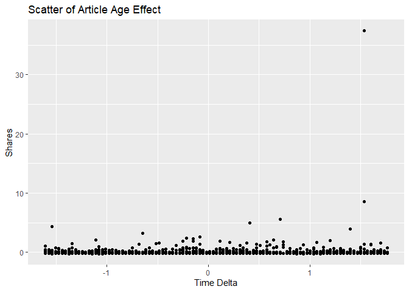

News Popularity Saturday Data
================
Shuang Du
10/16/2020

Load Libraries
--------------

    library(readxl);
    library(tidyverse);
    library(caret);
    library(modelr);
    library(rpart);
    library(kableExtra);

Read in Data
------------

    getData <- function(day) {

      newsPopData <- read_csv("raw_data/OnlineNewsPopularity.csv")
      
      if (day == 'monday') {
        newsPopData <- newsPopData %>% filter(weekday_is_monday == 1)
      } else if(day == 'tuesday') {
        newsPopData <- newsPopData %>% filter(weekday_is_tuesday == 1)
      } else if(day == 'wednesday') {
        newsPopData <- newsPopData %>% filter(weekday_is_wednesday == 1)
      } else if(day == 'thursday') {
        newsPopData <- newsPopData %>% filter(weekday_is_thursday == 1)
      } else if(day == 'friday') {
        newsPopData <- newsPopData %>% filter(weekday_is_friday == 1)
      } else if(day == 'saturday') {
        newsPopData <- newsPopData %>% filter(weekday_is_saturday == 1)
      } else if(day == 'sunday') {
        newsPopData <- newsPopData %>% filter(weekday_is_sunday == 1)
      } else {
        stop("Invalid date")
      }
      return(newsPopData)
    }

    newsPopData <- getData(params$day)

Set Aside Training Data
-----------------------

    set.seed(92)
    trainIndex <- createDataPartition(newsPopData$shares, 
                                      p = 0.7, list = FALSE)

    newsPopTrain <- newsPopData[as.vector(trainIndex),];
    newsPopTest <- newsPopData[-as.vector(trainIndex),];

Center and Scale
----------------

    preProcValues <- preProcess(newsPopTrain, method = c("center", "scale"))
    newsPopTrain <- predict(preProcValues, newsPopTrain) 
    newsPopTest <- predict(preProcValues, newsPopTest)

Summary of a Few Variables
--------------------------

The plots below show a histogram of the number of shares for the given
day. Scatter plots on the effect of max positive polarity, article time
delta and number of videos in the article are also included.

As expected the histogram has a strong right tail, as seem by the
summary stats which show a very high maximum and a median severals
orders of magnitude lower. This is expected for because of the “viral”
nature of online popularity.

    summary(newsPopTrain$shares)

    ##     Min.  1st Qu.   Median     Mean  3rd Qu.     Max. 
    ## -0.25079 -0.17423 -0.13160  0.00000 -0.03416 37.37878

    g0 <- ggplot(newsPopTrain, aes(x=shares))
    g0 + geom_histogram(binwidth = 0.5) + ggtitle('Histogram for Number of Shares') + ylab('Number of Shares') + xlab('Shares')

<!-- -->

    summary(newsPopTrain$max_positive_polarity)

    ##     Min.  1st Qu.   Median     Mean  3rd Qu.     Max. 
    ## -3.09122 -0.71581  0.07599  0.00000  0.86780  0.86780

    g1 <- ggplot(newsPopTrain, aes(x = max_positive_polarity, y = shares )) 
    g1 + geom_point() + ggtitle('Scatter of Max Positive Polarity Effect') + ylab('Shares') + xlab('Max Positive Polarity')

<!-- -->

    summary(newsPopTrain$timedelta)

    ##     Min.  1st Qu.   Median     Mean  3rd Qu.     Max. 
    ## -1.60493 -0.94480 -0.02062  0.00000  0.87055  1.76173

    g2 <- ggplot(newsPopTrain, aes(x = timedelta, y = shares )) 
    g2 + geom_point() + ggtitle('Scatter of Article Age Effect') + ylab('Shares') + xlab('Time Delta')

<!-- -->

    summary(newsPopTrain$num_videos)

    ##     Min.  1st Qu.   Median     Mean  3rd Qu.     Max. 
    ## -0.28543 -0.28543 -0.28543  0.00000 -0.04527 17.48692

    g3 <- ggplot(newsPopTrain, aes(x = num_videos, y = shares )) 
    g3 + geom_point() + ggtitle('Scatter of Videos Number Effect') + ylab('Shares') + xlab('Number of Videos')

<!-- -->

Modeling
--------

### Standard Tree Based Model (no ensemble)

The type of model being fitted here is a decision tree. The tree splits
are based on minimizing the residual sum of squares for each region.

    rpartFit <- train(shares ~ timedelta + n_tokens_title + n_tokens_content + n_unique_tokens + n_non_stop_words + n_non_stop_unique_tokens
                     + num_hrefs + num_self_hrefs + num_imgs + num_videos + average_token_length + num_keywords + data_channel_is_lifestyle +
                     data_channel_is_entertainment + data_channel_is_bus + data_channel_is_socmed + data_channel_is_tech + data_channel_is_world +
                     self_reference_min_shares + self_reference_max_shares + self_reference_avg_sharess + global_subjectivity + global_sentiment_polarity
                     + global_rate_positive_words + global_rate_negative_words + rate_positive_words + rate_negative_words + avg_positive_polarity +
                      min_positive_polarity + max_positive_polarity + avg_negative_polarity + min_negative_polarity + max_negative_polarity + title_subjectivity
                     + title_sentiment_polarity + abs_title_subjectivity + abs_title_sentiment_polarity, data = newsPopTrain,
                 method = "rpart",
                 trControl = trainControl(method = "cv", number = 10),
                 tuneGrid = data.frame(cp = c(.001,.01,.015,.02,.03,.04,.05))
                 )
    rpartFit

    ## CART 
    ## 
    ## 1719 samples
    ##   37 predictor
    ## 
    ## No pre-processing
    ## Resampling: Cross-Validated (10 fold) 
    ## Summary of sample sizes: 1547, 1546, 1546, 1549, 1547, 1546, ... 
    ## Resampling results across tuning parameters:
    ## 
    ##   cp     RMSE       Rsquared    MAE      
    ##   0.001  0.8204433  0.01499185  0.2560560
    ##   0.010  0.7974176  0.01183471  0.2430168
    ##   0.015  0.7967943  0.01172109  0.2418335
    ##   0.020  0.7963462  0.01170845  0.2401989
    ##   0.030  0.7963462  0.01170845  0.2401989
    ##   0.040  0.7963462  0.01170845  0.2401989
    ##   0.050  0.7961987  0.01300841  0.2400282
    ## 
    ## RMSE was used to select the optimal model using the smallest value.
    ## The final value used for the model was cp = 0.05.

    # create the prediction
    pred1 <- predict(rpartFit, newdata = newsPopTest)

    # compare the prediction vs the actual
    resample1 <- postResample(pred1, obs = newsPopTest$shares)
    resample1

    ##         RMSE     Rsquared          MAE 
    ## 4.499436e-01 8.661662e-06 1.967980e-01

### Boosted Tree Based Model

A boosted tree is an ensemble method which slowly approaches the tree
prediction which would result from the original data. In general, an
ensemble model model will have a lower RSME than a single tree model.

    gbmFit <- train(shares ~ timedelta + n_tokens_title + n_tokens_content + n_unique_tokens + n_non_stop_words + n_non_stop_unique_tokens
                     + num_hrefs + num_self_hrefs + num_imgs + num_videos + average_token_length + num_keywords + data_channel_is_lifestyle +
                     data_channel_is_entertainment + data_channel_is_bus + data_channel_is_socmed + data_channel_is_tech + data_channel_is_world +
                     self_reference_min_shares + self_reference_max_shares + self_reference_avg_sharess + global_subjectivity + global_sentiment_polarity
                     + global_rate_positive_words + global_rate_negative_words + rate_positive_words + rate_negative_words + avg_positive_polarity +
                      min_positive_polarity + max_positive_polarity + avg_negative_polarity + min_negative_polarity + max_negative_polarity + title_subjectivity
                     + title_sentiment_polarity + abs_title_subjectivity + abs_title_sentiment_polarity, data = newsPopTrain,
                 method = "gbm",
                 trControl = trainControl(method = "cv", number = 10))

    ## Iter   TrainDeviance   ValidDeviance   StepSize   Improve
    ##      1        1.0970             nan     0.1000   -0.0003
    ##      2        1.0923             nan     0.1000    0.0016
    ##      3        1.0883             nan     0.1000   -0.0011
    ##      4        1.0874             nan     0.1000    0.0004
    ##      5        1.0847             nan     0.1000    0.0003
    ##      6        1.0844             nan     0.1000   -0.0002
    ##      7        1.0816             nan     0.1000   -0.0001
    ##      8        1.0795             nan     0.1000   -0.0021
    ##      9        1.0789             nan     0.1000   -0.0001
    ##     10        1.0798             nan     0.1000   -0.0031
    ##     20        1.0722             nan     0.1000    0.0009
    ##     40        1.0567             nan     0.1000   -0.0025
    ##     60        1.0439             nan     0.1000   -0.0003
    ##     80        1.0309             nan     0.1000   -0.0031
    ##    100        1.0192             nan     0.1000    0.0012
    ##    120        1.0161             nan     0.1000   -0.0014
    ##    140        1.0076             nan     0.1000   -0.0016
    ##    150        1.0029             nan     0.1000   -0.0038
    ## 
    ## Iter   TrainDeviance   ValidDeviance   StepSize   Improve
    ##      1        1.0745             nan     0.1000   -0.0001
    ##      2        1.0576             nan     0.1000   -0.0018
    ##      3        1.0558             nan     0.1000   -0.0001
    ##      4        1.0337             nan     0.1000   -0.0042
    ##      5        1.0326             nan     0.1000    0.0003
    ##      6        1.0147             nan     0.1000   -0.0007
    ##      7        1.0002             nan     0.1000   -0.0049
    ##      8        0.9873             nan     0.1000   -0.0029
    ##      9        0.9861             nan     0.1000   -0.0005
    ##     10        0.9742             nan     0.1000   -0.0032
    ##     20        0.8930             nan     0.1000   -0.0049
    ##     40        0.8038             nan     0.1000   -0.0066
    ##     60        0.7420             nan     0.1000   -0.0019
    ##     80        0.7014             nan     0.1000   -0.0099
    ##    100        0.6577             nan     0.1000   -0.0041
    ##    120        0.6138             nan     0.1000   -0.0063
    ##    140        0.5865             nan     0.1000   -0.0008
    ##    150        0.5672             nan     0.1000   -0.0080
    ## 
    ## Iter   TrainDeviance   ValidDeviance   StepSize   Improve
    ##      1        1.0978             nan     0.1000   -0.0003
    ##      2        1.0960             nan     0.1000   -0.0010
    ##      3        1.0793             nan     0.1000   -0.0014
    ##      4        1.0599             nan     0.1000   -0.0002
    ##      5        1.0454             nan     0.1000   -0.0045
    ##      6        1.0285             nan     0.1000   -0.0018
    ##      7        1.0298             nan     0.1000   -0.0042
    ##      8        1.0308             nan     0.1000   -0.0047
    ##      9        1.0134             nan     0.1000   -0.0036
    ##     10        1.0150             nan     0.1000   -0.0054
    ##     20        0.9834             nan     0.1000   -0.0007
    ##     40        0.8851             nan     0.1000   -0.0055
    ##     60        0.8067             nan     0.1000   -0.0071
    ##     80        0.7350             nan     0.1000   -0.0039
    ##    100        0.6641             nan     0.1000   -0.0013
    ##    120        0.6242             nan     0.1000   -0.0058
    ##    140        0.5594             nan     0.1000   -0.0013
    ##    150        0.5324             nan     0.1000   -0.0019
    ## 
    ## Iter   TrainDeviance   ValidDeviance   StepSize   Improve
    ##      1        1.0894             nan     0.1000    0.0007
    ##      2        1.0847             nan     0.1000   -0.0010
    ##      3        1.0817             nan     0.1000    0.0006
    ##      4        1.0787             nan     0.1000   -0.0013
    ##      5        1.0766             nan     0.1000   -0.0016
    ##      6        1.0749             nan     0.1000   -0.0036
    ##      7        1.0740             nan     0.1000   -0.0004
    ##      8        1.0722             nan     0.1000   -0.0005
    ##      9        1.0710             nan     0.1000    0.0009
    ##     10        1.0697             nan     0.1000    0.0010
    ##     20        1.0590             nan     0.1000   -0.0008
    ##     40        1.0457             nan     0.1000    0.0006
    ##     60        1.0333             nan     0.1000   -0.0031
    ##     80        1.0259             nan     0.1000   -0.0025
    ##    100        1.0185             nan     0.1000   -0.0020
    ##    120        1.0123             nan     0.1000   -0.0029
    ##    140        1.0029             nan     0.1000   -0.0031
    ##    150        0.9969             nan     0.1000   -0.0014
    ## 
    ## Iter   TrainDeviance   ValidDeviance   StepSize   Improve
    ##      1        1.0926             nan     0.1000    0.0001
    ##      2        1.0754             nan     0.1000   -0.0002
    ##      3        1.0740             nan     0.1000   -0.0004
    ##      4        1.0728             nan     0.1000    0.0000
    ##      5        1.0514             nan     0.1000   -0.0003
    ##      6        1.0493             nan     0.1000   -0.0008
    ##      7        1.0323             nan     0.1000   -0.0018
    ##      8        1.0316             nan     0.1000   -0.0002
    ##      9        1.0172             nan     0.1000   -0.0049
    ##     10        1.0174             nan     0.1000   -0.0020
    ##     20        0.9438             nan     0.1000   -0.0022
    ##     40        0.8686             nan     0.1000   -0.0000
    ##     60        0.7979             nan     0.1000   -0.0097
    ##     80        0.7252             nan     0.1000   -0.0020
    ##    100        0.6826             nan     0.1000   -0.0007
    ##    120        0.6328             nan     0.1000   -0.0029
    ##    140        0.5955             nan     0.1000   -0.0054
    ##    150        0.5770             nan     0.1000   -0.0027
    ## 
    ## Iter   TrainDeviance   ValidDeviance   StepSize   Improve
    ##      1        1.0928             nan     0.1000   -0.0001
    ##      2        1.0907             nan     0.1000    0.0006
    ##      3        1.0636             nan     0.1000   -0.0017
    ##      4        1.0468             nan     0.1000   -0.0033
    ##      5        1.0448             nan     0.1000   -0.0004
    ##      6        1.0439             nan     0.1000   -0.0004
    ##      7        1.0431             nan     0.1000   -0.0005
    ##      8        1.0258             nan     0.1000   -0.0007
    ##      9        1.0094             nan     0.1000   -0.0033
    ##     10        0.9955             nan     0.1000   -0.0047
    ##     20        0.9150             nan     0.1000   -0.0125
    ##     40        0.7664             nan     0.1000   -0.0011
    ##     60        0.6948             nan     0.1000   -0.0045
    ##     80        0.5998             nan     0.1000   -0.0033
    ##    100        0.5468             nan     0.1000   -0.0019
    ##    120        0.4900             nan     0.1000   -0.0043
    ##    140        0.4509             nan     0.1000   -0.0057
    ##    150        0.4259             nan     0.1000   -0.0003
    ## 
    ## Iter   TrainDeviance   ValidDeviance   StepSize   Improve
    ##      1        1.0898             nan     0.1000    0.0018
    ##      2        1.0854             nan     0.1000   -0.0006
    ##      3        1.0821             nan     0.1000   -0.0020
    ##      4        1.0803             nan     0.1000   -0.0019
    ##      5        1.0791             nan     0.1000   -0.0020
    ##      6        1.0784             nan     0.1000   -0.0005
    ##      7        1.0789             nan     0.1000   -0.0023
    ##      8        1.0782             nan     0.1000   -0.0004
    ##      9        1.0789             nan     0.1000   -0.0028
    ##     10        1.0786             nan     0.1000    0.0001
    ##     20        1.0662             nan     0.1000    0.0005
    ##     40        1.0458             nan     0.1000    0.0013
    ##     60        1.0332             nan     0.1000    0.0012
    ##     80        1.0230             nan     0.1000   -0.0022
    ##    100        1.0148             nan     0.1000   -0.0018
    ##    120        1.0075             nan     0.1000   -0.0021
    ##    140        0.9996             nan     0.1000   -0.0023
    ##    150        0.9978             nan     0.1000   -0.0024
    ## 
    ## Iter   TrainDeviance   ValidDeviance   StepSize   Improve
    ##      1        1.0924             nan     0.1000   -0.0005
    ##      2        1.0912             nan     0.1000   -0.0000
    ##      3        1.0683             nan     0.1000    0.0063
    ##      4        1.0673             nan     0.1000   -0.0000
    ##      5        1.0667             nan     0.1000   -0.0002
    ##      6        1.0516             nan     0.1000   -0.0022
    ##      7        1.0351             nan     0.1000   -0.0038
    ##      8        1.0207             nan     0.1000   -0.0022
    ##      9        1.0217             nan     0.1000   -0.0035
    ##     10        1.0211             nan     0.1000   -0.0006
    ##     20        0.9860             nan     0.1000   -0.0027
    ##     40        0.8464             nan     0.1000    0.0021
    ##     60        0.7878             nan     0.1000   -0.0052
    ##     80        0.7323             nan     0.1000   -0.0061
    ##    100        0.6908             nan     0.1000   -0.0056
    ##    120        0.6412             nan     0.1000    0.0008
    ##    140        0.6064             nan     0.1000   -0.0015
    ##    150        0.5949             nan     0.1000   -0.0033
    ## 
    ## Iter   TrainDeviance   ValidDeviance   StepSize   Improve
    ##      1        1.0759             nan     0.1000   -0.0012
    ##      2        1.0526             nan     0.1000   -0.0035
    ##      3        1.0525             nan     0.1000   -0.0020
    ##      4        1.0372             nan     0.1000   -0.0062
    ##      5        1.0365             nan     0.1000   -0.0017
    ##      6        1.0341             nan     0.1000    0.0002
    ##      7        1.0358             nan     0.1000   -0.0051
    ##      8        1.0372             nan     0.1000   -0.0054
    ##      9        1.0365             nan     0.1000   -0.0007
    ##     10        1.0356             nan     0.1000   -0.0005
    ##     20        0.9278             nan     0.1000   -0.0033
    ##     40        0.8334             nan     0.1000   -0.0003
    ##     60        0.7437             nan     0.1000   -0.0066
    ##     80        0.6884             nan     0.1000    0.0003
    ##    100        0.6198             nan     0.1000   -0.0009
    ##    120        0.5538             nan     0.1000   -0.0005
    ##    140        0.5051             nan     0.1000   -0.0036
    ##    150        0.4936             nan     0.1000   -0.0030
    ## 
    ## Iter   TrainDeviance   ValidDeviance   StepSize   Improve
    ##      1        1.0240             nan     0.1000   -0.0000
    ##      2        1.0237             nan     0.1000   -0.0002
    ##      3        1.0198             nan     0.1000   -0.0012
    ##      4        1.0197             nan     0.1000   -0.0002
    ##      5        1.0187             nan     0.1000    0.0013
    ##      6        1.0166             nan     0.1000   -0.0010
    ##      7        1.0164             nan     0.1000   -0.0002
    ##      8        1.0163             nan     0.1000   -0.0004
    ##      9        1.0161             nan     0.1000   -0.0002
    ##     10        1.0145             nan     0.1000   -0.0014
    ##     20        1.0049             nan     0.1000   -0.0015
    ##     40        0.9913             nan     0.1000   -0.0019
    ##     60        0.9862             nan     0.1000   -0.0020
    ##     80        0.9757             nan     0.1000   -0.0020
    ##    100        0.9700             nan     0.1000    0.0016
    ##    120        0.9666             nan     0.1000   -0.0021
    ##    140        0.9630             nan     0.1000   -0.0024
    ##    150        0.9607             nan     0.1000    0.0010
    ## 
    ## Iter   TrainDeviance   ValidDeviance   StepSize   Improve
    ##      1        1.0272             nan     0.1000    0.0003
    ##      2        1.0096             nan     0.1000   -0.0022
    ##      3        1.0091             nan     0.1000   -0.0003
    ##      4        1.0090             nan     0.1000   -0.0007
    ##      5        0.9926             nan     0.1000   -0.0020
    ##      6        0.9921             nan     0.1000   -0.0005
    ##      7        0.9917             nan     0.1000   -0.0002
    ##      8        0.9796             nan     0.1000   -0.0085
    ##      9        0.9785             nan     0.1000    0.0009
    ##     10        0.9799             nan     0.1000   -0.0041
    ##     20        0.8697             nan     0.1000   -0.0038
    ##     40        0.8065             nan     0.1000   -0.0009
    ##     60        0.7411             nan     0.1000   -0.0048
    ##     80        0.6983             nan     0.1000   -0.0037
    ##    100        0.6457             nan     0.1000   -0.0077
    ##    120        0.6236             nan     0.1000   -0.0042
    ##    140        0.6030             nan     0.1000   -0.0043
    ##    150        0.5857             nan     0.1000   -0.0041
    ## 
    ## Iter   TrainDeviance   ValidDeviance   StepSize   Improve
    ##      1        1.0264             nan     0.1000   -0.0001
    ##      2        1.0256             nan     0.1000   -0.0001
    ##      3        1.0088             nan     0.1000   -0.0037
    ##      4        0.9920             nan     0.1000   -0.0017
    ##      5        0.9783             nan     0.1000   -0.0027
    ##      6        0.9776             nan     0.1000   -0.0005
    ##      7        0.9766             nan     0.1000    0.0000
    ##      8        0.9603             nan     0.1000   -0.0020
    ##      9        0.9480             nan     0.1000   -0.0061
    ##     10        0.9333             nan     0.1000   -0.0009
    ##     20        0.8934             nan     0.1000   -0.0045
    ##     40        0.8020             nan     0.1000   -0.0093
    ##     60        0.7294             nan     0.1000   -0.0058
    ##     80        0.6490             nan     0.1000   -0.0013
    ##    100        0.6176             nan     0.1000   -0.0058
    ##    120        0.5502             nan     0.1000   -0.0016
    ##    140        0.5201             nan     0.1000   -0.0024
    ##    150        0.5037             nan     0.1000   -0.0058
    ## 
    ## Iter   TrainDeviance   ValidDeviance   StepSize   Improve
    ##      1        1.0976             nan     0.1000    0.0012
    ##      2        1.0968             nan     0.1000    0.0002
    ##      3        1.0957             nan     0.1000   -0.0003
    ##      4        1.0956             nan     0.1000   -0.0002
    ##      5        1.0954             nan     0.1000   -0.0002
    ##      6        1.0907             nan     0.1000   -0.0019
    ##      7        1.0875             nan     0.1000   -0.0020
    ##      8        1.0858             nan     0.1000   -0.0021
    ##      9        1.0847             nan     0.1000    0.0009
    ##     10        1.0829             nan     0.1000   -0.0043
    ##     20        1.0688             nan     0.1000   -0.0031
    ##     40        1.0528             nan     0.1000   -0.0029
    ##     60        1.0425             nan     0.1000   -0.0032
    ##     80        1.0309             nan     0.1000   -0.0016
    ##    100        1.0250             nan     0.1000   -0.0022
    ##    120        1.0148             nan     0.1000    0.0011
    ##    140        1.0012             nan     0.1000   -0.0012
    ##    150        0.9958             nan     0.1000   -0.0019
    ## 
    ## Iter   TrainDeviance   ValidDeviance   StepSize   Improve
    ##      1        1.1012             nan     0.1000    0.0009
    ##      2        1.1003             nan     0.1000   -0.0007
    ##      3        1.0821             nan     0.1000   -0.0010
    ##      4        1.0804             nan     0.1000   -0.0009
    ##      5        1.0799             nan     0.1000   -0.0013
    ##      6        1.0791             nan     0.1000   -0.0007
    ##      7        1.0784             nan     0.1000   -0.0006
    ##      8        1.0618             nan     0.1000   -0.0053
    ##      9        1.0435             nan     0.1000   -0.0024
    ##     10        1.0187             nan     0.1000    0.0002
    ##     20        0.9167             nan     0.1000   -0.0020
    ##     40        0.7919             nan     0.1000   -0.0040
    ##     60        0.7310             nan     0.1000   -0.0033
    ##     80        0.6651             nan     0.1000   -0.0029
    ##    100        0.6245             nan     0.1000   -0.0021
    ##    120        0.5941             nan     0.1000   -0.0044
    ##    140        0.5723             nan     0.1000   -0.0066
    ##    150        0.5550             nan     0.1000   -0.0025
    ## 
    ## Iter   TrainDeviance   ValidDeviance   StepSize   Improve
    ##      1        1.1004             nan     0.1000    0.0000
    ##      2        1.0716             nan     0.1000    0.0002
    ##      3        1.0698             nan     0.1000    0.0001
    ##      4        1.0687             nan     0.1000   -0.0007
    ##      5        1.0676             nan     0.1000   -0.0007
    ##      6        1.0668             nan     0.1000   -0.0005
    ##      7        1.0658             nan     0.1000    0.0001
    ##      8        1.0459             nan     0.1000   -0.0057
    ##      9        1.0294             nan     0.1000   -0.0031
    ##     10        1.0289             nan     0.1000   -0.0005
    ##     20        0.9656             nan     0.1000   -0.0041
    ##     40        0.8666             nan     0.1000   -0.0015
    ##     60        0.7460             nan     0.1000   -0.0014
    ##     80        0.6763             nan     0.1000    0.0000
    ##    100        0.5980             nan     0.1000   -0.0006
    ##    120        0.5360             nan     0.1000   -0.0008
    ##    140        0.4998             nan     0.1000   -0.0017
    ##    150        0.4864             nan     0.1000   -0.0026
    ## 
    ## Iter   TrainDeviance   ValidDeviance   StepSize   Improve
    ##      1        1.0960             nan     0.1000    0.0001
    ##      2        1.0920             nan     0.1000   -0.0006
    ##      3        1.0910             nan     0.1000   -0.0004
    ##      4        1.0873             nan     0.1000   -0.0022
    ##      5        1.0839             nan     0.1000    0.0006
    ##      6        1.0825             nan     0.1000   -0.0004
    ##      7        1.0798             nan     0.1000   -0.0008
    ##      8        1.0773             nan     0.1000   -0.0002
    ##      9        1.0757             nan     0.1000   -0.0007
    ##     10        1.0743             nan     0.1000   -0.0025
    ##     20        1.0646             nan     0.1000   -0.0015
    ##     40        1.0528             nan     0.1000   -0.0021
    ##     60        1.0373             nan     0.1000   -0.0018
    ##     80        1.0273             nan     0.1000   -0.0036
    ##    100        1.0177             nan     0.1000   -0.0018
    ##    120        1.0104             nan     0.1000   -0.0018
    ##    140        1.0015             nan     0.1000    0.0013
    ##    150        0.9980             nan     0.1000    0.0009
    ## 
    ## Iter   TrainDeviance   ValidDeviance   StepSize   Improve
    ##      1        1.0993             nan     0.1000    0.0006
    ##      2        1.0761             nan     0.1000   -0.0008
    ##      3        1.0750             nan     0.1000   -0.0004
    ##      4        1.0549             nan     0.1000    0.0042
    ##      5        1.0410             nan     0.1000   -0.0067
    ##      6        1.0278             nan     0.1000   -0.0038
    ##      7        1.0263             nan     0.1000   -0.0006
    ##      8        1.0088             nan     0.1000   -0.0016
    ##      9        1.0075             nan     0.1000   -0.0010
    ##     10        0.9920             nan     0.1000   -0.0080
    ##     20        0.9303             nan     0.1000   -0.0006
    ##     40        0.8551             nan     0.1000   -0.0044
    ##     60        0.7509             nan     0.1000   -0.0070
    ##     80        0.6803             nan     0.1000   -0.0025
    ##    100        0.6407             nan     0.1000   -0.0057
    ##    120        0.6161             nan     0.1000   -0.0096
    ##    140        0.5791             nan     0.1000   -0.0064
    ##    150        0.5663             nan     0.1000   -0.0089
    ## 
    ## Iter   TrainDeviance   ValidDeviance   StepSize   Improve
    ##      1        1.0987             nan     0.1000    0.0003
    ##      2        1.0813             nan     0.1000   -0.0013
    ##      3        1.0800             nan     0.1000   -0.0003
    ##      4        1.0596             nan     0.1000   -0.0017
    ##      5        1.0443             nan     0.1000   -0.0027
    ##      6        1.0438             nan     0.1000   -0.0026
    ##      7        1.0276             nan     0.1000   -0.0104
    ##      8        1.0283             nan     0.1000   -0.0033
    ##      9        1.0110             nan     0.1000   -0.0017
    ##     10        0.9969             nan     0.1000   -0.0045
    ##     20        0.9394             nan     0.1000   -0.0095
    ##     40        0.8494             nan     0.1000   -0.0073
    ##     60        0.7684             nan     0.1000   -0.0005
    ##     80        0.7097             nan     0.1000   -0.0052
    ##    100        0.6346             nan     0.1000   -0.0013
    ##    120        0.5900             nan     0.1000   -0.0056
    ##    140        0.5521             nan     0.1000   -0.0031
    ##    150        0.5243             nan     0.1000   -0.0053
    ## 
    ## Iter   TrainDeviance   ValidDeviance   StepSize   Improve
    ##      1        0.1794             nan     0.1000    0.0002
    ##      2        0.1787             nan     0.1000    0.0002
    ##      3        0.1782             nan     0.1000   -0.0000
    ##      4        0.1775             nan     0.1000   -0.0000
    ##      5        0.1769             nan     0.1000   -0.0002
    ##      6        0.1764             nan     0.1000   -0.0002
    ##      7        0.1758             nan     0.1000   -0.0002
    ##      8        0.1754             nan     0.1000    0.0000
    ##      9        0.1749             nan     0.1000   -0.0004
    ##     10        0.1748             nan     0.1000   -0.0001
    ##     20        0.1712             nan     0.1000   -0.0003
    ##     40        0.1654             nan     0.1000   -0.0001
    ##     60        0.1620             nan     0.1000   -0.0003
    ##     80        0.1585             nan     0.1000   -0.0000
    ##    100        0.1559             nan     0.1000   -0.0003
    ##    120        0.1538             nan     0.1000   -0.0006
    ##    140        0.1523             nan     0.1000    0.0001
    ##    150        0.1516             nan     0.1000   -0.0001
    ## 
    ## Iter   TrainDeviance   ValidDeviance   StepSize   Improve
    ##      1        0.1796             nan     0.1000   -0.0002
    ##      2        0.1779             nan     0.1000    0.0000
    ##      3        0.1770             nan     0.1000   -0.0001
    ##      4        0.1753             nan     0.1000    0.0001
    ##      5        0.1745             nan     0.1000   -0.0008
    ##      6        0.1738             nan     0.1000    0.0006
    ##      7        0.1735             nan     0.1000   -0.0004
    ##      8        0.1720             nan     0.1000    0.0001
    ##      9        0.1713             nan     0.1000   -0.0003
    ##     10        0.1707             nan     0.1000    0.0002
    ##     20        0.1642             nan     0.1000    0.0000
    ##     40        0.1560             nan     0.1000   -0.0001
    ##     60        0.1504             nan     0.1000   -0.0003
    ##     80        0.1434             nan     0.1000   -0.0000
    ##    100        0.1380             nan     0.1000   -0.0001
    ##    120        0.1328             nan     0.1000   -0.0007
    ##    140        0.1298             nan     0.1000   -0.0002
    ##    150        0.1277             nan     0.1000   -0.0006
    ## 
    ## Iter   TrainDeviance   ValidDeviance   StepSize   Improve
    ##      1        0.1778             nan     0.1000   -0.0001
    ##      2        0.1762             nan     0.1000    0.0000
    ##      3        0.1750             nan     0.1000   -0.0000
    ##      4        0.1742             nan     0.1000   -0.0006
    ##      5        0.1723             nan     0.1000   -0.0001
    ##      6        0.1713             nan     0.1000    0.0006
    ##      7        0.1705             nan     0.1000   -0.0000
    ##      8        0.1698             nan     0.1000   -0.0003
    ##      9        0.1686             nan     0.1000    0.0008
    ##     10        0.1676             nan     0.1000   -0.0002
    ##     20        0.1590             nan     0.1000   -0.0000
    ##     40        0.1484             nan     0.1000   -0.0010
    ##     60        0.1380             nan     0.1000    0.0001
    ##     80        0.1294             nan     0.1000   -0.0004
    ##    100        0.1231             nan     0.1000    0.0001
    ##    120        0.1161             nan     0.1000   -0.0005
    ##    140        0.1102             nan     0.1000   -0.0003
    ##    150        0.1082             nan     0.1000   -0.0002
    ## 
    ## Iter   TrainDeviance   ValidDeviance   StepSize   Improve
    ##      1        1.0869             nan     0.1000   -0.0006
    ##      2        1.0827             nan     0.1000    0.0019
    ##      3        1.0791             nan     0.1000   -0.0006
    ##      4        1.0788             nan     0.1000   -0.0001
    ##      5        1.0780             nan     0.1000    0.0002
    ##      6        1.0781             nan     0.1000   -0.0006
    ##      7        1.0756             nan     0.1000   -0.0010
    ##      8        1.0736             nan     0.1000   -0.0018
    ##      9        1.0728             nan     0.1000   -0.0006
    ##     10        1.0707             nan     0.1000   -0.0003
    ##     20        1.0558             nan     0.1000   -0.0002
    ##     40        1.0436             nan     0.1000   -0.0015
    ##     60        1.0321             nan     0.1000   -0.0015
    ##     80        1.0169             nan     0.1000   -0.0017
    ##    100        1.0037             nan     0.1000    0.0010
    ##    120        0.9982             nan     0.1000   -0.0010
    ##    140        0.9920             nan     0.1000   -0.0024
    ##    150        0.9874             nan     0.1000   -0.0031
    ## 
    ## Iter   TrainDeviance   ValidDeviance   StepSize   Improve
    ##      1        1.0861             nan     0.1000    0.0002
    ##      2        1.0851             nan     0.1000   -0.0005
    ##      3        1.0845             nan     0.1000   -0.0005
    ##      4        1.0656             nan     0.1000   -0.0023
    ##      5        1.0653             nan     0.1000   -0.0006
    ##      6        1.0488             nan     0.1000   -0.0016
    ##      7        1.0478             nan     0.1000    0.0001
    ##      8        1.0475             nan     0.1000   -0.0002
    ##      9        1.0463             nan     0.1000   -0.0008
    ##     10        1.0320             nan     0.1000   -0.0036
    ##     20        0.9651             nan     0.1000   -0.0072
    ##     40        0.8271             nan     0.1000   -0.0040
    ##     60        0.7422             nan     0.1000   -0.0005
    ##     80        0.6864             nan     0.1000   -0.0061
    ##    100        0.6337             nan     0.1000   -0.0003
    ##    120        0.5918             nan     0.1000    0.0001
    ##    140        0.5640             nan     0.1000   -0.0108
    ##    150        0.5439             nan     0.1000   -0.0007
    ## 
    ## Iter   TrainDeviance   ValidDeviance   StepSize   Improve
    ##      1        1.0705             nan     0.1000   -0.0012
    ##      2        1.0528             nan     0.1000   -0.0021
    ##      3        1.0309             nan     0.1000   -0.0019
    ##      4        1.0151             nan     0.1000   -0.0028
    ##      5        0.9992             nan     0.1000   -0.0087
    ##      6        0.9790             nan     0.1000    0.0004
    ##      7        0.9786             nan     0.1000   -0.0021
    ##      8        0.9649             nan     0.1000   -0.0010
    ##      9        0.9499             nan     0.1000   -0.0011
    ##     10        0.9481             nan     0.1000    0.0002
    ##     20        0.8711             nan     0.1000   -0.0013
    ##     40        0.7527             nan     0.1000   -0.0022
    ##     60        0.6817             nan     0.1000   -0.0078
    ##     80        0.6417             nan     0.1000   -0.0049
    ##    100        0.6122             nan     0.1000   -0.0039
    ##    120        0.5406             nan     0.1000   -0.0032
    ##    140        0.4780             nan     0.1000    0.0003
    ##    150        0.4638             nan     0.1000   -0.0010
    ## 
    ## Iter   TrainDeviance   ValidDeviance   StepSize   Improve
    ##      1        1.1008             nan     0.1000   -0.0003
    ##      2        1.1001             nan     0.1000   -0.0002
    ##      3        1.0946             nan     0.1000   -0.0005
    ##      4        1.0906             nan     0.1000   -0.0008
    ##      5        1.0883             nan     0.1000    0.0004
    ##      6        1.0877             nan     0.1000    0.0002
    ##      7        1.0869             nan     0.1000   -0.0007
    ##      8        1.0869             nan     0.1000   -0.0004
    ##      9        1.0845             nan     0.1000   -0.0023
    ##     10        1.0837             nan     0.1000   -0.0001
    ##     20        1.0726             nan     0.1000   -0.0007
    ##     40        1.0567             nan     0.1000   -0.0025
    ##     60        1.0457             nan     0.1000    0.0005
    ##     80        1.0371             nan     0.1000   -0.0014
    ##    100        1.0276             nan     0.1000   -0.0022
    ##    120        1.0268             nan     0.1000   -0.0017
    ##    140        1.0186             nan     0.1000   -0.0025
    ##    150        1.0146             nan     0.1000   -0.0004
    ## 
    ## Iter   TrainDeviance   ValidDeviance   StepSize   Improve
    ##      1        1.0999             nan     0.1000    0.0004
    ##      2        1.0792             nan     0.1000    0.0050
    ##      3        1.0638             nan     0.1000   -0.0026
    ##      4        1.0488             nan     0.1000   -0.0044
    ##      5        1.0356             nan     0.1000   -0.0041
    ##      6        1.0204             nan     0.1000   -0.0020
    ##      7        1.0187             nan     0.1000   -0.0002
    ##      8        1.0174             nan     0.1000    0.0007
    ##      9        1.0033             nan     0.1000   -0.0017
    ##     10        0.9874             nan     0.1000   -0.0018
    ##     20        0.9271             nan     0.1000   -0.0023
    ##     40        0.7835             nan     0.1000   -0.0049
    ##     60        0.6953             nan     0.1000   -0.0000
    ##     80        0.6520             nan     0.1000   -0.0063
    ##    100        0.6066             nan     0.1000    0.0006
    ##    120        0.5626             nan     0.1000    0.0008
    ##    140        0.5343             nan     0.1000   -0.0003
    ##    150        0.5234             nan     0.1000   -0.0014
    ## 
    ## Iter   TrainDeviance   ValidDeviance   StepSize   Improve
    ##      1        1.0999             nan     0.1000   -0.0001
    ##      2        1.0978             nan     0.1000    0.0012
    ##      3        1.0733             nan     0.1000   -0.0037
    ##      4        1.0504             nan     0.1000   -0.0005
    ##      5        1.0318             nan     0.1000   -0.0012
    ##      6        1.0177             nan     0.1000   -0.0049
    ##      7        1.0171             nan     0.1000   -0.0027
    ##      8        1.0164             nan     0.1000   -0.0004
    ##      9        1.0165             nan     0.1000   -0.0028
    ##     10        1.0187             nan     0.1000   -0.0062
    ##     20        0.9552             nan     0.1000   -0.0021
    ##     40        0.8219             nan     0.1000   -0.0069
    ##     60        0.7237             nan     0.1000   -0.0064
    ##     80        0.6425             nan     0.1000   -0.0023
    ##    100        0.5967             nan     0.1000   -0.0056
    ##    120        0.5618             nan     0.1000   -0.0037
    ##    140        0.5129             nan     0.1000   -0.0037
    ##    150        0.4983             nan     0.1000   -0.0038
    ## 
    ## Iter   TrainDeviance   ValidDeviance   StepSize   Improve
    ##      1        1.0984             nan     0.1000    0.0005
    ##      2        1.0944             nan     0.1000    0.0007
    ##      3        1.0912             nan     0.1000    0.0001
    ##      4        1.0906             nan     0.1000   -0.0005
    ##      5        1.0897             nan     0.1000   -0.0001
    ##      6        1.0897             nan     0.1000   -0.0005
    ##      7        1.0890             nan     0.1000   -0.0001
    ##      8        1.0886             nan     0.1000   -0.0005
    ##      9        1.0882             nan     0.1000   -0.0007
    ##     10        1.0875             nan     0.1000   -0.0005
    ##     20        1.0759             nan     0.1000   -0.0030
    ##     40        1.0602             nan     0.1000   -0.0010
    ##     60        1.0454             nan     0.1000   -0.0023
    ##     80        1.0395             nan     0.1000   -0.0027
    ##    100        1.0271             nan     0.1000   -0.0030
    ##    120        1.0211             nan     0.1000   -0.0023
    ##    140        1.0189             nan     0.1000   -0.0013
    ##    150        1.0155             nan     0.1000   -0.0024
    ## 
    ## Iter   TrainDeviance   ValidDeviance   StepSize   Improve
    ##      1        1.1029             nan     0.1000   -0.0006
    ##      2        1.0766             nan     0.1000   -0.0023
    ##      3        1.0598             nan     0.1000   -0.0018
    ##      4        1.0584             nan     0.1000   -0.0009
    ##      5        1.0576             nan     0.1000   -0.0001
    ##      6        1.0401             nan     0.1000   -0.0036
    ##      7        1.0250             nan     0.1000   -0.0031
    ##      8        1.0250             nan     0.1000   -0.0021
    ##      9        1.0112             nan     0.1000   -0.0098
    ##     10        0.9962             nan     0.1000   -0.0106
    ##     20        0.9457             nan     0.1000   -0.0052
    ##     40        0.8423             nan     0.1000   -0.0040
    ##     60        0.7463             nan     0.1000   -0.0079
    ##     80        0.7061             nan     0.1000   -0.0071
    ##    100        0.6461             nan     0.1000   -0.0038
    ##    120        0.6087             nan     0.1000   -0.0069
    ##    140        0.5721             nan     0.1000   -0.0122
    ##    150        0.5626             nan     0.1000   -0.0027
    ## 
    ## Iter   TrainDeviance   ValidDeviance   StepSize   Improve
    ##      1        1.1016             nan     0.1000    0.0004
    ##      2        1.1004             nan     0.1000    0.0001
    ##      3        1.0995             nan     0.1000   -0.0006
    ##      4        1.0988             nan     0.1000   -0.0004
    ##      5        1.0980             nan     0.1000   -0.0006
    ##      6        1.0963             nan     0.1000    0.0001
    ##      7        1.0778             nan     0.1000   -0.0022
    ##      8        1.0768             nan     0.1000   -0.0005
    ##      9        1.0760             nan     0.1000   -0.0014
    ##     10        1.0590             nan     0.1000   -0.0017
    ##     20        1.0211             nan     0.1000   -0.0005
    ##     40        0.8763             nan     0.1000    0.0045
    ##     60        0.8176             nan     0.1000   -0.0012
    ##     80        0.7602             nan     0.1000   -0.0032
    ##    100        0.7087             nan     0.1000   -0.0087
    ##    120        0.6575             nan     0.1000   -0.0050
    ##    140        0.6005             nan     0.1000   -0.0075
    ##    150        0.5615             nan     0.1000   -0.0020
    ## 
    ## Iter   TrainDeviance   ValidDeviance   StepSize   Improve
    ##      1        0.9988             nan     0.1000    0.0001
    ##      2        0.9952             nan     0.1000    0.0014
    ##      3        0.9948             nan     0.1000   -0.0001
    ##      4        0.9941             nan     0.1000   -0.0002
    ##      5        0.9936             nan     0.1000   -0.0007
    ##      6        0.9932             nan     0.1000   -0.0002
    ##      7        0.9902             nan     0.1000    0.0007
    ##      8        0.9899             nan     0.1000   -0.0000
    ##      9        0.9873             nan     0.1000   -0.0000
    ##     10        0.9872             nan     0.1000   -0.0005
    ##     20        0.9754             nan     0.1000   -0.0021
    ##     40        0.9586             nan     0.1000   -0.0003
    ##     50        0.9553             nan     0.1000   -0.0020

    gbmFit

    ## Stochastic Gradient Boosting 
    ## 
    ## 1719 samples
    ##   37 predictor
    ## 
    ## No pre-processing
    ## Resampling: Cross-Validated (10 fold) 
    ## Summary of sample sizes: 1546, 1546, 1548, 1547, 1548, 1547, ... 
    ## Resampling results across tuning parameters:
    ## 
    ##   interaction.depth  n.trees  RMSE       Rsquared     MAE      
    ##   1                   50      0.6493460  0.016736436  0.2271626
    ##   1                  100      0.6606866  0.020616440  0.2382202
    ##   1                  150      0.6692479  0.024297807  0.2421840
    ##   2                   50      0.7230450  0.010658377  0.2513860
    ##   2                  100      0.7650257  0.013312855  0.2753723
    ##   2                  150      0.7969166  0.013017631  0.2907066
    ##   3                   50      0.7128736  0.009601075  0.2485394
    ##   3                  100      0.7476245  0.007816833  0.2688073
    ##   3                  150      0.7738168  0.011321534  0.2830293
    ## 
    ## Tuning parameter 'shrinkage' was held constant at a value of 0.1
    ## Tuning parameter 'n.minobsinnode' was held constant at a value
    ##  of 10
    ## RMSE was used to select the optimal model using the smallest value.
    ## The final values used for the model were n.trees = 50, interaction.depth = 1, shrinkage = 0.1 and n.minobsinnode = 10.

    # create the prediction
    pred2 <- predict(gbmFit, newdata = newsPopTest)

    # compare the prediction vs the actual
    resample2 <- postResample(pred2, obs = newsPopTest$shares)
    resample2

    ##       RMSE   Rsquared        MAE 
    ## 0.42052722 0.01055786 0.20971264

### Linear Regression Model

Linear regression is used to predict the outcome of a response variable
for 1 to n predictors. The aim is to establish a linear relationship
between the predictor variable(s) and response variable so we can
predict the value of the response when only the predictor variable(s)
is(are) known.

    # train the linear model for main effects + interactions on first 3 preds
    lmFit <- train(shares ~ timedelta*n_tokens_title*n_tokens_content, data = newsPopTrain,
                                                                       method = "lm", preProces = c("center", "scale"),
                                                                       trControl = trainControl(method = "cv", number = 10))
    lmFit

    ## Linear Regression 
    ## 
    ## 1719 samples
    ##    3 predictor
    ## 
    ## Pre-processing: centered (7), scaled (7) 
    ## Resampling: Cross-Validated (10 fold) 
    ## Summary of sample sizes: 1546, 1549, 1548, 1547, 1548, 1546, ... 
    ## Resampling results:
    ## 
    ##   RMSE       Rsquared     MAE      
    ##   0.6640295  0.008738918  0.2220189
    ## 
    ## Tuning parameter 'intercept' was held constant at a value of TRUE

    # create the prediction
    pred3 <- predict(lmFit, newdata = newsPopTest)

    # compare the prediction vs the actual
    resample3 <- postResample(pred3, obs = newsPopTest$shares)
    resample3

    ##        RMSE    Rsquared         MAE 
    ## 0.413042854 0.002514807 0.202086754

### Comparison

Below is a comparison of the 3 methods. All have relatively high root
mean square errors.

    comparison <- data.frame("RSME" = c(resample1[[1]], resample2[[1]], resample3[1]), "MAE" = c(resample1[[3]], resample2[[3]], resample3[[3]]))
    rownames(comparison) <- c("RPART","GBM", "LM")
    kable(comparison)

<table>
<thead>
<tr>
<th style="text-align:left;">
</th>
<th style="text-align:right;">
RSME
</th>
<th style="text-align:right;">
MAE
</th>
</tr>
</thead>
<tbody>
<tr>
<td style="text-align:left;">
RPART
</td>
<td style="text-align:right;">
0.4499436
</td>
<td style="text-align:right;">
0.1967980
</td>
</tr>
<tr>
<td style="text-align:left;">
GBM
</td>
<td style="text-align:right;">
0.4205272
</td>
<td style="text-align:right;">
0.2097126
</td>
</tr>
<tr>
<td style="text-align:left;">
LM
</td>
<td style="text-align:right;">
0.4130429
</td>
<td style="text-align:right;">
0.2020868
</td>
</tr>
</tbody>
</table>
