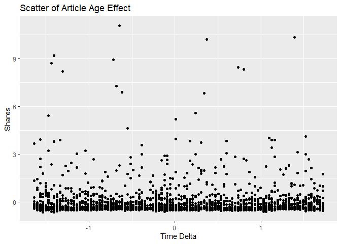

News Popularity Sunday Data
================
Shuang Du
10/16/2020

## Load Libraries

``` r
library(readxl);
library(tidyverse);
library(caret);
library(modelr);
library(rpart);
library(kableExtra);
```

## Read in Data

``` r
getData <- function(day) {

  newsPopData <- read_csv("../../raw_data/OnlineNewsPopularity.csv")
  
  if (day == 'monday') {
    newsPopData <- newsPopData %>% filter(weekday_is_monday == 1)
  } else if(day == 'tuesday') {
    newsPopData <- newsPopData %>% filter(weekday_is_tuesday == 1)
  } else if(day == 'wednesday') {
    newsPopData <- newsPopData %>% filter(weekday_is_wednesday == 1)
  } else if(day == 'thursday') {
    newsPopData <- newsPopData %>% filter(weekday_is_thursday == 1)
  } else if(day == 'friday') {
    newsPopData <- newsPopData %>% filter(weekday_is_friday == 1)
  } else if(day == 'saturday') {
    newsPopData <- newsPopData %>% filter(weekday_is_saturday == 1)
  } else if(day == 'sunday') {
    newsPopData <- newsPopData %>% filter(weekday_is_sunday == 1)
  } else {
    stop("Invalid date")
  }
  return(newsPopData)
}

newsPopData <- getData(params$day)
```

## Set Aside Training Data

``` r
set.seed(92)
trainIndex <- createDataPartition(newsPopData$shares, 
                                  p = 0.7, list = FALSE)

newsPopTrain <- newsPopData[as.vector(trainIndex),];
newsPopTest <- newsPopData[-as.vector(trainIndex),];
```

## Center and Scale

``` r
preProcValues <- preProcess(newsPopTrain, method = c("center", "scale"))
newsPopTrain <- predict(preProcValues, newsPopTrain) 
newsPopTest <- predict(preProcValues, newsPopTest)
```

## Summary of a Few Variables

The plots below show a histogram of the number of shares for the given
day. Scatter plots on the effect of max positive polarity, article time
delta and number of videos in the article are also included.

As expected the histogram has a strong right tail, as seem by the
summary stats which show a very high maximum and a median severals
orders of magnitude lower. This is expected for because of the “viral”
nature of online popularity.

``` r
summary(newsPopTrain$shares)
```

    ##      Min.   1st Qu.    Median      Mean   3rd Qu.      Max. 
    ## -0.610731 -0.423911 -0.306203  0.000000 -0.003526 11.061014

``` r
g0 <- ggplot(newsPopTrain, aes(x=shares))
g0 + geom_histogram(binwidth = 0.5) + ggtitle('Histogram for Number of Shares') + ylab('Number of Shares') + xlab('Shares')
```

<!-- -->

``` r
summary(newsPopTrain$max_positive_polarity)
```

    ##    Min. 1st Qu.  Median    Mean 3rd Qu.    Max. 
    ## -3.1745 -0.7367  0.0759  0.0000  0.8885  0.8885

``` r
g1 <- ggplot(newsPopTrain, aes(x = max_positive_polarity, y = shares )) 
g1 + geom_point() + ggtitle('Scatter of Max Positive Polarity Effect') + ylab('Shares') + xlab('Max Positive Polarity')
```

<!-- -->

``` r
summary(newsPopTrain$timedelta)
```

    ##    Min. 1st Qu.  Median    Mean 3rd Qu.    Max. 
    ## -1.6340 -0.8773 -0.0548  0.0000  0.8664  1.7218

``` r
g2 <- ggplot(newsPopTrain, aes(x = timedelta, y = shares )) 
g2 + geom_point() + ggtitle('Scatter of Article Age Effect') + ylab('Shares') + xlab('Time Delta')
```

<!-- -->

``` r
summary(newsPopTrain$num_videos)
```

    ##    Min. 1st Qu.  Median    Mean 3rd Qu.    Max. 
    ## -0.2929 -0.2929 -0.2929  0.0000  0.0000 21.0876

``` r
g3 <- ggplot(newsPopTrain, aes(x = num_videos, y = shares )) 
g3 + geom_point() + ggtitle('Scatter of Videos Number Effect') + ylab('Shares') + xlab('Number of Videos')
```

<!-- -->

## Modeling

### Standard Tree Based Model (no ensemble)

The type of model being fitted here is a decision tree. The tree splits
are based on minimizing the residual sum of squares for each region.

``` r
rpartFit <- train(shares ~ timedelta + n_tokens_title + n_tokens_content + n_unique_tokens + n_non_stop_words + n_non_stop_unique_tokens
                 + num_hrefs + num_self_hrefs + num_imgs + num_videos + average_token_length + num_keywords + data_channel_is_lifestyle +
                 data_channel_is_entertainment + data_channel_is_bus + data_channel_is_socmed + data_channel_is_tech + data_channel_is_world +
                 self_reference_min_shares + self_reference_max_shares + self_reference_avg_sharess + global_subjectivity + global_sentiment_polarity
                 + global_rate_positive_words + global_rate_negative_words + rate_positive_words + rate_negative_words + avg_positive_polarity +
                  min_positive_polarity + max_positive_polarity + avg_negative_polarity + min_negative_polarity + max_negative_polarity + title_subjectivity
                 + title_sentiment_polarity + abs_title_subjectivity + abs_title_sentiment_polarity, data = newsPopTrain,
             method = "rpart",
             trControl = trainControl(method = "cv", number = 10))
rpartFit
```

    ## CART 
    ## 
    ## 1917 samples
    ##   37 predictor
    ## 
    ## No pre-processing
    ## Resampling: Cross-Validated (10 fold) 
    ## Summary of sample sizes: 1724, 1724, 1725, 1726, 1725, 1725, ... 
    ## Resampling results across tuning parameters:
    ## 
    ##   cp          RMSE      Rsquared      MAE      
    ##   0.01173921  1.042424  0.0032932315  0.5214212
    ##   0.01196100  1.038196  0.0028934959  0.5192249
    ##   0.02059612  1.018598  0.0005610921  0.5215812
    ## 
    ## RMSE was used to select the optimal model using the smallest value.
    ## The final value used for the model was cp = 0.02059612.

``` r
# create the prediction
pred1 <- predict(rpartFit, newdata = newsPopTest)

# compare the prediction vs the actual
resample1 <- postResample(pred1, obs = newsPopTest$shares)
resample1
```

    ##      RMSE  Rsquared       MAE 
    ## 1.1434027        NA 0.5214574

### Boosted Tree Based Model

A boosted tree is an ensemble method which slowly approaches the tree
prediction which would result from the original data. In general, an
ensemble model model will have a lower RSME than a single tree model.

``` r
gbmFit <- train(shares ~ timedelta + n_tokens_title + n_tokens_content + n_unique_tokens + n_non_stop_words + n_non_stop_unique_tokens
                 + num_hrefs + num_self_hrefs + num_imgs + num_videos + average_token_length + num_keywords + data_channel_is_lifestyle +
                 data_channel_is_entertainment + data_channel_is_bus + data_channel_is_socmed + data_channel_is_tech + data_channel_is_world +
                 self_reference_min_shares + self_reference_max_shares + self_reference_avg_sharess + global_subjectivity + global_sentiment_polarity
                 + global_rate_positive_words + global_rate_negative_words + rate_positive_words + rate_negative_words + avg_positive_polarity +
                  min_positive_polarity + max_positive_polarity + avg_negative_polarity + min_negative_polarity + max_negative_polarity + title_subjectivity
                 + title_sentiment_polarity + abs_title_subjectivity + abs_title_sentiment_polarity, data = newsPopTrain,
             method = "gbm",
             trControl = trainControl(method = "cv", number = 10))
```

    ## Iter   TrainDeviance   ValidDeviance   StepSize   Improve
    ##      1        1.0720             nan     0.1000   -0.0006
    ##      2        1.0702             nan     0.1000   -0.0010
    ##      3        1.0685             nan     0.1000   -0.0020
    ##      4        1.0636             nan     0.1000    0.0007
    ##      5        1.0602             nan     0.1000    0.0028
    ##      6        1.0585             nan     0.1000    0.0003
    ##      7        1.0557             nan     0.1000   -0.0013
    ##      8        1.0526             nan     0.1000    0.0013
    ##      9        1.0511             nan     0.1000   -0.0006
    ##     10        1.0488             nan     0.1000   -0.0008
    ##     20        1.0293             nan     0.1000   -0.0024
    ##     40        1.0119             nan     0.1000   -0.0012
    ##     60        1.0008             nan     0.1000   -0.0040
    ##     80        0.9902             nan     0.1000   -0.0002
    ##    100        0.9836             nan     0.1000   -0.0023
    ##    120        0.9756             nan     0.1000   -0.0018
    ##    140        0.9689             nan     0.1000   -0.0007
    ##    150        0.9669             nan     0.1000   -0.0021
    ## 
    ## Iter   TrainDeviance   ValidDeviance   StepSize   Improve
    ##      1        1.0648             nan     0.1000    0.0007
    ##      2        1.0620             nan     0.1000   -0.0006
    ##      3        1.0561             nan     0.1000    0.0010
    ##      4        1.0510             nan     0.1000   -0.0004
    ##      5        1.0474             nan     0.1000    0.0012
    ##      6        1.0402             nan     0.1000    0.0025
    ##      7        1.0370             nan     0.1000   -0.0015
    ##      8        1.0315             nan     0.1000   -0.0008
    ##      9        1.0260             nan     0.1000   -0.0008
    ##     10        1.0231             nan     0.1000    0.0003
    ##     20        0.9913             nan     0.1000   -0.0022
    ##     40        0.9470             nan     0.1000   -0.0038
    ##     60        0.9099             nan     0.1000   -0.0007
    ##     80        0.8701             nan     0.1000   -0.0017
    ##    100        0.8486             nan     0.1000   -0.0024
    ##    120        0.8271             nan     0.1000   -0.0037
    ##    140        0.8104             nan     0.1000   -0.0018
    ##    150        0.8046             nan     0.1000   -0.0022
    ## 
    ## Iter   TrainDeviance   ValidDeviance   StepSize   Improve
    ##      1        1.0647             nan     0.1000    0.0024
    ##      2        1.0568             nan     0.1000    0.0027
    ##      3        1.0505             nan     0.1000    0.0026
    ##      4        1.0457             nan     0.1000   -0.0023
    ##      5        1.0293             nan     0.1000   -0.0012
    ##      6        1.0229             nan     0.1000   -0.0032
    ##      7        1.0172             nan     0.1000   -0.0017
    ##      8        1.0075             nan     0.1000   -0.0012
    ##      9        1.0029             nan     0.1000   -0.0000
    ##     10        0.9973             nan     0.1000   -0.0031
    ##     20        0.9580             nan     0.1000   -0.0018
    ##     40        0.8955             nan     0.1000   -0.0027
    ##     60        0.8403             nan     0.1000   -0.0009
    ##     80        0.7839             nan     0.1000   -0.0010
    ##    100        0.7407             nan     0.1000   -0.0037
    ##    120        0.7108             nan     0.1000   -0.0025
    ##    140        0.6804             nan     0.1000   -0.0019
    ##    150        0.6659             nan     0.1000   -0.0014
    ## 
    ## Iter   TrainDeviance   ValidDeviance   StepSize   Improve
    ##      1        0.9515             nan     0.1000    0.0019
    ##      2        0.9467             nan     0.1000   -0.0015
    ##      3        0.9444             nan     0.1000    0.0009
    ##      4        0.9440             nan     0.1000   -0.0013
    ##      5        0.9416             nan     0.1000   -0.0027
    ##      6        0.9393             nan     0.1000    0.0008
    ##      7        0.9372             nan     0.1000   -0.0021
    ##      8        0.9358             nan     0.1000   -0.0011
    ##      9        0.9342             nan     0.1000    0.0006
    ##     10        0.9340             nan     0.1000   -0.0018
    ##     20        0.9202             nan     0.1000    0.0007
    ##     40        0.9029             nan     0.1000   -0.0004
    ##     60        0.8927             nan     0.1000   -0.0008
    ##     80        0.8837             nan     0.1000   -0.0036
    ##    100        0.8767             nan     0.1000   -0.0010
    ##    120        0.8709             nan     0.1000   -0.0019
    ##    140        0.8631             nan     0.1000   -0.0019
    ##    150        0.8599             nan     0.1000   -0.0017
    ## 
    ## Iter   TrainDeviance   ValidDeviance   StepSize   Improve
    ##      1        0.9450             nan     0.1000    0.0041
    ##      2        0.9409             nan     0.1000    0.0017
    ##      3        0.9279             nan     0.1000   -0.0059
    ##      4        0.9237             nan     0.1000    0.0035
    ##      5        0.9174             nan     0.1000    0.0034
    ##      6        0.9132             nan     0.1000   -0.0002
    ##      7        0.9113             nan     0.1000   -0.0005
    ##      8        0.9052             nan     0.1000   -0.0019
    ##      9        0.9027             nan     0.1000    0.0005
    ##     10        0.9007             nan     0.1000   -0.0005
    ##     20        0.8749             nan     0.1000   -0.0010
    ##     40        0.8349             nan     0.1000   -0.0014
    ##     60        0.8048             nan     0.1000   -0.0013
    ##     80        0.7788             nan     0.1000   -0.0030
    ##    100        0.7588             nan     0.1000   -0.0009
    ##    120        0.7389             nan     0.1000   -0.0060
    ##    140        0.7155             nan     0.1000   -0.0015
    ##    150        0.7107             nan     0.1000   -0.0035
    ## 
    ## Iter   TrainDeviance   ValidDeviance   StepSize   Improve
    ##      1        0.9497             nan     0.1000    0.0048
    ##      2        0.9429             nan     0.1000    0.0003
    ##      3        0.9353             nan     0.1000    0.0013
    ##      4        0.9321             nan     0.1000    0.0007
    ##      5        0.9240             nan     0.1000    0.0027
    ##      6        0.9138             nan     0.1000   -0.0002
    ##      7        0.9075             nan     0.1000   -0.0017
    ##      8        0.9036             nan     0.1000    0.0001
    ##      9        0.9008             nan     0.1000    0.0012
    ##     10        0.8912             nan     0.1000   -0.0013
    ##     20        0.8470             nan     0.1000   -0.0018
    ##     40        0.7818             nan     0.1000   -0.0022
    ##     60        0.7271             nan     0.1000   -0.0009
    ##     80        0.6821             nan     0.1000   -0.0012
    ##    100        0.6575             nan     0.1000   -0.0006
    ##    120        0.6193             nan     0.1000   -0.0075
    ##    140        0.5935             nan     0.1000    0.0000
    ##    150        0.5818             nan     0.1000   -0.0018
    ## 
    ## Iter   TrainDeviance   ValidDeviance   StepSize   Improve
    ##      1        0.8643             nan     0.1000   -0.0006
    ##      2        0.8583             nan     0.1000   -0.0010
    ##      3        0.8552             nan     0.1000    0.0032
    ##      4        0.8515             nan     0.1000   -0.0006
    ##      5        0.8491             nan     0.1000   -0.0040
    ##      6        0.8451             nan     0.1000    0.0011
    ##      7        0.8428             nan     0.1000   -0.0012
    ##      8        0.8421             nan     0.1000   -0.0005
    ##      9        0.8408             nan     0.1000   -0.0010
    ##     10        0.8388             nan     0.1000    0.0021
    ##     20        0.8268             nan     0.1000   -0.0009
    ##     40        0.8135             nan     0.1000   -0.0006
    ##     60        0.8024             nan     0.1000    0.0006
    ##     80        0.7952             nan     0.1000   -0.0005
    ##    100        0.7870             nan     0.1000   -0.0025
    ##    120        0.7808             nan     0.1000   -0.0020
    ##    140        0.7739             nan     0.1000   -0.0019
    ##    150        0.7702             nan     0.1000   -0.0014
    ## 
    ## Iter   TrainDeviance   ValidDeviance   StepSize   Improve
    ##      1        0.8533             nan     0.1000   -0.0033
    ##      2        0.8456             nan     0.1000    0.0073
    ##      3        0.8405             nan     0.1000   -0.0002
    ##      4        0.8365             nan     0.1000    0.0000
    ##      5        0.8345             nan     0.1000    0.0001
    ##      6        0.8300             nan     0.1000    0.0013
    ##      7        0.8261             nan     0.1000   -0.0003
    ##      8        0.8220             nan     0.1000   -0.0020
    ##      9        0.8184             nan     0.1000   -0.0046
    ##     10        0.8162             nan     0.1000    0.0008
    ##     20        0.7952             nan     0.1000    0.0016
    ##     40        0.7573             nan     0.1000   -0.0039
    ##     60        0.7226             nan     0.1000   -0.0029
    ##     80        0.7019             nan     0.1000   -0.0021
    ##    100        0.6800             nan     0.1000   -0.0004
    ##    120        0.6578             nan     0.1000   -0.0009
    ##    140        0.6430             nan     0.1000   -0.0012
    ##    150        0.6317             nan     0.1000   -0.0007
    ## 
    ## Iter   TrainDeviance   ValidDeviance   StepSize   Improve
    ##      1        0.8579             nan     0.1000    0.0013
    ##      2        0.8514             nan     0.1000   -0.0018
    ##      3        0.8408             nan     0.1000    0.0040
    ##      4        0.8352             nan     0.1000    0.0010
    ##      5        0.8279             nan     0.1000    0.0014
    ##      6        0.8165             nan     0.1000   -0.0003
    ##      7        0.8111             nan     0.1000   -0.0018
    ##      8        0.8056             nan     0.1000   -0.0012
    ##      9        0.8011             nan     0.1000    0.0019
    ##     10        0.7954             nan     0.1000   -0.0050
    ##     20        0.7553             nan     0.1000   -0.0030
    ##     40        0.7061             nan     0.1000   -0.0001
    ##     60        0.6586             nan     0.1000   -0.0002
    ##     80        0.6267             nan     0.1000   -0.0005
    ##    100        0.5944             nan     0.1000   -0.0025
    ##    120        0.5675             nan     0.1000   -0.0048
    ##    140        0.5487             nan     0.1000   -0.0029
    ##    150        0.5387             nan     0.1000   -0.0020
    ## 
    ## Iter   TrainDeviance   ValidDeviance   StepSize   Improve
    ##      1        1.0548             nan     0.1000    0.0001
    ##      2        1.0493             nan     0.1000   -0.0001
    ##      3        1.0474             nan     0.1000   -0.0016
    ##      4        1.0440             nan     0.1000    0.0003
    ##      5        1.0411             nan     0.1000   -0.0019
    ##      6        1.0381             nan     0.1000    0.0024
    ##      7        1.0356             nan     0.1000   -0.0011
    ##      8        1.0343             nan     0.1000   -0.0038
    ##      9        1.0334             nan     0.1000   -0.0009
    ##     10        1.0313             nan     0.1000    0.0009
    ##     20        1.0204             nan     0.1000   -0.0014
    ##     40        1.0044             nan     0.1000   -0.0027
    ##     60        0.9895             nan     0.1000   -0.0011
    ##     80        0.9820             nan     0.1000   -0.0035
    ##    100        0.9740             nan     0.1000   -0.0036
    ##    120        0.9663             nan     0.1000   -0.0024
    ##    140        0.9618             nan     0.1000   -0.0019
    ##    150        0.9592             nan     0.1000   -0.0013
    ## 
    ## Iter   TrainDeviance   ValidDeviance   StepSize   Improve
    ##      1        1.0506             nan     0.1000    0.0001
    ##      2        1.0457             nan     0.1000   -0.0016
    ##      3        1.0414             nan     0.1000   -0.0017
    ##      4        1.0389             nan     0.1000    0.0010
    ##      5        1.0362             nan     0.1000    0.0006
    ##      6        1.0324             nan     0.1000   -0.0003
    ##      7        1.0299             nan     0.1000   -0.0020
    ##      8        1.0253             nan     0.1000    0.0017
    ##      9        1.0217             nan     0.1000   -0.0010
    ##     10        1.0177             nan     0.1000    0.0015
    ##     20        0.9885             nan     0.1000   -0.0018
    ##     40        0.9518             nan     0.1000   -0.0012
    ##     60        0.9234             nan     0.1000   -0.0008
    ##     80        0.8888             nan     0.1000   -0.0018
    ##    100        0.8624             nan     0.1000   -0.0037
    ##    120        0.8341             nan     0.1000   -0.0028
    ##    140        0.8106             nan     0.1000   -0.0035
    ##    150        0.8002             nan     0.1000   -0.0003
    ## 
    ## Iter   TrainDeviance   ValidDeviance   StepSize   Improve
    ##      1        1.0498             nan     0.1000    0.0011
    ##      2        1.0423             nan     0.1000    0.0024
    ##      3        1.0378             nan     0.1000   -0.0002
    ##      4        1.0295             nan     0.1000   -0.0041
    ##      5        1.0236             nan     0.1000   -0.0010
    ##      6        1.0183             nan     0.1000   -0.0015
    ##      7        1.0130             nan     0.1000    0.0007
    ##      8        1.0019             nan     0.1000   -0.0011
    ##      9        0.9970             nan     0.1000    0.0002
    ##     10        0.9929             nan     0.1000   -0.0015
    ##     20        0.9406             nan     0.1000   -0.0009
    ##     40        0.8734             nan     0.1000   -0.0058
    ##     60        0.8188             nan     0.1000   -0.0013
    ##     80        0.7782             nan     0.1000   -0.0023
    ##    100        0.7432             nan     0.1000   -0.0006
    ##    120        0.7136             nan     0.1000   -0.0022
    ##    140        0.6967             nan     0.1000   -0.0022
    ##    150        0.6852             nan     0.1000   -0.0028
    ## 
    ## Iter   TrainDeviance   ValidDeviance   StepSize   Improve
    ##      1        1.0625             nan     0.1000   -0.0001
    ##      2        1.0596             nan     0.1000    0.0025
    ##      3        1.0563             nan     0.1000   -0.0009
    ##      4        1.0537             nan     0.1000    0.0018
    ##      5        1.0509             nan     0.1000    0.0010
    ##      6        1.0486             nan     0.1000   -0.0014
    ##      7        1.0457             nan     0.1000    0.0002
    ##      8        1.0447             nan     0.1000   -0.0008
    ##      9        1.0416             nan     0.1000   -0.0008
    ##     10        1.0399             nan     0.1000   -0.0000
    ##     20        1.0255             nan     0.1000   -0.0023
    ##     40        1.0084             nan     0.1000   -0.0005
    ##     60        0.9980             nan     0.1000   -0.0026
    ##     80        0.9875             nan     0.1000   -0.0034
    ##    100        0.9772             nan     0.1000   -0.0007
    ##    120        0.9677             nan     0.1000   -0.0001
    ##    140        0.9630             nan     0.1000   -0.0011
    ##    150        0.9587             nan     0.1000   -0.0020
    ## 
    ## Iter   TrainDeviance   ValidDeviance   StepSize   Improve
    ##      1        1.0482             nan     0.1000   -0.0014
    ##      2        1.0413             nan     0.1000    0.0007
    ##      3        1.0374             nan     0.1000    0.0009
    ##      4        1.0339             nan     0.1000   -0.0015
    ##      5        1.0306             nan     0.1000   -0.0024
    ##      6        1.0276             nan     0.1000   -0.0029
    ##      7        1.0236             nan     0.1000    0.0002
    ##      8        1.0199             nan     0.1000   -0.0015
    ##      9        1.0158             nan     0.1000   -0.0008
    ##     10        1.0135             nan     0.1000   -0.0016
    ##     20        0.9874             nan     0.1000   -0.0013
    ##     40        0.9390             nan     0.1000   -0.0033
    ##     60        0.8976             nan     0.1000   -0.0019
    ##     80        0.8663             nan     0.1000   -0.0016
    ##    100        0.8371             nan     0.1000    0.0000
    ##    120        0.8178             nan     0.1000   -0.0018
    ##    140        0.7977             nan     0.1000   -0.0033
    ##    150        0.7889             nan     0.1000   -0.0028
    ## 
    ## Iter   TrainDeviance   ValidDeviance   StepSize   Improve
    ##      1        1.0551             nan     0.1000    0.0004
    ##      2        1.0489             nan     0.1000    0.0018
    ##      3        1.0423             nan     0.1000   -0.0003
    ##      4        1.0346             nan     0.1000    0.0013
    ##      5        1.0235             nan     0.1000   -0.0025
    ##      6        1.0167             nan     0.1000   -0.0008
    ##      7        1.0133             nan     0.1000   -0.0029
    ##      8        1.0071             nan     0.1000    0.0018
    ##      9        1.0006             nan     0.1000   -0.0011
    ##     10        0.9957             nan     0.1000    0.0016
    ##     20        0.9498             nan     0.1000   -0.0020
    ##     40        0.8845             nan     0.1000   -0.0027
    ##     60        0.8354             nan     0.1000   -0.0038
    ##     80        0.7887             nan     0.1000   -0.0039
    ##    100        0.7568             nan     0.1000   -0.0032
    ##    120        0.7254             nan     0.1000   -0.0003
    ##    140        0.6942             nan     0.1000   -0.0009
    ##    150        0.6827             nan     0.1000   -0.0022
    ## 
    ## Iter   TrainDeviance   ValidDeviance   StepSize   Improve
    ##      1        0.9465             nan     0.1000    0.0027
    ##      2        0.9442             nan     0.1000    0.0021
    ##      3        0.9429             nan     0.1000    0.0000
    ##      4        0.9410             nan     0.1000    0.0011
    ##      5        0.9368             nan     0.1000   -0.0011
    ##      6        0.9328             nan     0.1000   -0.0017
    ##      7        0.9305             nan     0.1000    0.0015
    ##      8        0.9281             nan     0.1000   -0.0004
    ##      9        0.9270             nan     0.1000    0.0001
    ##     10        0.9248             nan     0.1000    0.0002
    ##     20        0.9077             nan     0.1000    0.0004
    ##     40        0.8911             nan     0.1000   -0.0008
    ##     60        0.8806             nan     0.1000   -0.0011
    ##     80        0.8745             nan     0.1000   -0.0033
    ##    100        0.8673             nan     0.1000   -0.0026
    ##    120        0.8625             nan     0.1000   -0.0004
    ##    140        0.8578             nan     0.1000   -0.0014
    ##    150        0.8548             nan     0.1000   -0.0021
    ## 
    ## Iter   TrainDeviance   ValidDeviance   StepSize   Improve
    ##      1        0.9445             nan     0.1000    0.0004
    ##      2        0.9386             nan     0.1000    0.0008
    ##      3        0.9323             nan     0.1000    0.0003
    ##      4        0.9285             nan     0.1000    0.0022
    ##      5        0.9248             nan     0.1000    0.0014
    ##      6        0.9210             nan     0.1000   -0.0010
    ##      7        0.9161             nan     0.1000   -0.0021
    ##      8        0.9126             nan     0.1000   -0.0018
    ##      9        0.9098             nan     0.1000   -0.0014
    ##     10        0.9066             nan     0.1000   -0.0023
    ##     20        0.8790             nan     0.1000   -0.0019
    ##     40        0.8355             nan     0.1000   -0.0004
    ##     60        0.8086             nan     0.1000   -0.0014
    ##     80        0.7888             nan     0.1000   -0.0002
    ##    100        0.7670             nan     0.1000   -0.0017
    ##    120        0.7454             nan     0.1000   -0.0013
    ##    140        0.7266             nan     0.1000   -0.0009
    ##    150        0.7167             nan     0.1000   -0.0013
    ## 
    ## Iter   TrainDeviance   ValidDeviance   StepSize   Improve
    ##      1        0.9411             nan     0.1000    0.0058
    ##      2        0.9331             nan     0.1000    0.0009
    ##      3        0.9290             nan     0.1000   -0.0005
    ##      4        0.9199             nan     0.1000    0.0026
    ##      5        0.9148             nan     0.1000   -0.0017
    ##      6        0.9079             nan     0.1000   -0.0030
    ##      7        0.9022             nan     0.1000   -0.0009
    ##      8        0.8980             nan     0.1000    0.0011
    ##      9        0.8926             nan     0.1000   -0.0053
    ##     10        0.8899             nan     0.1000   -0.0008
    ##     20        0.8511             nan     0.1000   -0.0010
    ##     40        0.8033             nan     0.1000   -0.0035
    ##     60        0.7690             nan     0.1000   -0.0027
    ##     80        0.7369             nan     0.1000   -0.0018
    ##    100        0.7112             nan     0.1000   -0.0024
    ##    120        0.6893             nan     0.1000   -0.0018
    ##    140        0.6588             nan     0.1000   -0.0024
    ##    150        0.6485             nan     0.1000   -0.0016
    ## 
    ## Iter   TrainDeviance   ValidDeviance   StepSize   Improve
    ##      1        0.9959             nan     0.1000   -0.0008
    ##      2        0.9922             nan     0.1000    0.0033
    ##      3        0.9911             nan     0.1000   -0.0009
    ##      4        0.9886             nan     0.1000   -0.0010
    ##      5        0.9864             nan     0.1000    0.0004
    ##      6        0.9831             nan     0.1000    0.0019
    ##      7        0.9816             nan     0.1000    0.0008
    ##      8        0.9805             nan     0.1000    0.0000
    ##      9        0.9786             nan     0.1000    0.0002
    ##     10        0.9758             nan     0.1000    0.0012
    ##     20        0.9614             nan     0.1000    0.0003
    ##     40        0.9398             nan     0.1000   -0.0002
    ##     60        0.9277             nan     0.1000   -0.0010
    ##     80        0.9203             nan     0.1000   -0.0013
    ##    100        0.9160             nan     0.1000   -0.0021
    ##    120        0.9108             nan     0.1000   -0.0026
    ##    140        0.9028             nan     0.1000   -0.0013
    ##    150        0.8993             nan     0.1000   -0.0009
    ## 
    ## Iter   TrainDeviance   ValidDeviance   StepSize   Improve
    ##      1        0.9931             nan     0.1000    0.0021
    ##      2        0.9888             nan     0.1000    0.0024
    ##      3        0.9817             nan     0.1000    0.0007
    ##      4        0.9781             nan     0.1000   -0.0011
    ##      5        0.9736             nan     0.1000   -0.0030
    ##      6        0.9706             nan     0.1000   -0.0008
    ##      7        0.9660             nan     0.1000   -0.0004
    ##      8        0.9625             nan     0.1000   -0.0010
    ##      9        0.9598             nan     0.1000   -0.0015
    ##     10        0.9555             nan     0.1000   -0.0008
    ##     20        0.9183             nan     0.1000   -0.0020
    ##     40        0.8769             nan     0.1000   -0.0006
    ##     60        0.8487             nan     0.1000   -0.0036
    ##     80        0.8295             nan     0.1000   -0.0010
    ##    100        0.8029             nan     0.1000   -0.0012
    ##    120        0.7832             nan     0.1000   -0.0017
    ##    140        0.7624             nan     0.1000   -0.0025
    ##    150        0.7528             nan     0.1000    0.0000
    ## 
    ## Iter   TrainDeviance   ValidDeviance   StepSize   Improve
    ##      1        0.9869             nan     0.1000    0.0032
    ##      2        0.9831             nan     0.1000    0.0003
    ##      3        0.9765             nan     0.1000    0.0014
    ##      4        0.9709             nan     0.1000    0.0015
    ##      5        0.9632             nan     0.1000   -0.0031
    ##      6        0.9574             nan     0.1000   -0.0016
    ##      7        0.9528             nan     0.1000   -0.0005
    ##      8        0.9474             nan     0.1000   -0.0014
    ##      9        0.9427             nan     0.1000   -0.0035
    ##     10        0.9391             nan     0.1000   -0.0006
    ##     20        0.8871             nan     0.1000   -0.0028
    ##     40        0.8237             nan     0.1000   -0.0032
    ##     60        0.7675             nan     0.1000   -0.0024
    ##     80        0.7282             nan     0.1000   -0.0020
    ##    100        0.6966             nan     0.1000   -0.0015
    ##    120        0.6599             nan     0.1000   -0.0014
    ##    140        0.6344             nan     0.1000   -0.0000
    ##    150        0.6232             nan     0.1000   -0.0011
    ## 
    ## Iter   TrainDeviance   ValidDeviance   StepSize   Improve
    ##      1        0.9348             nan     0.1000    0.0028
    ##      2        0.9311             nan     0.1000    0.0002
    ##      3        0.9292             nan     0.1000    0.0014
    ##      4        0.9268             nan     0.1000   -0.0004
    ##      5        0.9251             nan     0.1000    0.0004
    ##      6        0.9234             nan     0.1000   -0.0001
    ##      7        0.9224             nan     0.1000   -0.0001
    ##      8        0.9214             nan     0.1000    0.0002
    ##      9        0.9195             nan     0.1000    0.0010
    ##     10        0.9173             nan     0.1000    0.0013
    ##     20        0.9062             nan     0.1000   -0.0009
    ##     40        0.8874             nan     0.1000   -0.0005
    ##     60        0.8761             nan     0.1000   -0.0008
    ##     80        0.8680             nan     0.1000   -0.0015
    ##    100        0.8626             nan     0.1000   -0.0014
    ##    120        0.8555             nan     0.1000   -0.0007
    ##    140        0.8462             nan     0.1000   -0.0008
    ##    150        0.8446             nan     0.1000   -0.0020
    ## 
    ## Iter   TrainDeviance   ValidDeviance   StepSize   Improve
    ##      1        0.9320             nan     0.1000    0.0033
    ##      2        0.9247             nan     0.1000    0.0018
    ##      3        0.9212             nan     0.1000    0.0003
    ##      4        0.9145             nan     0.1000   -0.0002
    ##      5        0.9102             nan     0.1000   -0.0010
    ##      6        0.9076             nan     0.1000    0.0003
    ##      7        0.9052             nan     0.1000   -0.0000
    ##      8        0.9007             nan     0.1000   -0.0017
    ##      9        0.8974             nan     0.1000    0.0017
    ##     10        0.8915             nan     0.1000    0.0002
    ##     20        0.8673             nan     0.1000   -0.0013
    ##     40        0.8212             nan     0.1000   -0.0014
    ##     60        0.7930             nan     0.1000   -0.0006
    ##     80        0.7619             nan     0.1000   -0.0023
    ##    100        0.7392             nan     0.1000   -0.0010
    ##    120        0.7168             nan     0.1000   -0.0008
    ##    140        0.6943             nan     0.1000   -0.0014
    ##    150        0.6873             nan     0.1000   -0.0011
    ## 
    ## Iter   TrainDeviance   ValidDeviance   StepSize   Improve
    ##      1        0.9298             nan     0.1000    0.0026
    ##      2        0.9220             nan     0.1000    0.0038
    ##      3        0.9140             nan     0.1000    0.0005
    ##      4        0.9077             nan     0.1000   -0.0016
    ##      5        0.8984             nan     0.1000   -0.0003
    ##      6        0.8917             nan     0.1000   -0.0001
    ##      7        0.8848             nan     0.1000    0.0005
    ##      8        0.8809             nan     0.1000    0.0000
    ##      9        0.8758             nan     0.1000   -0.0015
    ##     10        0.8716             nan     0.1000   -0.0006
    ##     20        0.8291             nan     0.1000   -0.0006
    ##     40        0.7725             nan     0.1000   -0.0011
    ##     60        0.7218             nan     0.1000   -0.0027
    ##     80        0.6863             nan     0.1000   -0.0003
    ##    100        0.6550             nan     0.1000   -0.0017
    ##    120        0.6274             nan     0.1000   -0.0019
    ##    140        0.5919             nan     0.1000   -0.0008
    ##    150        0.5821             nan     0.1000   -0.0025
    ## 
    ## Iter   TrainDeviance   ValidDeviance   StepSize   Improve
    ##      1        1.0207             nan     0.1000    0.0003
    ##      2        1.0178             nan     0.1000    0.0023
    ##      3        1.0142             nan     0.1000   -0.0030
    ##      4        1.0109             nan     0.1000    0.0003
    ##      5        1.0091             nan     0.1000   -0.0008
    ##      6        1.0076             nan     0.1000   -0.0039
    ##      7        1.0052             nan     0.1000   -0.0001
    ##      8        1.0021             nan     0.1000   -0.0013
    ##      9        1.0005             nan     0.1000   -0.0020
    ##     10        0.9982             nan     0.1000    0.0006
    ##     20        0.9868             nan     0.1000   -0.0025
    ##     40        0.9707             nan     0.1000   -0.0005
    ##     60        0.9605             nan     0.1000   -0.0006
    ##     80        0.9515             nan     0.1000   -0.0004
    ##    100        0.9431             nan     0.1000   -0.0007
    ##    120        0.9330             nan     0.1000   -0.0006
    ##    140        0.9276             nan     0.1000   -0.0019
    ##    150        0.9246             nan     0.1000   -0.0012
    ## 
    ## Iter   TrainDeviance   ValidDeviance   StepSize   Improve
    ##      1        1.0202             nan     0.1000   -0.0002
    ##      2        1.0176             nan     0.1000   -0.0004
    ##      3        1.0092             nan     0.1000   -0.0025
    ##      4        1.0047             nan     0.1000    0.0024
    ##      5        1.0018             nan     0.1000   -0.0006
    ##      6        0.9976             nan     0.1000   -0.0006
    ##      7        0.9930             nan     0.1000   -0.0001
    ##      8        0.9895             nan     0.1000    0.0016
    ##      9        0.9827             nan     0.1000    0.0021
    ##     10        0.9811             nan     0.1000    0.0004
    ##     20        0.9485             nan     0.1000   -0.0021
    ##     40        0.9100             nan     0.1000   -0.0034
    ##     60        0.8796             nan     0.1000   -0.0008
    ##     80        0.8545             nan     0.1000   -0.0021
    ##    100        0.8232             nan     0.1000   -0.0014
    ##    120        0.7976             nan     0.1000   -0.0008
    ##    140        0.7802             nan     0.1000   -0.0015
    ##    150        0.7717             nan     0.1000   -0.0012
    ## 
    ## Iter   TrainDeviance   ValidDeviance   StepSize   Improve
    ##      1        1.0174             nan     0.1000   -0.0006
    ##      2        1.0083             nan     0.1000   -0.0033
    ##      3        1.0016             nan     0.1000    0.0005
    ##      4        0.9959             nan     0.1000   -0.0012
    ##      5        0.9889             nan     0.1000    0.0003
    ##      6        0.9786             nan     0.1000   -0.0013
    ##      7        0.9749             nan     0.1000   -0.0006
    ##      8        0.9699             nan     0.1000    0.0010
    ##      9        0.9540             nan     0.1000   -0.0045
    ##     10        0.9509             nan     0.1000   -0.0011
    ##     20        0.9047             nan     0.1000   -0.0010
    ##     40        0.8475             nan     0.1000   -0.0045
    ##     60        0.7901             nan     0.1000   -0.0020
    ##     80        0.7528             nan     0.1000   -0.0020
    ##    100        0.7072             nan     0.1000   -0.0025
    ##    120        0.6693             nan     0.1000   -0.0022
    ##    140        0.6424             nan     0.1000   -0.0006
    ##    150        0.6300             nan     0.1000   -0.0018
    ## 
    ## Iter   TrainDeviance   ValidDeviance   StepSize   Improve
    ##      1        1.0626             nan     0.1000    0.0013
    ##      2        1.0585             nan     0.1000    0.0014
    ##      3        1.0552             nan     0.1000   -0.0001
    ##      4        1.0530             nan     0.1000    0.0012
    ##      5        1.0507             nan     0.1000    0.0007
    ##      6        1.0489             nan     0.1000   -0.0013
    ##      7        1.0473             nan     0.1000   -0.0022
    ##      8        1.0456             nan     0.1000   -0.0004
    ##      9        1.0440             nan     0.1000   -0.0004
    ##     10        1.0435             nan     0.1000   -0.0004
    ##     20        1.0307             nan     0.1000   -0.0017
    ##     40        1.0150             nan     0.1000   -0.0004
    ##     60        1.0021             nan     0.1000   -0.0022
    ##     80        0.9924             nan     0.1000   -0.0009
    ##    100        0.9849             nan     0.1000   -0.0002
    ##    120        0.9787             nan     0.1000   -0.0010
    ##    140        0.9711             nan     0.1000   -0.0011
    ##    150        0.9683             nan     0.1000   -0.0043
    ## 
    ## Iter   TrainDeviance   ValidDeviance   StepSize   Improve
    ##      1        1.0607             nan     0.1000   -0.0021
    ##      2        1.0464             nan     0.1000   -0.0017
    ##      3        1.0416             nan     0.1000   -0.0002
    ##      4        1.0372             nan     0.1000    0.0029
    ##      5        1.0273             nan     0.1000   -0.0029
    ##      6        1.0214             nan     0.1000   -0.0039
    ##      7        1.0179             nan     0.1000   -0.0005
    ##      8        1.0150             nan     0.1000   -0.0029
    ##      9        1.0124             nan     0.1000    0.0001
    ##     10        1.0088             nan     0.1000    0.0013
    ##     20        0.9798             nan     0.1000   -0.0022
    ##     40        0.9438             nan     0.1000   -0.0024
    ##     60        0.9049             nan     0.1000   -0.0013
    ##     80        0.8780             nan     0.1000   -0.0026
    ##    100        0.8549             nan     0.1000   -0.0020
    ##    120        0.8315             nan     0.1000   -0.0031
    ##    140        0.8070             nan     0.1000   -0.0007
    ##    150        0.7975             nan     0.1000   -0.0018
    ## 
    ## Iter   TrainDeviance   ValidDeviance   StepSize   Improve
    ##      1        1.0576             nan     0.1000   -0.0003
    ##      2        1.0493             nan     0.1000   -0.0034
    ##      3        1.0432             nan     0.1000    0.0005
    ##      4        1.0366             nan     0.1000    0.0005
    ##      5        1.0274             nan     0.1000    0.0039
    ##      6        1.0213             nan     0.1000   -0.0009
    ##      7        1.0126             nan     0.1000   -0.0033
    ##      8        1.0080             nan     0.1000   -0.0037
    ##      9        0.9996             nan     0.1000   -0.0035
    ##     10        0.9961             nan     0.1000   -0.0002
    ##     20        0.9467             nan     0.1000   -0.0038
    ##     40        0.8579             nan     0.1000   -0.0006
    ##     60        0.8026             nan     0.1000   -0.0028
    ##     80        0.7673             nan     0.1000   -0.0020
    ##    100        0.7369             nan     0.1000   -0.0027
    ##    120        0.7007             nan     0.1000   -0.0023
    ##    140        0.6756             nan     0.1000   -0.0026
    ##    150        0.6619             nan     0.1000   -0.0015
    ## 
    ## Iter   TrainDeviance   ValidDeviance   StepSize   Improve
    ##      1        0.9968             nan     0.1000   -0.0004
    ##      2        0.9931             nan     0.1000   -0.0018
    ##      3        0.9897             nan     0.1000   -0.0007
    ##      4        0.9871             nan     0.1000    0.0021
    ##      5        0.9855             nan     0.1000   -0.0021
    ##      6        0.9840             nan     0.1000   -0.0008
    ##      7        0.9819             nan     0.1000   -0.0000
    ##      8        0.9810             nan     0.1000   -0.0011
    ##      9        0.9792             nan     0.1000   -0.0004
    ##     10        0.9765             nan     0.1000    0.0019
    ##     20        0.9644             nan     0.1000    0.0006
    ##     40        0.9486             nan     0.1000   -0.0002
    ##     60        0.9386             nan     0.1000   -0.0012
    ##     80        0.9318             nan     0.1000   -0.0021
    ##    100        0.9236             nan     0.1000   -0.0008

``` r
gbmFit
```

    ## Stochastic Gradient Boosting 
    ## 
    ## 1917 samples
    ##   37 predictor
    ## 
    ## No pre-processing
    ## Resampling: Cross-Validated (10 fold) 
    ## Summary of sample sizes: 1726, 1724, 1725, 1725, 1725, 1727, ... 
    ## Resampling results across tuning parameters:
    ## 
    ##   interaction.depth  n.trees  RMSE       Rsquared    MAE      
    ##   1                   50      0.9589232  0.01351199  0.5101014
    ##   1                  100      0.9587115  0.01677125  0.5064817
    ##   1                  150      0.9644570  0.01446115  0.5090875
    ##   2                   50      0.9614333  0.01730966  0.5058515
    ##   2                  100      0.9712361  0.01675839  0.5075432
    ##   2                  150      0.9802436  0.01463778  0.5169594
    ##   3                   50      0.9660713  0.01584424  0.5092113
    ##   3                  100      0.9806774  0.01475651  0.5199314
    ##   3                  150      0.9882549  0.01626417  0.5275130
    ## 
    ## Tuning parameter 'shrinkage' was held constant at a value of 0.1
    ## Tuning parameter 'n.minobsinnode' was held constant at a value of 10
    ## RMSE was used to select the optimal model using the smallest value.
    ## The final values used for the model were n.trees = 100, interaction.depth = 1, shrinkage = 0.1 and n.minobsinnode = 10.

``` r
# create the prediction
pred2 <- predict(gbmFit, newdata = newsPopTest)

# compare the prediction vs the actual
resample2 <- postResample(pred2, obs = newsPopTest$shares)
resample2
```

    ##       RMSE   Rsquared        MAE 
    ## 1.13415607 0.01911077 0.50865999

### Comparison

Below is a comparison of the two methods. Both have relatively high root
mean square errors.

``` r
comparison <- data.frame("RSME" = c(resample1[[1]], resample2[[1]]), "MAE" = c(resample1[[3]], resample2[[3]]) )
rownames(comparison) <- c("RPART","GBM")
kable(comparison)
```

<table>

<thead>

<tr>

<th style="text-align:left;">

</th>

<th style="text-align:right;">

RSME

</th>

<th style="text-align:right;">

MAE

</th>

</tr>

</thead>

<tbody>

<tr>

<td style="text-align:left;">

RPART

</td>

<td style="text-align:right;">

1.143403

</td>

<td style="text-align:right;">

0.5214574

</td>

</tr>

<tr>

<td style="text-align:left;">

GBM

</td>

<td style="text-align:right;">

1.134156

</td>

<td style="text-align:right;">

0.5086600

</td>

</tr>

</tbody>

</table>
