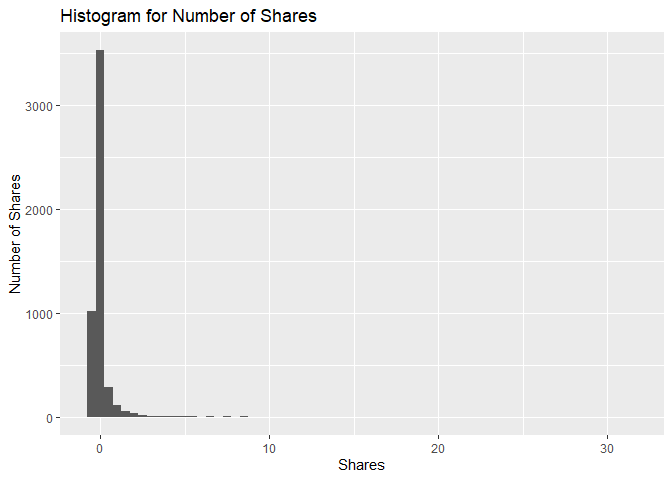

News Popularity Thursday Data
================
Shuang Du
10/16/2020

Load Libraries
--------------

    library(readxl);
    library(tidyverse);
    library(caret);
    library(modelr);
    library(rpart);
    library(kableExtra);

Read in Data
------------

    getData <- function(day) {

      newsPopData <- read_csv("raw_data/OnlineNewsPopularity.csv")
      
      if (day == 'monday') {
        newsPopData <- newsPopData %>% filter(weekday_is_monday == 1)
      } else if(day == 'tuesday') {
        newsPopData <- newsPopData %>% filter(weekday_is_tuesday == 1)
      } else if(day == 'wednesday') {
        newsPopData <- newsPopData %>% filter(weekday_is_wednesday == 1)
      } else if(day == 'thursday') {
        newsPopData <- newsPopData %>% filter(weekday_is_thursday == 1)
      } else if(day == 'friday') {
        newsPopData <- newsPopData %>% filter(weekday_is_friday == 1)
      } else if(day == 'saturday') {
        newsPopData <- newsPopData %>% filter(weekday_is_saturday == 1)
      } else if(day == 'sunday') {
        newsPopData <- newsPopData %>% filter(weekday_is_sunday == 1)
      } else {
        stop("Invalid date")
      }
      return(newsPopData)
    }

    newsPopData <- getData(params$day)

Set Aside Training Data
-----------------------

    set.seed(92)
    trainIndex <- createDataPartition(newsPopData$shares, 
                                      p = 0.7, list = FALSE)

    newsPopTrain <- newsPopData[as.vector(trainIndex),];
    newsPopTest <- newsPopData[-as.vector(trainIndex),];

Center and Scale
----------------

    preProcValues <- preProcess(newsPopTrain, method = c("center", "scale"))
    newsPopTrain <- predict(preProcValues, newsPopTrain) 
    newsPopTest <- predict(preProcValues, newsPopTest)

Summary of a Few Variables
--------------------------

The plots below show a histogram of the number of shares for the given
day. Scatter plots on the effect of max positive polarity, article time
delta and number of videos in the article are also included.

As expected the histogram has a strong right tail, as seem by the
summary stats which show a very high maximum and a median severals
orders of magnitude lower. This is expected for because of the “viral”
nature of online popularity.

    summary(newsPopTrain$shares)

    ##     Min.  1st Qu.   Median     Mean  3rd Qu.     Max. 
    ## -0.33841 -0.24242 -0.18913  0.00000 -0.06071 31.59327

    g0 <- ggplot(newsPopTrain, aes(x=shares))
    g0 + geom_histogram(binwidth = 0.5) + ggtitle('Histogram for Number of Shares') + ylab('Number of Shares') + xlab('Shares')

<!-- -->

    summary(newsPopTrain$max_positive_polarity)

    ##    Min. 1st Qu.  Median    Mean 3rd Qu.    Max. 
    ## -3.0111 -0.6089  0.1919  0.0000  0.9926  0.9926

    g1 <- ggplot(newsPopTrain, aes(x = max_positive_polarity, y = shares )) 
    g1 + geom_point() + ggtitle('Scatter of Max Positive Polarity Effect') + ylab('Shares') + xlab('Max Positive Polarity')

<!-- -->

    summary(newsPopTrain$timedelta)

    ##     Min.  1st Qu.   Median     Mean  3rd Qu.     Max. 
    ## -1.59613 -0.88020 -0.09918  0.00000  0.87709  1.72319

    g2 <- ggplot(newsPopTrain, aes(x = timedelta, y = shares )) 
    g2 + geom_point() + ggtitle('Scatter of Article Age Effect') + ylab('Shares') + xlab('Time Delta')

<!-- -->

    summary(newsPopTrain$num_videos)

    ##     Min.  1st Qu.   Median     Mean  3rd Qu.     Max. 
    ## -0.30927 -0.30927 -0.30927  0.00000 -0.04485 19.25809

    g3 <- ggplot(newsPopTrain, aes(x = num_videos, y = shares )) 
    g3 + geom_point() + ggtitle('Scatter of Videos Number Effect') + ylab('Shares') + xlab('Number of Videos')

<!-- -->

Modeling
--------

### Standard Tree Based Model (no ensemble)

The type of model being fitted here is a decision tree. The tree splits
are based on minimizing the residual sum of squares for each region.

    rpartFit <- train(shares ~ timedelta + n_tokens_title + n_tokens_content + n_unique_tokens + n_non_stop_words + n_non_stop_unique_tokens
                     + num_hrefs + num_self_hrefs + num_imgs + num_videos + average_token_length + num_keywords + data_channel_is_lifestyle +
                     data_channel_is_entertainment + data_channel_is_bus + data_channel_is_socmed + data_channel_is_tech + data_channel_is_world +
                     self_reference_min_shares + self_reference_max_shares + self_reference_avg_sharess + global_subjectivity + global_sentiment_polarity
                     + global_rate_positive_words + global_rate_negative_words + rate_positive_words + rate_negative_words + avg_positive_polarity +
                      min_positive_polarity + max_positive_polarity + avg_negative_polarity + min_negative_polarity + max_negative_polarity + title_subjectivity
                     + title_sentiment_polarity + abs_title_subjectivity + abs_title_sentiment_polarity, data = newsPopTrain,
                 method = "rpart",
                 trControl = trainControl(method = "cv", number = 10),
                 tuneGrid = data.frame(cp = c(.001,.01,.015,.02,.03,.04,.05,.06,.07,.08))
                 )
    rpartFit

    ## CART 
    ## 
    ## 5088 samples
    ##   37 predictor
    ## 
    ## No pre-processing
    ## Resampling: Cross-Validated (10 fold) 
    ## Summary of sample sizes: 4579, 4580, 4578, 4579, 4579, 4579, ... 
    ## Resampling results across tuning parameters:
    ## 
    ##   cp     RMSE       Rsquared     MAE      
    ##   0.001  1.0379450  0.002054467  0.3289377
    ##   0.010  0.9943223  0.006133413  0.3161982
    ##   0.015  0.9878528  0.009541017  0.3151471
    ##   0.020  0.9877017  0.009446073  0.3156122
    ##   0.030  0.9847261  0.009097971  0.3155388
    ##   0.040  0.9847261  0.009097971  0.3155388
    ##   0.050  0.9780586  0.010184384  0.3147656
    ##   0.060  0.9261306          NaN  0.3179916
    ##   0.070  0.9261306          NaN  0.3179916
    ##   0.080  0.9261306          NaN  0.3179916
    ## 
    ## RMSE was used to select the optimal model using the smallest value.
    ## The final value used for the model was cp = 0.08.

    # create the prediction
    pred1 <- predict(rpartFit, newdata = newsPopTest)

    # compare the prediction vs the actual
    resample1 <- postResample(pred1, obs = newsPopTest$shares)
    resample1

    ##      RMSE  Rsquared       MAE 
    ## 1.0321475        NA 0.3206665

### Boosted Tree Based Model

A boosted tree is an ensemble method which slowly approaches the tree
prediction which would result from the original data. In general, an
ensemble model model will have a lower RSME than a single tree model.

    gbmFit <- train(shares ~ timedelta + n_tokens_title + n_tokens_content + n_unique_tokens + n_non_stop_words + n_non_stop_unique_tokens
                     + num_hrefs + num_self_hrefs + num_imgs + num_videos + average_token_length + num_keywords + data_channel_is_lifestyle +
                     data_channel_is_entertainment + data_channel_is_bus + data_channel_is_socmed + data_channel_is_tech + data_channel_is_world +
                     self_reference_min_shares + self_reference_max_shares + self_reference_avg_sharess + global_subjectivity + global_sentiment_polarity
                     + global_rate_positive_words + global_rate_negative_words + rate_positive_words + rate_negative_words + avg_positive_polarity +
                      min_positive_polarity + max_positive_polarity + avg_negative_polarity + min_negative_polarity + max_negative_polarity + title_subjectivity
                     + title_sentiment_polarity + abs_title_subjectivity + abs_title_sentiment_polarity, data = newsPopTrain,
                 method = "gbm",
                 trControl = trainControl(method = "cv", number = 10))

    ## Iter   TrainDeviance   ValidDeviance   StepSize   Improve
    ##      1        1.0617             nan     0.1000   -0.0006
    ##      2        1.0577             nan     0.1000    0.0028
    ##      3        1.0537             nan     0.1000   -0.0001
    ##      4        1.0517             nan     0.1000   -0.0003
    ##      5        1.0505             nan     0.1000   -0.0004
    ##      6        1.0471             nan     0.1000    0.0011
    ##      7        1.0451             nan     0.1000   -0.0007
    ##      8        1.0440             nan     0.1000    0.0004
    ##      9        1.0427             nan     0.1000   -0.0012
    ##     10        1.0419             nan     0.1000   -0.0004
    ##     20        1.0315             nan     0.1000    0.0007
    ##     40        1.0176             nan     0.1000   -0.0003
    ##     60        1.0084             nan     0.1000   -0.0004
    ##     80        1.0001             nan     0.1000   -0.0008
    ##    100        0.9925             nan     0.1000   -0.0008
    ##    120        0.9852             nan     0.1000    0.0000
    ##    140        0.9796             nan     0.1000   -0.0013
    ##    150        0.9768             nan     0.1000   -0.0016
    ## 
    ## Iter   TrainDeviance   ValidDeviance   StepSize   Improve
    ##      1        1.0602             nan     0.1000    0.0005
    ##      2        1.0569             nan     0.1000    0.0008
    ##      3        1.0535             nan     0.1000    0.0002
    ##      4        1.0489             nan     0.1000   -0.0000
    ##      5        1.0364             nan     0.1000    0.0022
    ##      6        1.0287             nan     0.1000   -0.0009
    ##      7        1.0241             nan     0.1000    0.0001
    ##      8        1.0185             nan     0.1000   -0.0006
    ##      9        1.0115             nan     0.1000    0.0007
    ##     10        1.0076             nan     0.1000    0.0002
    ##     20        0.9677             nan     0.1000   -0.0001
    ##     40        0.9162             nan     0.1000   -0.0009
    ##     60        0.8864             nan     0.1000   -0.0006
    ##     80        0.8573             nan     0.1000   -0.0009
    ##    100        0.8399             nan     0.1000   -0.0011
    ##    120        0.8236             nan     0.1000   -0.0010
    ##    140        0.8076             nan     0.1000   -0.0013
    ##    150        0.7976             nan     0.1000   -0.0013
    ## 
    ## Iter   TrainDeviance   ValidDeviance   StepSize   Improve
    ##      1        1.0625             nan     0.1000    0.0020
    ##      2        1.0539             nan     0.1000    0.0039
    ##      3        1.0467             nan     0.1000   -0.0015
    ##      4        1.0371             nan     0.1000    0.0008
    ##      5        1.0315             nan     0.1000    0.0008
    ##      6        1.0248             nan     0.1000   -0.0014
    ##      7        1.0152             nan     0.1000   -0.0021
    ##      8        1.0102             nan     0.1000   -0.0023
    ##      9        0.9943             nan     0.1000   -0.0050
    ##     10        0.9883             nan     0.1000   -0.0008
    ##     20        0.9295             nan     0.1000   -0.0032
    ##     40        0.8633             nan     0.1000   -0.0010
    ##     60        0.7995             nan     0.1000   -0.0042
    ##     80        0.7645             nan     0.1000   -0.0010
    ##    100        0.7383             nan     0.1000   -0.0006
    ##    120        0.7117             nan     0.1000   -0.0021
    ##    140        0.6764             nan     0.1000   -0.0048
    ##    150        0.6683             nan     0.1000   -0.0010
    ## 
    ## Iter   TrainDeviance   ValidDeviance   StepSize   Improve
    ##      1        1.0889             nan     0.1000    0.0028
    ##      2        1.0869             nan     0.1000    0.0021
    ##      3        1.0839             nan     0.1000    0.0020
    ##      4        1.0813             nan     0.1000    0.0013
    ##      5        1.0801             nan     0.1000   -0.0001
    ##      6        1.0771             nan     0.1000    0.0011
    ##      7        1.0755             nan     0.1000    0.0000
    ##      8        1.0724             nan     0.1000   -0.0004
    ##      9        1.0710             nan     0.1000   -0.0003
    ##     10        1.0684             nan     0.1000    0.0011
    ##     20        1.0568             nan     0.1000    0.0005
    ##     40        1.0449             nan     0.1000   -0.0005
    ##     60        1.0370             nan     0.1000   -0.0027
    ##     80        1.0313             nan     0.1000   -0.0013
    ##    100        1.0247             nan     0.1000    0.0007
    ##    120        1.0185             nan     0.1000   -0.0034
    ##    140        1.0146             nan     0.1000   -0.0014
    ##    150        1.0110             nan     0.1000   -0.0017
    ## 
    ## Iter   TrainDeviance   ValidDeviance   StepSize   Improve
    ##      1        1.0904             nan     0.1000    0.0023
    ##      2        1.0844             nan     0.1000    0.0011
    ##      3        1.0779             nan     0.1000    0.0017
    ##      4        1.0583             nan     0.1000   -0.0005
    ##      5        1.0525             nan     0.1000    0.0001
    ##      6        1.0423             nan     0.1000   -0.0034
    ##      7        1.0406             nan     0.1000   -0.0012
    ##      8        1.0351             nan     0.1000    0.0009
    ##      9        1.0333             nan     0.1000   -0.0015
    ##     10        1.0233             nan     0.1000   -0.0023
    ##     20        0.9929             nan     0.1000   -0.0023
    ##     40        0.9381             nan     0.1000   -0.0009
    ##     60        0.9128             nan     0.1000   -0.0007
    ##     80        0.8928             nan     0.1000    0.0000
    ##    100        0.8769             nan     0.1000   -0.0003
    ##    120        0.8593             nan     0.1000   -0.0020
    ##    140        0.8439             nan     0.1000    0.0003
    ##    150        0.8317             nan     0.1000    0.0005
    ## 
    ## Iter   TrainDeviance   ValidDeviance   StepSize   Improve
    ##      1        1.0843             nan     0.1000    0.0004
    ##      2        1.0759             nan     0.1000    0.0016
    ##      3        1.0653             nan     0.1000    0.0087
    ##      4        1.0611             nan     0.1000    0.0012
    ##      5        1.0476             nan     0.1000   -0.0020
    ##      6        1.0463             nan     0.1000    0.0001
    ##      7        1.0373             nan     0.1000    0.0037
    ##      8        1.0280             nan     0.1000    0.0003
    ##      9        1.0232             nan     0.1000    0.0027
    ##     10        1.0122             nan     0.1000   -0.0012
    ##     20        0.9674             nan     0.1000   -0.0015
    ##     40        0.8956             nan     0.1000   -0.0023
    ##     60        0.8323             nan     0.1000   -0.0021
    ##     80        0.7985             nan     0.1000    0.0003
    ##    100        0.7665             nan     0.1000   -0.0034
    ##    120        0.7311             nan     0.1000   -0.0022
    ##    140        0.6998             nan     0.1000   -0.0012
    ##    150        0.6926             nan     0.1000   -0.0007
    ## 
    ## Iter   TrainDeviance   ValidDeviance   StepSize   Improve
    ##      1        1.0756             nan     0.1000    0.0002
    ##      2        1.0728             nan     0.1000    0.0009
    ##      3        1.0687             nan     0.1000    0.0029
    ##      4        1.0658             nan     0.1000   -0.0003
    ##      5        1.0631             nan     0.1000    0.0021
    ##      6        1.0615             nan     0.1000    0.0006
    ##      7        1.0589             nan     0.1000   -0.0008
    ##      8        1.0580             nan     0.1000    0.0001
    ##      9        1.0564             nan     0.1000    0.0008
    ##     10        1.0555             nan     0.1000   -0.0003
    ##     20        1.0460             nan     0.1000   -0.0022
    ##     40        1.0326             nan     0.1000   -0.0002
    ##     60        1.0225             nan     0.1000   -0.0009
    ##     80        1.0145             nan     0.1000   -0.0002
    ##    100        1.0071             nan     0.1000    0.0002
    ##    120        1.0018             nan     0.1000   -0.0001
    ##    140        0.9965             nan     0.1000   -0.0009
    ##    150        0.9952             nan     0.1000    0.0001
    ## 
    ## Iter   TrainDeviance   ValidDeviance   StepSize   Improve
    ##      1        1.0730             nan     0.1000    0.0007
    ##      2        1.0542             nan     0.1000    0.0013
    ##      3        1.0516             nan     0.1000    0.0010
    ##      4        1.0470             nan     0.1000   -0.0004
    ##      5        1.0382             nan     0.1000    0.0010
    ##      6        1.0324             nan     0.1000   -0.0012
    ##      7        1.0280             nan     0.1000   -0.0018
    ##      8        1.0213             nan     0.1000   -0.0005
    ##      9        1.0162             nan     0.1000    0.0007
    ##     10        1.0109             nan     0.1000   -0.0000
    ##     20        0.9651             nan     0.1000   -0.0014
    ##     40        0.9272             nan     0.1000   -0.0001
    ##     60        0.9017             nan     0.1000   -0.0007
    ##     80        0.8738             nan     0.1000   -0.0021
    ##    100        0.8516             nan     0.1000   -0.0005
    ##    120        0.8350             nan     0.1000   -0.0009
    ##    140        0.8233             nan     0.1000   -0.0003
    ##    150        0.8135             nan     0.1000   -0.0013
    ## 
    ## Iter   TrainDeviance   ValidDeviance   StepSize   Improve
    ##      1        1.0603             nan     0.1000    0.0004
    ##      2        1.0508             nan     0.1000    0.0017
    ##      3        1.0486             nan     0.1000    0.0014
    ##      4        1.0415             nan     0.1000   -0.0003
    ##      5        1.0325             nan     0.1000   -0.0000
    ##      6        1.0269             nan     0.1000   -0.0023
    ##      7        1.0218             nan     0.1000   -0.0003
    ##      8        1.0148             nan     0.1000    0.0005
    ##      9        1.0133             nan     0.1000   -0.0013
    ##     10        1.0096             nan     0.1000   -0.0007
    ##     20        0.9514             nan     0.1000   -0.0011
    ##     40        0.8677             nan     0.1000   -0.0014
    ##     60        0.8215             nan     0.1000   -0.0011
    ##     80        0.7786             nan     0.1000   -0.0002
    ##    100        0.7442             nan     0.1000   -0.0016
    ##    120        0.7142             nan     0.1000   -0.0002
    ##    140        0.6876             nan     0.1000   -0.0006
    ##    150        0.6772             nan     0.1000   -0.0024
    ## 
    ## Iter   TrainDeviance   ValidDeviance   StepSize   Improve
    ##      1        0.8490             nan     0.1000    0.0020
    ##      2        0.8451             nan     0.1000    0.0020
    ##      3        0.8436             nan     0.1000    0.0015
    ##      4        0.8409             nan     0.1000   -0.0002
    ##      5        0.8397             nan     0.1000    0.0012
    ##      6        0.8386             nan     0.1000    0.0010
    ##      7        0.8376             nan     0.1000    0.0007
    ##      8        0.8346             nan     0.1000    0.0000
    ##      9        0.8328             nan     0.1000   -0.0003
    ##     10        0.8318             nan     0.1000   -0.0000
    ##     20        0.8211             nan     0.1000    0.0005
    ##     40        0.8110             nan     0.1000    0.0002
    ##     60        0.8038             nan     0.1000   -0.0022
    ##     80        0.7959             nan     0.1000   -0.0008
    ##    100        0.7886             nan     0.1000   -0.0005
    ##    120        0.7832             nan     0.1000   -0.0009
    ##    140        0.7779             nan     0.1000   -0.0004
    ##    150        0.7751             nan     0.1000   -0.0003
    ## 
    ## Iter   TrainDeviance   ValidDeviance   StepSize   Improve
    ##      1        0.8441             nan     0.1000    0.0031
    ##      2        0.8385             nan     0.1000   -0.0002
    ##      3        0.8304             nan     0.1000    0.0011
    ##      4        0.8251             nan     0.1000    0.0006
    ##      5        0.8211             nan     0.1000    0.0012
    ##      6        0.8187             nan     0.1000    0.0009
    ##      7        0.8145             nan     0.1000   -0.0033
    ##      8        0.8075             nan     0.1000   -0.0005
    ##      9        0.8044             nan     0.1000    0.0004
    ##     10        0.8020             nan     0.1000   -0.0009
    ##     20        0.7775             nan     0.1000    0.0002
    ##     40        0.7438             nan     0.1000   -0.0038
    ##     60        0.7194             nan     0.1000   -0.0022
    ##     80        0.7018             nan     0.1000   -0.0032
    ##    100        0.6834             nan     0.1000   -0.0014
    ##    120        0.6704             nan     0.1000   -0.0005
    ##    140        0.6534             nan     0.1000   -0.0015
    ##    150        0.6485             nan     0.1000   -0.0015
    ## 
    ## Iter   TrainDeviance   ValidDeviance   StepSize   Improve
    ##      1        0.8449             nan     0.1000    0.0037
    ##      2        0.8353             nan     0.1000   -0.0002
    ##      3        0.8271             nan     0.1000    0.0000
    ##      4        0.8192             nan     0.1000    0.0029
    ##      5        0.8110             nan     0.1000   -0.0015
    ##      6        0.8067             nan     0.1000   -0.0002
    ##      7        0.8031             nan     0.1000    0.0012
    ##      8        0.7954             nan     0.1000   -0.0029
    ##      9        0.7900             nan     0.1000   -0.0006
    ##     10        0.7828             nan     0.1000    0.0011
    ##     20        0.7310             nan     0.1000   -0.0045
    ##     40        0.6928             nan     0.1000   -0.0003
    ##     60        0.6620             nan     0.1000   -0.0015
    ##     80        0.6422             nan     0.1000   -0.0032
    ##    100        0.6239             nan     0.1000   -0.0008
    ##    120        0.6022             nan     0.1000   -0.0014
    ##    140        0.5800             nan     0.1000   -0.0003
    ##    150        0.5718             nan     0.1000   -0.0005
    ## 
    ## Iter   TrainDeviance   ValidDeviance   StepSize   Improve
    ##      1        1.0642             nan     0.1000    0.0023
    ##      2        1.0605             nan     0.1000    0.0023
    ##      3        1.0577             nan     0.1000    0.0019
    ##      4        1.0555             nan     0.1000    0.0010
    ##      5        1.0537             nan     0.1000   -0.0002
    ##      6        1.0524             nan     0.1000    0.0003
    ##      7        1.0508             nan     0.1000    0.0005
    ##      8        1.0498             nan     0.1000    0.0004
    ##      9        1.0477             nan     0.1000    0.0018
    ##     10        1.0465             nan     0.1000   -0.0021
    ##     20        1.0340             nan     0.1000   -0.0006
    ##     40        1.0217             nan     0.1000    0.0002
    ##     60        1.0131             nan     0.1000   -0.0006
    ##     80        1.0056             nan     0.1000   -0.0004
    ##    100        0.9981             nan     0.1000   -0.0002
    ##    120        0.9906             nan     0.1000   -0.0022
    ##    140        0.9857             nan     0.1000   -0.0009
    ##    150        0.9831             nan     0.1000   -0.0009
    ## 
    ## Iter   TrainDeviance   ValidDeviance   StepSize   Improve
    ##      1        1.0605             nan     0.1000    0.0003
    ##      2        1.0571             nan     0.1000    0.0022
    ##      3        1.0535             nan     0.1000    0.0021
    ##      4        1.0442             nan     0.1000    0.0048
    ##      5        1.0396             nan     0.1000    0.0015
    ##      6        1.0361             nan     0.1000    0.0001
    ##      7        1.0291             nan     0.1000   -0.0009
    ##      8        1.0241             nan     0.1000   -0.0020
    ##      9        1.0207             nan     0.1000   -0.0004
    ##     10        1.0185             nan     0.1000   -0.0019
    ##     20        0.9852             nan     0.1000   -0.0012
    ##     40        0.9289             nan     0.1000   -0.0024
    ##     60        0.8884             nan     0.1000   -0.0004
    ##     80        0.8702             nan     0.1000   -0.0015
    ##    100        0.8546             nan     0.1000   -0.0009
    ##    120        0.8366             nan     0.1000   -0.0009
    ##    140        0.8206             nan     0.1000   -0.0006
    ##    150        0.8117             nan     0.1000   -0.0008
    ## 
    ## Iter   TrainDeviance   ValidDeviance   StepSize   Improve
    ##      1        1.0479             nan     0.1000   -0.0015
    ##      2        1.0419             nan     0.1000   -0.0008
    ##      3        1.0347             nan     0.1000    0.0016
    ##      4        1.0268             nan     0.1000   -0.0011
    ##      5        1.0174             nan     0.1000   -0.0002
    ##      6        1.0095             nan     0.1000   -0.0008
    ##      7        1.0029             nan     0.1000   -0.0009
    ##      8        0.9904             nan     0.1000   -0.0039
    ##      9        0.9860             nan     0.1000   -0.0007
    ##     10        0.9748             nan     0.1000   -0.0020
    ##     20        0.9145             nan     0.1000   -0.0003
    ##     40        0.8548             nan     0.1000   -0.0028
    ##     60        0.8117             nan     0.1000    0.0001
    ##     80        0.7806             nan     0.1000   -0.0010
    ##    100        0.7475             nan     0.1000   -0.0070
    ##    120        0.7269             nan     0.1000   -0.0037
    ##    140        0.6977             nan     0.1000   -0.0011
    ##    150        0.6863             nan     0.1000   -0.0034
    ## 
    ## Iter   TrainDeviance   ValidDeviance   StepSize   Improve
    ##      1        0.9175             nan     0.1000    0.0028
    ##      2        0.9141             nan     0.1000    0.0017
    ##      3        0.9112             nan     0.1000    0.0032
    ##      4        0.9099             nan     0.1000   -0.0005
    ##      5        0.9064             nan     0.1000   -0.0010
    ##      6        0.9050             nan     0.1000    0.0003
    ##      7        0.9018             nan     0.1000    0.0022
    ##      8        0.9005             nan     0.1000    0.0007
    ##      9        0.8990             nan     0.1000    0.0004
    ##     10        0.8974             nan     0.1000   -0.0016
    ##     20        0.8851             nan     0.1000   -0.0002
    ##     40        0.8743             nan     0.1000   -0.0005
    ##     60        0.8662             nan     0.1000    0.0002
    ##     80        0.8601             nan     0.1000   -0.0015
    ##    100        0.8552             nan     0.1000   -0.0010
    ##    120        0.8486             nan     0.1000    0.0010
    ##    140        0.8417             nan     0.1000   -0.0020
    ##    150        0.8392             nan     0.1000   -0.0010
    ## 
    ## Iter   TrainDeviance   ValidDeviance   StepSize   Improve
    ##      1        0.9136             nan     0.1000    0.0016
    ##      2        0.9039             nan     0.1000    0.0018
    ##      3        0.8964             nan     0.1000    0.0000
    ##      4        0.8931             nan     0.1000    0.0003
    ##      5        0.8858             nan     0.1000    0.0006
    ##      6        0.8734             nan     0.1000    0.0000
    ##      7        0.8614             nan     0.1000   -0.0041
    ##      8        0.8529             nan     0.1000   -0.0052
    ##      9        0.8516             nan     0.1000    0.0005
    ##     10        0.8457             nan     0.1000   -0.0094
    ##     20        0.8107             nan     0.1000   -0.0006
    ##     40        0.7721             nan     0.1000   -0.0007
    ##     60        0.7486             nan     0.1000   -0.0003
    ##     80        0.7272             nan     0.1000   -0.0000
    ##    100        0.7029             nan     0.1000   -0.0002
    ##    120        0.6841             nan     0.1000   -0.0005
    ##    140        0.6715             nan     0.1000   -0.0036
    ##    150        0.6655             nan     0.1000   -0.0016
    ## 
    ## Iter   TrainDeviance   ValidDeviance   StepSize   Improve
    ##      1        0.9094             nan     0.1000    0.0042
    ##      2        0.9031             nan     0.1000   -0.0007
    ##      3        0.8870             nan     0.1000   -0.0000
    ##      4        0.8802             nan     0.1000    0.0013
    ##      5        0.8731             nan     0.1000    0.0001
    ##      6        0.8707             nan     0.1000    0.0012
    ##      7        0.8654             nan     0.1000   -0.0001
    ##      8        0.8588             nan     0.1000   -0.0005
    ##      9        0.8524             nan     0.1000    0.0004
    ##     10        0.8508             nan     0.1000   -0.0007
    ##     20        0.7968             nan     0.1000   -0.0001
    ##     40        0.7290             nan     0.1000   -0.0028
    ##     60        0.6938             nan     0.1000   -0.0023
    ##     80        0.6630             nan     0.1000   -0.0019
    ##    100        0.6298             nan     0.1000   -0.0003
    ##    120        0.6050             nan     0.1000   -0.0008
    ##    140        0.5831             nan     0.1000    0.0001
    ##    150        0.5720             nan     0.1000   -0.0016
    ## 
    ## Iter   TrainDeviance   ValidDeviance   StepSize   Improve
    ##      1        0.7899             nan     0.1000    0.0014
    ##      2        0.7889             nan     0.1000    0.0006
    ##      3        0.7874             nan     0.1000    0.0012
    ##      4        0.7854             nan     0.1000    0.0010
    ##      5        0.7838             nan     0.1000    0.0006
    ##      6        0.7824             nan     0.1000    0.0009
    ##      7        0.7811             nan     0.1000    0.0001
    ##      8        0.7792             nan     0.1000    0.0013
    ##      9        0.7781             nan     0.1000    0.0008
    ##     10        0.7774             nan     0.1000    0.0002
    ##     20        0.7699             nan     0.1000   -0.0004
    ##     40        0.7614             nan     0.1000   -0.0000
    ##     60        0.7565             nan     0.1000   -0.0002
    ##     80        0.7534             nan     0.1000   -0.0011
    ##    100        0.7498             nan     0.1000   -0.0001
    ##    120        0.7478             nan     0.1000   -0.0005
    ##    140        0.7452             nan     0.1000   -0.0010
    ##    150        0.7439             nan     0.1000   -0.0009
    ## 
    ## Iter   TrainDeviance   ValidDeviance   StepSize   Improve
    ##      1        0.7842             nan     0.1000    0.0030
    ##      2        0.7814             nan     0.1000    0.0019
    ##      3        0.7803             nan     0.1000    0.0004
    ##      4        0.7746             nan     0.1000   -0.0025
    ##      5        0.7721             nan     0.1000   -0.0008
    ##      6        0.7706             nan     0.1000   -0.0001
    ##      7        0.7650             nan     0.1000   -0.0015
    ##      8        0.7633             nan     0.1000   -0.0007
    ##      9        0.7624             nan     0.1000   -0.0003
    ##     10        0.7614             nan     0.1000   -0.0008
    ##     20        0.7347             nan     0.1000    0.0009
    ##     40        0.6958             nan     0.1000   -0.0003
    ##     60        0.6728             nan     0.1000   -0.0004
    ##     80        0.6549             nan     0.1000    0.0000
    ##    100        0.6376             nan     0.1000   -0.0002
    ##    120        0.6240             nan     0.1000   -0.0004
    ##    140        0.6106             nan     0.1000   -0.0004
    ##    150        0.6015             nan     0.1000   -0.0001
    ## 
    ## Iter   TrainDeviance   ValidDeviance   StepSize   Improve
    ##      1        0.7894             nan     0.1000   -0.0001
    ##      2        0.7765             nan     0.1000    0.0009
    ##      3        0.7638             nan     0.1000   -0.0013
    ##      4        0.7576             nan     0.1000   -0.0005
    ##      5        0.7504             nan     0.1000    0.0004
    ##      6        0.7389             nan     0.1000   -0.0013
    ##      7        0.7351             nan     0.1000    0.0000
    ##      8        0.7327             nan     0.1000   -0.0006
    ##      9        0.7267             nan     0.1000   -0.0013
    ##     10        0.7239             nan     0.1000   -0.0013
    ##     20        0.6915             nan     0.1000   -0.0017
    ##     40        0.6467             nan     0.1000   -0.0002
    ##     60        0.6010             nan     0.1000   -0.0007
    ##     80        0.5718             nan     0.1000   -0.0024
    ##    100        0.5445             nan     0.1000   -0.0007
    ##    120        0.5157             nan     0.1000   -0.0020
    ##    140        0.4957             nan     0.1000   -0.0008
    ##    150        0.4879             nan     0.1000   -0.0013
    ## 
    ## Iter   TrainDeviance   ValidDeviance   StepSize   Improve
    ##      1        1.0509             nan     0.1000    0.0020
    ##      2        1.0502             nan     0.1000    0.0002
    ##      3        1.0496             nan     0.1000   -0.0002
    ##      4        1.0473             nan     0.1000    0.0007
    ##      5        1.0458             nan     0.1000    0.0004
    ##      6        1.0422             nan     0.1000    0.0004
    ##      7        1.0395             nan     0.1000   -0.0007
    ##      8        1.0365             nan     0.1000    0.0020
    ##      9        1.0358             nan     0.1000    0.0004
    ##     10        1.0349             nan     0.1000   -0.0003
    ##     20        1.0220             nan     0.1000    0.0000
    ##     40        1.0112             nan     0.1000   -0.0008
    ##     60        1.0021             nan     0.1000   -0.0008
    ##     80        0.9945             nan     0.1000   -0.0008
    ##    100        0.9886             nan     0.1000   -0.0008
    ##    120        0.9830             nan     0.1000   -0.0033
    ##    140        0.9768             nan     0.1000   -0.0018
    ##    150        0.9725             nan     0.1000    0.0006
    ## 
    ## Iter   TrainDeviance   ValidDeviance   StepSize   Improve
    ##      1        1.0472             nan     0.1000   -0.0008
    ##      2        1.0423             nan     0.1000    0.0024
    ##      3        1.0381             nan     0.1000    0.0013
    ##      4        1.0353             nan     0.1000   -0.0009
    ##      5        1.0189             nan     0.1000    0.0017
    ##      6        1.0167             nan     0.1000   -0.0001
    ##      7        1.0148             nan     0.1000   -0.0015
    ##      8        1.0049             nan     0.1000    0.0004
    ##      9        1.0041             nan     0.1000   -0.0003
    ##     10        1.0022             nan     0.1000   -0.0014
    ##     20        0.9658             nan     0.1000   -0.0011
    ##     40        0.9176             nan     0.1000    0.0002
    ##     60        0.8861             nan     0.1000   -0.0007
    ##     80        0.8588             nan     0.1000   -0.0044
    ##    100        0.8429             nan     0.1000   -0.0052
    ##    120        0.8174             nan     0.1000   -0.0062
    ##    140        0.8051             nan     0.1000   -0.0012
    ##    150        0.7961             nan     0.1000   -0.0018
    ## 
    ## Iter   TrainDeviance   ValidDeviance   StepSize   Improve
    ##      1        1.0437             nan     0.1000    0.0024
    ##      2        1.0254             nan     0.1000    0.0005
    ##      3        1.0207             nan     0.1000    0.0004
    ##      4        1.0120             nan     0.1000    0.0016
    ##      5        1.0088             nan     0.1000   -0.0010
    ##      6        1.0047             nan     0.1000    0.0005
    ##      7        1.0008             nan     0.1000   -0.0003
    ##      8        0.9933             nan     0.1000   -0.0008
    ##      9        0.9860             nan     0.1000    0.0007
    ##     10        0.9814             nan     0.1000   -0.0007
    ##     20        0.9298             nan     0.1000   -0.0018
    ##     40        0.8672             nan     0.1000   -0.0021
    ##     60        0.8123             nan     0.1000   -0.0003
    ##     80        0.7750             nan     0.1000   -0.0017
    ##    100        0.7474             nan     0.1000   -0.0026
    ##    120        0.7215             nan     0.1000   -0.0025
    ##    140        0.6931             nan     0.1000   -0.0012
    ##    150        0.6840             nan     0.1000   -0.0013
    ## 
    ## Iter   TrainDeviance   ValidDeviance   StepSize   Improve
    ##      1        1.0230             nan     0.1000    0.0026
    ##      2        1.0213             nan     0.1000   -0.0009
    ##      3        1.0204             nan     0.1000   -0.0004
    ##      4        1.0194             nan     0.1000    0.0003
    ##      5        1.0167             nan     0.1000    0.0005
    ##      6        1.0138             nan     0.1000   -0.0003
    ##      7        1.0115             nan     0.1000   -0.0010
    ##      8        1.0098             nan     0.1000   -0.0005
    ##      9        1.0087             nan     0.1000    0.0013
    ##     10        1.0053             nan     0.1000    0.0020
    ##     20        0.9924             nan     0.1000    0.0006
    ##     40        0.9805             nan     0.1000   -0.0003
    ##     60        0.9738             nan     0.1000   -0.0038
    ##     80        0.9658             nan     0.1000   -0.0010
    ##    100        0.9596             nan     0.1000   -0.0000
    ##    120        0.9567             nan     0.1000   -0.0017
    ##    140        0.9537             nan     0.1000   -0.0006
    ##    150        0.9504             nan     0.1000   -0.0003
    ## 
    ## Iter   TrainDeviance   ValidDeviance   StepSize   Improve
    ##      1        1.0158             nan     0.1000    0.0036
    ##      2        1.0123             nan     0.1000    0.0007
    ##      3        1.0020             nan     0.1000    0.0011
    ##      4        0.9987             nan     0.1000    0.0002
    ##      5        0.9931             nan     0.1000   -0.0001
    ##      6        0.9872             nan     0.1000   -0.0032
    ##      7        0.9769             nan     0.1000   -0.0025
    ##      8        0.9637             nan     0.1000   -0.0061
    ##      9        0.9584             nan     0.1000   -0.0010
    ##     10        0.9522             nan     0.1000   -0.0064
    ##     20        0.9233             nan     0.1000   -0.0054
    ##     40        0.8850             nan     0.1000   -0.0016
    ##     60        0.8662             nan     0.1000   -0.0049
    ##     80        0.8483             nan     0.1000    0.0000
    ##    100        0.8255             nan     0.1000   -0.0008
    ##    120        0.8036             nan     0.1000   -0.0009
    ##    140        0.7887             nan     0.1000   -0.0011
    ##    150        0.7835             nan     0.1000   -0.0007
    ## 
    ## Iter   TrainDeviance   ValidDeviance   StepSize   Improve
    ##      1        1.0176             nan     0.1000    0.0005
    ##      2        1.0001             nan     0.1000    0.0005
    ##      3        0.9983             nan     0.1000    0.0007
    ##      4        0.9916             nan     0.1000    0.0007
    ##      5        0.9873             nan     0.1000    0.0015
    ##      6        0.9726             nan     0.1000   -0.0119
    ##      7        0.9606             nan     0.1000   -0.0039
    ##      8        0.9525             nan     0.1000   -0.0083
    ##      9        0.9475             nan     0.1000   -0.0018
    ##     10        0.9423             nan     0.1000    0.0000
    ##     20        0.8876             nan     0.1000   -0.0007
    ##     40        0.8384             nan     0.1000   -0.0002
    ##     60        0.7902             nan     0.1000   -0.0012
    ##     80        0.7520             nan     0.1000   -0.0010
    ##    100        0.7268             nan     0.1000   -0.0004
    ##    120        0.7040             nan     0.1000   -0.0010
    ##    140        0.6786             nan     0.1000   -0.0014
    ##    150        0.6649             nan     0.1000   -0.0010
    ## 
    ## Iter   TrainDeviance   ValidDeviance   StepSize   Improve
    ##      1        1.0440             nan     0.1000    0.0036
    ##      2        1.0416             nan     0.1000    0.0016
    ##      3        1.0390             nan     0.1000   -0.0001
    ##      4        1.0375             nan     0.1000    0.0006
    ##      5        1.0340             nan     0.1000    0.0028
    ##      6        1.0314             nan     0.1000   -0.0006
    ##      7        1.0294             nan     0.1000    0.0009
    ##      8        1.0285             nan     0.1000    0.0001
    ##      9        1.0264             nan     0.1000    0.0009
    ##     10        1.0254             nan     0.1000   -0.0003
    ##     20        1.0141             nan     0.1000    0.0003
    ##     40        1.0011             nan     0.1000   -0.0001
    ##     60        0.9931             nan     0.1000   -0.0009
    ##     80        0.9859             nan     0.1000   -0.0011
    ##    100        0.9793             nan     0.1000   -0.0002
    ##    120        0.9747             nan     0.1000   -0.0016
    ##    140        0.9681             nan     0.1000   -0.0007
    ##    150        0.9658             nan     0.1000    0.0001
    ## 
    ## Iter   TrainDeviance   ValidDeviance   StepSize   Improve
    ##      1        1.0441             nan     0.1000    0.0026
    ##      2        1.0395             nan     0.1000   -0.0008
    ##      3        1.0301             nan     0.1000    0.0056
    ##      4        1.0268             nan     0.1000   -0.0021
    ##      5        1.0238             nan     0.1000   -0.0000
    ##      6        1.0218             nan     0.1000   -0.0006
    ##      7        1.0160             nan     0.1000    0.0005
    ##      8        1.0147             nan     0.1000   -0.0011
    ##      9        0.9984             nan     0.1000    0.0020
    ##     10        0.9972             nan     0.1000   -0.0012
    ##     20        0.9479             nan     0.1000   -0.0015
    ##     40        0.8996             nan     0.1000   -0.0004
    ##     60        0.8684             nan     0.1000   -0.0005
    ##     80        0.8421             nan     0.1000   -0.0027
    ##    100        0.8267             nan     0.1000   -0.0013
    ##    120        0.8059             nan     0.1000   -0.0015
    ##    140        0.7846             nan     0.1000   -0.0010
    ##    150        0.7801             nan     0.1000   -0.0060
    ## 
    ## Iter   TrainDeviance   ValidDeviance   StepSize   Improve
    ##      1        1.0364             nan     0.1000    0.0030
    ##      2        1.0280             nan     0.1000    0.0004
    ##      3        1.0099             nan     0.1000    0.0015
    ##      4        1.0022             nan     0.1000    0.0012
    ##      5        0.9888             nan     0.1000   -0.0029
    ##      6        0.9837             nan     0.1000   -0.0024
    ##      7        0.9799             nan     0.1000   -0.0014
    ##      8        0.9665             nan     0.1000   -0.0034
    ##      9        0.9608             nan     0.1000   -0.0018
    ##     10        0.9542             nan     0.1000    0.0017
    ##     20        0.8972             nan     0.1000   -0.0024
    ##     40        0.8390             nan     0.1000   -0.0038
    ##     60        0.8046             nan     0.1000   -0.0003
    ##     80        0.7703             nan     0.1000   -0.0020
    ##    100        0.7398             nan     0.1000   -0.0019
    ##    120        0.7157             nan     0.1000   -0.0010
    ##    140        0.6920             nan     0.1000   -0.0003
    ##    150        0.6739             nan     0.1000   -0.0015
    ## 
    ## Iter   TrainDeviance   ValidDeviance   StepSize   Improve
    ##      1        0.9962             nan     0.1000    0.0020
    ##      2        0.9945             nan     0.1000    0.0007
    ##      3        0.9913             nan     0.1000    0.0025
    ##      4        0.9896             nan     0.1000    0.0010
    ##      5        0.9875             nan     0.1000    0.0011
    ##      6        0.9862             nan     0.1000    0.0011
    ##      7        0.9848             nan     0.1000   -0.0005
    ##      8        0.9828             nan     0.1000    0.0000
    ##      9        0.9821             nan     0.1000    0.0002
    ##     10        0.9817             nan     0.1000   -0.0003
    ##     20        0.9728             nan     0.1000   -0.0005
    ##     40        0.9595             nan     0.1000   -0.0012
    ##     50        0.9555             nan     0.1000   -0.0008

    gbmFit

    ## Stochastic Gradient Boosting 
    ## 
    ## 5088 samples
    ##   37 predictor
    ## 
    ## No pre-processing
    ## Resampling: Cross-Validated (10 fold) 
    ## Summary of sample sizes: 4579, 4579, 4579, 4579, 4579, 4579, ... 
    ## Resampling results across tuning parameters:
    ## 
    ##   interaction.depth  n.trees  RMSE       Rsquared    MAE      
    ##   1                   50      0.9016485  0.02164734  0.3123094
    ##   1                  100      0.9037997  0.02341226  0.3138440
    ##   1                  150      0.9052432  0.02351316  0.3150349
    ##   2                   50      0.9179908  0.01783713  0.3148284
    ##   2                  100      0.9246172  0.01826378  0.3171803
    ##   2                  150      0.9353570  0.01456399  0.3240514
    ##   3                   50      0.9256222  0.01452437  0.3188501
    ##   3                  100      0.9420434  0.01280557  0.3257613
    ##   3                  150      0.9537958  0.01273446  0.3344042
    ## 
    ## Tuning parameter 'shrinkage' was held constant at a value of 0.1
    ## Tuning parameter 'n.minobsinnode' was held constant at a value
    ##  of 10
    ## RMSE was used to select the optimal model using the smallest value.
    ## The final values used for the model were n.trees = 50, interaction.depth = 1, shrinkage = 0.1 and n.minobsinnode = 10.

    # create the prediction
    pred2 <- predict(gbmFit, newdata = newsPopTest)

    # compare the prediction vs the actual
    resample2 <- postResample(pred2, obs = newsPopTest$shares)
    resample2

    ##       RMSE   Rsquared        MAE 
    ## 1.02816164 0.01170796 0.31911971

### Linear Regression Model

Linear regression is used to predict the outcome of a response variable
for 1 to n predictors. The aim is to establish a linear relationship
between the predictor variable(s) and response variable so we can
predict the value of the response when only the predictor variable(s)
is(are) known.

    # train the linear model for main effects + interactions on first 3 preds
    lmFit <- train(shares ~ timedelta*n_tokens_title*n_tokens_content, data = newsPopTrain,
                                                                       method = "lm", preProces = c("center", "scale"),
                                                                       trControl = trainControl(method = "cv", number = 10))
    lmFit

    ## Linear Regression 
    ## 
    ## 5088 samples
    ##    3 predictor
    ## 
    ## Pre-processing: centered (7), scaled (7) 
    ## Resampling: Cross-Validated (10 fold) 
    ## Summary of sample sizes: 4579, 4579, 4579, 4579, 4580, 4579, ... 
    ## Resampling results:
    ## 
    ##   RMSE       Rsquared    MAE      
    ##   0.9479034  0.00560722  0.3210324
    ## 
    ## Tuning parameter 'intercept' was held constant at a value of TRUE

    # create the prediction
    pred3 <- predict(lmFit, newdata = newsPopTest)

    # compare the prediction vs the actual
    resample3 <- postResample(pred3, obs = newsPopTest$shares)
    resample3

    ##         RMSE     Rsquared          MAE 
    ## 1.0334966032 0.0004642339 0.3229928281

### Comparison

Below is a comparison of the 3 methods. All have relatively high root
mean square errors.

    # compare results from 3 methods
    comparison <- data.frame("RSME" = c(resample1[[1]], resample2[[1]], resample3[1]), "MAE" = c(resample1[[3]], resample2[[3]], resample3[[3]]))
    rownames(comparison) <- c("RPART","GBM", "LM")
    kable(comparison)

<table>
<thead>
<tr>
<th style="text-align:left;">
</th>
<th style="text-align:right;">
RSME
</th>
<th style="text-align:right;">
MAE
</th>
</tr>
</thead>
<tbody>
<tr>
<td style="text-align:left;">
RPART
</td>
<td style="text-align:right;">
1.032147
</td>
<td style="text-align:right;">
0.3206665
</td>
</tr>
<tr>
<td style="text-align:left;">
GBM
</td>
<td style="text-align:right;">
1.028162
</td>
<td style="text-align:right;">
0.3191197
</td>
</tr>
<tr>
<td style="text-align:left;">
LM
</td>
<td style="text-align:right;">
1.033497
</td>
<td style="text-align:right;">
0.3229928
</td>
</tr>
</tbody>
</table>
