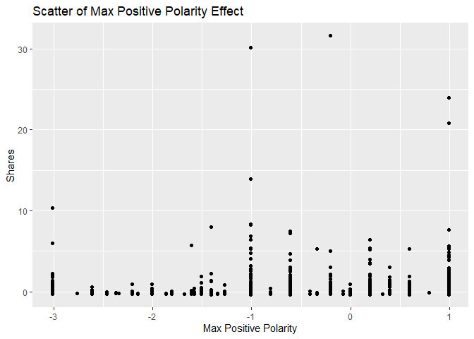

News Popularity Thursday Data
================
Shuang Du
10/16/2020

## Load Libraries

``` r
library(readxl);
library(tidyverse);
library(caret);
library(modelr);
library(rpart);
library(kableExtra);
```

## Read in Data

``` r
getData <- function(day) {

  newsPopData <- read_csv("../../raw_data/OnlineNewsPopularity.csv")
  
  if (day == 'monday') {
    newsPopData <- newsPopData %>% filter(weekday_is_monday == 1)
  } else if(day == 'tuesday') {
    newsPopData <- newsPopData %>% filter(weekday_is_tuesday == 1)
  } else if(day == 'wednesday') {
    newsPopData <- newsPopData %>% filter(weekday_is_wednesday == 1)
  } else if(day == 'thursday') {
    newsPopData <- newsPopData %>% filter(weekday_is_thursday == 1)
  } else if(day == 'friday') {
    newsPopData <- newsPopData %>% filter(weekday_is_friday == 1)
  } else if(day == 'saturday') {
    newsPopData <- newsPopData %>% filter(weekday_is_saturday == 1)
  } else if(day == 'sunday') {
    newsPopData <- newsPopData %>% filter(weekday_is_sunday == 1)
  } else {
    stop("Invalid date")
  }
  return(newsPopData)
}

newsPopData <- getData(params$day)
```

## Set Aside Training Data

``` r
set.seed(92)
trainIndex <- createDataPartition(newsPopData$shares, 
                                  p = 0.7, list = FALSE)

newsPopTrain <- newsPopData[as.vector(trainIndex),];
newsPopTest <- newsPopData[-as.vector(trainIndex),];
```

## Center and Scale

``` r
preProcValues <- preProcess(newsPopTrain, method = c("center", "scale"))
newsPopTrain <- predict(preProcValues, newsPopTrain) 
newsPopTest <- predict(preProcValues, newsPopTest)
```

## Summary of a Few Variables

The plots below show a histogram of the number of shares for the given
day. Scatter plots on the effect of max positive polarity, article time
delta and number of videos in the article are also included.

As expected the histogram has a strong right tail, as seem by the
summary stats which show a very high maximum and a median severals
orders of magnitude lower. This is expected for because of the “viral”
nature of online popularity.

``` r
summary(newsPopTrain$shares)
```

    ##     Min.  1st Qu.   Median     Mean  3rd Qu.     Max. 
    ## -0.33841 -0.24242 -0.18913  0.00000 -0.06071 31.59327

``` r
g0 <- ggplot(newsPopTrain, aes(x=shares))
g0 + geom_histogram(binwidth = 0.5) + ggtitle('Histogram for Number of Shares') + ylab('Number of Shares') + xlab('Shares')
```

<!-- -->

``` r
summary(newsPopTrain$max_positive_polarity)
```

    ##    Min. 1st Qu.  Median    Mean 3rd Qu.    Max. 
    ## -3.0111 -0.6089  0.1919  0.0000  0.9926  0.9926

``` r
g1 <- ggplot(newsPopTrain, aes(x = max_positive_polarity, y = shares )) 
g1 + geom_point() + ggtitle('Scatter of Max Positive Polarity Effect') + ylab('Shares') + xlab('Max Positive Polarity')
```

<!-- -->

``` r
summary(newsPopTrain$timedelta)
```

    ##     Min.  1st Qu.   Median     Mean  3rd Qu.     Max. 
    ## -1.59613 -0.88020 -0.09918  0.00000  0.87709  1.72319

``` r
g2 <- ggplot(newsPopTrain, aes(x = timedelta, y = shares )) 
g2 + geom_point() + ggtitle('Scatter of Article Age Effect') + ylab('Shares') + xlab('Time Delta')
```

<!-- -->

``` r
summary(newsPopTrain$num_videos)
```

    ##     Min.  1st Qu.   Median     Mean  3rd Qu.     Max. 
    ## -0.30927 -0.30927 -0.30927  0.00000 -0.04485 19.25809

``` r
g3 <- ggplot(newsPopTrain, aes(x = num_videos, y = shares )) 
g3 + geom_point() + ggtitle('Scatter of Videos Number Effect') + ylab('Shares') + xlab('Number of Videos')
```

<!-- -->

## Modeling

### Standard Tree Based Model (no ensemble)

The type of model being fitted here is a decision tree. The tree splits
are based on minimizing the residual sum of squares for each region.

``` r
rpartFit <- train(shares ~ timedelta + n_tokens_title + n_tokens_content + n_unique_tokens + n_non_stop_words + n_non_stop_unique_tokens
                 + num_hrefs + num_self_hrefs + num_imgs + num_videos + average_token_length + num_keywords + data_channel_is_lifestyle +
                 data_channel_is_entertainment + data_channel_is_bus + data_channel_is_socmed + data_channel_is_tech + data_channel_is_world +
                 self_reference_min_shares + self_reference_max_shares + self_reference_avg_sharess + global_subjectivity + global_sentiment_polarity
                 + global_rate_positive_words + global_rate_negative_words + rate_positive_words + rate_negative_words + avg_positive_polarity +
                  min_positive_polarity + max_positive_polarity + avg_negative_polarity + min_negative_polarity + max_negative_polarity + title_subjectivity
                 + title_sentiment_polarity + abs_title_subjectivity + abs_title_sentiment_polarity, data = newsPopTrain,
             method = "rpart",
             trControl = trainControl(method = "cv", number = 10))
rpartFit
```

    ## CART 
    ## 
    ## 5088 samples
    ##   37 predictor
    ## 
    ## No pre-processing
    ## Resampling: Cross-Validated (10 fold) 
    ## Summary of sample sizes: 4579, 4580, 4578, 4579, 4579, 4579, ... 
    ## Resampling results across tuning parameters:
    ## 
    ##   cp           RMSE       Rsquared     MAE      
    ##   0.008924008  0.9997812  0.005453178  0.3167229
    ##   0.009819329  0.9943223  0.006133413  0.3161982
    ##   0.049361931  0.9780586  0.010184384  0.3147656
    ## 
    ## RMSE was used to select the optimal model using the smallest value.
    ## The final value used for the model was cp = 0.04936193.

``` r
# create the prediction
pred1 <- predict(rpartFit, newdata = newsPopTest)

# compare the prediction vs the actual
resample1 <- postResample(pred1, obs = newsPopTest$shares)
resample1
```

    ##      RMSE  Rsquared       MAE 
    ## 1.0321475        NA 0.3206665

### Boosted Tree Based Model

A boosted tree is an ensemble method which slowly approaches the tree
prediction which would result from the original data. In general, an
ensemble model model will have a lower RSME than a single tree model.

``` r
gbmFit <- train(shares ~ timedelta + n_tokens_title + n_tokens_content + n_unique_tokens + n_non_stop_words + n_non_stop_unique_tokens
                 + num_hrefs + num_self_hrefs + num_imgs + num_videos + average_token_length + num_keywords + data_channel_is_lifestyle +
                 data_channel_is_entertainment + data_channel_is_bus + data_channel_is_socmed + data_channel_is_tech + data_channel_is_world +
                 self_reference_min_shares + self_reference_max_shares + self_reference_avg_sharess + global_subjectivity + global_sentiment_polarity
                 + global_rate_positive_words + global_rate_negative_words + rate_positive_words + rate_negative_words + avg_positive_polarity +
                  min_positive_polarity + max_positive_polarity + avg_negative_polarity + min_negative_polarity + max_negative_polarity + title_subjectivity
                 + title_sentiment_polarity + abs_title_subjectivity + abs_title_sentiment_polarity, data = newsPopTrain,
             method = "gbm",
             trControl = trainControl(method = "cv", number = 10))
```

    ## Iter   TrainDeviance   ValidDeviance   StepSize   Improve
    ##      1        1.0430             nan     0.1000   -0.0005
    ##      2        1.0403             nan     0.1000   -0.0003
    ##      3        1.0369             nan     0.1000    0.0000
    ##      4        1.0337             nan     0.1000    0.0032
    ##      5        1.0315             nan     0.1000    0.0014
    ##      6        1.0297             nan     0.1000    0.0009
    ##      7        1.0282             nan     0.1000   -0.0008
    ##      8        1.0268             nan     0.1000    0.0001
    ##      9        1.0253             nan     0.1000   -0.0007
    ##     10        1.0246             nan     0.1000    0.0004
    ##     20        1.0126             nan     0.1000   -0.0009
    ##     40        1.0000             nan     0.1000   -0.0006
    ##     60        0.9911             nan     0.1000   -0.0035
    ##     80        0.9840             nan     0.1000   -0.0001
    ##    100        0.9775             nan     0.1000   -0.0004
    ##    120        0.9704             nan     0.1000   -0.0009
    ##    140        0.9660             nan     0.1000    0.0001
    ##    150        0.9633             nan     0.1000   -0.0013
    ## 
    ## Iter   TrainDeviance   ValidDeviance   StepSize   Improve
    ##      1        1.0388             nan     0.1000   -0.0017
    ##      2        1.0349             nan     0.1000    0.0006
    ##      3        1.0151             nan     0.1000    0.0028
    ##      4        1.0107             nan     0.1000    0.0004
    ##      5        1.0083             nan     0.1000    0.0003
    ##      6        1.0048             nan     0.1000   -0.0007
    ##      7        1.0015             nan     0.1000    0.0006
    ##      8        0.9988             nan     0.1000    0.0002
    ##      9        0.9864             nan     0.1000   -0.0032
    ##     10        0.9786             nan     0.1000    0.0013
    ##     20        0.9361             nan     0.1000   -0.0019
    ##     40        0.8763             nan     0.1000   -0.0020
    ##     60        0.8405             nan     0.1000   -0.0007
    ##     80        0.8194             nan     0.1000   -0.0017
    ##    100        0.8016             nan     0.1000   -0.0014
    ##    120        0.7796             nan     0.1000   -0.0007
    ##    140        0.7652             nan     0.1000   -0.0023
    ##    150        0.7577             nan     0.1000   -0.0007
    ## 
    ## Iter   TrainDeviance   ValidDeviance   StepSize   Improve
    ##      1        1.0431             nan     0.1000    0.0025
    ##      2        1.0340             nan     0.1000    0.0041
    ##      3        1.0184             nan     0.1000   -0.0028
    ##      4        1.0072             nan     0.1000   -0.0009
    ##      5        1.0013             nan     0.1000    0.0022
    ##      6        0.9956             nan     0.1000    0.0003
    ##      7        0.9866             nan     0.1000   -0.0010
    ##      8        0.9664             nan     0.1000   -0.0035
    ##      9        0.9611             nan     0.1000   -0.0023
    ##     10        0.9517             nan     0.1000   -0.0023
    ##     20        0.8950             nan     0.1000   -0.0022
    ##     40        0.8260             nan     0.1000   -0.0036
    ##     60        0.7910             nan     0.1000   -0.0005
    ##     80        0.7412             nan     0.1000   -0.0002
    ##    100        0.7155             nan     0.1000   -0.0022
    ##    120        0.6816             nan     0.1000   -0.0025
    ##    140        0.6553             nan     0.1000   -0.0042
    ##    150        0.6438             nan     0.1000   -0.0015
    ## 
    ## Iter   TrainDeviance   ValidDeviance   StepSize   Improve
    ##      1        0.9875             nan     0.1000    0.0010
    ##      2        0.9844             nan     0.1000    0.0006
    ##      3        0.9829             nan     0.1000    0.0013
    ##      4        0.9814             nan     0.1000    0.0009
    ##      5        0.9783             nan     0.1000   -0.0011
    ##      6        0.9771             nan     0.1000   -0.0006
    ##      7        0.9762             nan     0.1000    0.0002
    ##      8        0.9749             nan     0.1000    0.0008
    ##      9        0.9741             nan     0.1000   -0.0002
    ##     10        0.9725             nan     0.1000    0.0005
    ##     20        0.9606             nan     0.1000   -0.0005
    ##     40        0.9504             nan     0.1000   -0.0010
    ##     60        0.9416             nan     0.1000   -0.0003
    ##     80        0.9348             nan     0.1000   -0.0001
    ##    100        0.9298             nan     0.1000    0.0001
    ##    120        0.9244             nan     0.1000   -0.0001
    ##    140        0.9186             nan     0.1000   -0.0011
    ##    150        0.9169             nan     0.1000    0.0009
    ## 
    ## Iter   TrainDeviance   ValidDeviance   StepSize   Improve
    ##      1        0.9867             nan     0.1000    0.0021
    ##      2        0.9797             nan     0.1000   -0.0007
    ##      3        0.9717             nan     0.1000   -0.0002
    ##      4        0.9634             nan     0.1000    0.0008
    ##      5        0.9586             nan     0.1000   -0.0029
    ##      6        0.9573             nan     0.1000   -0.0000
    ##      7        0.9442             nan     0.1000   -0.0033
    ##      8        0.9424             nan     0.1000    0.0009
    ##      9        0.9372             nan     0.1000   -0.0041
    ##     10        0.9324             nan     0.1000   -0.0006
    ##     20        0.9063             nan     0.1000    0.0005
    ##     40        0.8400             nan     0.1000   -0.0016
    ##     60        0.8106             nan     0.1000    0.0014
    ##     80        0.7840             nan     0.1000    0.0001
    ##    100        0.7615             nan     0.1000   -0.0010
    ##    120        0.7402             nan     0.1000   -0.0017
    ##    140        0.7182             nan     0.1000   -0.0015
    ##    150        0.7133             nan     0.1000   -0.0026
    ## 
    ## Iter   TrainDeviance   ValidDeviance   StepSize   Improve
    ##      1        0.9764             nan     0.1000    0.0110
    ##      2        0.9736             nan     0.1000    0.0030
    ##      3        0.9686             nan     0.1000    0.0013
    ##      4        0.9583             nan     0.1000    0.0042
    ##      5        0.9453             nan     0.1000   -0.0025
    ##      6        0.9370             nan     0.1000   -0.0001
    ##      7        0.9240             nan     0.1000   -0.0030
    ##      8        0.9218             nan     0.1000   -0.0007
    ##      9        0.9201             nan     0.1000   -0.0006
    ##     10        0.9133             nan     0.1000    0.0017
    ##     20        0.8592             nan     0.1000    0.0001
    ##     40        0.7731             nan     0.1000   -0.0016
    ##     60        0.7343             nan     0.1000   -0.0020
    ##     80        0.6870             nan     0.1000   -0.0013
    ##    100        0.6547             nan     0.1000   -0.0010
    ##    120        0.6333             nan     0.1000   -0.0006
    ##    140        0.6021             nan     0.1000   -0.0002
    ##    150        0.5938             nan     0.1000    0.0003
    ## 
    ## Iter   TrainDeviance   ValidDeviance   StepSize   Improve
    ##      1        1.0574             nan     0.1000    0.0015
    ##      2        1.0543             nan     0.1000    0.0016
    ##      3        1.0522             nan     0.1000    0.0014
    ##      4        1.0498             nan     0.1000    0.0006
    ##      5        1.0461             nan     0.1000    0.0030
    ##      6        1.0440             nan     0.1000    0.0000
    ##      7        1.0413             nan     0.1000    0.0024
    ##      8        1.0401             nan     0.1000   -0.0002
    ##      9        1.0386             nan     0.1000    0.0003
    ##     10        1.0379             nan     0.1000   -0.0003
    ##     20        1.0252             nan     0.1000    0.0005
    ##     40        1.0126             nan     0.1000    0.0002
    ##     60        1.0024             nan     0.1000   -0.0001
    ##     80        0.9940             nan     0.1000    0.0001
    ##    100        0.9888             nan     0.1000   -0.0015
    ##    120        0.9824             nan     0.1000   -0.0003
    ##    140        0.9775             nan     0.1000   -0.0010
    ##    150        0.9747             nan     0.1000    0.0000
    ## 
    ## Iter   TrainDeviance   ValidDeviance   StepSize   Improve
    ##      1        1.0497             nan     0.1000    0.0002
    ##      2        1.0469             nan     0.1000    0.0013
    ##      3        1.0399             nan     0.1000    0.0029
    ##      4        1.0230             nan     0.1000   -0.0014
    ##      5        1.0172             nan     0.1000   -0.0014
    ##      6        1.0048             nan     0.1000   -0.0058
    ##      7        0.9964             nan     0.1000   -0.0051
    ##      8        0.9862             nan     0.1000   -0.0032
    ##      9        0.9830             nan     0.1000   -0.0008
    ##     10        0.9816             nan     0.1000    0.0001
    ##     20        0.9588             nan     0.1000    0.0001
    ##     40        0.9071             nan     0.1000    0.0000
    ##     60        0.8792             nan     0.1000    0.0005
    ##     80        0.8591             nan     0.1000   -0.0007
    ##    100        0.8472             nan     0.1000   -0.0003
    ##    120        0.8252             nan     0.1000   -0.0012
    ##    140        0.8123             nan     0.1000   -0.0009
    ##    150        0.8056             nan     0.1000   -0.0004
    ## 
    ## Iter   TrainDeviance   ValidDeviance   StepSize   Improve
    ##      1        1.0477             nan     0.1000   -0.0020
    ##      2        1.0313             nan     0.1000   -0.0006
    ##      3        1.0232             nan     0.1000   -0.0011
    ##      4        1.0195             nan     0.1000   -0.0001
    ##      5        1.0178             nan     0.1000    0.0004
    ##      6        1.0080             nan     0.1000   -0.0014
    ##      7        1.0016             nan     0.1000   -0.0001
    ##      8        0.9868             nan     0.1000   -0.0017
    ##      9        0.9761             nan     0.1000   -0.0026
    ##     10        0.9702             nan     0.1000   -0.0015
    ##     20        0.9324             nan     0.1000   -0.0015
    ##     40        0.8587             nan     0.1000   -0.0015
    ##     60        0.8115             nan     0.1000   -0.0016
    ##     80        0.7843             nan     0.1000   -0.0009
    ##    100        0.7472             nan     0.1000   -0.0013
    ##    120        0.7172             nan     0.1000   -0.0013
    ##    140        0.6960             nan     0.1000   -0.0006
    ##    150        0.6872             nan     0.1000   -0.0006
    ## 
    ## Iter   TrainDeviance   ValidDeviance   StepSize   Improve
    ##      1        1.0861             nan     0.1000    0.0021
    ##      2        1.0831             nan     0.1000    0.0028
    ##      3        1.0798             nan     0.1000    0.0023
    ##      4        1.0781             nan     0.1000    0.0014
    ##      5        1.0755             nan     0.1000    0.0015
    ##      6        1.0729             nan     0.1000   -0.0008
    ##      7        1.0708             nan     0.1000    0.0003
    ##      8        1.0695             nan     0.1000    0.0003
    ##      9        1.0682             nan     0.1000    0.0006
    ##     10        1.0668             nan     0.1000   -0.0003
    ##     20        1.0555             nan     0.1000   -0.0015
    ##     40        1.0411             nan     0.1000   -0.0008
    ##     60        1.0338             nan     0.1000   -0.0007
    ##     80        1.0273             nan     0.1000    0.0006
    ##    100        1.0202             nan     0.1000   -0.0015
    ##    120        1.0143             nan     0.1000   -0.0010
    ##    140        1.0096             nan     0.1000   -0.0013
    ##    150        1.0072             nan     0.1000    0.0002
    ## 
    ## Iter   TrainDeviance   ValidDeviance   StepSize   Improve
    ##      1        1.0804             nan     0.1000    0.0026
    ##      2        1.0730             nan     0.1000    0.0007
    ##      3        1.0692             nan     0.1000   -0.0005
    ##      4        1.0620             nan     0.1000    0.0046
    ##      5        1.0556             nan     0.1000   -0.0012
    ##      6        1.0518             nan     0.1000    0.0006
    ##      7        1.0489             nan     0.1000    0.0009
    ##      8        1.0434             nan     0.1000   -0.0011
    ##      9        1.0396             nan     0.1000   -0.0000
    ##     10        1.0336             nan     0.1000   -0.0020
    ##     20        0.9880             nan     0.1000   -0.0032
    ##     40        0.9366             nan     0.1000   -0.0005
    ##     60        0.9052             nan     0.1000   -0.0015
    ##     80        0.8827             nan     0.1000   -0.0008
    ##    100        0.8659             nan     0.1000   -0.0012
    ##    120        0.8482             nan     0.1000    0.0000
    ##    140        0.8248             nan     0.1000   -0.0018
    ##    150        0.8144             nan     0.1000   -0.0023
    ## 
    ## Iter   TrainDeviance   ValidDeviance   StepSize   Improve
    ##      1        1.0780             nan     0.1000    0.0049
    ##      2        1.0630             nan     0.1000   -0.0021
    ##      3        1.0454             nan     0.1000    0.0002
    ##      4        1.0378             nan     0.1000    0.0002
    ##      5        1.0266             nan     0.1000    0.0013
    ##      6        1.0218             nan     0.1000    0.0001
    ##      7        1.0192             nan     0.1000   -0.0001
    ##      8        1.0168             nan     0.1000   -0.0005
    ##      9        1.0096             nan     0.1000   -0.0009
    ##     10        0.9979             nan     0.1000   -0.0032
    ##     20        0.9552             nan     0.1000   -0.0027
    ##     40        0.8882             nan     0.1000   -0.0001
    ##     60        0.8194             nan     0.1000   -0.0004
    ##     80        0.7717             nan     0.1000   -0.0028
    ##    100        0.7408             nan     0.1000   -0.0039
    ##    120        0.7080             nan     0.1000   -0.0004
    ##    140        0.6848             nan     0.1000   -0.0018
    ##    150        0.6703             nan     0.1000   -0.0014
    ## 
    ## Iter   TrainDeviance   ValidDeviance   StepSize   Improve
    ##      1        1.0706             nan     0.1000   -0.0006
    ##      2        1.0663             nan     0.1000    0.0032
    ##      3        1.0648             nan     0.1000    0.0008
    ##      4        1.0633             nan     0.1000   -0.0001
    ##      5        1.0617             nan     0.1000   -0.0019
    ##      6        1.0598             nan     0.1000    0.0005
    ##      7        1.0575             nan     0.1000    0.0007
    ##      8        1.0552             nan     0.1000    0.0024
    ##      9        1.0532             nan     0.1000   -0.0002
    ##     10        1.0524             nan     0.1000    0.0002
    ##     20        1.0398             nan     0.1000   -0.0011
    ##     40        1.0265             nan     0.1000   -0.0013
    ##     60        1.0158             nan     0.1000   -0.0010
    ##     80        1.0081             nan     0.1000   -0.0033
    ##    100        1.0010             nan     0.1000   -0.0002
    ##    120        0.9936             nan     0.1000   -0.0018
    ##    140        0.9876             nan     0.1000   -0.0010
    ##    150        0.9838             nan     0.1000   -0.0001
    ## 
    ## Iter   TrainDeviance   ValidDeviance   StepSize   Improve
    ##      1        1.0676             nan     0.1000    0.0009
    ##      2        1.0498             nan     0.1000   -0.0008
    ##      3        1.0360             nan     0.1000    0.0004
    ##      4        1.0294             nan     0.1000   -0.0012
    ##      5        1.0237             nan     0.1000   -0.0025
    ##      6        1.0211             nan     0.1000   -0.0007
    ##      7        1.0140             nan     0.1000   -0.0003
    ##      8        1.0116             nan     0.1000   -0.0008
    ##      9        1.0064             nan     0.1000   -0.0020
    ##     10        1.0054             nan     0.1000    0.0006
    ##     20        0.9667             nan     0.1000   -0.0008
    ##     40        0.9302             nan     0.1000   -0.0005
    ##     60        0.9052             nan     0.1000    0.0000
    ##     80        0.8716             nan     0.1000   -0.0001
    ##    100        0.8544             nan     0.1000   -0.0030
    ##    120        0.8344             nan     0.1000   -0.0004
    ##    140        0.8143             nan     0.1000   -0.0005
    ##    150        0.8075             nan     0.1000    0.0002
    ## 
    ## Iter   TrainDeviance   ValidDeviance   StepSize   Improve
    ##      1        1.0593             nan     0.1000    0.0047
    ##      2        1.0509             nan     0.1000    0.0005
    ##      3        1.0422             nan     0.1000    0.0012
    ##      4        1.0393             nan     0.1000    0.0010
    ##      5        1.0265             nan     0.1000   -0.0027
    ##      6        1.0232             nan     0.1000    0.0012
    ##      7        1.0053             nan     0.1000   -0.0035
    ##      8        1.0023             nan     0.1000    0.0005
    ##      9        0.9923             nan     0.1000   -0.0043
    ##     10        0.9883             nan     0.1000   -0.0021
    ##     20        0.9373             nan     0.1000   -0.0042
    ##     40        0.8872             nan     0.1000   -0.0001
    ##     60        0.8581             nan     0.1000   -0.0031
    ##     80        0.8222             nan     0.1000    0.0002
    ##    100        0.7835             nan     0.1000   -0.0016
    ##    120        0.7460             nan     0.1000   -0.0015
    ##    140        0.7140             nan     0.1000   -0.0016
    ##    150        0.7025             nan     0.1000   -0.0021
    ## 
    ## Iter   TrainDeviance   ValidDeviance   StepSize   Improve
    ##      1        0.8459             nan     0.1000   -0.0009
    ##      2        0.8428             nan     0.1000    0.0019
    ##      3        0.8401             nan     0.1000    0.0014
    ##      4        0.8391             nan     0.1000   -0.0004
    ##      5        0.8375             nan     0.1000   -0.0003
    ##      6        0.8360             nan     0.1000    0.0008
    ##      7        0.8351             nan     0.1000    0.0004
    ##      8        0.8337             nan     0.1000    0.0008
    ##      9        0.8325             nan     0.1000    0.0011
    ##     10        0.8318             nan     0.1000    0.0002
    ##     20        0.8234             nan     0.1000    0.0003
    ##     40        0.8132             nan     0.1000    0.0007
    ##     60        0.8056             nan     0.1000   -0.0014
    ##     80        0.8017             nan     0.1000    0.0002
    ##    100        0.7980             nan     0.1000   -0.0008
    ##    120        0.7957             nan     0.1000   -0.0021
    ##    140        0.7918             nan     0.1000   -0.0003
    ##    150        0.7898             nan     0.1000   -0.0004
    ## 
    ## Iter   TrainDeviance   ValidDeviance   StepSize   Improve
    ##      1        0.8410             nan     0.1000    0.0004
    ##      2        0.8385             nan     0.1000    0.0015
    ##      3        0.8334             nan     0.1000   -0.0002
    ##      4        0.8282             nan     0.1000    0.0009
    ##      5        0.8242             nan     0.1000    0.0008
    ##      6        0.8189             nan     0.1000    0.0004
    ##      7        0.8146             nan     0.1000   -0.0002
    ##      8        0.8131             nan     0.1000    0.0004
    ##      9        0.8090             nan     0.1000   -0.0008
    ##     10        0.8047             nan     0.1000   -0.0014
    ##     20        0.7830             nan     0.1000    0.0002
    ##     40        0.7543             nan     0.1000   -0.0002
    ##     60        0.7284             nan     0.1000   -0.0023
    ##     80        0.7119             nan     0.1000   -0.0007
    ##    100        0.7032             nan     0.1000   -0.0019
    ##    120        0.6923             nan     0.1000   -0.0007
    ##    140        0.6773             nan     0.1000   -0.0003
    ##    150        0.6733             nan     0.1000   -0.0013
    ## 
    ## Iter   TrainDeviance   ValidDeviance   StepSize   Improve
    ##      1        0.8380             nan     0.1000    0.0034
    ##      2        0.8337             nan     0.1000    0.0010
    ##      3        0.8314             nan     0.1000    0.0011
    ##      4        0.8284             nan     0.1000    0.0010
    ##      5        0.8253             nan     0.1000    0.0000
    ##      6        0.8195             nan     0.1000   -0.0006
    ##      7        0.8138             nan     0.1000    0.0006
    ##      8        0.8112             nan     0.1000   -0.0011
    ##      9        0.8044             nan     0.1000   -0.0005
    ##     10        0.8024             nan     0.1000    0.0005
    ##     20        0.7505             nan     0.1000   -0.0010
    ##     40        0.7064             nan     0.1000   -0.0007
    ##     60        0.6802             nan     0.1000    0.0013
    ##     80        0.6420             nan     0.1000   -0.0009
    ##    100        0.6123             nan     0.1000   -0.0025
    ##    120        0.5840             nan     0.1000   -0.0014
    ##    140        0.5689             nan     0.1000   -0.0001
    ##    150        0.5590             nan     0.1000   -0.0003
    ## 
    ## Iter   TrainDeviance   ValidDeviance   StepSize   Improve
    ##      1        0.9503             nan     0.1000    0.0022
    ##      2        0.9458             nan     0.1000    0.0025
    ##      3        0.9440             nan     0.1000    0.0018
    ##      4        0.9414             nan     0.1000    0.0003
    ##      5        0.9383             nan     0.1000    0.0016
    ##      6        0.9345             nan     0.1000   -0.0018
    ##      7        0.9325             nan     0.1000    0.0005
    ##      8        0.9321             nan     0.1000   -0.0003
    ##      9        0.9313             nan     0.1000   -0.0000
    ##     10        0.9297             nan     0.1000    0.0001
    ##     20        0.9191             nan     0.1000   -0.0006
    ##     40        0.9063             nan     0.1000   -0.0023
    ##     60        0.8962             nan     0.1000   -0.0002
    ##     80        0.8889             nan     0.1000    0.0000
    ##    100        0.8828             nan     0.1000   -0.0016
    ##    120        0.8777             nan     0.1000   -0.0019
    ##    140        0.8709             nan     0.1000   -0.0006
    ##    150        0.8682             nan     0.1000   -0.0010
    ## 
    ## Iter   TrainDeviance   ValidDeviance   StepSize   Improve
    ##      1        0.9441             nan     0.1000    0.0021
    ##      2        0.9335             nan     0.1000    0.0012
    ##      3        0.9283             nan     0.1000    0.0020
    ##      4        0.9226             nan     0.1000    0.0009
    ##      5        0.9152             nan     0.1000   -0.0001
    ##      6        0.9126             nan     0.1000   -0.0012
    ##      7        0.9069             nan     0.1000   -0.0018
    ##      8        0.9020             nan     0.1000    0.0003
    ##      9        0.8999             nan     0.1000   -0.0003
    ##     10        0.8910             nan     0.1000    0.0004
    ##     20        0.8568             nan     0.1000    0.0004
    ##     40        0.8099             nan     0.1000   -0.0012
    ##     60        0.7878             nan     0.1000   -0.0020
    ##     80        0.7592             nan     0.1000   -0.0008
    ##    100        0.7450             nan     0.1000   -0.0014
    ##    120        0.7294             nan     0.1000   -0.0011
    ##    140        0.7178             nan     0.1000    0.0005
    ##    150        0.7085             nan     0.1000   -0.0026
    ## 
    ## Iter   TrainDeviance   ValidDeviance   StepSize   Improve
    ##      1        0.9414             nan     0.1000    0.0024
    ##      2        0.9373             nan     0.1000   -0.0000
    ##      3        0.9272             nan     0.1000   -0.0006
    ##      4        0.9201             nan     0.1000    0.0002
    ##      5        0.9141             nan     0.1000   -0.0019
    ##      6        0.9032             nan     0.1000   -0.0013
    ##      7        0.8977             nan     0.1000   -0.0002
    ##      8        0.8895             nan     0.1000   -0.0008
    ##      9        0.8837             nan     0.1000   -0.0011
    ##     10        0.8807             nan     0.1000    0.0009
    ##     20        0.8355             nan     0.1000   -0.0028
    ##     40        0.7533             nan     0.1000    0.0002
    ##     60        0.7087             nan     0.1000   -0.0019
    ##     80        0.6780             nan     0.1000   -0.0032
    ##    100        0.6466             nan     0.1000   -0.0013
    ##    120        0.6251             nan     0.1000   -0.0009
    ##    140        0.6069             nan     0.1000   -0.0021
    ##    150        0.5968             nan     0.1000   -0.0022
    ## 
    ## Iter   TrainDeviance   ValidDeviance   StepSize   Improve
    ##      1        0.8280             nan     0.1000    0.0007
    ##      2        0.8264             nan     0.1000    0.0009
    ##      3        0.8239             nan     0.1000    0.0010
    ##      4        0.8217             nan     0.1000   -0.0008
    ##      5        0.8191             nan     0.1000    0.0011
    ##      6        0.8165             nan     0.1000   -0.0002
    ##      7        0.8145             nan     0.1000    0.0016
    ##      8        0.8120             nan     0.1000    0.0002
    ##      9        0.8107             nan     0.1000    0.0006
    ##     10        0.8094             nan     0.1000   -0.0020
    ##     20        0.7997             nan     0.1000    0.0000
    ##     40        0.7880             nan     0.1000   -0.0006
    ##     60        0.7797             nan     0.1000   -0.0007
    ##     80        0.7714             nan     0.1000   -0.0001
    ##    100        0.7655             nan     0.1000   -0.0003
    ##    120        0.7612             nan     0.1000   -0.0002
    ##    140        0.7554             nan     0.1000   -0.0018
    ##    150        0.7525             nan     0.1000   -0.0045
    ## 
    ## Iter   TrainDeviance   ValidDeviance   StepSize   Improve
    ##      1        0.8238             nan     0.1000    0.0040
    ##      2        0.8203             nan     0.1000    0.0018
    ##      3        0.8151             nan     0.1000    0.0022
    ##      4        0.8115             nan     0.1000   -0.0003
    ##      5        0.8095             nan     0.1000    0.0016
    ##      6        0.8027             nan     0.1000   -0.0018
    ##      7        0.7938             nan     0.1000   -0.0021
    ##      8        0.7914             nan     0.1000    0.0009
    ##      9        0.7845             nan     0.1000   -0.0004
    ##     10        0.7795             nan     0.1000   -0.0025
    ##     20        0.7550             nan     0.1000    0.0000
    ##     40        0.7294             nan     0.1000   -0.0006
    ##     60        0.7075             nan     0.1000   -0.0004
    ##     80        0.6932             nan     0.1000   -0.0010
    ##    100        0.6737             nan     0.1000    0.0006
    ##    120        0.6645             nan     0.1000   -0.0001
    ##    140        0.6414             nan     0.1000   -0.0008
    ##    150        0.6354             nan     0.1000   -0.0016
    ## 
    ## Iter   TrainDeviance   ValidDeviance   StepSize   Improve
    ##      1        0.8217             nan     0.1000    0.0007
    ##      2        0.8175             nan     0.1000   -0.0004
    ##      3        0.8104             nan     0.1000    0.0019
    ##      4        0.8003             nan     0.1000    0.0029
    ##      5        0.7959             nan     0.1000   -0.0004
    ##      6        0.7902             nan     0.1000   -0.0010
    ##      7        0.7789             nan     0.1000   -0.0001
    ##      8        0.7762             nan     0.1000    0.0015
    ##      9        0.7684             nan     0.1000    0.0021
    ##     10        0.7625             nan     0.1000    0.0003
    ##     20        0.7374             nan     0.1000   -0.0024
    ##     40        0.6884             nan     0.1000   -0.0022
    ##     60        0.6570             nan     0.1000   -0.0044
    ##     80        0.6352             nan     0.1000   -0.0015
    ##    100        0.6105             nan     0.1000   -0.0022
    ##    120        0.5882             nan     0.1000   -0.0025
    ##    140        0.5697             nan     0.1000   -0.0010
    ##    150        0.5619             nan     0.1000   -0.0031
    ## 
    ## Iter   TrainDeviance   ValidDeviance   StepSize   Improve
    ##      1        1.0883             nan     0.1000    0.0003
    ##      2        1.0860             nan     0.1000   -0.0011
    ##      3        1.0828             nan     0.1000    0.0033
    ##      4        1.0795             nan     0.1000    0.0011
    ##      5        1.0776             nan     0.1000    0.0008
    ##      6        1.0753             nan     0.1000    0.0014
    ##      7        1.0728             nan     0.1000   -0.0003
    ##      8        1.0707             nan     0.1000   -0.0005
    ##      9        1.0694             nan     0.1000   -0.0008
    ##     10        1.0681             nan     0.1000    0.0004
    ##     20        1.0573             nan     0.1000   -0.0005
    ##     40        1.0445             nan     0.1000    0.0009
    ##     60        1.0349             nan     0.1000   -0.0013
    ##     80        1.0262             nan     0.1000   -0.0033
    ##    100        1.0193             nan     0.1000   -0.0011
    ##    120        1.0134             nan     0.1000   -0.0020
    ##    140        1.0079             nan     0.1000   -0.0001
    ##    150        1.0055             nan     0.1000    0.0003
    ## 
    ## Iter   TrainDeviance   ValidDeviance   StepSize   Improve
    ##      1        1.0827             nan     0.1000    0.0031
    ##      2        1.0736             nan     0.1000    0.0051
    ##      3        1.0694             nan     0.1000    0.0021
    ##      4        1.0637             nan     0.1000    0.0017
    ##      5        1.0591             nan     0.1000   -0.0011
    ##      6        1.0392             nan     0.1000   -0.0038
    ##      7        1.0366             nan     0.1000   -0.0009
    ##      8        1.0337             nan     0.1000   -0.0012
    ##      9        1.0319             nan     0.1000   -0.0006
    ##     10        1.0276             nan     0.1000   -0.0011
    ##     20        0.9922             nan     0.1000   -0.0019
    ##     40        0.9464             nan     0.1000   -0.0008
    ##     60        0.9087             nan     0.1000   -0.0017
    ##     80        0.8788             nan     0.1000   -0.0013
    ##    100        0.8502             nan     0.1000   -0.0010
    ##    120        0.8366             nan     0.1000   -0.0007
    ##    140        0.8243             nan     0.1000   -0.0006
    ##    150        0.8137             nan     0.1000   -0.0019
    ## 
    ## Iter   TrainDeviance   ValidDeviance   StepSize   Improve
    ##      1        1.0813             nan     0.1000    0.0028
    ##      2        1.0644             nan     0.1000   -0.0005
    ##      3        1.0616             nan     0.1000   -0.0001
    ##      4        1.0527             nan     0.1000    0.0022
    ##      5        1.0400             nan     0.1000   -0.0004
    ##      6        1.0347             nan     0.1000   -0.0010
    ##      7        1.0330             nan     0.1000    0.0001
    ##      8        1.0294             nan     0.1000    0.0001
    ##      9        1.0212             nan     0.1000    0.0003
    ##     10        1.0128             nan     0.1000    0.0002
    ##     20        0.9650             nan     0.1000   -0.0030
    ##     40        0.9050             nan     0.1000    0.0007
    ##     60        0.8641             nan     0.1000   -0.0023
    ##     80        0.8200             nan     0.1000   -0.0018
    ##    100        0.7763             nan     0.1000   -0.0013
    ##    120        0.7460             nan     0.1000    0.0002
    ##    140        0.7154             nan     0.1000   -0.0026
    ##    150        0.6993             nan     0.1000   -0.0004
    ## 
    ## Iter   TrainDeviance   ValidDeviance   StepSize   Improve
    ##      1        1.0126             nan     0.1000    0.0021
    ##      2        1.0104             nan     0.1000    0.0007
    ##      3        1.0083             nan     0.1000    0.0011
    ##      4        1.0066             nan     0.1000    0.0005
    ##      5        1.0033             nan     0.1000    0.0017
    ##      6        1.0017             nan     0.1000    0.0002
    ##      7        1.0002             nan     0.1000   -0.0002
    ##      8        0.9994             nan     0.1000   -0.0003
    ##      9        0.9975             nan     0.1000    0.0010
    ##     10        0.9951             nan     0.1000   -0.0023
    ##     20        0.9855             nan     0.1000   -0.0012
    ##     40        0.9712             nan     0.1000    0.0002
    ##     60        0.9639             nan     0.1000   -0.0011
    ##     80        0.9573             nan     0.1000   -0.0018
    ##    100        0.9511             nan     0.1000   -0.0008
    ##    120        0.9442             nan     0.1000    0.0003
    ##    140        0.9406             nan     0.1000   -0.0004
    ##    150        0.9373             nan     0.1000   -0.0005
    ## 
    ## Iter   TrainDeviance   ValidDeviance   StepSize   Improve
    ##      1        1.0079             nan     0.1000    0.0015
    ##      2        0.9906             nan     0.1000    0.0001
    ##      3        0.9873             nan     0.1000    0.0004
    ##      4        0.9806             nan     0.1000   -0.0014
    ##      5        0.9678             nan     0.1000   -0.0031
    ##      6        0.9666             nan     0.1000   -0.0001
    ##      7        0.9652             nan     0.1000    0.0004
    ##      8        0.9586             nan     0.1000   -0.0009
    ##      9        0.9532             nan     0.1000   -0.0009
    ##     10        0.9510             nan     0.1000    0.0000
    ##     20        0.9152             nan     0.1000   -0.0022
    ##     40        0.8667             nan     0.1000    0.0003
    ##     60        0.8343             nan     0.1000   -0.0012
    ##     80        0.8105             nan     0.1000   -0.0052
    ##    100        0.7949             nan     0.1000   -0.0033
    ##    120        0.7840             nan     0.1000   -0.0011
    ##    140        0.7620             nan     0.1000   -0.0010
    ##    150        0.7567             nan     0.1000   -0.0002
    ## 
    ## Iter   TrainDeviance   ValidDeviance   StepSize   Improve
    ##      1        1.0110             nan     0.1000    0.0012
    ##      2        0.9937             nan     0.1000    0.0008
    ##      3        0.9913             nan     0.1000    0.0007
    ##      4        0.9812             nan     0.1000    0.0026
    ##      5        0.9753             nan     0.1000    0.0010
    ##      6        0.9691             nan     0.1000   -0.0001
    ##      7        0.9609             nan     0.1000   -0.0038
    ##      8        0.9505             nan     0.1000   -0.0010
    ##      9        0.9434             nan     0.1000   -0.0004
    ##     10        0.9385             nan     0.1000   -0.0015
    ##     20        0.8707             nan     0.1000   -0.0010
    ##     40        0.8091             nan     0.1000   -0.0023
    ##     60        0.7721             nan     0.1000   -0.0015
    ##     80        0.7362             nan     0.1000   -0.0000
    ##    100        0.7096             nan     0.1000   -0.0007
    ##    120        0.6773             nan     0.1000   -0.0010
    ##    140        0.6626             nan     0.1000   -0.0028
    ##    150        0.6471             nan     0.1000   -0.0005
    ## 
    ## Iter   TrainDeviance   ValidDeviance   StepSize   Improve
    ##      1        0.9958             nan     0.1000    0.0033
    ##      2        0.9931             nan     0.1000    0.0011
    ##      3        0.9903             nan     0.1000    0.0000
    ##      4        0.9877             nan     0.1000    0.0021
    ##      5        0.9857             nan     0.1000    0.0003
    ##      6        0.9848             nan     0.1000    0.0006
    ##      7        0.9831             nan     0.1000    0.0004
    ##      8        0.9812             nan     0.1000   -0.0000
    ##      9        0.9798             nan     0.1000   -0.0002
    ##     10        0.9787             nan     0.1000    0.0007
    ##     20        0.9679             nan     0.1000    0.0002
    ##     40        0.9574             nan     0.1000   -0.0001
    ##     50        0.9532             nan     0.1000   -0.0009

``` r
gbmFit
```

    ## Stochastic Gradient Boosting 
    ## 
    ## 5088 samples
    ##   37 predictor
    ## 
    ## No pre-processing
    ## Resampling: Cross-Validated (10 fold) 
    ## Summary of sample sizes: 4581, 4579, 4578, 4579, 4578, 4579, ... 
    ## Resampling results across tuning parameters:
    ## 
    ##   interaction.depth  n.trees  RMSE       Rsquared     MAE      
    ##   1                   50      0.9156326  0.019644576  0.3139507
    ##   1                  100      0.9173713  0.021670424  0.3147344
    ##   1                  150      0.9171954  0.022322920  0.3147864
    ##   2                   50      0.9291696  0.015506855  0.3166639
    ##   2                  100      0.9421612  0.011737168  0.3211887
    ##   2                  150      0.9520626  0.011021060  0.3265811
    ##   3                   50      0.9374806  0.013653600  0.3192370
    ##   3                  100      0.9542754  0.013028878  0.3281879
    ##   3                  150      0.9680198  0.008936119  0.3361941
    ## 
    ## Tuning parameter 'shrinkage' was held constant at a value of 0.1
    ## Tuning parameter 'n.minobsinnode' was held constant at a value of 10
    ## RMSE was used to select the optimal model using the smallest value.
    ## The final values used for the model were n.trees = 50, interaction.depth = 1, shrinkage = 0.1 and n.minobsinnode = 10.

``` r
# create the prediction
pred2 <- predict(gbmFit, newdata = newsPopTest)

# compare the prediction vs the actual
resample2 <- postResample(pred2, obs = newsPopTest$shares)
resample2
```

    ##       RMSE   Rsquared        MAE 
    ## 1.02618763 0.01308979 0.31879846

### Comparison

Below is a comparison of the two methods. Both have relatively high root
mean square errors.

``` r
comparison <- data.frame("RSME" = c(resample1[[1]], resample2[[1]]), "MAE" = c(resample1[[3]], resample2[[3]]) )
rownames(comparison) <- c("RPART","GBM")
kable(comparison)
```

<table>

<thead>

<tr>

<th style="text-align:left;">

</th>

<th style="text-align:right;">

RSME

</th>

<th style="text-align:right;">

MAE

</th>

</tr>

</thead>

<tbody>

<tr>

<td style="text-align:left;">

RPART

</td>

<td style="text-align:right;">

1.032147

</td>

<td style="text-align:right;">

0.3206665

</td>

</tr>

<tr>

<td style="text-align:left;">

GBM

</td>

<td style="text-align:right;">

1.026188

</td>

<td style="text-align:right;">

0.3187985

</td>

</tr>

</tbody>

</table>
