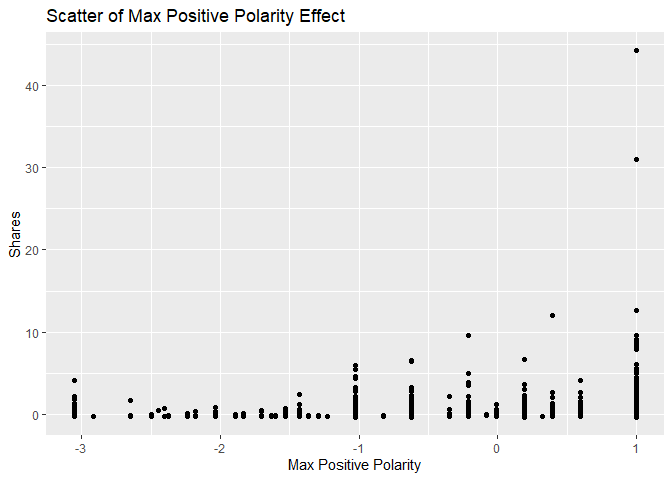
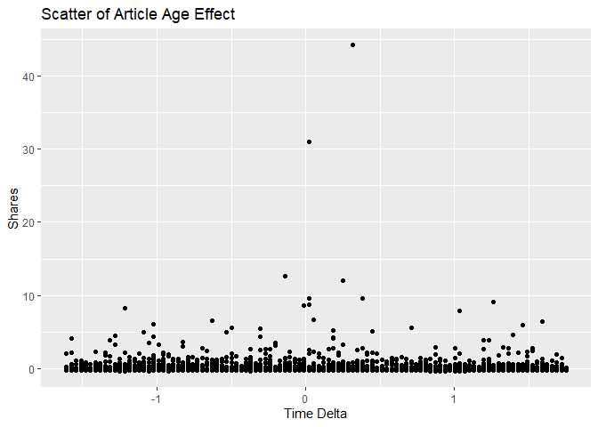

News Popularity Tuesday Data
================
Shuang Du
10/16/2020

Load Libraries
--------------

    library(readxl);
    library(tidyverse);
    library(caret);
    library(modelr);
    library(rpart);
    library(kableExtra);

Read in Data
------------

    getData <- function(day) {

      newsPopData <- read_csv("raw_data/OnlineNewsPopularity.csv")
      
      if (day == 'monday') {
        newsPopData <- newsPopData %>% filter(weekday_is_monday == 1)
      } else if(day == 'tuesday') {
        newsPopData <- newsPopData %>% filter(weekday_is_tuesday == 1)
      } else if(day == 'wednesday') {
        newsPopData <- newsPopData %>% filter(weekday_is_wednesday == 1)
      } else if(day == 'thursday') {
        newsPopData <- newsPopData %>% filter(weekday_is_thursday == 1)
      } else if(day == 'friday') {
        newsPopData <- newsPopData %>% filter(weekday_is_friday == 1)
      } else if(day == 'saturday') {
        newsPopData <- newsPopData %>% filter(weekday_is_saturday == 1)
      } else if(day == 'sunday') {
        newsPopData <- newsPopData %>% filter(weekday_is_sunday == 1)
      } else {
        stop("Invalid date")
      }
      return(newsPopData)
    }

    newsPopData <- getData(params$day)

Set Aside Training Data
-----------------------

    set.seed(92)
    trainIndex <- createDataPartition(newsPopData$shares, 
                                      p = 0.7, list = FALSE)

    newsPopTrain <- newsPopData[as.vector(trainIndex),];
    newsPopTest <- newsPopData[-as.vector(trainIndex),];

Center and Scale
----------------

    preProcValues <- preProcess(newsPopTrain, method = c("center", "scale"))
    newsPopTrain <- predict(preProcValues, newsPopTrain) 
    newsPopTest <- predict(preProcValues, newsPopTest)

Summary of a Few Variables
--------------------------

The plots below show a histogram of the number of shares for the given
day. Scatter plots on the effect of max positive polarity, article time
delta and number of videos in the article are also included.

As expected the histogram has a strong right tail, as seem by the
summary stats which show a very high maximum and a median severals
orders of magnitude lower. This is expected for because of the “viral”
nature of online popularity.

    summary(newsPopTrain$shares)

    ##     Min.  1st Qu.   Median     Mean  3rd Qu.     Max. 
    ## -0.31620 -0.22995 -0.18930  0.00000 -0.06826 44.16344

    g0 <- ggplot(newsPopTrain, aes(x=shares))
    g0 + geom_histogram(binwidth = 0.5) + ggtitle('Histogram for Number of Shares') + ylab('Number of Shares') + xlab('Shares')

<!-- -->

    summary(newsPopTrain$max_positive_polarity)

    ##    Min. 1st Qu.  Median    Mean 3rd Qu.    Max. 
    ## -3.0504 -0.6206  0.1893  0.0000  0.9992  0.9992

    g1 <- ggplot(newsPopTrain, aes(x = max_positive_polarity, y = shares )) 
    g1 + geom_point() + ggtitle('Scatter of Max Positive Polarity Effect') + ylab('Shares') + xlab('Max Positive Polarity')

<!-- -->

    summary(newsPopTrain$timedelta)

    ##     Min.  1st Qu.   Median     Mean  3rd Qu.     Max. 
    ## -1.60954 -0.89161 -0.07578  0.00000  0.87058  1.75168

    g2 <- ggplot(newsPopTrain, aes(x = timedelta, y = shares )) 
    g2 + geom_point() + ggtitle('Scatter of Article Age Effect') + ylab('Shares') + xlab('Time Delta')

<!-- -->

    summary(newsPopTrain$num_videos)

    ##     Min.  1st Qu.   Median     Mean  3rd Qu.     Max. 
    ## -0.31683 -0.31683 -0.31683  0.00000 -0.07667 17.21525

    g3 <- ggplot(newsPopTrain, aes(x = num_videos, y = shares )) 
    g3 + geom_point() + ggtitle('Scatter of Videos Number Effect') + ylab('Shares') + xlab('Number of Videos')

<!-- -->

Modeling
--------

### Standard Tree Based Model (no ensemble)

The type of model being fitted here is a decision tree. The tree splits
are based on minimizing the residual sum of squares for each region.

    rpartFit <- train(shares ~ timedelta + n_tokens_title + n_tokens_content + n_unique_tokens + n_non_stop_words + n_non_stop_unique_tokens
                     + num_hrefs + num_self_hrefs + num_imgs + num_videos + average_token_length + num_keywords + data_channel_is_lifestyle +
                     data_channel_is_entertainment + data_channel_is_bus + data_channel_is_socmed + data_channel_is_tech + data_channel_is_world +
                     self_reference_min_shares + self_reference_max_shares + self_reference_avg_sharess + global_subjectivity + global_sentiment_polarity
                     + global_rate_positive_words + global_rate_negative_words + rate_positive_words + rate_negative_words + avg_positive_polarity +
                      min_positive_polarity + max_positive_polarity + avg_negative_polarity + min_negative_polarity + max_negative_polarity + title_subjectivity
                     + title_sentiment_polarity + abs_title_subjectivity + abs_title_sentiment_polarity, data = newsPopTrain,
                 method = "rpart",
                 trControl = trainControl(method = "cv", number = 10),
                 tuneGrid = data.frame(cp = c(.001,.01,.015,.02,.03,.04,.05))
                 )
    rpartFit

    ## CART 
    ## 
    ## 5175 samples
    ##   37 predictor
    ## 
    ## No pre-processing
    ## Resampling: Cross-Validated (10 fold) 
    ## Summary of sample sizes: 4657, 4656, 4658, 4659, 4658, 4657, ... 
    ## Resampling results across tuning parameters:
    ## 
    ##   cp     RMSE       Rsquared     MAE      
    ##   0.001  0.9531612  0.017287810  0.3127114
    ##   0.010  0.9273818  0.014327726  0.3086837
    ##   0.015  0.9176725  0.010771757  0.3088906
    ##   0.020  0.8754890  0.008963537  0.3020529
    ##   0.030  0.8689058          NaN  0.3038533
    ##   0.040  0.8689058          NaN  0.3038533
    ##   0.050  0.8689058          NaN  0.3038533
    ## 
    ## RMSE was used to select the optimal model using the smallest value.
    ## The final value used for the model was cp = 0.05.

    # create the prediction
    pred1 <- predict(rpartFit, newdata = newsPopTest)

    # compare the prediction vs the actual
    resample1 <- postResample(pred1, obs = newsPopTest$shares)
    resample1

    ##      RMSE  Rsquared       MAE 
    ## 0.9605903        NA 0.3123001

### Boosted Tree Based Model

A boosted tree is an ensemble method which slowly approaches the tree
prediction which would result from the original data. In general, an
ensemble model model will have a lower RSME than a single tree model.

    gbmFit <- train(shares ~ timedelta + n_tokens_title + n_tokens_content + n_unique_tokens + n_non_stop_words + n_non_stop_unique_tokens
                     + num_hrefs + num_self_hrefs + num_imgs + num_videos + average_token_length + num_keywords + data_channel_is_lifestyle +
                     data_channel_is_entertainment + data_channel_is_bus + data_channel_is_socmed + data_channel_is_tech + data_channel_is_world +
                     self_reference_min_shares + self_reference_max_shares + self_reference_avg_sharess + global_subjectivity + global_sentiment_polarity
                     + global_rate_positive_words + global_rate_negative_words + rate_positive_words + rate_negative_words + avg_positive_polarity +
                      min_positive_polarity + max_positive_polarity + avg_negative_polarity + min_negative_polarity + max_negative_polarity + title_subjectivity
                     + title_sentiment_polarity + abs_title_subjectivity + abs_title_sentiment_polarity, data = newsPopTrain,
                 method = "gbm",
                 trControl = trainControl(method = "cv", number = 10))

    ## Iter   TrainDeviance   ValidDeviance   StepSize   Improve
    ##      1        1.0463             nan     0.1000    0.0021
    ##      2        1.0442             nan     0.1000    0.0018
    ##      3        1.0426             nan     0.1000    0.0001
    ##      4        1.0401             nan     0.1000    0.0012
    ##      5        1.0394             nan     0.1000    0.0000
    ##      6        1.0379             nan     0.1000    0.0009
    ##      7        1.0365             nan     0.1000    0.0004
    ##      8        1.0350             nan     0.1000    0.0002
    ##      9        1.0345             nan     0.1000   -0.0000
    ##     10        1.0340             nan     0.1000   -0.0000
    ##     20        1.0275             nan     0.1000    0.0000
    ##     40        1.0194             nan     0.1000   -0.0007
    ##     60        1.0144             nan     0.1000   -0.0002
    ##     80        1.0111             nan     0.1000   -0.0006
    ##    100        1.0076             nan     0.1000   -0.0011
    ##    120        1.0055             nan     0.1000   -0.0007
    ##    140        1.0027             nan     0.1000   -0.0011
    ##    150        1.0014             nan     0.1000   -0.0007
    ## 
    ## Iter   TrainDeviance   ValidDeviance   StepSize   Improve
    ##      1        1.0440             nan     0.1000    0.0013
    ##      2        1.0363             nan     0.1000    0.0026
    ##      3        1.0324             nan     0.1000    0.0013
    ##      4        1.0292             nan     0.1000    0.0011
    ##      5        1.0270             nan     0.1000   -0.0005
    ##      6        1.0220             nan     0.1000   -0.0010
    ##      7        1.0206             nan     0.1000   -0.0001
    ##      8        1.0127             nan     0.1000   -0.0002
    ##      9        1.0046             nan     0.1000   -0.0019
    ##     10        1.0032             nan     0.1000    0.0005
    ##     20        0.9663             nan     0.1000   -0.0002
    ##     40        0.9350             nan     0.1000   -0.0004
    ##     60        0.9006             nan     0.1000    0.0003
    ##     80        0.8864             nan     0.1000   -0.0007
    ##    100        0.8681             nan     0.1000   -0.0002
    ##    120        0.8524             nan     0.1000   -0.0012
    ##    140        0.8339             nan     0.1000   -0.0015
    ##    150        0.8301             nan     0.1000   -0.0004
    ## 
    ## Iter   TrainDeviance   ValidDeviance   StepSize   Improve
    ##      1        1.0338             nan     0.1000    0.0015
    ##      2        1.0270             nan     0.1000    0.0002
    ##      3        1.0166             nan     0.1000    0.0017
    ##      4        1.0081             nan     0.1000    0.0003
    ##      5        0.9998             nan     0.1000   -0.0008
    ##      6        0.9975             nan     0.1000   -0.0001
    ##      7        0.9897             nan     0.1000   -0.0016
    ##      8        0.9885             nan     0.1000   -0.0002
    ##      9        0.9869             nan     0.1000   -0.0009
    ##     10        0.9851             nan     0.1000    0.0004
    ##     20        0.9382             nan     0.1000   -0.0006
    ##     40        0.8664             nan     0.1000   -0.0015
    ##     60        0.8173             nan     0.1000   -0.0010
    ##     80        0.7763             nan     0.1000   -0.0014
    ##    100        0.7622             nan     0.1000   -0.0013
    ##    120        0.7352             nan     0.1000   -0.0028
    ##    140        0.7121             nan     0.1000   -0.0002
    ##    150        0.7004             nan     0.1000   -0.0013
    ## 
    ## Iter   TrainDeviance   ValidDeviance   StepSize   Improve
    ##      1        1.0327             nan     0.1000    0.0024
    ##      2        1.0307             nan     0.1000    0.0008
    ##      3        1.0287             nan     0.1000    0.0018
    ##      4        1.0274             nan     0.1000    0.0003
    ##      5        1.0254             nan     0.1000    0.0013
    ##      6        1.0238             nan     0.1000    0.0008
    ##      7        1.0233             nan     0.1000   -0.0001
    ##      8        1.0219             nan     0.1000    0.0006
    ##      9        1.0207             nan     0.1000    0.0000
    ##     10        1.0198             nan     0.1000   -0.0001
    ##     20        1.0120             nan     0.1000   -0.0006
    ##     40        1.0035             nan     0.1000   -0.0009
    ##     60        0.9987             nan     0.1000   -0.0007
    ##     80        0.9947             nan     0.1000   -0.0004
    ##    100        0.9912             nan     0.1000    0.0000
    ##    120        0.9883             nan     0.1000    0.0000
    ##    140        0.9857             nan     0.1000   -0.0009
    ##    150        0.9834             nan     0.1000   -0.0002
    ## 
    ## Iter   TrainDeviance   ValidDeviance   StepSize   Improve
    ##      1        1.0305             nan     0.1000    0.0028
    ##      2        1.0273             nan     0.1000    0.0005
    ##      3        1.0238             nan     0.1000    0.0016
    ##      4        1.0201             nan     0.1000    0.0004
    ##      5        1.0101             nan     0.1000   -0.0021
    ##      6        1.0071             nan     0.1000    0.0009
    ##      7        1.0058             nan     0.1000    0.0005
    ##      8        1.0032             nan     0.1000    0.0002
    ##      9        1.0021             nan     0.1000   -0.0004
    ##     10        1.0006             nan     0.1000   -0.0001
    ##     20        0.9679             nan     0.1000   -0.0023
    ##     40        0.9182             nan     0.1000   -0.0008
    ##     60        0.8804             nan     0.1000   -0.0009
    ##     80        0.8641             nan     0.1000   -0.0024
    ##    100        0.8448             nan     0.1000   -0.0011
    ##    120        0.8297             nan     0.1000   -0.0015
    ##    140        0.8003             nan     0.1000    0.0003
    ##    150        0.7961             nan     0.1000   -0.0002
    ## 
    ## Iter   TrainDeviance   ValidDeviance   StepSize   Improve
    ##      1        1.0284             nan     0.1000    0.0021
    ##      2        1.0190             nan     0.1000    0.0004
    ##      3        1.0155             nan     0.1000   -0.0001
    ##      4        1.0091             nan     0.1000   -0.0010
    ##      5        1.0019             nan     0.1000   -0.0025
    ##      6        0.9996             nan     0.1000   -0.0014
    ##      7        0.9937             nan     0.1000   -0.0028
    ##      8        0.9867             nan     0.1000    0.0024
    ##      9        0.9792             nan     0.1000   -0.0011
    ##     10        0.9781             nan     0.1000   -0.0008
    ##     20        0.9304             nan     0.1000   -0.0030
    ##     40        0.8741             nan     0.1000   -0.0020
    ##     60        0.8242             nan     0.1000   -0.0005
    ##     80        0.8007             nan     0.1000   -0.0023
    ##    100        0.7468             nan     0.1000   -0.0015
    ##    120        0.7178             nan     0.1000   -0.0006
    ##    140        0.6841             nan     0.1000    0.0007
    ##    150        0.6740             nan     0.1000   -0.0006
    ## 
    ## Iter   TrainDeviance   ValidDeviance   StepSize   Improve
    ##      1        1.0622             nan     0.1000    0.0017
    ##      2        1.0605             nan     0.1000    0.0007
    ##      3        1.0586             nan     0.1000    0.0010
    ##      4        1.0583             nan     0.1000   -0.0003
    ##      5        1.0563             nan     0.1000    0.0017
    ##      6        1.0545             nan     0.1000   -0.0002
    ##      7        1.0531             nan     0.1000   -0.0002
    ##      8        1.0518             nan     0.1000    0.0001
    ##      9        1.0505             nan     0.1000    0.0007
    ##     10        1.0490             nan     0.1000    0.0010
    ##     20        1.0406             nan     0.1000    0.0003
    ##     40        1.0332             nan     0.1000   -0.0012
    ##     60        1.0267             nan     0.1000   -0.0010
    ##     80        1.0235             nan     0.1000   -0.0008
    ##    100        1.0201             nan     0.1000   -0.0003
    ##    120        1.0168             nan     0.1000   -0.0001
    ##    140        1.0139             nan     0.1000   -0.0001
    ##    150        1.0121             nan     0.1000   -0.0002
    ## 
    ## Iter   TrainDeviance   ValidDeviance   StepSize   Improve
    ##      1        1.0633             nan     0.1000    0.0011
    ##      2        1.0527             nan     0.1000   -0.0018
    ##      3        1.0483             nan     0.1000    0.0012
    ##      4        1.0470             nan     0.1000    0.0006
    ##      5        1.0438             nan     0.1000   -0.0006
    ##      6        1.0396             nan     0.1000   -0.0006
    ##      7        1.0309             nan     0.1000    0.0032
    ##      8        1.0292             nan     0.1000   -0.0001
    ##      9        1.0283             nan     0.1000   -0.0000
    ##     10        1.0268             nan     0.1000    0.0004
    ##     20        0.9962             nan     0.1000   -0.0004
    ##     40        0.9520             nan     0.1000   -0.0006
    ##     60        0.9221             nan     0.1000   -0.0011
    ##     80        0.9040             nan     0.1000   -0.0009
    ##    100        0.8726             nan     0.1000   -0.0010
    ##    120        0.8428             nan     0.1000   -0.0015
    ##    140        0.8206             nan     0.1000   -0.0032
    ##    150        0.8138             nan     0.1000    0.0000
    ## 
    ## Iter   TrainDeviance   ValidDeviance   StepSize   Improve
    ##      1        1.0586             nan     0.1000    0.0018
    ##      2        1.0501             nan     0.1000   -0.0007
    ##      3        1.0332             nan     0.1000    0.0006
    ##      4        1.0264             nan     0.1000    0.0004
    ##      5        1.0159             nan     0.1000   -0.0006
    ##      6        1.0069             nan     0.1000   -0.0004
    ##      7        1.0016             nan     0.1000   -0.0014
    ##      8        0.9931             nan     0.1000   -0.0002
    ##      9        0.9894             nan     0.1000   -0.0020
    ##     10        0.9872             nan     0.1000    0.0005
    ##     20        0.9338             nan     0.1000   -0.0010
    ##     40        0.8745             nan     0.1000   -0.0018
    ##     60        0.8317             nan     0.1000   -0.0004
    ##     80        0.7936             nan     0.1000   -0.0008
    ##    100        0.7558             nan     0.1000   -0.0006
    ##    120        0.7329             nan     0.1000   -0.0007
    ##    140        0.6992             nan     0.1000   -0.0019
    ##    150        0.6898             nan     0.1000   -0.0006
    ## 
    ## Iter   TrainDeviance   ValidDeviance   StepSize   Improve
    ##      1        1.0577             nan     0.1000    0.0005
    ##      2        1.0550             nan     0.1000    0.0023
    ##      3        1.0521             nan     0.1000    0.0015
    ##      4        1.0505             nan     0.1000    0.0001
    ##      5        1.0489             nan     0.1000    0.0013
    ##      6        1.0475             nan     0.1000    0.0006
    ##      7        1.0458             nan     0.1000    0.0005
    ##      8        1.0442             nan     0.1000    0.0006
    ##      9        1.0431             nan     0.1000    0.0007
    ##     10        1.0421             nan     0.1000    0.0003
    ##     20        1.0350             nan     0.1000   -0.0003
    ##     40        1.0274             nan     0.1000   -0.0011
    ##     60        1.0216             nan     0.1000   -0.0000
    ##     80        1.0182             nan     0.1000   -0.0003
    ##    100        1.0158             nan     0.1000   -0.0004
    ##    120        1.0128             nan     0.1000   -0.0003
    ##    140        1.0096             nan     0.1000   -0.0005
    ##    150        1.0084             nan     0.1000   -0.0002
    ## 
    ## Iter   TrainDeviance   ValidDeviance   StepSize   Improve
    ##      1        1.0556             nan     0.1000    0.0012
    ##      2        1.0504             nan     0.1000    0.0006
    ##      3        1.0440             nan     0.1000    0.0001
    ##      4        1.0400             nan     0.1000   -0.0006
    ##      5        1.0313             nan     0.1000    0.0029
    ##      6        1.0234             nan     0.1000   -0.0020
    ##      7        1.0208             nan     0.1000   -0.0001
    ##      8        1.0122             nan     0.1000   -0.0019
    ##      9        1.0103             nan     0.1000    0.0000
    ##     10        1.0029             nan     0.1000   -0.0011
    ##     20        0.9758             nan     0.1000   -0.0002
    ##     40        0.9279             nan     0.1000   -0.0003
    ##     60        0.9061             nan     0.1000   -0.0004
    ##     80        0.8793             nan     0.1000   -0.0007
    ##    100        0.8633             nan     0.1000   -0.0008
    ##    120        0.8490             nan     0.1000   -0.0011
    ##    140        0.8330             nan     0.1000   -0.0020
    ##    150        0.8229             nan     0.1000   -0.0010
    ## 
    ## Iter   TrainDeviance   ValidDeviance   StepSize   Improve
    ##      1        1.0567             nan     0.1000    0.0021
    ##      2        1.0488             nan     0.1000    0.0014
    ##      3        1.0454             nan     0.1000    0.0017
    ##      4        1.0444             nan     0.1000    0.0001
    ##      5        1.0413             nan     0.1000    0.0013
    ##      6        1.0354             nan     0.1000   -0.0016
    ##      7        1.0308             nan     0.1000    0.0002
    ##      8        1.0288             nan     0.1000   -0.0004
    ##      9        1.0217             nan     0.1000    0.0001
    ##     10        1.0140             nan     0.1000    0.0013
    ##     20        0.9568             nan     0.1000   -0.0017
    ##     40        0.8840             nan     0.1000   -0.0010
    ##     60        0.8163             nan     0.1000   -0.0012
    ##     80        0.7821             nan     0.1000   -0.0009
    ##    100        0.7566             nan     0.1000    0.0003
    ##    120        0.7307             nan     0.1000   -0.0043
    ##    140        0.7028             nan     0.1000   -0.0019
    ##    150        0.6909             nan     0.1000   -0.0004
    ## 
    ## Iter   TrainDeviance   ValidDeviance   StepSize   Improve
    ##      1        1.0621             nan     0.1000    0.0001
    ##      2        1.0604             nan     0.1000    0.0007
    ##      3        1.0583             nan     0.1000    0.0004
    ##      4        1.0567             nan     0.1000   -0.0001
    ##      5        1.0539             nan     0.1000    0.0027
    ##      6        1.0514             nan     0.1000    0.0019
    ##      7        1.0494             nan     0.1000    0.0014
    ##      8        1.0471             nan     0.1000    0.0012
    ##      9        1.0459             nan     0.1000    0.0003
    ##     10        1.0451             nan     0.1000    0.0001
    ##     20        1.0357             nan     0.1000   -0.0005
    ##     40        1.0258             nan     0.1000   -0.0002
    ##     60        1.0210             nan     0.1000   -0.0003
    ##     80        1.0173             nan     0.1000   -0.0003
    ##    100        1.0138             nan     0.1000   -0.0007
    ##    120        1.0109             nan     0.1000   -0.0010
    ##    140        1.0080             nan     0.1000   -0.0006
    ##    150        1.0061             nan     0.1000   -0.0008
    ## 
    ## Iter   TrainDeviance   ValidDeviance   StepSize   Improve
    ##      1        1.0540             nan     0.1000    0.0015
    ##      2        1.0481             nan     0.1000    0.0010
    ##      3        1.0432             nan     0.1000    0.0006
    ##      4        1.0411             nan     0.1000    0.0010
    ##      5        1.0321             nan     0.1000   -0.0004
    ##      6        1.0293             nan     0.1000    0.0005
    ##      7        1.0163             nan     0.1000   -0.0015
    ##      8        1.0133             nan     0.1000   -0.0001
    ##      9        1.0119             nan     0.1000   -0.0002
    ##     10        1.0089             nan     0.1000    0.0004
    ##     20        0.9702             nan     0.1000   -0.0015
    ##     40        0.9096             nan     0.1000   -0.0024
    ##     60        0.8798             nan     0.1000   -0.0016
    ##     80        0.8645             nan     0.1000   -0.0033
    ##    100        0.8421             nan     0.1000   -0.0007
    ##    120        0.8172             nan     0.1000   -0.0005
    ##    140        0.8045             nan     0.1000   -0.0007
    ##    150        0.8009             nan     0.1000   -0.0024
    ## 
    ## Iter   TrainDeviance   ValidDeviance   StepSize   Improve
    ##      1        1.0438             nan     0.1000   -0.0012
    ##      2        1.0353             nan     0.1000    0.0018
    ##      3        1.0233             nan     0.1000    0.0029
    ##      4        1.0129             nan     0.1000    0.0006
    ##      5        1.0061             nan     0.1000   -0.0012
    ##      6        1.0036             nan     0.1000    0.0002
    ##      7        0.9945             nan     0.1000   -0.0009
    ##      8        0.9859             nan     0.1000   -0.0006
    ##      9        0.9786             nan     0.1000   -0.0041
    ##     10        0.9730             nan     0.1000   -0.0025
    ##     20        0.9276             nan     0.1000   -0.0004
    ##     40        0.8620             nan     0.1000   -0.0013
    ##     60        0.8081             nan     0.1000   -0.0026
    ##     80        0.7722             nan     0.1000   -0.0005
    ##    100        0.7492             nan     0.1000   -0.0013
    ##    120        0.7160             nan     0.1000   -0.0002
    ##    140        0.6850             nan     0.1000   -0.0024
    ##    150        0.6736             nan     0.1000   -0.0008
    ## 
    ## Iter   TrainDeviance   ValidDeviance   StepSize   Improve
    ##      1        0.4353             nan     0.1000    0.0008
    ##      2        0.4340             nan     0.1000    0.0010
    ##      3        0.4325             nan     0.1000    0.0014
    ##      4        0.4315             nan     0.1000    0.0008
    ##      5        0.4308             nan     0.1000    0.0001
    ##      6        0.4302             nan     0.1000   -0.0000
    ##      7        0.4290             nan     0.1000    0.0009
    ##      8        0.4286             nan     0.1000   -0.0002
    ##      9        0.4280             nan     0.1000   -0.0002
    ##     10        0.4272             nan     0.1000    0.0004
    ##     20        0.4219             nan     0.1000   -0.0001
    ##     40        0.4141             nan     0.1000   -0.0000
    ##     60        0.4095             nan     0.1000    0.0002
    ##     80        0.4065             nan     0.1000   -0.0002
    ##    100        0.4041             nan     0.1000   -0.0002
    ##    120        0.4022             nan     0.1000   -0.0007
    ##    140        0.3999             nan     0.1000   -0.0002
    ##    150        0.3993             nan     0.1000   -0.0003
    ## 
    ## Iter   TrainDeviance   ValidDeviance   StepSize   Improve
    ##      1        0.4339             nan     0.1000   -0.0003
    ##      2        0.4310             nan     0.1000    0.0010
    ##      3        0.4297             nan     0.1000    0.0000
    ##      4        0.4272             nan     0.1000    0.0003
    ##      5        0.4259             nan     0.1000    0.0003
    ##      6        0.4249             nan     0.1000    0.0000
    ##      7        0.4226             nan     0.1000   -0.0007
    ##      8        0.4207             nan     0.1000   -0.0001
    ##      9        0.4188             nan     0.1000    0.0004
    ##     10        0.4174             nan     0.1000    0.0006
    ##     20        0.4056             nan     0.1000   -0.0000
    ##     40        0.3891             nan     0.1000   -0.0001
    ##     60        0.3756             nan     0.1000   -0.0008
    ##     80        0.3663             nan     0.1000   -0.0003
    ##    100        0.3593             nan     0.1000   -0.0008
    ##    120        0.3532             nan     0.1000   -0.0010
    ##    140        0.3476             nan     0.1000   -0.0002
    ##    150        0.3457             nan     0.1000   -0.0005
    ## 
    ## Iter   TrainDeviance   ValidDeviance   StepSize   Improve
    ##      1        0.4343             nan     0.1000    0.0011
    ##      2        0.4303             nan     0.1000    0.0012
    ##      3        0.4253             nan     0.1000    0.0007
    ##      4        0.4220             nan     0.1000    0.0001
    ##      5        0.4200             nan     0.1000    0.0002
    ##      6        0.4164             nan     0.1000   -0.0002
    ##      7        0.4149             nan     0.1000    0.0007
    ##      8        0.4135             nan     0.1000    0.0001
    ##      9        0.4114             nan     0.1000   -0.0000
    ##     10        0.4094             nan     0.1000   -0.0002
    ##     20        0.3927             nan     0.1000    0.0003
    ##     40        0.3766             nan     0.1000   -0.0007
    ##     60        0.3616             nan     0.1000   -0.0002
    ##     80        0.3492             nan     0.1000   -0.0004
    ##    100        0.3398             nan     0.1000   -0.0011
    ##    120        0.3300             nan     0.1000   -0.0004
    ##    140        0.3210             nan     0.1000   -0.0002
    ##    150        0.3171             nan     0.1000   -0.0010
    ## 
    ## Iter   TrainDeviance   ValidDeviance   StepSize   Improve
    ##      1        1.0790             nan     0.1000    0.0022
    ##      2        1.0765             nan     0.1000    0.0022
    ##      3        1.0759             nan     0.1000    0.0001
    ##      4        1.0738             nan     0.1000    0.0017
    ##      5        1.0722             nan     0.1000    0.0003
    ##      6        1.0709             nan     0.1000    0.0006
    ##      7        1.0690             nan     0.1000    0.0004
    ##      8        1.0670             nan     0.1000    0.0008
    ##      9        1.0663             nan     0.1000    0.0000
    ##     10        1.0650             nan     0.1000    0.0003
    ##     20        1.0582             nan     0.1000   -0.0002
    ##     40        1.0472             nan     0.1000   -0.0001
    ##     60        1.0419             nan     0.1000   -0.0013
    ##     80        1.0383             nan     0.1000   -0.0003
    ##    100        1.0351             nan     0.1000   -0.0003
    ##    120        1.0321             nan     0.1000   -0.0010
    ##    140        1.0288             nan     0.1000   -0.0008
    ##    150        1.0279             nan     0.1000   -0.0007
    ## 
    ## Iter   TrainDeviance   ValidDeviance   StepSize   Improve
    ##      1        1.0761             nan     0.1000    0.0009
    ##      2        1.0727             nan     0.1000    0.0014
    ##      3        1.0682             nan     0.1000    0.0005
    ##      4        1.0613             nan     0.1000   -0.0002
    ##      5        1.0531             nan     0.1000   -0.0003
    ##      6        1.0444             nan     0.1000   -0.0006
    ##      7        1.0411             nan     0.1000    0.0014
    ##      8        1.0340             nan     0.1000   -0.0010
    ##      9        1.0331             nan     0.1000   -0.0000
    ##     10        1.0296             nan     0.1000   -0.0007
    ##     20        1.0098             nan     0.1000   -0.0016
    ##     40        0.9626             nan     0.1000   -0.0015
    ##     60        0.9193             nan     0.1000   -0.0003
    ##     80        0.8965             nan     0.1000   -0.0007
    ##    100        0.8829             nan     0.1000   -0.0033
    ##    120        0.8605             nan     0.1000   -0.0011
    ##    140        0.8433             nan     0.1000   -0.0007
    ##    150        0.8363             nan     0.1000   -0.0012
    ## 
    ## Iter   TrainDeviance   ValidDeviance   StepSize   Improve
    ##      1        1.0748             nan     0.1000   -0.0001
    ##      2        1.0668             nan     0.1000   -0.0005
    ##      3        1.0582             nan     0.1000    0.0001
    ##      4        1.0514             nan     0.1000   -0.0005
    ##      5        1.0492             nan     0.1000   -0.0007
    ##      6        1.0477             nan     0.1000   -0.0002
    ##      7        1.0303             nan     0.1000   -0.0045
    ##      8        1.0232             nan     0.1000   -0.0012
    ##      9        1.0214             nan     0.1000    0.0007
    ##     10        1.0158             nan     0.1000   -0.0004
    ##     20        0.9575             nan     0.1000   -0.0007
    ##     40        0.8793             nan     0.1000    0.0021
    ##     60        0.8336             nan     0.1000   -0.0010
    ##     80        0.7948             nan     0.1000   -0.0007
    ##    100        0.7655             nan     0.1000   -0.0015
    ##    120        0.7327             nan     0.1000   -0.0008
    ##    140        0.7046             nan     0.1000   -0.0012
    ##    150        0.6958             nan     0.1000   -0.0023
    ## 
    ## Iter   TrainDeviance   ValidDeviance   StepSize   Improve
    ##      1        1.0657             nan     0.1000    0.0017
    ##      2        1.0639             nan     0.1000    0.0010
    ##      3        1.0630             nan     0.1000    0.0001
    ##      4        1.0612             nan     0.1000    0.0014
    ##      5        1.0597             nan     0.1000   -0.0005
    ##      6        1.0583             nan     0.1000   -0.0001
    ##      7        1.0579             nan     0.1000   -0.0003
    ##      8        1.0574             nan     0.1000   -0.0002
    ##      9        1.0565             nan     0.1000   -0.0000
    ##     10        1.0546             nan     0.1000    0.0008
    ##     20        1.0464             nan     0.1000    0.0006
    ##     40        1.0381             nan     0.1000   -0.0005
    ##     60        1.0328             nan     0.1000   -0.0009
    ##     80        1.0289             nan     0.1000   -0.0007
    ##    100        1.0253             nan     0.1000   -0.0004
    ##    120        1.0220             nan     0.1000   -0.0012
    ##    140        1.0184             nan     0.1000   -0.0001
    ##    150        1.0170             nan     0.1000   -0.0003
    ## 
    ## Iter   TrainDeviance   ValidDeviance   StepSize   Improve
    ##      1        1.0633             nan     0.1000    0.0014
    ##      2        1.0589             nan     0.1000    0.0009
    ##      3        1.0567             nan     0.1000   -0.0003
    ##      4        1.0455             nan     0.1000    0.0024
    ##      5        1.0370             nan     0.1000    0.0003
    ##      6        1.0272             nan     0.1000   -0.0025
    ##      7        1.0246             nan     0.1000    0.0012
    ##      8        1.0183             nan     0.1000   -0.0033
    ##      9        1.0175             nan     0.1000   -0.0002
    ##     10        1.0158             nan     0.1000    0.0006
    ##     20        0.9831             nan     0.1000   -0.0079
    ##     40        0.9439             nan     0.1000   -0.0010
    ##     60        0.9116             nan     0.1000   -0.0011
    ##     80        0.8914             nan     0.1000   -0.0026
    ##    100        0.8665             nan     0.1000   -0.0004
    ##    120        0.8572             nan     0.1000   -0.0048
    ##    140        0.8426             nan     0.1000   -0.0007
    ##    150        0.8338             nan     0.1000   -0.0003
    ## 
    ## Iter   TrainDeviance   ValidDeviance   StepSize   Improve
    ##      1        1.0613             nan     0.1000    0.0016
    ##      2        1.0562             nan     0.1000    0.0006
    ##      3        1.0528             nan     0.1000    0.0006
    ##      4        1.0491             nan     0.1000    0.0004
    ##      5        1.0360             nan     0.1000    0.0057
    ##      6        1.0280             nan     0.1000   -0.0008
    ##      7        1.0140             nan     0.1000   -0.0025
    ##      8        1.0049             nan     0.1000   -0.0009
    ##      9        0.9987             nan     0.1000   -0.0021
    ##     10        0.9901             nan     0.1000   -0.0007
    ##     20        0.9341             nan     0.1000   -0.0026
    ##     40        0.8683             nan     0.1000   -0.0004
    ##     60        0.8262             nan     0.1000   -0.0009
    ##     80        0.7793             nan     0.1000   -0.0015
    ##    100        0.7558             nan     0.1000    0.0002
    ##    120        0.7259             nan     0.1000   -0.0011
    ##    140        0.6963             nan     0.1000   -0.0011
    ##    150        0.6796             nan     0.1000   -0.0009
    ## 
    ## Iter   TrainDeviance   ValidDeviance   StepSize   Improve
    ##      1        1.0911             nan     0.1000    0.0014
    ##      2        1.0906             nan     0.1000   -0.0002
    ##      3        1.0879             nan     0.1000    0.0017
    ##      4        1.0854             nan     0.1000    0.0010
    ##      5        1.0841             nan     0.1000   -0.0001
    ##      6        1.0832             nan     0.1000   -0.0002
    ##      7        1.0824             nan     0.1000   -0.0001
    ##      8        1.0807             nan     0.1000    0.0002
    ##      9        1.0802             nan     0.1000   -0.0001
    ##     10        1.0799             nan     0.1000   -0.0006
    ##     20        1.0706             nan     0.1000    0.0002
    ##     40        1.0620             nan     0.1000    0.0000
    ##     60        1.0564             nan     0.1000   -0.0007
    ##     80        1.0518             nan     0.1000   -0.0010
    ##    100        1.0485             nan     0.1000   -0.0008
    ##    120        1.0466             nan     0.1000   -0.0009
    ##    140        1.0435             nan     0.1000   -0.0012
    ##    150        1.0414             nan     0.1000   -0.0002
    ## 
    ## Iter   TrainDeviance   ValidDeviance   StepSize   Improve
    ##      1        1.0866             nan     0.1000    0.0013
    ##      2        1.0795             nan     0.1000   -0.0022
    ##      3        1.0737             nan     0.1000    0.0006
    ##      4        1.0700             nan     0.1000    0.0006
    ##      5        1.0671             nan     0.1000    0.0005
    ##      6        1.0624             nan     0.1000    0.0010
    ##      7        1.0595             nan     0.1000    0.0008
    ##      8        1.0565             nan     0.1000   -0.0000
    ##      9        1.0546             nan     0.1000   -0.0004
    ##     10        1.0521             nan     0.1000   -0.0008
    ##     20        1.0095             nan     0.1000   -0.0048
    ##     40        0.9678             nan     0.1000   -0.0014
    ##     60        0.9402             nan     0.1000   -0.0011
    ##     80        0.9173             nan     0.1000   -0.0007
    ##    100        0.8898             nan     0.1000   -0.0017
    ##    120        0.8697             nan     0.1000   -0.0012
    ##    140        0.8523             nan     0.1000   -0.0006
    ##    150        0.8449             nan     0.1000   -0.0014
    ## 
    ## Iter   TrainDeviance   ValidDeviance   StepSize   Improve
    ##      1        1.0838             nan     0.1000    0.0008
    ##      2        1.0764             nan     0.1000    0.0019
    ##      3        1.0663             nan     0.1000    0.0048
    ##      4        1.0579             nan     0.1000   -0.0001
    ##      5        1.0493             nan     0.1000   -0.0001
    ##      6        1.0398             nan     0.1000   -0.0030
    ##      7        1.0309             nan     0.1000   -0.0012
    ##      8        1.0237             nan     0.1000   -0.0032
    ##      9        1.0178             nan     0.1000   -0.0014
    ##     10        1.0110             nan     0.1000   -0.0002
    ##     20        0.9588             nan     0.1000   -0.0052
    ##     40        0.9091             nan     0.1000   -0.0030
    ##     60        0.8536             nan     0.1000    0.0003
    ##     80        0.8033             nan     0.1000   -0.0013
    ##    100        0.7654             nan     0.1000   -0.0019
    ##    120        0.7338             nan     0.1000   -0.0027
    ##    140        0.7063             nan     0.1000   -0.0007
    ##    150        0.6917             nan     0.1000   -0.0017
    ## 
    ## Iter   TrainDeviance   ValidDeviance   StepSize   Improve
    ##      1        1.0389             nan     0.1000    0.0024
    ##      2        1.0359             nan     0.1000    0.0007
    ##      3        1.0337             nan     0.1000    0.0011
    ##      4        1.0318             nan     0.1000    0.0013
    ##      5        1.0298             nan     0.1000    0.0008
    ##      6        1.0283             nan     0.1000    0.0009
    ##      7        1.0274             nan     0.1000    0.0006
    ##      8        1.0259             nan     0.1000   -0.0003
    ##      9        1.0250             nan     0.1000    0.0000
    ##     10        1.0245             nan     0.1000   -0.0002
    ##     20        1.0180             nan     0.1000    0.0001
    ##     40        1.0071             nan     0.1000   -0.0000
    ##     60        1.0008             nan     0.1000   -0.0003
    ##     80        0.9977             nan     0.1000   -0.0001
    ##    100        0.9954             nan     0.1000   -0.0002
    ##    120        0.9926             nan     0.1000    0.0003
    ##    140        0.9901             nan     0.1000   -0.0007
    ##    150        0.9890             nan     0.1000   -0.0005
    ## 
    ## Iter   TrainDeviance   ValidDeviance   StepSize   Improve
    ##      1        1.0363             nan     0.1000    0.0036
    ##      2        1.0331             nan     0.1000    0.0023
    ##      3        1.0282             nan     0.1000    0.0005
    ##      4        1.0248             nan     0.1000   -0.0015
    ##      5        1.0166             nan     0.1000   -0.0006
    ##      6        1.0075             nan     0.1000    0.0043
    ##      7        0.9997             nan     0.1000   -0.0009
    ##      8        0.9961             nan     0.1000    0.0003
    ##      9        0.9951             nan     0.1000    0.0006
    ##     10        0.9899             nan     0.1000    0.0012
    ##     20        0.9561             nan     0.1000   -0.0023
    ##     40        0.9216             nan     0.1000   -0.0008
    ##     60        0.8952             nan     0.1000   -0.0001
    ##     80        0.8697             nan     0.1000   -0.0003
    ##    100        0.8422             nan     0.1000   -0.0014
    ##    120        0.8249             nan     0.1000   -0.0007
    ##    140        0.8031             nan     0.1000   -0.0009
    ##    150        0.7882             nan     0.1000   -0.0003
    ## 
    ## Iter   TrainDeviance   ValidDeviance   StepSize   Improve
    ##      1        1.0305             nan     0.1000    0.0015
    ##      2        1.0237             nan     0.1000    0.0007
    ##      3        1.0159             nan     0.1000    0.0013
    ##      4        1.0089             nan     0.1000   -0.0005
    ##      5        1.0035             nan     0.1000   -0.0009
    ##      6        0.9963             nan     0.1000   -0.0010
    ##      7        0.9936             nan     0.1000   -0.0002
    ##      8        0.9916             nan     0.1000    0.0013
    ##      9        0.9820             nan     0.1000   -0.0004
    ##     10        0.9747             nan     0.1000    0.0029
    ##     20        0.9310             nan     0.1000   -0.0003
    ##     40        0.8499             nan     0.1000   -0.0010
    ##     60        0.8017             nan     0.1000   -0.0009
    ##     80        0.7756             nan     0.1000    0.0007
    ##    100        0.7375             nan     0.1000   -0.0009
    ##    120        0.7116             nan     0.1000   -0.0003
    ##    140        0.6916             nan     0.1000   -0.0008
    ##    150        0.6786             nan     0.1000   -0.0009
    ## 
    ## Iter   TrainDeviance   ValidDeviance   StepSize   Improve
    ##      1        0.9965             nan     0.1000    0.0020
    ##      2        0.9943             nan     0.1000    0.0017
    ##      3        0.9921             nan     0.1000    0.0011
    ##      4        0.9905             nan     0.1000    0.0009
    ##      5        0.9893             nan     0.1000    0.0007
    ##      6        0.9879             nan     0.1000    0.0006
    ##      7        0.9866             nan     0.1000   -0.0003
    ##      8        0.9856             nan     0.1000    0.0005
    ##      9        0.9846             nan     0.1000    0.0002
    ##     10        0.9834             nan     0.1000    0.0001
    ##     20        0.9769             nan     0.1000   -0.0006
    ##     40        0.9692             nan     0.1000   -0.0009
    ##     50        0.9662             nan     0.1000   -0.0003

    gbmFit

    ## Stochastic Gradient Boosting 
    ## 
    ## 5175 samples
    ##   37 predictor
    ## 
    ## No pre-processing
    ## Resampling: Cross-Validated (10 fold) 
    ## Summary of sample sizes: 4657, 4658, 4658, 4656, 4657, 4658, ... 
    ## Resampling results across tuning parameters:
    ## 
    ##   interaction.depth  n.trees  RMSE       Rsquared    MAE      
    ##   1                   50      0.8228995  0.02985847  0.2950095
    ##   1                  100      0.8236287  0.03199829  0.2961279
    ##   1                  150      0.8248168  0.03084859  0.2957592
    ##   2                   50      0.8413666  0.02051948  0.3009141
    ##   2                  100      0.8569796  0.01801505  0.3087319
    ##   2                  150      0.8686868  0.01654918  0.3155867
    ##   3                   50      0.8490519  0.02591793  0.3061468
    ##   3                  100      0.8624600  0.02259466  0.3144505
    ##   3                  150      0.8698240  0.02429420  0.3210204
    ## 
    ## Tuning parameter 'shrinkage' was held constant at a value of 0.1
    ## Tuning parameter 'n.minobsinnode' was held constant at a value
    ##  of 10
    ## RMSE was used to select the optimal model using the smallest value.
    ## The final values used for the model were n.trees = 50, interaction.depth = 1, shrinkage = 0.1 and n.minobsinnode = 10.

    # create the prediction
    pred2 <- predict(gbmFit, newdata = newsPopTest)

    # compare the prediction vs the actual
    resample2 <- postResample(pred2, obs = newsPopTest$shares)
    resample2

    ##       RMSE   Rsquared        MAE 
    ## 0.95542018 0.01247656 0.30161467

### Linear Regression Model

Linear regression is used to predict the outcome of a response variable
for 1 to n predictors. The aim is to establish a linear relationship
between the predictor variable(s) and response variable so we can
predict the value of the response when only the predictor variable(s)
is(are) known.

    # train the linear model for main effects + interactions on first 3 preds
    lmFit <- train(shares ~ timedelta*n_tokens_title*n_tokens_content, data = newsPopTrain,
                                                                       method = "lm", preProces = c("center", "scale"),
                                                                       trControl = trainControl(method = "cv", number = 10))
    lmFit

    ## Linear Regression 
    ## 
    ## 5175 samples
    ##    3 predictor
    ## 
    ## Pre-processing: centered (7), scaled (7) 
    ## Resampling: Cross-Validated (10 fold) 
    ## Summary of sample sizes: 4658, 4658, 4657, 4657, 4657, 4657, ... 
    ## Resampling results:
    ## 
    ##   RMSE       Rsquared     MAE      
    ##   0.8818785  0.001560738  0.3044919
    ## 
    ## Tuning parameter 'intercept' was held constant at a value of TRUE

    # create the prediction
    pred3 <- predict(lmFit, newdata = newsPopTest)

    # compare the prediction vs the actual
    resample3 <- postResample(pred3, obs = newsPopTest$shares)
    resample3

    ##         RMSE     Rsquared          MAE 
    ## 9.608389e-01 2.425307e-08 3.122606e-01

### Comparison

Below is a comparison of the 3 methods. All have relatively high root
mean square errors.

    # compare results from 3 methods
    comparison <- data.frame("RSME" = c(resample1[[1]], resample2[[1]], resample3[1]), "MAE" = c(resample1[[3]], resample2[[3]], resample3[[3]]))
    rownames(comparison) <- c("RPART","GBM", "LM")
    kable(comparison)

<table>
<thead>
<tr>
<th style="text-align:left;">
</th>
<th style="text-align:right;">
RSME
</th>
<th style="text-align:right;">
MAE
</th>
</tr>
</thead>
<tbody>
<tr>
<td style="text-align:left;">
RPART
</td>
<td style="text-align:right;">
0.9605903
</td>
<td style="text-align:right;">
0.3123001
</td>
</tr>
<tr>
<td style="text-align:left;">
GBM
</td>
<td style="text-align:right;">
0.9554202
</td>
<td style="text-align:right;">
0.3016147
</td>
</tr>
<tr>
<td style="text-align:left;">
LM
</td>
<td style="text-align:right;">
0.9608389
</td>
<td style="text-align:right;">
0.3122606
</td>
</tr>
</tbody>
</table>
