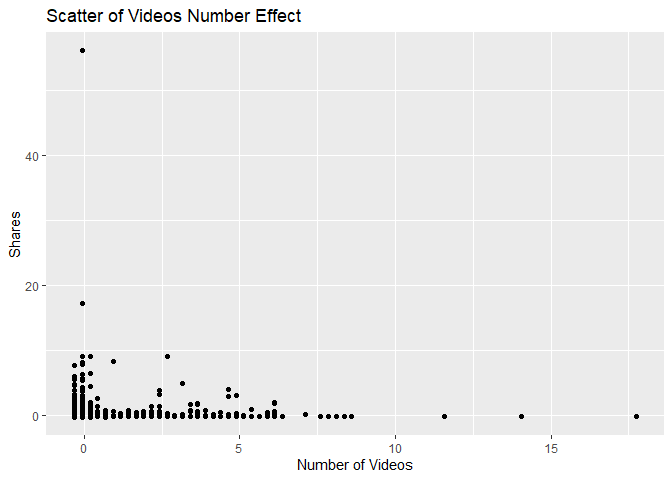

News Popularity Wednesday Data
================
Shuang Du
10/16/2020

## Load Libraries

``` r
library(readxl);
library(tidyverse);
library(caret);
library(modelr);
library(rpart);
library(kableExtra);
```

## Read in Data

``` r
getData <- function(day) {

  newsPopData <- read_csv("../../raw_data/OnlineNewsPopularity.csv")
  
  if (day == 'monday') {
    newsPopData <- newsPopData %>% filter(weekday_is_monday == 1)
  } else if(day == 'tuesday') {
    newsPopData <- newsPopData %>% filter(weekday_is_tuesday == 1)
  } else if(day == 'wednesday') {
    newsPopData <- newsPopData %>% filter(weekday_is_wednesday == 1)
  } else if(day == 'thursday') {
    newsPopData <- newsPopData %>% filter(weekday_is_thursday == 1)
  } else if(day == 'friday') {
    newsPopData <- newsPopData %>% filter(weekday_is_friday == 1)
  } else if(day == 'saturday') {
    newsPopData <- newsPopData %>% filter(weekday_is_saturday == 1)
  } else if(day == 'sunday') {
    newsPopData <- newsPopData %>% filter(weekday_is_sunday == 1)
  } else {
    stop("Invalid date")
  }
  return(newsPopData)
}

newsPopData <- getData(params$day)
```

## Set Aside Training Data

``` r
set.seed(92)
trainIndex <- createDataPartition(newsPopData$shares, 
                                  p = 0.7, list = FALSE)

newsPopTrain <- newsPopData[as.vector(trainIndex),];
newsPopTest <- newsPopData[-as.vector(trainIndex),];
```

## Center and Scale

``` r
preProcValues <- preProcess(newsPopTrain, method = c("center", "scale"))
newsPopTrain <- predict(preProcValues, newsPopTrain) 
newsPopTest <- predict(preProcValues, newsPopTest)
```

## Summary of a Few Variables

The plots below show a histogram of the number of shares for the given
day. Scatter plots on the effect of max positive polarity, article time
delta and number of videos in the article are also included.

As expected the histogram has a strong right tail, as seem by the
summary stats which show a very high maximum and a median severals
orders of magnitude lower. This is expected for because of the “viral”
nature of online popularity.

``` r
summary(newsPopTrain$shares)
```

    ##     Min.  1st Qu.   Median     Mean  3rd Qu.     Max. 
    ## -0.26734 -0.19394 -0.15892  0.00000 -0.04855 56.07103

``` r
g0 <- ggplot(newsPopTrain, aes(x=shares))
g0 + geom_histogram(binwidth = 0.5) + ggtitle('Histogram for Number of Shares') + ylab('Number of Shares') + xlab('Shares')
```

<!-- -->

``` r
summary(newsPopTrain$max_positive_polarity)
```

    ##    Min. 1st Qu.  Median    Mean 3rd Qu.    Max. 
    ## -3.0402 -0.6017  0.2112  0.0000  1.0240  1.0240

``` r
g1 <- ggplot(newsPopTrain, aes(x = max_positive_polarity, y = shares )) 
g1 + geom_point() + ggtitle('Scatter of Max Positive Polarity Effect') + ylab('Shares') + xlab('Max Positive Polarity')
```

<!-- -->

``` r
summary(newsPopTrain$timedelta)
```

    ##     Min.  1st Qu.   Median     Mean  3rd Qu.     Max. 
    ## -1.63207 -0.88664 -0.07638  0.00000  0.89593  1.70619

``` r
g2 <- ggplot(newsPopTrain, aes(x = timedelta, y = shares )) 
g2 + geom_point() + ggtitle('Scatter of Article Age Effect') + ylab('Shares') + xlab('Time Delta')
```

<!-- -->

``` r
summary(newsPopTrain$num_videos)
```

    ##     Min.  1st Qu.   Median     Mean  3rd Qu.     Max. 
    ## -0.31360 -0.31360 -0.31360  0.00000 -0.06619 17.74741

``` r
g3 <- ggplot(newsPopTrain, aes(x = num_videos, y = shares )) 
g3 + geom_point() + ggtitle('Scatter of Videos Number Effect') + ylab('Shares') + xlab('Number of Videos')
```

<!-- -->

## Modeling

### Standard Tree Based Model (no ensemble)

The type of model being fitted here is a decision tree. The tree splits
are based on minimizing the residual sum of squares for each region.

``` r
rpartFit <- train(shares ~ timedelta + n_tokens_title + n_tokens_content + n_unique_tokens + n_non_stop_words + n_non_stop_unique_tokens
                 + num_hrefs + num_self_hrefs + num_imgs + num_videos + average_token_length + num_keywords + data_channel_is_lifestyle +
                 data_channel_is_entertainment + data_channel_is_bus + data_channel_is_socmed + data_channel_is_tech + data_channel_is_world +
                 self_reference_min_shares + self_reference_max_shares + self_reference_avg_sharess + global_subjectivity + global_sentiment_polarity
                 + global_rate_positive_words + global_rate_negative_words + rate_positive_words + rate_negative_words + avg_positive_polarity +
                  min_positive_polarity + max_positive_polarity + avg_negative_polarity + min_negative_polarity + max_negative_polarity + title_subjectivity
                 + title_sentiment_polarity + abs_title_subjectivity + abs_title_sentiment_polarity, data = newsPopTrain,
             method = "rpart",
             trControl = trainControl(method = "cv", number = 10),
             tuneGrid = data.frame(cp = c(.001,.01,.015,.02,.03,.04,.05))
             )
rpartFit
```

    ## CART 
    ## 
    ## 5207 samples
    ##   37 predictor
    ## 
    ## No pre-processing
    ## Resampling: Cross-Validated (10 fold) 
    ## Summary of sample sizes: 4686, 4687, 4687, 4686, 4686, 4686, ... 
    ## Resampling results across tuning parameters:
    ## 
    ##   cp     RMSE       Rsquared      MAE      
    ##   0.001  0.8848906  0.0047158308  0.2689431
    ##   0.010  0.8471028  0.0009442458  0.2586998
    ##   0.015  0.8414431  0.0014392420  0.2580866
    ##   0.020  0.8406259  0.0016165696  0.2576059
    ##   0.030  0.8406259  0.0016165696  0.2576059
    ##   0.040  0.8406259  0.0016165696  0.2576059
    ##   0.050  0.8121741           NaN  0.2561187
    ## 
    ## RMSE was used to select the optimal model using the smallest value.
    ## The final value used for the model was cp = 0.05.

``` r
# create the prediction
pred1 <- predict(rpartFit, newdata = newsPopTest)

# compare the prediction vs the actual
resample1 <- postResample(pred1, obs = newsPopTest$shares)
resample1
```

    ##      RMSE  Rsquared       MAE 
    ## 1.6680328        NA 0.2935443

### Boosted Tree Based Model

A boosted tree is an ensemble method which slowly approaches the tree
prediction which would result from the original data. In general, an
ensemble model model will have a lower RSME than a single tree model.

``` r
gbmFit <- train(shares ~ timedelta + n_tokens_title + n_tokens_content + n_unique_tokens + n_non_stop_words + n_non_stop_unique_tokens
                 + num_hrefs + num_self_hrefs + num_imgs + num_videos + average_token_length + num_keywords + data_channel_is_lifestyle +
                 data_channel_is_entertainment + data_channel_is_bus + data_channel_is_socmed + data_channel_is_tech + data_channel_is_world +
                 self_reference_min_shares + self_reference_max_shares + self_reference_avg_sharess + global_subjectivity + global_sentiment_polarity
                 + global_rate_positive_words + global_rate_negative_words + rate_positive_words + rate_negative_words + avg_positive_polarity +
                  min_positive_polarity + max_positive_polarity + avg_negative_polarity + min_negative_polarity + max_negative_polarity + title_subjectivity
                 + title_sentiment_polarity + abs_title_subjectivity + abs_title_sentiment_polarity, data = newsPopTrain,
             method = "gbm",
             trControl = trainControl(method = "cv", number = 10))
```

    ## Iter   TrainDeviance   ValidDeviance   StepSize   Improve
    ##      1        1.0638             nan     0.1000   -0.0016
    ##      2        1.0539             nan     0.1000   -0.0012
    ##      3        1.0529             nan     0.1000    0.0001
    ##      4        1.0467             nan     0.1000   -0.0065
    ##      5        1.0406             nan     0.1000   -0.0021
    ##      6        1.0418             nan     0.1000   -0.0051
    ##      7        1.0385             nan     0.1000   -0.0072
    ##      8        1.0395             nan     0.1000   -0.0047
    ##      9        1.0408             nan     0.1000   -0.0057
    ##     10        1.0370             nan     0.1000   -0.0077
    ##     20        1.0300             nan     0.1000   -0.0078
    ##     40        1.0162             nan     0.1000   -0.0086
    ##     60        1.0058             nan     0.1000   -0.0022
    ##     80        0.9810             nan     0.1000   -0.0049
    ##    100        0.9571             nan     0.1000   -0.0043
    ##    120        0.9525             nan     0.1000   -0.0108
    ##    140        0.9477             nan     0.1000   -0.0079
    ##    150        0.9413             nan     0.1000   -0.0065
    ## 
    ## Iter   TrainDeviance   ValidDeviance   StepSize   Improve
    ##      1        1.0738             nan     0.1000    0.0003
    ##      2        1.0602             nan     0.1000   -0.0023
    ##      3        1.0575             nan     0.1000    0.0013
    ##      4        1.0563             nan     0.1000    0.0002
    ##      5        1.0457             nan     0.1000   -0.0016
    ##      6        1.0376             nan     0.1000   -0.0014
    ##      7        1.0381             nan     0.1000   -0.0031
    ##      8        1.0314             nan     0.1000   -0.0066
    ##      9        1.0265             nan     0.1000   -0.0042
    ##     10        1.0271             nan     0.1000   -0.0038
    ##     20        1.0174             nan     0.1000   -0.0138
    ##     40        0.9690             nan     0.1000   -0.0051
    ##     60        0.9618             nan     0.1000   -0.0110
    ##     80        0.9303             nan     0.1000   -0.0055
    ##    100        0.9318             nan     0.1000   -0.0059
    ##    120        0.8992             nan     0.1000   -0.0078
    ##    140        0.8502             nan     0.1000   -0.0030
    ##    150        0.8371             nan     0.1000   -0.0085
    ## 
    ## Iter   TrainDeviance   ValidDeviance   StepSize   Improve
    ##      1        1.0728             nan     0.1000    0.0022
    ##      2        1.0569             nan     0.1000   -0.0004
    ##      3        1.0458             nan     0.1000   -0.0028
    ##      4        1.0369             nan     0.1000   -0.0033
    ##      5        1.0316             nan     0.1000   -0.0077
    ##      6        1.0275             nan     0.1000   -0.0061
    ##      7        1.0276             nan     0.1000   -0.0067
    ##      8        1.0279             nan     0.1000   -0.0054
    ##      9        1.0249             nan     0.1000    0.0016
    ##     10        1.0217             nan     0.1000   -0.0059
    ##     20        0.9972             nan     0.1000   -0.0036
    ##     40        0.9411             nan     0.1000   -0.0062
    ##     60        0.9198             nan     0.1000   -0.0086
    ##     80        0.9018             nan     0.1000   -0.0093
    ##    100        0.8739             nan     0.1000   -0.0084
    ##    120        0.8417             nan     0.1000   -0.0077
    ##    140        0.8024             nan     0.1000   -0.0029
    ##    150        0.7946             nan     0.1000   -0.0068
    ## 
    ## Iter   TrainDeviance   ValidDeviance   StepSize   Improve
    ##      1        1.0669             nan     0.1000   -0.0003
    ##      2        1.0570             nan     0.1000   -0.0040
    ##      3        1.0557             nan     0.1000    0.0002
    ##      4        1.0548             nan     0.1000   -0.0000
    ##      5        1.0533             nan     0.1000    0.0002
    ##      6        1.0525             nan     0.1000   -0.0001
    ##      7        1.0517             nan     0.1000    0.0002
    ##      8        1.0440             nan     0.1000   -0.0058
    ##      9        1.0391             nan     0.1000   -0.0064
    ##     10        1.0362             nan     0.1000   -0.0059
    ##     20        1.0290             nan     0.1000   -0.0062
    ##     40        1.0131             nan     0.1000   -0.0071
    ##     60        0.9871             nan     0.1000   -0.0068
    ##     80        0.9792             nan     0.1000   -0.0065
    ##    100        0.9722             nan     0.1000   -0.0074
    ##    120        0.9638             nan     0.1000   -0.0053
    ##    140        0.9363             nan     0.1000    0.0057
    ##    150        0.9327             nan     0.1000   -0.0055
    ## 
    ## Iter   TrainDeviance   ValidDeviance   StepSize   Improve
    ##      1        1.0773             nan     0.1000    0.0005
    ##      2        1.0762             nan     0.1000    0.0008
    ##      3        1.0737             nan     0.1000    0.0020
    ##      4        1.0722             nan     0.1000   -0.0003
    ##      5        1.0715             nan     0.1000   -0.0004
    ##      6        1.0698             nan     0.1000    0.0000
    ##      7        1.0684             nan     0.1000   -0.0004
    ##      8        1.0642             nan     0.1000   -0.0005
    ##      9        1.0505             nan     0.1000   -0.0002
    ##     10        1.0384             nan     0.1000   -0.0028
    ##     20        1.0137             nan     0.1000   -0.0082
    ##     40        0.9966             nan     0.1000    0.0022
    ##     60        0.9797             nan     0.1000    0.0019
    ##     80        0.9575             nan     0.1000   -0.0057
    ##    100        0.9210             nan     0.1000   -0.0031
    ##    120        0.8961             nan     0.1000   -0.0054
    ##    140        0.8732             nan     0.1000   -0.0058
    ##    150        0.8693             nan     0.1000   -0.0064
    ## 
    ## Iter   TrainDeviance   ValidDeviance   StepSize   Improve
    ##      1        1.0774             nan     0.1000    0.0003
    ##      2        1.0623             nan     0.1000   -0.0009
    ##      3        1.0586             nan     0.1000    0.0011
    ##      4        1.0560             nan     0.1000    0.0009
    ##      5        1.0438             nan     0.1000   -0.0018
    ##      6        1.0412             nan     0.1000    0.0003
    ##      7        1.0367             nan     0.1000    0.0004
    ##      8        1.0350             nan     0.1000   -0.0003
    ##      9        1.0265             nan     0.1000   -0.0035
    ##     10        1.0261             nan     0.1000   -0.0055
    ##     20        0.9798             nan     0.1000   -0.0048
    ##     40        0.9387             nan     0.1000   -0.0049
    ##     60        0.8932             nan     0.1000   -0.0048
    ##     80        0.8712             nan     0.1000   -0.0039
    ##    100        0.8456             nan     0.1000   -0.0071
    ##    120        0.8301             nan     0.1000   -0.0064
    ##    140        0.7961             nan     0.1000   -0.0050
    ##    150        0.7917             nan     0.1000   -0.0058
    ## 
    ## Iter   TrainDeviance   ValidDeviance   StepSize   Improve
    ##      1        1.0508             nan     0.1000   -0.0000
    ##      2        1.0493             nan     0.1000   -0.0001
    ##      3        1.0484             nan     0.1000    0.0008
    ##      4        1.0337             nan     0.1000   -0.0022
    ##      5        1.0326             nan     0.1000    0.0000
    ##      6        1.0316             nan     0.1000   -0.0003
    ##      7        1.0312             nan     0.1000   -0.0002
    ##      8        1.0209             nan     0.1000   -0.0019
    ##      9        1.0203             nan     0.1000    0.0003
    ##     10        1.0134             nan     0.1000   -0.0048
    ##     20        1.0051             nan     0.1000   -0.0080
    ##     40        0.9860             nan     0.1000   -0.0065
    ##     60        0.9587             nan     0.1000    0.0029
    ##     80        0.9476             nan     0.1000   -0.0065
    ##    100        0.9401             nan     0.1000   -0.0057
    ##    120        0.9303             nan     0.1000   -0.0066
    ##    140        0.9178             nan     0.1000   -0.0066
    ##    150        0.9225             nan     0.1000   -0.0056
    ## 
    ## Iter   TrainDeviance   ValidDeviance   StepSize   Improve
    ##      1        1.0494             nan     0.1000    0.0000
    ##      2        1.0468             nan     0.1000    0.0021
    ##      3        1.0325             nan     0.1000    0.0002
    ##      4        1.0307             nan     0.1000   -0.0005
    ##      5        1.0180             nan     0.1000   -0.0036
    ##      6        1.0171             nan     0.1000   -0.0001
    ##      7        1.0163             nan     0.1000    0.0000
    ##      8        1.0157             nan     0.1000   -0.0003
    ##      9        1.0088             nan     0.1000   -0.0023
    ##     10        1.0033             nan     0.1000   -0.0038
    ##     20        0.9910             nan     0.1000   -0.0025
    ##     40        0.9646             nan     0.1000   -0.0058
    ##     60        0.9108             nan     0.1000   -0.0038
    ##     80        0.8626             nan     0.1000   -0.0033
    ##    100        0.8275             nan     0.1000   -0.0117
    ##    120        0.7835             nan     0.1000   -0.0068
    ##    140        0.7652             nan     0.1000   -0.0058
    ##    150        0.7589             nan     0.1000   -0.0046
    ## 
    ## Iter   TrainDeviance   ValidDeviance   StepSize   Improve
    ##      1        1.0347             nan     0.1000    0.0004
    ##      2        1.0227             nan     0.1000   -0.0043
    ##      3        1.0196             nan     0.1000    0.0009
    ##      4        1.0176             nan     0.1000    0.0002
    ##      5        1.0087             nan     0.1000   -0.0016
    ##      6        1.0081             nan     0.1000   -0.0030
    ##      7        1.0087             nan     0.1000   -0.0053
    ##      8        1.0068             nan     0.1000   -0.0001
    ##      9        0.9962             nan     0.1000   -0.0038
    ##     10        0.9950             nan     0.1000   -0.0002
    ##     20        0.9659             nan     0.1000   -0.0106
    ##     40        0.8841             nan     0.1000    0.0010
    ##     60        0.8566             nan     0.1000   -0.0045
    ##     80        0.8048             nan     0.1000   -0.0045
    ##    100        0.7683             nan     0.1000   -0.0061
    ##    120        0.7509             nan     0.1000   -0.0070
    ##    140        0.7245             nan     0.1000   -0.0042
    ##    150        0.7105             nan     0.1000   -0.0111
    ## 
    ## Iter   TrainDeviance   ValidDeviance   StepSize   Improve
    ##      1        0.4078             nan     0.1000    0.0008
    ##      2        0.4062             nan     0.1000    0.0003
    ##      3        0.4051             nan     0.1000    0.0002
    ##      4        0.4043             nan     0.1000    0.0007
    ##      5        0.4033             nan     0.1000    0.0000
    ##      6        0.4024             nan     0.1000   -0.0003
    ##      7        0.4015             nan     0.1000   -0.0003
    ##      8        0.4004             nan     0.1000    0.0004
    ##      9        0.3999             nan     0.1000   -0.0003
    ##     10        0.3992             nan     0.1000    0.0001
    ##     20        0.3941             nan     0.1000   -0.0003
    ##     40        0.3881             nan     0.1000   -0.0001
    ##     60        0.3848             nan     0.1000   -0.0001
    ##     80        0.3827             nan     0.1000   -0.0001
    ##    100        0.3818             nan     0.1000   -0.0010
    ##    120        0.3800             nan     0.1000   -0.0003
    ##    140        0.3778             nan     0.1000   -0.0000
    ##    150        0.3770             nan     0.1000   -0.0001
    ## 
    ## Iter   TrainDeviance   ValidDeviance   StepSize   Improve
    ##      1        0.4063             nan     0.1000    0.0002
    ##      2        0.4042             nan     0.1000    0.0006
    ##      3        0.4025             nan     0.1000    0.0005
    ##      4        0.4011             nan     0.1000   -0.0002
    ##      5        0.3984             nan     0.1000    0.0019
    ##      6        0.3974             nan     0.1000    0.0006
    ##      7        0.3949             nan     0.1000   -0.0002
    ##      8        0.3938             nan     0.1000   -0.0008
    ##      9        0.3903             nan     0.1000   -0.0011
    ##     10        0.3896             nan     0.1000   -0.0005
    ##     20        0.3765             nan     0.1000    0.0000
    ##     40        0.3669             nan     0.1000   -0.0011
    ##     60        0.3550             nan     0.1000   -0.0004
    ##     80        0.3477             nan     0.1000   -0.0005
    ##    100        0.3409             nan     0.1000   -0.0010
    ##    120        0.3365             nan     0.1000   -0.0010
    ##    140        0.3326             nan     0.1000   -0.0002
    ##    150        0.3280             nan     0.1000   -0.0007
    ## 
    ## Iter   TrainDeviance   ValidDeviance   StepSize   Improve
    ##      1        0.4052             nan     0.1000    0.0020
    ##      2        0.4028             nan     0.1000    0.0016
    ##      3        0.4016             nan     0.1000    0.0002
    ##      4        0.3987             nan     0.1000    0.0010
    ##      5        0.3969             nan     0.1000    0.0002
    ##      6        0.3952             nan     0.1000    0.0001
    ##      7        0.3926             nan     0.1000   -0.0000
    ##      8        0.3907             nan     0.1000   -0.0004
    ##      9        0.3891             nan     0.1000    0.0001
    ##     10        0.3872             nan     0.1000   -0.0003
    ##     20        0.3761             nan     0.1000   -0.0001
    ##     40        0.3527             nan     0.1000   -0.0005
    ##     60        0.3418             nan     0.1000   -0.0014
    ##     80        0.3272             nan     0.1000   -0.0004
    ##    100        0.3201             nan     0.1000   -0.0010
    ##    120        0.3125             nan     0.1000   -0.0004
    ##    140        0.3051             nan     0.1000   -0.0004
    ##    150        0.3020             nan     0.1000   -0.0008
    ## 
    ## Iter   TrainDeviance   ValidDeviance   StepSize   Improve
    ##      1        1.0843             nan     0.1000   -0.0006
    ##      2        1.0827             nan     0.1000    0.0002
    ##      3        1.0714             nan     0.1000   -0.0019
    ##      4        1.0642             nan     0.1000   -0.0032
    ##      5        1.0578             nan     0.1000   -0.0103
    ##      6        1.0545             nan     0.1000   -0.0046
    ##      7        1.0522             nan     0.1000   -0.0032
    ##      8        1.0504             nan     0.1000   -0.0045
    ##      9        1.0510             nan     0.1000   -0.0039
    ##     10        1.0521             nan     0.1000   -0.0058
    ##     20        1.0444             nan     0.1000   -0.0050
    ##     40        1.0251             nan     0.1000   -0.0075
    ##     60        1.0140             nan     0.1000   -0.0073
    ##     80        0.9848             nan     0.1000    0.0036
    ##    100        0.9762             nan     0.1000   -0.0042
    ##    120        0.9633             nan     0.1000   -0.0060
    ##    140        0.9410             nan     0.1000   -0.0042
    ##    150        0.9392             nan     0.1000   -0.0046
    ## 
    ## Iter   TrainDeviance   ValidDeviance   StepSize   Improve
    ##      1        1.0960             nan     0.1000    0.0011
    ##      2        1.0934             nan     0.1000    0.0013
    ##      3        1.0894             nan     0.1000   -0.0009
    ##      4        1.0880             nan     0.1000    0.0002
    ##      5        1.0866             nan     0.1000   -0.0003
    ##      6        1.0850             nan     0.1000    0.0001
    ##      7        1.0841             nan     0.1000   -0.0000
    ##      8        1.0831             nan     0.1000   -0.0003
    ##      9        1.0819             nan     0.1000   -0.0003
    ##     10        1.0663             nan     0.1000   -0.0013
    ##     20        1.0294             nan     0.1000   -0.0053
    ##     40        0.9755             nan     0.1000   -0.0022
    ##     60        0.9432             nan     0.1000   -0.0044
    ##     80        0.9429             nan     0.1000   -0.0064
    ##    100        0.9341             nan     0.1000   -0.0068
    ##    120        0.9263             nan     0.1000   -0.0053
    ##    140        0.9088             nan     0.1000   -0.0063
    ##    150        0.8882             nan     0.1000   -0.0029
    ## 
    ## Iter   TrainDeviance   ValidDeviance   StepSize   Improve
    ##      1        1.0955             nan     0.1000    0.0003
    ##      2        1.0773             nan     0.1000   -0.0025
    ##      3        1.0727             nan     0.1000    0.0037
    ##      4        1.0697             nan     0.1000   -0.0005
    ##      5        1.0583             nan     0.1000   -0.0038
    ##      6        1.0564             nan     0.1000    0.0006
    ##      7        1.0490             nan     0.1000   -0.0073
    ##      8        1.0498             nan     0.1000   -0.0060
    ##      9        1.0504             nan     0.1000   -0.0041
    ##     10        1.0482             nan     0.1000    0.0001
    ##     20        1.0271             nan     0.1000   -0.0042
    ##     40        0.9928             nan     0.1000   -0.0057
    ##     60        0.9728             nan     0.1000   -0.0049
    ##     80        0.9425             nan     0.1000   -0.0067
    ##    100        0.9321             nan     0.1000   -0.0066
    ##    120        0.9247             nan     0.1000   -0.0064
    ##    140        0.8998             nan     0.1000    0.0016
    ##    150        0.8946             nan     0.1000   -0.0046
    ## 
    ## Iter   TrainDeviance   ValidDeviance   StepSize   Improve
    ##      1        1.0531             nan     0.1000   -0.0013
    ##      2        1.0518             nan     0.1000    0.0001
    ##      3        1.0410             nan     0.1000   -0.0052
    ##      4        1.0345             nan     0.1000   -0.0039
    ##      5        1.0337             nan     0.1000    0.0006
    ##      6        1.0285             nan     0.1000   -0.0041
    ##      7        1.0253             nan     0.1000   -0.0065
    ##      8        1.0268             nan     0.1000   -0.0069
    ##      9        1.0257             nan     0.1000    0.0002
    ##     10        1.0231             nan     0.1000   -0.0084
    ##     20        1.0114             nan     0.1000    0.0030
    ##     40        0.9968             nan     0.1000    0.0023
    ##     60        0.9788             nan     0.1000   -0.0053
    ##     80        0.9543             nan     0.1000    0.0045
    ##    100        0.9353             nan     0.1000    0.0029
    ##    120        0.9184             nan     0.1000   -0.0048
    ##    140        0.9042             nan     0.1000   -0.0041
    ##    150        0.8884             nan     0.1000   -0.0041
    ## 
    ## Iter   TrainDeviance   ValidDeviance   StepSize   Improve
    ##      1        1.0509             nan     0.1000    0.0018
    ##      2        1.0493             nan     0.1000    0.0008
    ##      3        1.0471             nan     0.1000    0.0004
    ##      4        1.0375             nan     0.1000   -0.0024
    ##      5        1.0342             nan     0.1000   -0.0010
    ##      6        1.0351             nan     0.1000   -0.0045
    ##      7        1.0337             nan     0.1000    0.0009
    ##      8        1.0255             nan     0.1000   -0.0054
    ##      9        1.0195             nan     0.1000   -0.0050
    ##     10        1.0209             nan     0.1000   -0.0075
    ##     20        1.0002             nan     0.1000    0.0040
    ##     40        0.9564             nan     0.1000   -0.0016
    ##     60        0.9087             nan     0.1000   -0.0051
    ##     80        0.8899             nan     0.1000   -0.0041
    ##    100        0.8453             nan     0.1000   -0.0026
    ##    120        0.7886             nan     0.1000   -0.0037
    ##    140        0.7666             nan     0.1000   -0.0058
    ##    150        0.7612             nan     0.1000   -0.0039
    ## 
    ## Iter   TrainDeviance   ValidDeviance   StepSize   Improve
    ##      1        1.0506             nan     0.1000    0.0000
    ##      2        1.0403             nan     0.1000   -0.0019
    ##      3        1.0382             nan     0.1000    0.0011
    ##      4        1.0275             nan     0.1000   -0.0055
    ##      5        1.0209             nan     0.1000   -0.0043
    ##      6        1.0166             nan     0.1000   -0.0044
    ##      7        1.0158             nan     0.1000   -0.0077
    ##      8        1.0158             nan     0.1000   -0.0036
    ##      9        1.0094             nan     0.1000   -0.0029
    ##     10        1.0099             nan     0.1000   -0.0044
    ##     20        0.9477             nan     0.1000   -0.0031
    ##     40        0.8930             nan     0.1000   -0.0057
    ##     60        0.8481             nan     0.1000   -0.0008
    ##     80        0.8474             nan     0.1000   -0.0039
    ##    100        0.8182             nan     0.1000   -0.0041
    ##    120        0.7849             nan     0.1000   -0.0058
    ##    140        0.7637             nan     0.1000   -0.0096
    ##    150        0.7501             nan     0.1000   -0.0049
    ## 
    ## Iter   TrainDeviance   ValidDeviance   StepSize   Improve
    ##      1        1.0157             nan     0.1000    0.0001
    ##      2        1.0017             nan     0.1000   -0.0003
    ##      3        0.9916             nan     0.1000   -0.0016
    ##      4        0.9909             nan     0.1000    0.0003
    ##      5        0.9904             nan     0.1000   -0.0001
    ##      6        0.9827             nan     0.1000   -0.0067
    ##      7        0.9768             nan     0.1000   -0.0034
    ##      8        0.9791             nan     0.1000   -0.0077
    ##      9        0.9746             nan     0.1000   -0.0040
    ##     10        0.9712             nan     0.1000   -0.0066
    ##     20        0.9801             nan     0.1000   -0.0029
    ##     40        0.9574             nan     0.1000   -0.0043
    ##     60        0.9424             nan     0.1000   -0.0095
    ##     80        0.9299             nan     0.1000   -0.0073
    ##    100        0.9013             nan     0.1000   -0.0089
    ##    120        0.8893             nan     0.1000   -0.0042
    ##    140        0.8833             nan     0.1000   -0.0038
    ##    150        0.8857             nan     0.1000   -0.0034
    ## 
    ## Iter   TrainDeviance   ValidDeviance   StepSize   Improve
    ##      1        0.9994             nan     0.1000   -0.0011
    ##      2        0.9887             nan     0.1000   -0.0006
    ##      3        0.9808             nan     0.1000   -0.0036
    ##      4        0.9734             nan     0.1000   -0.0086
    ##      5        0.9707             nan     0.1000    0.0005
    ##      6        0.9665             nan     0.1000   -0.0049
    ##      7        0.9634             nan     0.1000   -0.0055
    ##      8        0.9634             nan     0.1000   -0.0031
    ##      9        0.9635             nan     0.1000   -0.0031
    ##     10        0.9645             nan     0.1000   -0.0069
    ##     20        0.9565             nan     0.1000   -0.0255
    ##     40        0.9371             nan     0.1000   -0.0093
    ##     60        0.9018             nan     0.1000   -0.0055
    ##     80        0.8948             nan     0.1000   -0.0064
    ##    100        0.8617             nan     0.1000   -0.0047
    ##    120        0.8107             nan     0.1000   -0.0037
    ##    140        0.7953             nan     0.1000   -0.0051
    ##    150        0.7953             nan     0.1000   -0.0027
    ## 
    ## Iter   TrainDeviance   ValidDeviance   StepSize   Improve
    ##      1        1.0146             nan     0.1000   -0.0002
    ##      2        0.9988             nan     0.1000    0.0029
    ##      3        0.9880             nan     0.1000   -0.0013
    ##      4        0.9849             nan     0.1000   -0.0002
    ##      5        0.9830             nan     0.1000    0.0002
    ##      6        0.9734             nan     0.1000   -0.0054
    ##      7        0.9662             nan     0.1000   -0.0060
    ##      8        0.9668             nan     0.1000   -0.0047
    ##      9        0.9678             nan     0.1000   -0.0068
    ##     10        0.9686             nan     0.1000   -0.0052
    ##     20        0.9423             nan     0.1000   -0.0045
    ##     40        0.8716             nan     0.1000   -0.0041
    ##     60        0.8430             nan     0.1000   -0.0058
    ##     80        0.8019             nan     0.1000   -0.0039
    ##    100        0.7906             nan     0.1000   -0.0052
    ##    120        0.7744             nan     0.1000   -0.0041
    ##    140        0.7572             nan     0.1000   -0.0058
    ##    150        0.7421             nan     0.1000   -0.0081
    ## 
    ## Iter   TrainDeviance   ValidDeviance   StepSize   Improve
    ##      1        1.0546             nan     0.1000    0.0000
    ##      2        1.0392             nan     0.1000   -0.0003
    ##      3        1.0284             nan     0.1000   -0.0018
    ##      4        1.0272             nan     0.1000   -0.0005
    ##      5        1.0175             nan     0.1000   -0.0038
    ##      6        1.0109             nan     0.1000   -0.0071
    ##      7        1.0073             nan     0.1000   -0.0027
    ##      8        1.0050             nan     0.1000   -0.0119
    ##      9        1.0032             nan     0.1000   -0.0088
    ##     10        1.0028             nan     0.1000   -0.0050
    ##     20        0.9977             nan     0.1000    0.0015
    ##     40        0.9801             nan     0.1000   -0.0080
    ##     60        0.9766             nan     0.1000   -0.0117
    ##     80        0.9625             nan     0.1000   -0.0072
    ##    100        0.9537             nan     0.1000   -0.0004
    ##    120        0.9434             nan     0.1000   -0.0091
    ##    140        0.9350             nan     0.1000   -0.0058
    ##    150        0.9317             nan     0.1000   -0.0032
    ## 
    ## Iter   TrainDeviance   ValidDeviance   StepSize   Improve
    ##      1        1.0407             nan     0.1000    0.0006
    ##      2        1.0378             nan     0.1000    0.0028
    ##      3        1.0341             nan     0.1000    0.0004
    ##      4        1.0328             nan     0.1000    0.0000
    ##      5        1.0315             nan     0.1000    0.0007
    ##      6        1.0186             nan     0.1000   -0.0011
    ##      7        1.0089             nan     0.1000   -0.0043
    ##      8        1.0022             nan     0.1000   -0.0020
    ##      9        0.9970             nan     0.1000   -0.0050
    ##     10        0.9982             nan     0.1000   -0.0062
    ##     20        0.9753             nan     0.1000   -0.0069
    ##     40        0.9621             nan     0.1000   -0.0047
    ##     60        0.9478             nan     0.1000   -0.0029
    ##     80        0.9453             nan     0.1000   -0.0056
    ##    100        0.9434             nan     0.1000   -0.0066
    ##    120        0.9200             nan     0.1000   -0.0069
    ##    140        0.9071             nan     0.1000   -0.0054
    ##    150        0.8920             nan     0.1000   -0.0080
    ## 
    ## Iter   TrainDeviance   ValidDeviance   StepSize   Improve
    ##      1        1.0385             nan     0.1000    0.0025
    ##      2        1.0257             nan     0.1000   -0.0010
    ##      3        1.0139             nan     0.1000   -0.0009
    ##      4        1.0111             nan     0.1000    0.0002
    ##      5        1.0032             nan     0.1000   -0.0080
    ##      6        0.9976             nan     0.1000   -0.0077
    ##      7        0.9933             nan     0.1000   -0.0099
    ##      8        0.9908             nan     0.1000   -0.0078
    ##      9        0.9894             nan     0.1000   -0.0030
    ##     10        0.9890             nan     0.1000   -0.0146
    ##     20        0.9644             nan     0.1000   -0.0068
    ##     40        0.9525             nan     0.1000   -0.0048
    ##     60        0.9279             nan     0.1000   -0.0067
    ##     80        0.8929             nan     0.1000   -0.0047
    ##    100        0.8866             nan     0.1000   -0.0028
    ##    120        0.8648             nan     0.1000   -0.0083
    ##    140        0.8624             nan     0.1000   -0.0054
    ##    150        0.8299             nan     0.1000   -0.0028
    ## 
    ## Iter   TrainDeviance   ValidDeviance   StepSize   Improve
    ##      1        1.0563             nan     0.1000   -0.0011
    ##      2        1.0555             nan     0.1000    0.0006
    ##      3        1.0461             nan     0.1000   -0.0027
    ##      4        1.0445             nan     0.1000   -0.0004
    ##      5        1.0436             nan     0.1000    0.0004
    ##      6        1.0353             nan     0.1000   -0.0071
    ##      7        1.0312             nan     0.1000   -0.0050
    ##      8        1.0286             nan     0.1000   -0.0060
    ##      9        1.0272             nan     0.1000   -0.0096
    ##     10        1.0261             nan     0.1000   -0.0053
    ##     20        1.0137             nan     0.1000    0.0057
    ##     40        1.0001             nan     0.1000   -0.0123
    ##     60        0.9839             nan     0.1000   -0.0020
    ##     80        0.9711             nan     0.1000    0.0049
    ##    100        0.9559             nan     0.1000   -0.0059
    ##    120        0.9424             nan     0.1000   -0.0043
    ##    140        0.9347             nan     0.1000   -0.0043
    ##    150        0.9246             nan     0.1000   -0.0048
    ## 
    ## Iter   TrainDeviance   ValidDeviance   StepSize   Improve
    ##      1        1.0564             nan     0.1000   -0.0006
    ##      2        1.0444             nan     0.1000   -0.0030
    ##      3        1.0361             nan     0.1000   -0.0033
    ##      4        1.0295             nan     0.1000   -0.0032
    ##      5        1.0236             nan     0.1000   -0.0087
    ##      6        1.0205             nan     0.1000   -0.0062
    ##      7        1.0208             nan     0.1000   -0.0060
    ##      8        1.0209             nan     0.1000   -0.0039
    ##      9        1.0176             nan     0.1000   -0.0093
    ##     10        1.0166             nan     0.1000   -0.0083
    ##     20        0.9964             nan     0.1000   -0.0058
    ##     40        0.9616             nan     0.1000   -0.0116
    ##     60        0.9400             nan     0.1000   -0.0134
    ##     80        0.8810             nan     0.1000   -0.0039
    ##    100        0.8625             nan     0.1000   -0.0014
    ##    120        0.8322             nan     0.1000   -0.0035
    ##    140        0.8250             nan     0.1000   -0.0067
    ##    150        0.7868             nan     0.1000   -0.0078
    ## 
    ## Iter   TrainDeviance   ValidDeviance   StepSize   Improve
    ##      1        1.0544             nan     0.1000   -0.0008
    ##      2        1.0522             nan     0.1000    0.0004
    ##      3        1.0389             nan     0.1000   -0.0009
    ##      4        1.0392             nan     0.1000   -0.0029
    ##      5        1.0375             nan     0.1000    0.0004
    ##      6        1.0351             nan     0.1000   -0.0003
    ##      7        1.0249             nan     0.1000   -0.0022
    ##      8        1.0225             nan     0.1000    0.0008
    ##      9        1.0200             nan     0.1000    0.0001
    ##     10        1.0181             nan     0.1000   -0.0006
    ##     20        0.9871             nan     0.1000    0.0018
    ##     40        0.9596             nan     0.1000   -0.0067
    ##     60        0.9329             nan     0.1000   -0.0032
    ##     80        0.8885             nan     0.1000   -0.0052
    ##    100        0.8394             nan     0.1000   -0.0065
    ##    120        0.8246             nan     0.1000   -0.0055
    ##    140        0.7758             nan     0.1000   -0.0046
    ##    150        0.7596             nan     0.1000   -0.0036
    ## 
    ## Iter   TrainDeviance   ValidDeviance   StepSize   Improve
    ##      1        1.0622             nan     0.1000   -0.0010
    ##      2        1.0605             nan     0.1000   -0.0001
    ##      3        1.0599             nan     0.1000   -0.0000
    ##      4        1.0480             nan     0.1000   -0.0007
    ##      5        1.0417             nan     0.1000   -0.0004
    ##      6        1.0406             nan     0.1000    0.0003
    ##      7        1.0341             nan     0.1000   -0.0062
    ##      8        1.0296             nan     0.1000   -0.0052
    ##      9        1.0271             nan     0.1000   -0.0081
    ##     10        1.0287             nan     0.1000   -0.0077
    ##     20        1.0188             nan     0.1000   -0.0068
    ##     40        1.0057             nan     0.1000   -0.0084
    ##     60        1.0000             nan     0.1000    0.0005
    ##     80        0.9784             nan     0.1000   -0.0041
    ##    100        0.9667             nan     0.1000   -0.0079
    ##    120        0.9480             nan     0.1000   -0.0060
    ##    140        0.9352             nan     0.1000   -0.0061
    ##    150        0.9320             nan     0.1000   -0.0054
    ## 
    ## Iter   TrainDeviance   ValidDeviance   StepSize   Improve
    ##      1        1.0721             nan     0.1000    0.0006
    ##      2        1.0698             nan     0.1000    0.0011
    ##      3        1.0558             nan     0.1000   -0.0004
    ##      4        1.0442             nan     0.1000   -0.0016
    ##      5        1.0429             nan     0.1000   -0.0002
    ##      6        1.0341             nan     0.1000   -0.0038
    ##      7        1.0347             nan     0.1000   -0.0036
    ##      8        1.0324             nan     0.1000    0.0012
    ##      9        1.0263             nan     0.1000   -0.0054
    ##     10        1.0244             nan     0.1000   -0.0011
    ##     20        0.9960             nan     0.1000   -0.0068
    ##     40        0.9466             nan     0.1000    0.0013
    ##     60        0.9157             nan     0.1000    0.0012
    ##     80        0.9040             nan     0.1000   -0.0062
    ##    100        0.8940             nan     0.1000   -0.0048
    ##    120        0.8374             nan     0.1000   -0.0093
    ##    140        0.8088             nan     0.1000   -0.0030
    ##    150        0.8043             nan     0.1000   -0.0056
    ## 
    ## Iter   TrainDeviance   ValidDeviance   StepSize   Improve
    ##      1        1.0579             nan     0.1000   -0.0003
    ##      2        1.0547             nan     0.1000    0.0012
    ##      3        1.0524             nan     0.1000    0.0003
    ##      4        1.0390             nan     0.1000   -0.0026
    ##      5        1.0362             nan     0.1000    0.0024
    ##      6        1.0342             nan     0.1000    0.0007
    ##      7        1.0320             nan     0.1000   -0.0007
    ##      8        1.0220             nan     0.1000   -0.0070
    ##      9        1.0152             nan     0.1000   -0.0036
    ##     10        1.0158             nan     0.1000   -0.0056
    ##     20        0.9826             nan     0.1000   -0.0145
    ##     40        0.9328             nan     0.1000    0.0005
    ##     60        0.8805             nan     0.1000   -0.0078
    ##     80        0.8478             nan     0.1000   -0.0061
    ##    100        0.8298             nan     0.1000   -0.0056
    ##    120        0.8086             nan     0.1000   -0.0064
    ##    140        0.7849             nan     0.1000   -0.0045
    ##    150        0.7700             nan     0.1000   -0.0015
    ## 
    ## Iter   TrainDeviance   ValidDeviance   StepSize   Improve
    ##      1        0.9878             nan     0.1000    0.0001
    ##      2        0.9871             nan     0.1000    0.0005
    ##      3        0.9788             nan     0.1000   -0.0028
    ##      4        0.9779             nan     0.1000    0.0004
    ##      5        0.9713             nan     0.1000   -0.0033
    ##      6        0.9707             nan     0.1000    0.0006
    ##      7        0.9672             nan     0.1000   -0.0011
    ##      8        0.9642             nan     0.1000   -0.0033
    ##      9        0.9614             nan     0.1000   -0.0031
    ##     10        0.9624             nan     0.1000   -0.0045
    ##     20        0.9522             nan     0.1000   -0.0070
    ##     40        0.9289             nan     0.1000    0.0026
    ##     60        0.9165             nan     0.1000   -0.0045
    ##     80        0.9000             nan     0.1000   -0.0044
    ##    100        0.8930             nan     0.1000   -0.0058
    ##    120        0.8723             nan     0.1000   -0.0026
    ##    140        0.8709             nan     0.1000   -0.0044
    ##    150        0.8562             nan     0.1000   -0.0048

``` r
gbmFit
```

    ## Stochastic Gradient Boosting 
    ## 
    ## 5207 samples
    ##   37 predictor
    ## 
    ## No pre-processing
    ## Resampling: Cross-Validated (10 fold) 
    ## Summary of sample sizes: 4686, 4687, 4685, 4686, 4687, 4687, ... 
    ## Resampling results across tuning parameters:
    ## 
    ##   interaction.depth  n.trees  RMSE       Rsquared     MAE      
    ##   1                   50      0.8302885  0.006769974  0.2570549
    ##   1                  100      0.8399081  0.007736524  0.2590773
    ##   1                  150      0.8288418  0.007904398  0.2559856
    ##   2                   50      0.8293711  0.012863443  0.2544807
    ##   2                  100      0.8415449  0.013501280  0.2561651
    ##   2                  150      0.8456839  0.019501219  0.2570319
    ##   3                   50      0.8379272  0.014209535  0.2558103
    ##   3                  100      0.8398891  0.017319809  0.2563939
    ##   3                  150      0.8481992  0.017966826  0.2604332
    ## 
    ## Tuning parameter 'shrinkage' was held constant at a value of 0.1
    ## Tuning parameter 'n.minobsinnode' was held constant at a value of 10
    ## RMSE was used to select the optimal model using the smallest value.
    ## The final values used for the model were n.trees = 150, interaction.depth = 1, shrinkage = 0.1 and n.minobsinnode = 10.

``` r
# create the prediction
pred2 <- predict(gbmFit, newdata = newsPopTest)

# compare the prediction vs the actual
resample2 <- postResample(pred2, obs = newsPopTest$shares)
resample2
```

    ##        RMSE    Rsquared         MAE 
    ## 1.673504344 0.002972075 0.299653937

### Comparison

Below is a comparison of the two methods. Both have relatively high root
mean square errors.

``` r
comparison <- data.frame("RSME" = c(resample1[[1]], resample2[[1]]), "MAE" = c(resample1[[3]], resample2[[3]]) )
rownames(comparison) <- c("RPART","GBM")
kable(comparison)
```

<table>

<thead>

<tr>

<th style="text-align:left;">

</th>

<th style="text-align:right;">

RSME

</th>

<th style="text-align:right;">

MAE

</th>

</tr>

</thead>

<tbody>

<tr>

<td style="text-align:left;">

RPART

</td>

<td style="text-align:right;">

1.668033

</td>

<td style="text-align:right;">

0.2935443

</td>

</tr>

<tr>

<td style="text-align:left;">

GBM

</td>

<td style="text-align:right;">

1.673504

</td>

<td style="text-align:right;">

0.2996539

</td>

</tr>

</tbody>

</table>
