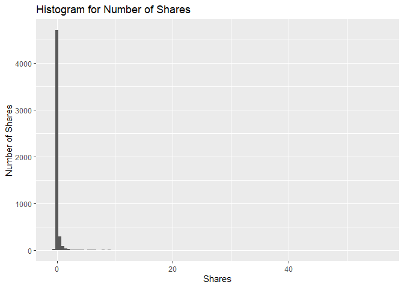

News Popularity Wednesday Data
================
Shuang Du
10/16/2020

## Load Libraries

``` r
library(readxl);
library(tidyverse);
library(caret);
library(modelr);
library(rpart);
library(kableExtra);
```

## Read in Data

``` r
getData <- function(day) {

  newsPopData <- read_csv("../../raw_data/OnlineNewsPopularity.csv")
  
  if (day == 'monday') {
    newsPopData <- newsPopData %>% filter(weekday_is_monday == 1)
  } else if(day == 'tuesday') {
    newsPopData <- newsPopData %>% filter(weekday_is_tuesday == 1)
  } else if(day == 'wednesday') {
    newsPopData <- newsPopData %>% filter(weekday_is_wednesday == 1)
  } else if(day == 'thursday') {
    newsPopData <- newsPopData %>% filter(weekday_is_thursday == 1)
  } else if(day == 'friday') {
    newsPopData <- newsPopData %>% filter(weekday_is_friday == 1)
  } else if(day == 'saturday') {
    newsPopData <- newsPopData %>% filter(weekday_is_saturday == 1)
  } else if(day == 'sunday') {
    newsPopData <- newsPopData %>% filter(weekday_is_sunday == 1)
  } else {
    stop("Invalid date")
  }
  return(newsPopData)
}

newsPopData <- getData(params$day)
```

## Set Aside Training Data

``` r
set.seed(92)
trainIndex <- createDataPartition(newsPopData$shares, 
                                  p = 0.7, list = FALSE)

newsPopTrain <- newsPopData[as.vector(trainIndex),];
newsPopTest <- newsPopData[-as.vector(trainIndex),];
```

## Center and Scale

``` r
preProcValues <- preProcess(newsPopTrain, method = c("center", "scale"))
newsPopTrain <- predict(preProcValues, newsPopTrain) 
newsPopTest <- predict(preProcValues, newsPopTest)
```

## Summary of a Few Variables

The plots below show a histogram of the number of shares for the given
day. Scatter plots on the effect of max positive polarity, article time
delta and number of videos in the article are also included.

As expected the histogram has a strong right tail, as seem by the
summary stats which show a very high maximum and a median severals
orders of magnitude lower. This is expected for because of the “viral”
nature of online popularity.

``` r
summary(newsPopTrain$shares)
```

    ##     Min.  1st Qu.   Median     Mean  3rd Qu.     Max. 
    ## -0.26734 -0.19394 -0.15892  0.00000 -0.04855 56.07103

``` r
g0 <- ggplot(newsPopTrain, aes(x=shares))
g0 + geom_histogram(binwidth = 0.5) + ggtitle('Histogram for Number of Shares') + ylab('Number of Shares') + xlab('Shares')
```

<!-- -->

``` r
summary(newsPopTrain$max_positive_polarity)
```

    ##    Min. 1st Qu.  Median    Mean 3rd Qu.    Max. 
    ## -3.0402 -0.6017  0.2112  0.0000  1.0240  1.0240

``` r
g1 <- ggplot(newsPopTrain, aes(x = max_positive_polarity, y = shares )) 
g1 + geom_point() + ggtitle('Scatter of Max Positive Polarity Effect') + ylab('Shares') + xlab('Max Positive Polarity')
```

<!-- -->

``` r
summary(newsPopTrain$timedelta)
```

    ##     Min.  1st Qu.   Median     Mean  3rd Qu.     Max. 
    ## -1.63207 -0.88664 -0.07638  0.00000  0.89593  1.70619

``` r
g2 <- ggplot(newsPopTrain, aes(x = timedelta, y = shares )) 
g2 + geom_point() + ggtitle('Scatter of Article Age Effect') + ylab('Shares') + xlab('Time Delta')
```

<!-- -->

``` r
summary(newsPopTrain$num_videos)
```

    ##     Min.  1st Qu.   Median     Mean  3rd Qu.     Max. 
    ## -0.31360 -0.31360 -0.31360  0.00000 -0.06619 17.74741

``` r
g3 <- ggplot(newsPopTrain, aes(x = num_videos, y = shares )) 
g3 + geom_point() + ggtitle('Scatter of Videos Number Effect') + ylab('Shares') + xlab('Number of Videos')
```

<!-- -->

## Modeling

### Standard Tree Based Model (no ensemble)

The type of model being fitted here is a decision tree. The tree splits
are based on minimizing the residual sum of squares for each region.

``` r
rpartFit <- train(shares ~ timedelta + n_tokens_title + n_tokens_content + n_unique_tokens + n_non_stop_words + n_non_stop_unique_tokens
                 + num_hrefs + num_self_hrefs + num_imgs + num_videos + average_token_length + num_keywords + data_channel_is_lifestyle +
                 data_channel_is_entertainment + data_channel_is_bus + data_channel_is_socmed + data_channel_is_tech + data_channel_is_world +
                 self_reference_min_shares + self_reference_max_shares + self_reference_avg_sharess + global_subjectivity + global_sentiment_polarity
                 + global_rate_positive_words + global_rate_negative_words + rate_positive_words + rate_negative_words + avg_positive_polarity +
                  min_positive_polarity + max_positive_polarity + avg_negative_polarity + min_negative_polarity + max_negative_polarity + title_subjectivity
                 + title_sentiment_polarity + abs_title_subjectivity + abs_title_sentiment_polarity, data = newsPopTrain,
             method = "rpart",
             trControl = trainControl(method = "cv", number = 10))
rpartFit
```

    ## CART 
    ## 
    ## 5207 samples
    ##   37 predictor
    ## 
    ## No pre-processing
    ## Resampling: Cross-Validated (10 fold) 
    ## Summary of sample sizes: 4686, 4687, 4687, 4686, 4686, 4686, ... 
    ## Resampling results across tuning parameters:
    ## 
    ##   cp           RMSE       Rsquared      MAE      
    ##   0.004578022  0.8570857  0.0047740350  0.2615761
    ##   0.006886115  0.8481565  0.0009875627  0.2591144
    ##   0.039324731  0.8406259  0.0016165696  0.2576059
    ## 
    ## RMSE was used to select the optimal model using the smallest value.
    ## The final value used for the model was cp = 0.03932473.

``` r
# create the prediction
pred1 <- predict(rpartFit, newdata = newsPopTest)

# compare the prediction vs the actual
resample1 <- postResample(pred1, obs = newsPopTest$shares)
resample1
```

    ##      RMSE  Rsquared       MAE 
    ## 1.6680328        NA 0.2935443

### Boosted Tree Based Model

A boosted tree is an ensemble method which slowly approaches the tree
prediction which would result from the original data. In general, an
ensemble model model will have a lower RSME than a single tree model.

``` r
gbmFit <- train(shares ~ timedelta + n_tokens_title + n_tokens_content + n_unique_tokens + n_non_stop_words + n_non_stop_unique_tokens
                 + num_hrefs + num_self_hrefs + num_imgs + num_videos + average_token_length + num_keywords + data_channel_is_lifestyle +
                 data_channel_is_entertainment + data_channel_is_bus + data_channel_is_socmed + data_channel_is_tech + data_channel_is_world +
                 self_reference_min_shares + self_reference_max_shares + self_reference_avg_sharess + global_subjectivity + global_sentiment_polarity
                 + global_rate_positive_words + global_rate_negative_words + rate_positive_words + rate_negative_words + avg_positive_polarity +
                  min_positive_polarity + max_positive_polarity + avg_negative_polarity + min_negative_polarity + max_negative_polarity + title_subjectivity
                 + title_sentiment_polarity + abs_title_subjectivity + abs_title_sentiment_polarity, data = newsPopTrain,
             method = "gbm",
             trControl = trainControl(method = "cv", number = 10))
```

    ## Iter   TrainDeviance   ValidDeviance   StepSize   Improve
    ##      1        0.3719             nan     0.1000    0.0003
    ##      2        0.3706             nan     0.1000   -0.0003
    ##      3        0.3696             nan     0.1000   -0.0004
    ##      4        0.3690             nan     0.1000   -0.0002
    ##      5        0.3682             nan     0.1000    0.0002
    ##      6        0.3678             nan     0.1000   -0.0005
    ##      7        0.3669             nan     0.1000    0.0008
    ##      8        0.3664             nan     0.1000   -0.0001
    ##      9        0.3658             nan     0.1000    0.0006
    ##     10        0.3651             nan     0.1000    0.0004
    ##     20        0.3603             nan     0.1000    0.0000
    ##     40        0.3543             nan     0.1000   -0.0001
    ##     60        0.3517             nan     0.1000   -0.0007
    ##     80        0.3501             nan     0.1000   -0.0009
    ##    100        0.3489             nan     0.1000   -0.0006
    ##    120        0.3480             nan     0.1000   -0.0003
    ##    140        0.3460             nan     0.1000   -0.0004
    ##    150        0.3457             nan     0.1000   -0.0007
    ## 
    ## Iter   TrainDeviance   ValidDeviance   StepSize   Improve
    ##      1        0.3707             nan     0.1000    0.0007
    ##      2        0.3685             nan     0.1000    0.0006
    ##      3        0.3674             nan     0.1000    0.0007
    ##      4        0.3654             nan     0.1000    0.0008
    ##      5        0.3638             nan     0.1000    0.0007
    ##      6        0.3621             nan     0.1000    0.0015
    ##      7        0.3603             nan     0.1000   -0.0005
    ##      8        0.3593             nan     0.1000    0.0003
    ##      9        0.3577             nan     0.1000    0.0005
    ##     10        0.3550             nan     0.1000   -0.0004
    ##     20        0.3424             nan     0.1000   -0.0008
    ##     40        0.3284             nan     0.1000   -0.0008
    ##     60        0.3202             nan     0.1000   -0.0008
    ##     80        0.3157             nan     0.1000   -0.0008
    ##    100        0.3108             nan     0.1000   -0.0005
    ##    120        0.3050             nan     0.1000   -0.0008
    ##    140        0.3005             nan     0.1000   -0.0001
    ##    150        0.2991             nan     0.1000   -0.0008
    ## 
    ## Iter   TrainDeviance   ValidDeviance   StepSize   Improve
    ##      1        0.3719             nan     0.1000    0.0006
    ##      2        0.3687             nan     0.1000    0.0015
    ##      3        0.3664             nan     0.1000    0.0010
    ##      4        0.3634             nan     0.1000    0.0004
    ##      5        0.3605             nan     0.1000   -0.0002
    ##      6        0.3573             nan     0.1000   -0.0006
    ##      7        0.3557             nan     0.1000    0.0004
    ##      8        0.3541             nan     0.1000   -0.0012
    ##      9        0.3528             nan     0.1000   -0.0002
    ##     10        0.3520             nan     0.1000    0.0000
    ##     20        0.3379             nan     0.1000   -0.0017
    ##     40        0.3179             nan     0.1000   -0.0007
    ##     60        0.3059             nan     0.1000   -0.0001
    ##     80        0.2959             nan     0.1000   -0.0007
    ##    100        0.2880             nan     0.1000   -0.0006
    ##    120        0.2791             nan     0.1000   -0.0005
    ##    140        0.2713             nan     0.1000   -0.0006
    ##    150        0.2672             nan     0.1000   -0.0004
    ## 
    ## Iter   TrainDeviance   ValidDeviance   StepSize   Improve
    ##      1        1.0642             nan     0.1000    0.0000
    ##      2        1.0510             nan     0.1000   -0.0001
    ##      3        1.0407             nan     0.1000   -0.0019
    ##      4        1.0391             nan     0.1000   -0.0002
    ##      5        1.0341             nan     0.1000   -0.0008
    ##      6        1.0328             nan     0.1000    0.0014
    ##      7        1.0345             nan     0.1000   -0.0045
    ##      8        1.0336             nan     0.1000   -0.0005
    ##      9        1.0327             nan     0.1000    0.0008
    ##     10        1.0265             nan     0.1000   -0.0046
    ##     20        1.0180             nan     0.1000   -0.0072
    ##     40        0.9977             nan     0.1000   -0.0046
    ##     60        0.9864             nan     0.1000   -0.0125
    ##     80        0.9729             nan     0.1000   -0.0008
    ##    100        0.9450             nan     0.1000   -0.0054
    ##    120        0.9265             nan     0.1000    0.0016
    ##    140        0.9108             nan     0.1000   -0.0068
    ##    150        0.9054             nan     0.1000   -0.0064
    ## 
    ## Iter   TrainDeviance   ValidDeviance   StepSize   Improve
    ##      1        1.0525             nan     0.1000    0.0007
    ##      2        1.0411             nan     0.1000   -0.0013
    ##      3        1.0326             nan     0.1000   -0.0053
    ##      4        1.0260             nan     0.1000   -0.0047
    ##      5        1.0271             nan     0.1000   -0.0058
    ##      6        1.0252             nan     0.1000   -0.0002
    ##      7        1.0233             nan     0.1000    0.0009
    ##      8        1.0182             nan     0.1000   -0.0069
    ##      9        1.0193             nan     0.1000   -0.0086
    ##     10        1.0164             nan     0.1000   -0.0094
    ##     20        0.9860             nan     0.1000   -0.0030
    ##     40        0.9539             nan     0.1000   -0.0056
    ##     60        0.9420             nan     0.1000   -0.0031
    ##     80        0.9157             nan     0.1000   -0.0056
    ##    100        0.8794             nan     0.1000   -0.0036
    ##    120        0.8408             nan     0.1000   -0.0056
    ##    140        0.8343             nan     0.1000   -0.0040
    ##    150        0.8358             nan     0.1000   -0.0037
    ## 
    ## Iter   TrainDeviance   ValidDeviance   StepSize   Improve
    ##      1        1.0515             nan     0.1000    0.0007
    ##      2        1.0474             nan     0.1000    0.0027
    ##      3        1.0366             nan     0.1000   -0.0040
    ##      4        1.0273             nan     0.1000   -0.0024
    ##      5        1.0218             nan     0.1000   -0.0071
    ##      6        1.0168             nan     0.1000   -0.0050
    ##      7        1.0153             nan     0.1000   -0.0039
    ##      8        1.0155             nan     0.1000   -0.0059
    ##      9        1.0148             nan     0.1000   -0.0020
    ##     10        1.0094             nan     0.1000   -0.0065
    ##     20        0.9970             nan     0.1000   -0.0065
    ##     40        0.9544             nan     0.1000   -0.0074
    ##     60        0.9018             nan     0.1000   -0.0049
    ##     80        0.8721             nan     0.1000   -0.0070
    ##    100        0.8464             nan     0.1000   -0.0025
    ##    120        0.8159             nan     0.1000   -0.0059
    ##    140        0.7755             nan     0.1000   -0.0039
    ##    150        0.7596             nan     0.1000   -0.0061
    ## 
    ## Iter   TrainDeviance   ValidDeviance   StepSize   Improve
    ##      1        1.0609             nan     0.1000   -0.0004
    ##      2        1.0494             nan     0.1000   -0.0003
    ##      3        1.0483             nan     0.1000    0.0005
    ##      4        1.0476             nan     0.1000    0.0004
    ##      5        1.0462             nan     0.1000    0.0003
    ##      6        1.0453             nan     0.1000   -0.0002
    ##      7        1.0441             nan     0.1000    0.0012
    ##      8        1.0354             nan     0.1000   -0.0055
    ##      9        1.0372             nan     0.1000   -0.0052
    ##     10        1.0312             nan     0.1000   -0.0070
    ##     20        1.0233             nan     0.1000   -0.0092
    ##     40        1.0122             nan     0.1000   -0.0042
    ##     60        1.0050             nan     0.1000   -0.0091
    ##     80        0.9977             nan     0.1000   -0.0066
    ##    100        0.9839             nan     0.1000   -0.0079
    ##    120        0.9784             nan     0.1000    0.0040
    ##    140        0.9706             nan     0.1000   -0.0036
    ##    150        0.9647             nan     0.1000   -0.0083
    ## 
    ## Iter   TrainDeviance   ValidDeviance   StepSize   Improve
    ##      1        1.0584             nan     0.1000    0.0016
    ##      2        1.0470             nan     0.1000   -0.0018
    ##      3        1.0385             nan     0.1000   -0.0047
    ##      4        1.0306             nan     0.1000   -0.0077
    ##      5        1.0262             nan     0.1000   -0.0109
    ##      6        1.0264             nan     0.1000   -0.0055
    ##      7        1.0273             nan     0.1000   -0.0063
    ##      8        1.0279             nan     0.1000   -0.0036
    ##      9        1.0288             nan     0.1000   -0.0054
    ##     10        1.0303             nan     0.1000   -0.0060
    ##     20        1.0149             nan     0.1000   -0.0080
    ##     40        0.9961             nan     0.1000   -0.0035
    ##     60        0.9841             nan     0.1000   -0.0040
    ##     80        0.9475             nan     0.1000   -0.0044
    ##    100        0.9062             nan     0.1000   -0.0039
    ##    120        0.8838             nan     0.1000   -0.0024
    ##    140        0.8581             nan     0.1000   -0.0057
    ##    150        0.8454             nan     0.1000    0.0004
    ## 
    ## Iter   TrainDeviance   ValidDeviance   StepSize   Improve
    ##      1        1.0723             nan     0.1000    0.0002
    ##      2        1.0544             nan     0.1000   -0.0009
    ##      3        1.0518             nan     0.1000    0.0009
    ##      4        1.0404             nan     0.1000   -0.0018
    ##      5        1.0315             nan     0.1000   -0.0030
    ##      6        1.0288             nan     0.1000   -0.0008
    ##      7        1.0295             nan     0.1000   -0.0052
    ##      8        1.0276             nan     0.1000    0.0010
    ##      9        1.0280             nan     0.1000   -0.0035
    ##     10        1.0173             nan     0.1000   -0.0058
    ##     20        0.9958             nan     0.1000   -0.0088
    ##     40        0.9473             nan     0.1000   -0.0061
    ##     60        0.9202             nan     0.1000   -0.0080
    ##     80        0.8885             nan     0.1000   -0.0005
    ##    100        0.8458             nan     0.1000   -0.0045
    ##    120        0.8292             nan     0.1000   -0.0041
    ##    140        0.8215             nan     0.1000   -0.0037
    ##    150        0.8171             nan     0.1000   -0.0053
    ## 
    ## Iter   TrainDeviance   ValidDeviance   StepSize   Improve
    ##      1        1.0583             nan     0.1000    0.0011
    ##      2        1.0572             nan     0.1000    0.0012
    ##      3        1.0556             nan     0.1000    0.0006
    ##      4        1.0548             nan     0.1000    0.0004
    ##      5        1.0446             nan     0.1000   -0.0015
    ##      6        1.0435             nan     0.1000    0.0002
    ##      7        1.0429             nan     0.1000   -0.0004
    ##      8        1.0361             nan     0.1000   -0.0019
    ##      9        1.0354             nan     0.1000   -0.0001
    ##     10        1.0294             nan     0.1000   -0.0042
    ##     20        1.0128             nan     0.1000   -0.0116
    ##     40        0.9997             nan     0.1000   -0.0069
    ##     60        0.9875             nan     0.1000   -0.0049
    ##     80        0.9809             nan     0.1000   -0.0029
    ##    100        0.9750             nan     0.1000   -0.0040
    ##    120        0.9639             nan     0.1000   -0.0103
    ##    140        0.9479             nan     0.1000   -0.0089
    ##    150        0.9339             nan     0.1000   -0.0051
    ## 
    ## Iter   TrainDeviance   ValidDeviance   StepSize   Improve
    ##      1        1.0547             nan     0.1000    0.0028
    ##      2        1.0454             nan     0.1000   -0.0012
    ##      3        1.0369             nan     0.1000   -0.0020
    ##      4        1.0336             nan     0.1000   -0.0003
    ##      5        1.0274             nan     0.1000   -0.0037
    ##      6        1.0240             nan     0.1000   -0.0015
    ##      7        1.0249             nan     0.1000   -0.0052
    ##      8        1.0206             nan     0.1000   -0.0028
    ##      9        1.0172             nan     0.1000   -0.0059
    ##     10        1.0178             nan     0.1000   -0.0073
    ##     20        0.9716             nan     0.1000    0.0003
    ##     40        0.9144             nan     0.1000   -0.0018
    ##     60        0.8919             nan     0.1000   -0.0082
    ##     80        0.8833             nan     0.1000   -0.0049
    ##    100        0.8451             nan     0.1000   -0.0075
    ##    120        0.8403             nan     0.1000   -0.0063
    ##    140        0.8179             nan     0.1000   -0.0037
    ##    150        0.8149             nan     0.1000   -0.0051
    ## 
    ## Iter   TrainDeviance   ValidDeviance   StepSize   Improve
    ##      1        1.0554             nan     0.1000   -0.0008
    ##      2        1.0433             nan     0.1000   -0.0019
    ##      3        1.0391             nan     0.1000    0.0003
    ##      4        1.0288             nan     0.1000   -0.0042
    ##      5        1.0265             nan     0.1000   -0.0033
    ##      6        1.0276             nan     0.1000   -0.0061
    ##      7        1.0202             nan     0.1000   -0.0034
    ##      8        1.0140             nan     0.1000   -0.0065
    ##      9        1.0106             nan     0.1000    0.0013
    ##     10        1.0109             nan     0.1000   -0.0039
    ##     20        0.9726             nan     0.1000   -0.0045
    ##     40        0.9133             nan     0.1000   -0.0048
    ##     60        0.8841             nan     0.1000   -0.0094
    ##     80        0.8314             nan     0.1000   -0.0057
    ##    100        0.7896             nan     0.1000   -0.0052
    ##    120        0.7512             nan     0.1000   -0.0047
    ##    140        0.7225             nan     0.1000   -0.0041
    ##    150        0.7175             nan     0.1000   -0.0035
    ## 
    ## Iter   TrainDeviance   ValidDeviance   StepSize   Improve
    ##      1        1.0110             nan     0.1000    0.0001
    ##      2        1.0106             nan     0.1000   -0.0002
    ##      3        0.9955             nan     0.1000   -0.0010
    ##      4        0.9868             nan     0.1000   -0.0017
    ##      5        0.9862             nan     0.1000    0.0001
    ##      6        0.9856             nan     0.1000    0.0001
    ##      7        0.9771             nan     0.1000   -0.0060
    ##      8        0.9786             nan     0.1000   -0.0041
    ##      9        0.9728             nan     0.1000   -0.0085
    ##     10        0.9702             nan     0.1000   -0.0016
    ##     20        0.9672             nan     0.1000   -0.0095
    ##     40        0.9512             nan     0.1000    0.0002
    ##     60        0.9367             nan     0.1000   -0.0079
    ##     80        0.9076             nan     0.1000   -0.0072
    ##    100        0.8892             nan     0.1000   -0.0066
    ##    120        0.8820             nan     0.1000   -0.0040
    ##    140        0.8747             nan     0.1000   -0.0059
    ##    150        0.8739             nan     0.1000   -0.0040
    ## 
    ## Iter   TrainDeviance   ValidDeviance   StepSize   Improve
    ##      1        0.9977             nan     0.1000   -0.0003
    ##      2        0.9857             nan     0.1000   -0.0044
    ##      3        0.9839             nan     0.1000    0.0003
    ##      4        0.9826             nan     0.1000    0.0001
    ##      5        0.9809             nan     0.1000   -0.0003
    ##      6        0.9735             nan     0.1000   -0.0030
    ##      7        0.9745             nan     0.1000   -0.0053
    ##      8        0.9686             nan     0.1000   -0.0040
    ##      9        0.9697             nan     0.1000   -0.0044
    ##     10        0.9648             nan     0.1000   -0.0100
    ##     20        0.9560             nan     0.1000   -0.0068
    ##     40        0.9221             nan     0.1000   -0.0014
    ##     60        0.9003             nan     0.1000   -0.0044
    ##     80        0.8461             nan     0.1000   -0.0042
    ##    100        0.8281             nan     0.1000   -0.0085
    ##    120        0.7733             nan     0.1000   -0.0034
    ##    140        0.7523             nan     0.1000   -0.0059
    ##    150        0.7431             nan     0.1000   -0.0065
    ## 
    ## Iter   TrainDeviance   ValidDeviance   StepSize   Improve
    ##      1        0.9963             nan     0.1000   -0.0022
    ##      2        0.9934             nan     0.1000    0.0014
    ##      3        0.9923             nan     0.1000   -0.0005
    ##      4        0.9820             nan     0.1000   -0.0017
    ##      5        0.9741             nan     0.1000   -0.0037
    ##      6        0.9747             nan     0.1000   -0.0034
    ##      7        0.9681             nan     0.1000   -0.0112
    ##      8        0.9687             nan     0.1000   -0.0066
    ##      9        0.9640             nan     0.1000   -0.0027
    ##     10        0.9596             nan     0.1000   -0.0064
    ##     20        0.9302             nan     0.1000    0.0040
    ##     40        0.9005             nan     0.1000   -0.0014
    ##     60        0.8777             nan     0.1000   -0.0045
    ##     80        0.8589             nan     0.1000   -0.0053
    ##    100        0.8203             nan     0.1000    0.0003
    ##    120        0.7861             nan     0.1000   -0.0041
    ##    140        0.7590             nan     0.1000   -0.0044
    ##    150        0.7322             nan     0.1000   -0.0003
    ## 
    ## Iter   TrainDeviance   ValidDeviance   StepSize   Improve
    ##      1        1.0958             nan     0.1000    0.0006
    ##      2        1.0946             nan     0.1000    0.0014
    ##      3        1.0832             nan     0.1000    0.0007
    ##      4        1.0704             nan     0.1000   -0.0006
    ##      5        1.0690             nan     0.1000    0.0003
    ##      6        1.0680             nan     0.1000    0.0006
    ##      7        1.0595             nan     0.1000   -0.0012
    ##      8        1.0529             nan     0.1000   -0.0046
    ##      9        1.0521             nan     0.1000    0.0006
    ##     10        1.0468             nan     0.1000   -0.0082
    ##     20        1.0477             nan     0.1000   -0.0061
    ##     40        1.0350             nan     0.1000   -0.0025
    ##     60        1.0278             nan     0.1000   -0.0031
    ##     80        1.0236             nan     0.1000   -0.0061
    ##    100        1.0189             nan     0.1000   -0.0104
    ##    120        1.0147             nan     0.1000   -0.0081
    ##    140        1.0098             nan     0.1000   -0.0112
    ##    150        1.0088             nan     0.1000   -0.0092
    ## 
    ## Iter   TrainDeviance   ValidDeviance   StepSize   Improve
    ##      1        1.0941             nan     0.1000    0.0011
    ##      2        1.0784             nan     0.1000    0.0023
    ##      3        1.0666             nan     0.1000   -0.0008
    ##      4        1.0657             nan     0.1000    0.0001
    ##      5        1.0564             nan     0.1000   -0.0016
    ##      6        1.0491             nan     0.1000   -0.0033
    ##      7        1.0476             nan     0.1000    0.0008
    ##      8        1.0423             nan     0.1000   -0.0099
    ##      9        1.0385             nan     0.1000   -0.0044
    ##     10        1.0390             nan     0.1000   -0.0073
    ##     20        1.0290             nan     0.1000   -0.0116
    ##     40        0.9825             nan     0.1000   -0.0100
    ##     60        0.9567             nan     0.1000   -0.0062
    ##     80        0.9540             nan     0.1000   -0.0085
    ##    100        0.9269             nan     0.1000   -0.0020
    ##    120        0.9210             nan     0.1000   -0.0016
    ##    140        0.9062             nan     0.1000   -0.0017
    ##    150        0.8866             nan     0.1000   -0.0007
    ## 
    ## Iter   TrainDeviance   ValidDeviance   StepSize   Improve
    ##      1        1.0938             nan     0.1000   -0.0001
    ##      2        1.0911             nan     0.1000    0.0004
    ##      3        1.0887             nan     0.1000    0.0001
    ##      4        1.0843             nan     0.1000   -0.0006
    ##      5        1.0825             nan     0.1000   -0.0003
    ##      6        1.0794             nan     0.1000    0.0000
    ##      7        1.0627             nan     0.1000   -0.0004
    ##      8        1.0620             nan     0.1000   -0.0011
    ##      9        1.0609             nan     0.1000    0.0001
    ##     10        1.0488             nan     0.1000   -0.0029
    ##     20        1.0169             nan     0.1000   -0.0073
    ##     40        1.0009             nan     0.1000   -0.0089
    ##     60        0.9819             nan     0.1000   -0.0095
    ##     80        0.9566             nan     0.1000   -0.0049
    ##    100        0.9522             nan     0.1000   -0.0047
    ##    120        0.9256             nan     0.1000   -0.0092
    ##    140        0.9211             nan     0.1000   -0.0083
    ##    150        0.9032             nan     0.1000   -0.0049
    ## 
    ## Iter   TrainDeviance   ValidDeviance   StepSize   Improve
    ##      1        1.0746             nan     0.1000    0.0005
    ##      2        1.0732             nan     0.1000    0.0001
    ##      3        1.0588             nan     0.1000   -0.0009
    ##      4        1.0575             nan     0.1000   -0.0002
    ##      5        1.0448             nan     0.1000   -0.0030
    ##      6        1.0371             nan     0.1000   -0.0045
    ##      7        1.0320             nan     0.1000   -0.0034
    ##      8        1.0271             nan     0.1000   -0.0068
    ##      9        1.0263             nan     0.1000   -0.0004
    ##     10        1.0277             nan     0.1000   -0.0051
    ##     20        1.0154             nan     0.1000   -0.0096
    ##     40        1.0084             nan     0.1000   -0.0084
    ##     60        1.0054             nan     0.1000   -0.0073
    ##     80        0.9817             nan     0.1000   -0.0065
    ##    100        0.9595             nan     0.1000   -0.0092
    ##    120        0.9562             nan     0.1000   -0.0007
    ##    140        0.9418             nan     0.1000   -0.0106
    ##    150        0.9361             nan     0.1000   -0.0066
    ## 
    ## Iter   TrainDeviance   ValidDeviance   StepSize   Improve
    ##      1        1.0721             nan     0.1000   -0.0000
    ##      2        1.0567             nan     0.1000    0.0006
    ##      3        1.0554             nan     0.1000   -0.0002
    ##      4        1.0536             nan     0.1000    0.0006
    ##      5        1.0413             nan     0.1000    0.0006
    ##      6        1.0316             nan     0.1000   -0.0021
    ##      7        1.0306             nan     0.1000   -0.0004
    ##      8        1.0227             nan     0.1000   -0.0042
    ##      9        1.0239             nan     0.1000   -0.0056
    ##     10        1.0230             nan     0.1000    0.0004
    ##     20        1.0122             nan     0.1000   -0.0047
    ##     40        0.9875             nan     0.1000   -0.0059
    ##     60        0.9425             nan     0.1000   -0.0058
    ##     80        0.9288             nan     0.1000   -0.0070
    ##    100        0.8980             nan     0.1000   -0.0028
    ##    120        0.8794             nan     0.1000   -0.0029
    ##    140        0.8741             nan     0.1000   -0.0039
    ##    150        0.8544             nan     0.1000   -0.0046
    ## 
    ## Iter   TrainDeviance   ValidDeviance   StepSize   Improve
    ##      1        1.0583             nan     0.1000    0.0045
    ##      2        1.0559             nan     0.1000   -0.0003
    ##      3        1.0434             nan     0.1000   -0.0021
    ##      4        1.0345             nan     0.1000   -0.0045
    ##      5        1.0354             nan     0.1000   -0.0070
    ##      6        1.0264             nan     0.1000   -0.0120
    ##      7        1.0194             nan     0.1000   -0.0067
    ##      8        1.0185             nan     0.1000   -0.0080
    ##      9        1.0186             nan     0.1000   -0.0031
    ##     10        1.0143             nan     0.1000   -0.0048
    ##     20        1.0015             nan     0.1000   -0.0080
    ##     40        0.9562             nan     0.1000   -0.0061
    ##     60        0.9190             nan     0.1000   -0.0063
    ##     80        0.8953             nan     0.1000   -0.0071
    ##    100        0.8839             nan     0.1000   -0.0066
    ##    120        0.8613             nan     0.1000   -0.0071
    ##    140        0.8306             nan     0.1000   -0.0041
    ##    150        0.8267             nan     0.1000   -0.0088
    ## 
    ## Iter   TrainDeviance   ValidDeviance   StepSize   Improve
    ##      1        1.0876             nan     0.1000    0.0007
    ##      2        1.0724             nan     0.1000   -0.0007
    ##      3        1.0627             nan     0.1000   -0.0034
    ##      4        1.0612             nan     0.1000   -0.0000
    ##      5        1.0600             nan     0.1000    0.0001
    ##      6        1.0590             nan     0.1000    0.0004
    ##      7        1.0583             nan     0.1000   -0.0001
    ##      8        1.0572             nan     0.1000    0.0001
    ##      9        1.0563             nan     0.1000   -0.0005
    ##     10        1.0553             nan     0.1000   -0.0005
    ##     20        1.0307             nan     0.1000   -0.0059
    ##     40        1.0240             nan     0.1000   -0.0077
    ##     60        0.9977             nan     0.1000    0.0036
    ##     80        0.9958             nan     0.1000   -0.0081
    ##    100        0.9808             nan     0.1000   -0.0043
    ##    120        0.9616             nan     0.1000   -0.0080
    ##    140        0.9613             nan     0.1000   -0.0041
    ##    150        0.9448             nan     0.1000    0.0021
    ## 
    ## Iter   TrainDeviance   ValidDeviance   StepSize   Improve
    ##      1        1.0859             nan     0.1000    0.0026
    ##      2        1.0844             nan     0.1000    0.0010
    ##      3        1.0676             nan     0.1000    0.0002
    ##      4        1.0556             nan     0.1000   -0.0033
    ##      5        1.0464             nan     0.1000   -0.0018
    ##      6        1.0395             nan     0.1000   -0.0033
    ##      7        1.0401             nan     0.1000   -0.0042
    ##      8        1.0366             nan     0.1000   -0.0007
    ##      9        1.0321             nan     0.1000   -0.0049
    ##     10        1.0288             nan     0.1000   -0.0073
    ##     20        1.0137             nan     0.1000   -0.0078
    ##     40        0.9971             nan     0.1000   -0.0029
    ##     60        0.9758             nan     0.1000   -0.0055
    ##     80        0.9678             nan     0.1000   -0.0044
    ##    100        0.9555             nan     0.1000   -0.0029
    ##    120        0.9104             nan     0.1000   -0.0050
    ##    140        0.8763             nan     0.1000   -0.0052
    ##    150        0.8621             nan     0.1000   -0.0043
    ## 
    ## Iter   TrainDeviance   ValidDeviance   StepSize   Improve
    ##      1        1.0766             nan     0.1000   -0.0001
    ##      2        1.0623             nan     0.1000   -0.0007
    ##      3        1.0511             nan     0.1000   -0.0020
    ##      4        1.0458             nan     0.1000    0.0005
    ##      5        1.0442             nan     0.1000   -0.0000
    ##      6        1.0425             nan     0.1000   -0.0006
    ##      7        1.0354             nan     0.1000   -0.0022
    ##      8        1.0358             nan     0.1000   -0.0060
    ##      9        1.0281             nan     0.1000   -0.0042
    ##     10        1.0253             nan     0.1000   -0.0005
    ##     20        1.0063             nan     0.1000   -0.0126
    ##     40        0.9566             nan     0.1000   -0.0045
    ##     60        0.9156             nan     0.1000   -0.0044
    ##     80        0.8936             nan     0.1000   -0.0049
    ##    100        0.8732             nan     0.1000   -0.0046
    ##    120        0.8508             nan     0.1000   -0.0087
    ##    140        0.8178             nan     0.1000   -0.0038
    ##    150        0.8059             nan     0.1000   -0.0040
    ## 
    ## Iter   TrainDeviance   ValidDeviance   StepSize   Improve
    ##      1        1.0711             nan     0.1000   -0.0008
    ##      2        1.0615             nan     0.1000   -0.0027
    ##      3        1.0534             nan     0.1000   -0.0041
    ##      4        1.0486             nan     0.1000   -0.0105
    ##      5        1.0451             nan     0.1000   -0.0027
    ##      6        1.0429             nan     0.1000   -0.0097
    ##      7        1.0437             nan     0.1000   -0.0057
    ##      8        1.0421             nan     0.1000   -0.0073
    ##      9        1.0407             nan     0.1000   -0.0001
    ##     10        1.0393             nan     0.1000   -0.0038
    ##     20        1.0360             nan     0.1000   -0.0080
    ##     40        1.0058             nan     0.1000   -0.0075
    ##     60        0.9980             nan     0.1000   -0.0063
    ##     80        0.9870             nan     0.1000    0.0056
    ##    100        0.9521             nan     0.1000   -0.0072
    ##    120        0.9385             nan     0.1000   -0.0061
    ##    140        0.9249             nan     0.1000   -0.0020
    ##    150        0.9201             nan     0.1000   -0.0032
    ## 
    ## Iter   TrainDeviance   ValidDeviance   StepSize   Improve
    ##      1        1.0698             nan     0.1000   -0.0008
    ##      2        1.0570             nan     0.1000   -0.0038
    ##      3        1.0526             nan     0.1000   -0.0006
    ##      4        1.0450             nan     0.1000   -0.0050
    ##      5        1.0380             nan     0.1000   -0.0072
    ##      6        1.0347             nan     0.1000   -0.0015
    ##      7        1.0315             nan     0.1000   -0.0016
    ##      8        1.0300             nan     0.1000   -0.0085
    ##      9        1.0301             nan     0.1000   -0.0068
    ##     10        1.0305             nan     0.1000   -0.0036
    ##     20        0.9934             nan     0.1000   -0.0034
    ##     40        0.9696             nan     0.1000   -0.0075
    ##     60        0.9176             nan     0.1000   -0.0066
    ##     80        0.8743             nan     0.1000   -0.0110
    ##    100        0.8174             nan     0.1000   -0.0041
    ##    120        0.7887             nan     0.1000   -0.0038
    ##    140        0.7651             nan     0.1000   -0.0035
    ##    150        0.7589             nan     0.1000   -0.0047
    ## 
    ## Iter   TrainDeviance   ValidDeviance   StepSize   Improve
    ##      1        1.0820             nan     0.1000    0.0009
    ##      2        1.0785             nan     0.1000    0.0021
    ##      3        1.0759             nan     0.1000    0.0024
    ##      4        1.0609             nan     0.1000    0.0001
    ##      5        1.0483             nan     0.1000    0.0015
    ##      6        1.0398             nan     0.1000   -0.0054
    ##      7        1.0368             nan     0.1000    0.0008
    ##      8        1.0290             nan     0.1000   -0.0006
    ##      9        1.0264             nan     0.1000    0.0013
    ##     10        1.0202             nan     0.1000   -0.0063
    ##     20        1.0003             nan     0.1000   -0.0079
    ##     40        0.9585             nan     0.1000   -0.0010
    ##     60        0.9448             nan     0.1000   -0.0023
    ##     80        0.9253             nan     0.1000   -0.0089
    ##    100        0.8608             nan     0.1000   -0.0036
    ##    120        0.8377             nan     0.1000   -0.0077
    ##    140        0.8014             nan     0.1000   -0.0041
    ##    150        0.7969             nan     0.1000   -0.0028
    ## 
    ## Iter   TrainDeviance   ValidDeviance   StepSize   Improve
    ##      1        1.0436             nan     0.1000   -0.0001
    ##      2        1.0336             nan     0.1000   -0.0022
    ##      3        1.0319             nan     0.1000    0.0001
    ##      4        1.0303             nan     0.1000    0.0003
    ##      5        1.0227             nan     0.1000   -0.0040
    ##      6        1.0187             nan     0.1000   -0.0014
    ##      7        1.0178             nan     0.1000   -0.0003
    ##      8        1.0170             nan     0.1000   -0.0008
    ##      9        1.0131             nan     0.1000   -0.0046
    ##     10        1.0105             nan     0.1000   -0.0035
    ##     20        0.9950             nan     0.1000   -0.0078
    ##     40        0.9887             nan     0.1000   -0.0065
    ##     60        0.9788             nan     0.1000   -0.0115
    ##     80        0.9550             nan     0.1000   -0.0046
    ##    100        0.9326             nan     0.1000   -0.0087
    ##    120        0.9253             nan     0.1000   -0.0114
    ##    140        0.9153             nan     0.1000   -0.0037
    ##    150        0.9090             nan     0.1000   -0.0059
    ## 
    ## Iter   TrainDeviance   ValidDeviance   StepSize   Improve
    ##      1        1.0515             nan     0.1000   -0.0000
    ##      2        1.0358             nan     0.1000   -0.0017
    ##      3        1.0249             nan     0.1000   -0.0034
    ##      4        1.0239             nan     0.1000    0.0001
    ##      5        1.0162             nan     0.1000   -0.0011
    ##      6        1.0104             nan     0.1000   -0.0040
    ##      7        1.0117             nan     0.1000   -0.0064
    ##      8        1.0089             nan     0.1000    0.0026
    ##      9        1.0100             nan     0.1000   -0.0041
    ##     10        1.0109             nan     0.1000   -0.0050
    ##     20        0.9910             nan     0.1000   -0.0059
    ##     40        0.9379             nan     0.1000   -0.0079
    ##     60        0.9250             nan     0.1000   -0.0042
    ##     80        0.8996             nan     0.1000   -0.0066
    ##    100        0.8849             nan     0.1000   -0.0100
    ##    120        0.8447             nan     0.1000   -0.0060
    ##    140        0.8177             nan     0.1000   -0.0046
    ##    150        0.8029             nan     0.1000   -0.0019
    ## 
    ## Iter   TrainDeviance   ValidDeviance   StepSize   Improve
    ##      1        1.0548             nan     0.1000    0.0008
    ##      2        1.0434             nan     0.1000   -0.0003
    ##      3        1.0292             nan     0.1000   -0.0027
    ##      4        1.0201             nan     0.1000   -0.0046
    ##      5        1.0205             nan     0.1000   -0.0044
    ##      6        1.0207             nan     0.1000   -0.0052
    ##      7        1.0206             nan     0.1000   -0.0040
    ##      8        1.0215             nan     0.1000   -0.0041
    ##      9        1.0133             nan     0.1000   -0.0014
    ##     10        1.0065             nan     0.1000   -0.0056
    ##     20        0.9801             nan     0.1000   -0.0033
    ##     40        0.9492             nan     0.1000   -0.0084
    ##     60        0.9243             nan     0.1000   -0.0065
    ##     80        0.8829             nan     0.1000   -0.0038
    ##    100        0.8705             nan     0.1000   -0.0033
    ##    120        0.8085             nan     0.1000   -0.0045
    ##    140        0.7881             nan     0.1000   -0.0043
    ##    150        0.7704             nan     0.1000   -0.0015
    ## 
    ## Iter   TrainDeviance   ValidDeviance   StepSize   Improve
    ##      1        0.9880             nan     0.1000   -0.0004
    ##      2        0.9788             nan     0.1000   -0.0027
    ##      3        0.9726             nan     0.1000   -0.0030
    ##      4        0.9743             nan     0.1000   -0.0048
    ##      5        0.9737             nan     0.1000    0.0003
    ##      6        0.9729             nan     0.1000    0.0004
    ##      7        0.9679             nan     0.1000   -0.0040
    ##      8        0.9665             nan     0.1000    0.0012
    ##      9        0.9622             nan     0.1000   -0.0065
    ##     10        0.9599             nan     0.1000   -0.0071
    ##     20        0.9511             nan     0.1000   -0.0055
    ##     40        0.9425             nan     0.1000   -0.0061
    ##     50        0.9303             nan     0.1000   -0.0047

``` r
gbmFit
```

    ## Stochastic Gradient Boosting 
    ## 
    ## 5207 samples
    ##   37 predictor
    ## 
    ## No pre-processing
    ## Resampling: Cross-Validated (10 fold) 
    ## Summary of sample sizes: 4687, 4686, 4686, 4687, 4686, 4685, ... 
    ## Resampling results across tuning parameters:
    ## 
    ##   interaction.depth  n.trees  RMSE       Rsquared     MAE      
    ##   1                   50      0.8160660  0.013990997  0.2579227
    ##   1                  100      0.8252243  0.009199270  0.2606358
    ##   1                  150      0.8305032  0.003838183  0.2613495
    ##   2                   50      0.8290069  0.009089470  0.2585876
    ##   2                  100      0.8320408  0.013233574  0.2584492
    ##   2                  150      0.8355617  0.013807169  0.2580352
    ##   3                   50      0.8266348  0.016741493  0.2573153
    ##   3                  100      0.8217085  0.013757314  0.2559924
    ##   3                  150      0.8451170  0.013804946  0.2618096
    ## 
    ## Tuning parameter 'shrinkage' was held constant at a value of 0.1
    ## Tuning parameter 'n.minobsinnode' was held constant at a value of 10
    ## RMSE was used to select the optimal model using the smallest value.
    ## The final values used for the model were n.trees = 50, interaction.depth = 1, shrinkage = 0.1 and n.minobsinnode = 10.

``` r
# create the prediction
pred2 <- predict(gbmFit, newdata = newsPopTest)

# compare the prediction vs the actual
resample2 <- postResample(pred2, obs = newsPopTest$shares)
resample2
```

    ##        RMSE    Rsquared         MAE 
    ## 1.672834954 0.002509496 0.300304354

### Comparison

Below is a comparison of the two methods. Both have relatively high root
mean square errors.

``` r
comparison <- data.frame("RSME" = c(resample1[[1]], resample2[[1]]), "MAE" = c(resample1[[3]], resample2[[3]]) )
rownames(comparison) <- c("RPART","GBM")
kable(comparison)
```

<table>

<thead>

<tr>

<th style="text-align:left;">

</th>

<th style="text-align:right;">

RSME

</th>

<th style="text-align:right;">

MAE

</th>

</tr>

</thead>

<tbody>

<tr>

<td style="text-align:left;">

RPART

</td>

<td style="text-align:right;">

1.668033

</td>

<td style="text-align:right;">

0.2935443

</td>

</tr>

<tr>

<td style="text-align:left;">

GBM

</td>

<td style="text-align:right;">

1.672835

</td>

<td style="text-align:right;">

0.3003044

</td>

</tr>

</tbody>

</table>
